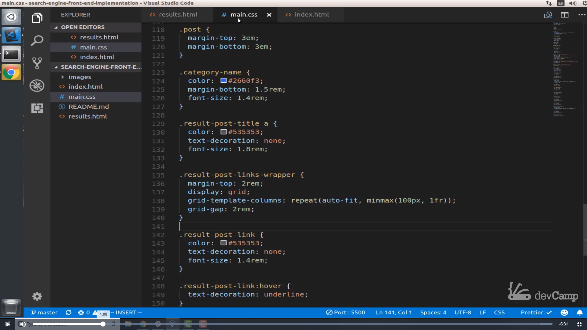
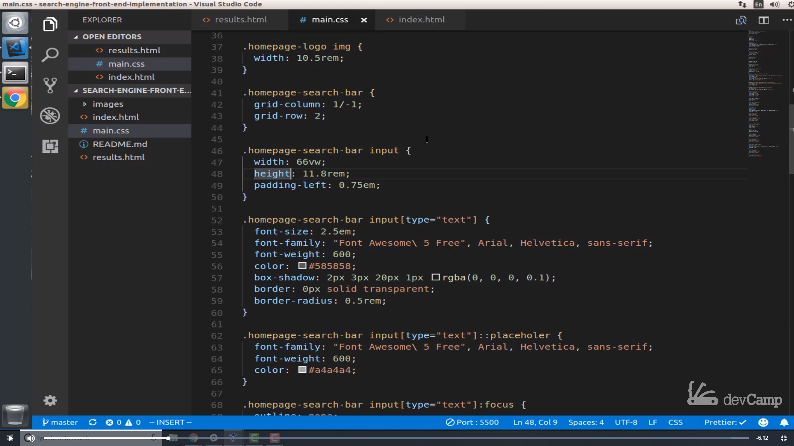
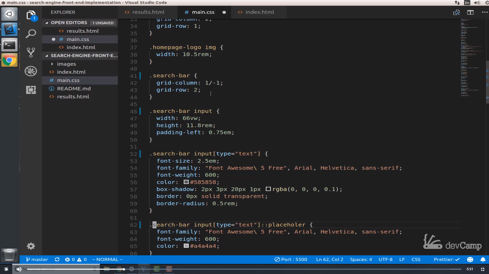
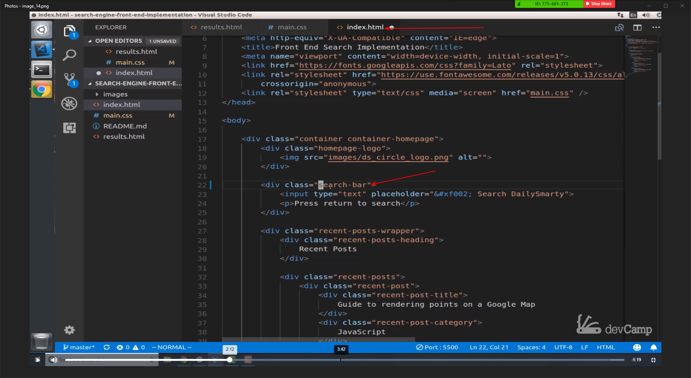
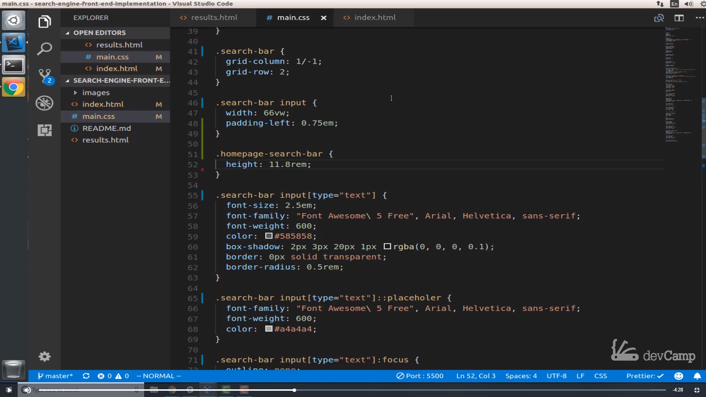
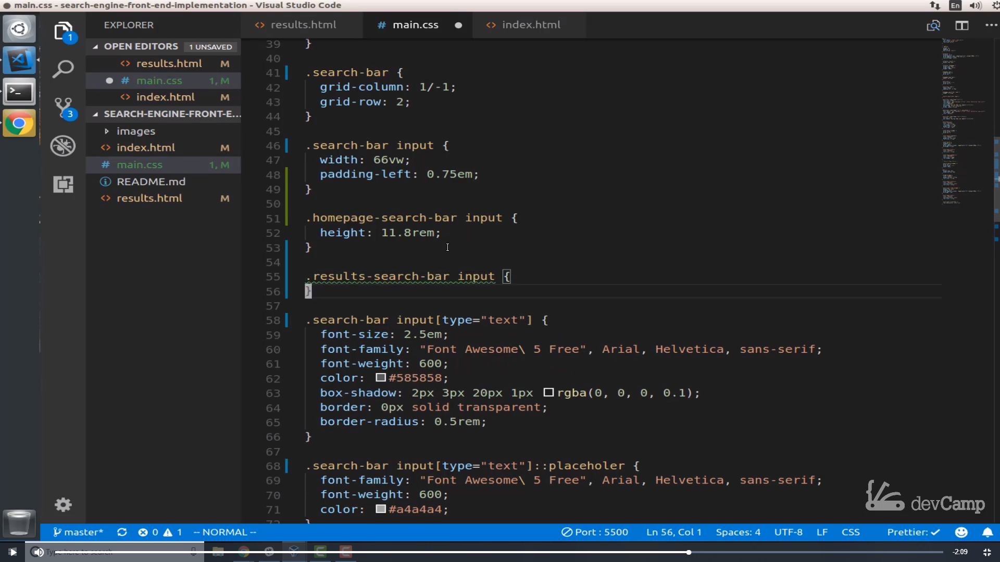
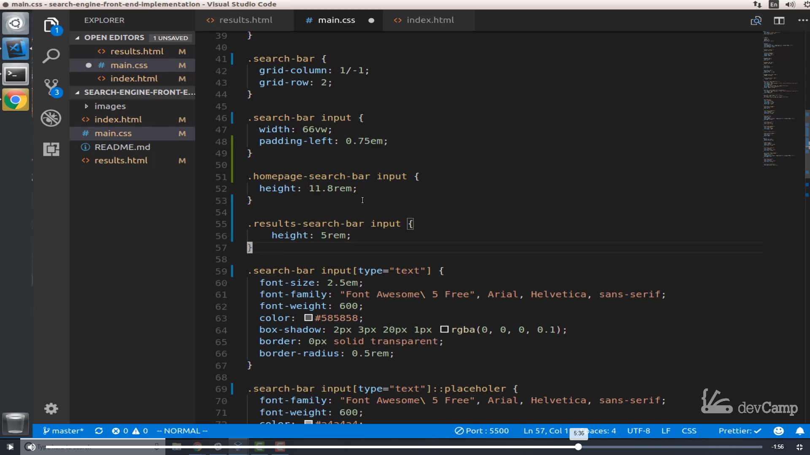
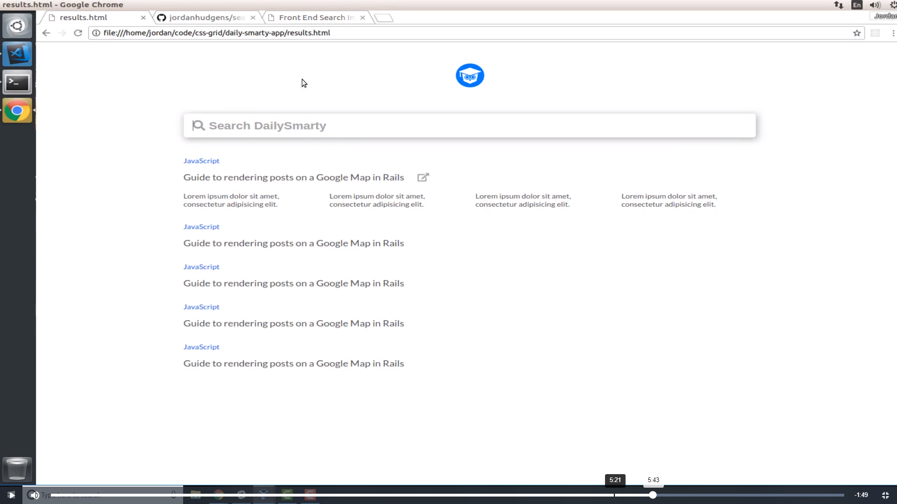
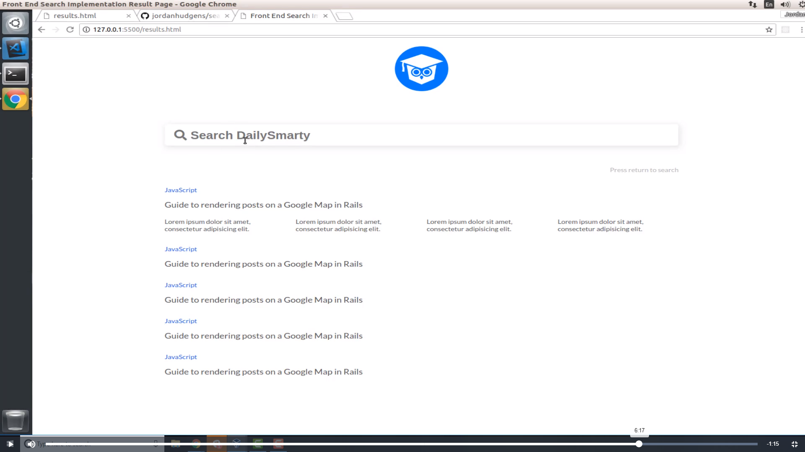

# 01-045:   Implementing Shared Styles for Custom Input Elements to Decrease Code Duplication

Now that we have our results looking the way that we want them to be I think the next element we should work with is the input. Now, this is going to require a little bit of work not just on the element itself but also on doing something very similar to what we did with the container. 

As you can tell there are a number of shared styles. For this element as for this one. You can see even the focus is very similar. The size is similar except for the height and everything else so what I want to do is I want to share and pull out and abstract as much of the style information as we can. And so then each one of the elements on the index and on the result page can just add a few custom styles to it and we don't have to have a lot of duplicate code. So let's see how we could best do that. 

I am going to come into the `main.css`

 

and if we come up and we look at our input. So it's come all the way up to near the top. And let's see where it is. So right here where you can see the `height: 11.8em;`

 

What I want to do is I want to change the name here. So instead of `.homepage_search-bar` I want to call this just the `.search-bar` and I want to do the same thing here, and then here because as I'm looking at this and this is something I'm doing more on the fly just as I'm looking at the code and the main reason is because what I've noticed is that a lot of these styles are shared and there are so many of them are shared. In fact that I don't think it's really worth creating an entirely new class. I think we can just do kind of like what we did with the container. 

So this is going to break everything. So let's come to the index and instead of `homepage_search-bar` this should just be the `search-bar`.

 

And so now let's go and look who we can see that. Obviously, this is not working. But now let's first kind of work backwards and get the index working and you can see that this is working perfectly. So that's good. Now let's go and add our custom element here. So I'm going to say `search-bar` and then let's say `homepage-search-bar` and now inside of our `main.css` what we can do is we can take that height element, this is the big difference here. And what we can do is say `.homepage-search-bar`

 

and now let's just put that height right in there. If I  come back and you can see that it is not working. Do I have a typo? So home page search bar and we have that height. Let's look at the index homepage search bar. So all of that is there. Let's see what is the issue. Is it not picking up that height? so search-bar-homepage, lets right click on it and inspect the element and see OK. So right here we have this element and I need to add this and add the input `.homepage-search-bar input` there we go. 
     
So hopefully you can see where the problem I did right there. The search bar input I needed to actually select the input value itself or the input tag, before I was only select in the class and that wasn't really doing anything we needed to like the input. You can see that now that is working

. 

So we're all good to go on this site and we may or may not have to come back and update a few other things but hopefully, you can see what I did. I've pulled out the homepage element which is the only difference really was the height there and now what I'm going to do is I can now go to the results page, must also go see what this looks like. 
     
And now we can go and we can update the naming here. So instead of just homepage-search-bar. Now I'm just going to call it search-bar and let's add a class here, it's going to be `results-search-bar` okay. So now we can see we are getting closer. So now the selectors working everything on that site working. Now we can customize it, the results-search-bar lets go down right below the   .homepage-search-bar input, and put .result-search-bar. And let's see the custom styles. We know that we're going to oh and I almost make this same mistake again. Input OK

. 

Now that we have that that let's add the custom component here. We know that the height needs to be different. I'm going to go with ``height: 5rem;`` for this 

. 

And  Let's just start off with that and see if that fixes that. OK, so that looks a lot better. As you can see we're pretty much back to where we want everything to be 

. 
     
Now let's see what other elements that we need to implement. OK, I think if I just add a `margin-bottom:` here so we can go `margin-bottom: 1em;` and then add a `merge-top:  3em;`. This should give us what we want and it does now looks really good. So we now have the search bar looking pretty much exactly how we want it to be. 

Now if you want it to be pixel perfect with what we have here the only difference here is in the early version when I created this implementation I did have two different classes one for the home page and one for the results page. And so I have a slightly different color and font size so you can do exactly what we just did with the entire bar. You can do that with the text attribute. So you can come here and implement the same behavior. 

I'm not going to do it here because we literally just went through that entire process. But feel free if that is something that you want to do. You can replicate that process create a `search-bar input` as an abstract level to it and then from there change the font size and the coloring. But I'm really happy with how this is right now.
   
As you can see this has gone much faster than the index home page because we've been able to reuse so much code and that's really the sign that you're building a system the right way when you're able to reuse previous components you built out and they help you in any kind of future features that you want to build into the system.  

## Resources

- [Source Code](https://github.com/jordanhudgens/search-engine-front-end-implementation/tree/df6b86d1b39969448c2d1356b99c85ce54fb0927)
