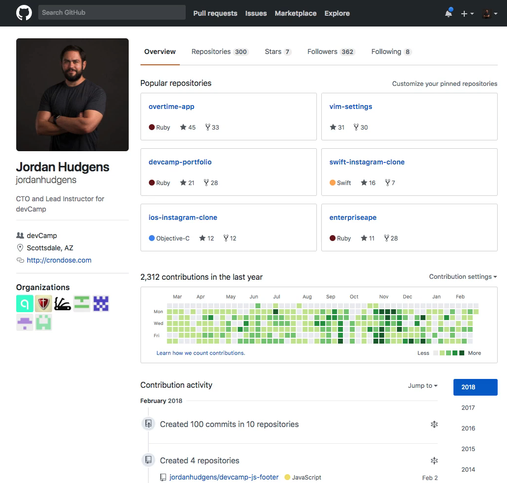
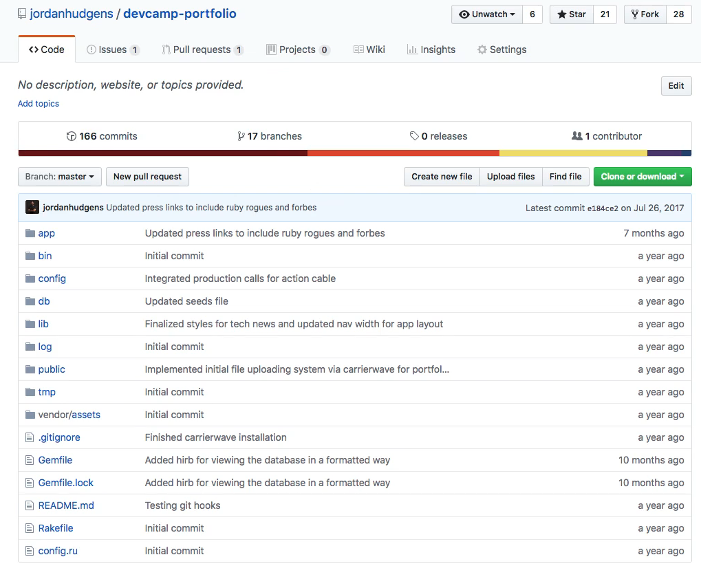
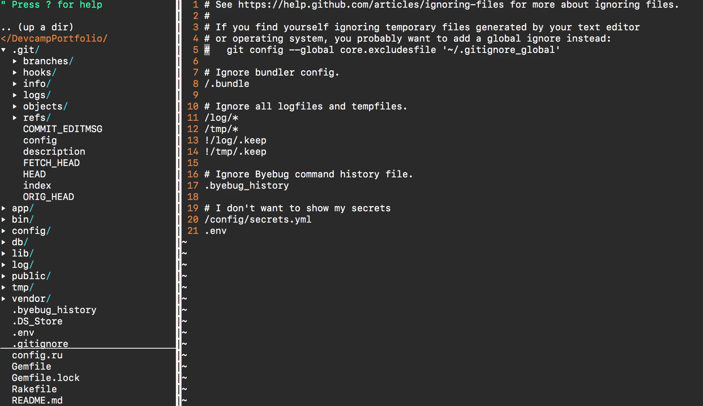
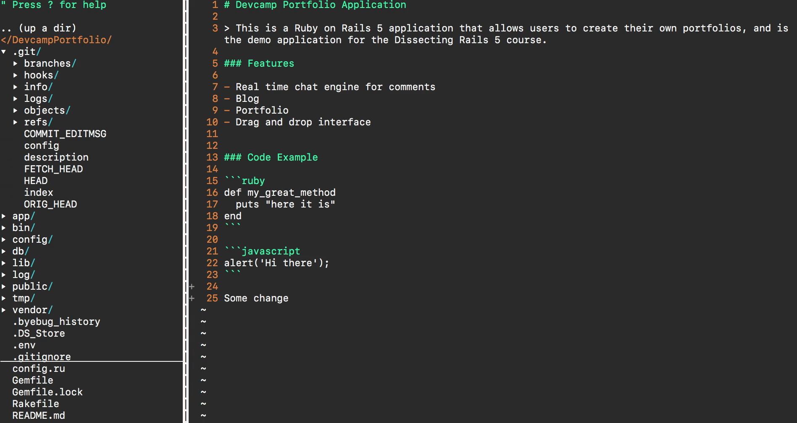
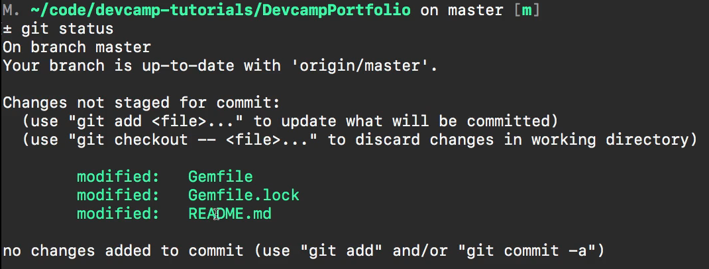

# 01-049:   Difference Between Git and GitHub

Right here I have my personal profile on GitHub on the screen 

You can see a list of some popular repositories latest comments elements like that and if I click on this one says devcamp-portfolio this is going to bring up a full project that I have. 

Now, this is technically a git repository. So whenever you have a Code project that you push to GitHub like I have right here. That is simply a graphical layer of what you have on your local machine and where it becomes incredibly powerful is it's a layer that can work as your centralized repository. 

If you remember back to our overview of git and where we walk through how multiple individuals and developers located all over the world could work on the same project at the same time. Tools like git allow for that if you only had your code in your repository on your local machine then other developers couldn't pull from that and then push to it the way that you could when you have it in a spot like GitHub. 

And so what we have right here is simply a centralized and stored version of what I have on my local machine and it gives me a number of tools such as working with concepts such as branches and being able to view all of my comments in a visual manner. And if you've never worked with git or GitHub before and this is your introduction to the technology. 

Don't worry if you're a little confused right now that's perfectly normal. I am only showing you this so that you can see that there is a difference I know that the name GitHub kind of sounds like it is just git. But it's exactly the way that the words describe it is a hub for git it's a hub for your git repositories. 

So just like I have this entire project here. If I switch to my local codebase so if I switch into VIM and I have the identical project this is that same devcamp-portfolio and it doesn't matter what kind of language or framework or type of project that you're working on you can use git with any of those. So this is my local version of git right here 

you can see and have a git directory. If you scroll all the way down I have a git ignore file that lists out all of the files that I do not want to get pushed up to GitHub and I only want on my local machine 

and we're going to be working through exactly how we can work with all of these different files whether it's the directory or the git ignore file. But what we have here is the actual git repository. This is the repository on my local machine so if I were to make a change to any of the files I'm just going to open up one file and down at the bottom I'm just going to say some change 

and if I save this file and quit out if I type git status and we're going to walk through what all these commands mean later on in their dedicated sections. But right now I'm just wanting to show you that what I have right here is a local version of the git repository.

So if I type git status you can see that I have changes in a couple of different files one that I was working on earlier and then the ReadMe file that you just saw me use. 

Now if I switch back to the actual repository that stored on GitHub and scroll down you can see that change is not here because I have not pushed that code up it is only on my local machine. If I add it to the repository, create a comment which means I'm creating a version I'm creating a benchmark in time that I want to see the changes and then I push it up to GitHub. Then all of the changes will be reflected and later on, we'll walk through what that looks like that. 

In summary that's the key difference between git and GitHub. Git is the actual technology, it is what allows us to create commits and create versions of our systems and work with branches and those kinds of elements and GitHub is a centralized repository where you can visualize all of those and where you can also collaborate on projects with other team members.

