# 01-053:   How to Integrate Gulp and Browser Sync for Auto Reloading HTML Pages

#### Update:  you will need to run these commands to install gulp:
`npm install gulp-cli -g `
and then:
`npm install gulp browser-sync`


So I'm going to rearrange how I have everything shown here because whenever I'm building out my own applications I usually like to have a visual of what I'm working on especially when they are front-end applications like what we'll be building with flexbox. So I'm going to first hide this explorer 

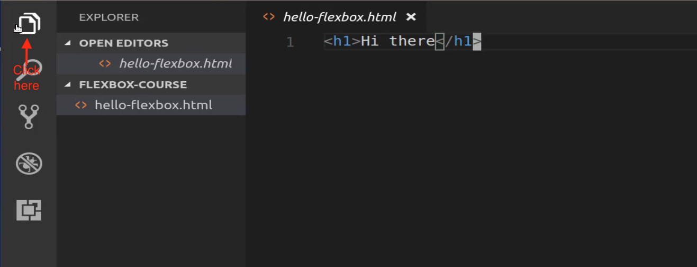

and then I'm going to have the browser over here on the right-hand side and the code on the left-hand side. So double click on that and you can see that Linux rearranges very nicely for us when we do that. 

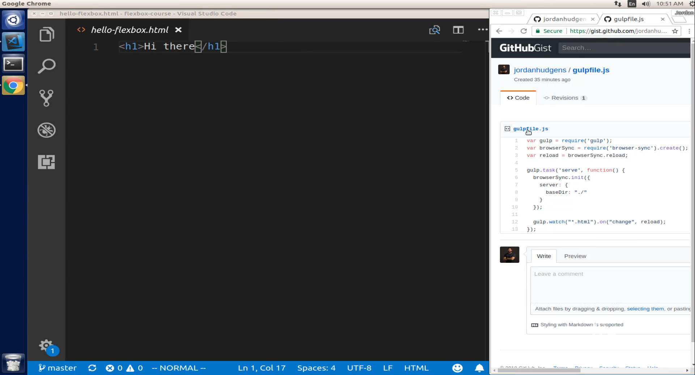

So now we have the code here and we're going to have everything else on the right-hand side. And so this is as you follow along you'll see this is how I have it set up for the rest of the course. Now the other thing that we're going to do is we're going to set up a task runner. Now if you've never heard of a task runner that's perfectly fine. And that's what I have this code already loaded up here for.

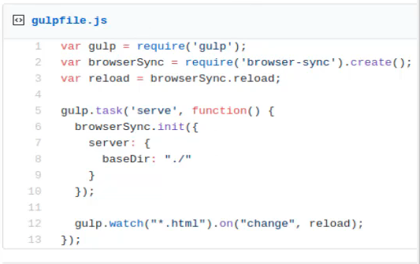

And so what we're going to be able to do is I'm going to be able to write code here on the left-hand side so I'm going to write all my code into this HTML file and then every time I hit save it is going to auto reload the browser that I have open for whatever I'm working on. So this makes for a very efficient work environment because if I didn't have that kind of setup I would have to save the file here come over switch to the browser hit refresh and then see if my change worked or not but instead if I set up a task runner what's going to happen is it's going to go through and watch for every change I make to this file and then it will reload the browser for me so I can watch in real time as I'm building out my app. 

So this is a very helpful little tool so I'm going to make a few changes before we get into the build-out of that task runner. So first I'm going to change this instead of saying hello-flexbox I'm going to rename it and it's going to be `index.html`. And then I am also going to actually have some valid HTML here. If you followed along when I walk through how to add different snippets that I use if I start typing HTML and then come down to HTML 5 this gives us our boilerplate right here. 

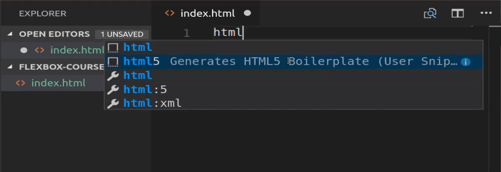

Now, this is actually valid HTML code. 

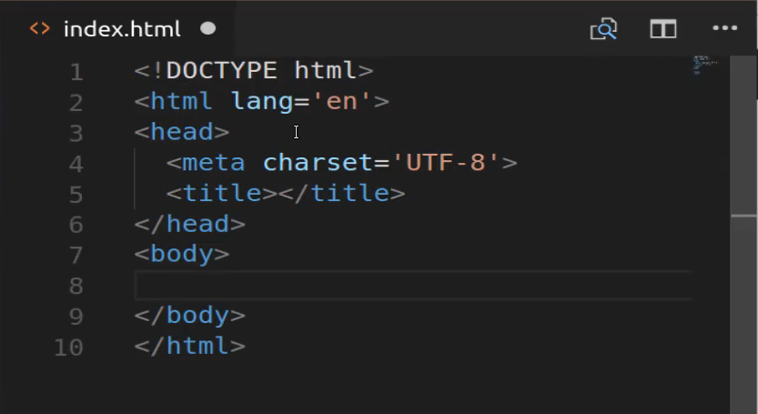

So here I can say Hi Flexbox hit save and now we have valid HTML here and that is required, browser sync will not simply work with just a plain h1 tag it expects to have a real validate HTML document to work with. 

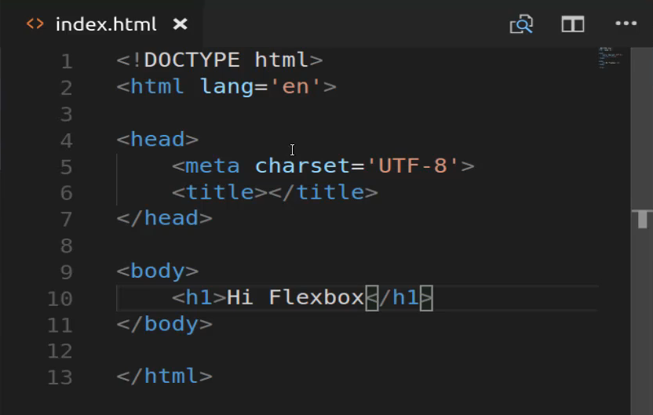

So now that we have that set up let's come and let's start installing gulp and the different tools we need for our tasks.

So I'm going to open up the terminal and we could technically also do this in the terminal provided by vs code but by doing it this way I can just have it run in the background and not have it take up any screen real estate. So I'm going to change into the directory so if you do not have a code directory or you have yours saved in a different spot you may have to type something a little bit different. I'll increase the font size here and so I have mine located at the root of the system. 

So I can do `~/code/flexbox-course` and so now I'm changed in that directory if I type LS. You can see we have our index.html file there 

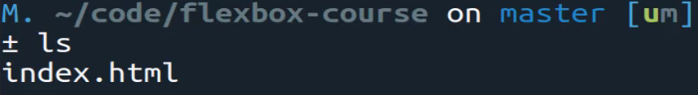

and now we're going to use NPM to install the different packages we need so I can say npm install and then we want to have a few different ones. We need to have a gulp, then we need to have gulp-cli, and then we need to have browser-sync. 

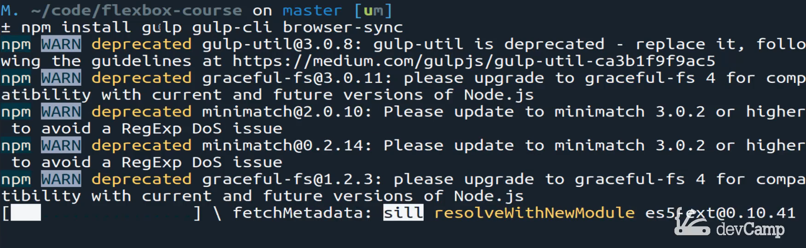

As these are installing I will explain what they're doing or what they are so the goal is our task for running system so it is a node module that will allow us to create watcher's and various tasks that will run in our case we're going to set up something that's going to watch for changes in an HTML file and then it is going to process those. Now the gulp cli allows us to run commands here in the terminal so that's needed for us to start up the process and then browser sync is our connection to the browser so that's what is going to perform those reloads. 

So we will run

`npm install gulp gulp-cli browser-sync`

Then you will need to make sure that the gulp cli is installed globally, use this command

`npm install -g gulp-cli`

So if everything worked and we didn't get an error so it looks like it did. 

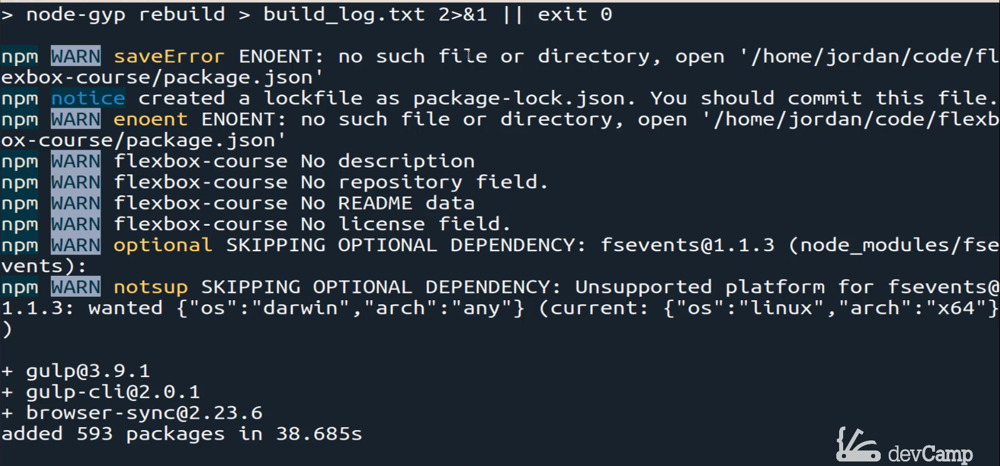

Then we can come back over here and you'll see that we have a few new files that were added. One was this package-lock.json and so that showing all of the different packages that were installed. 

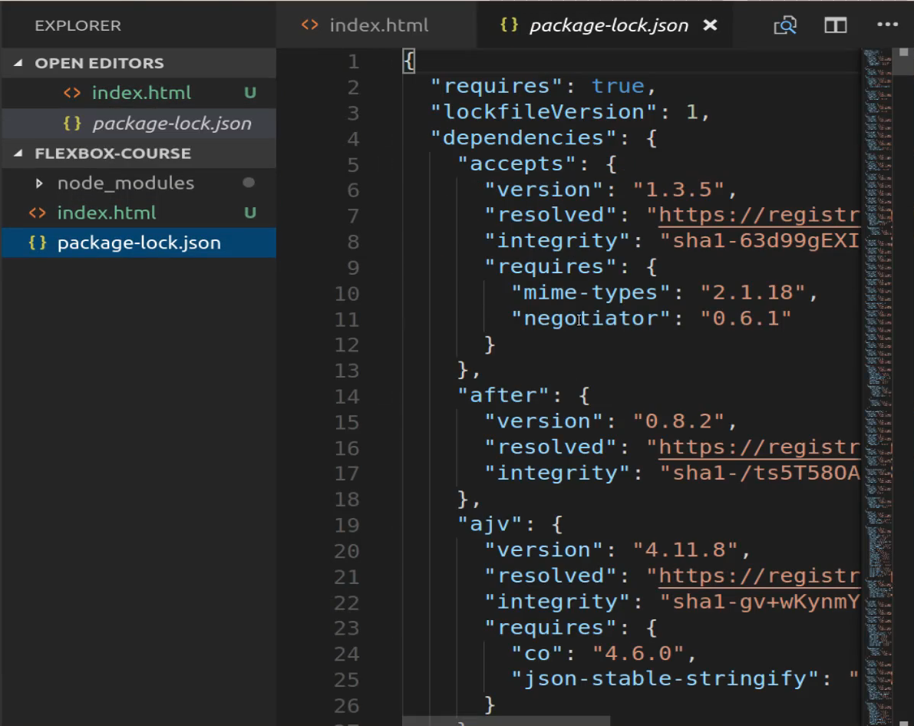

Because even though we only picked out 3 packages those 3 contain their own set's of dependencies so that's what's in there. Now node modules is a massive directory that includes all of the JavaScript code that gulp and browser-sync and those types of tools use. Now you may notice that we have a little issue here with git where it thinks that we have 5000 new changes. 

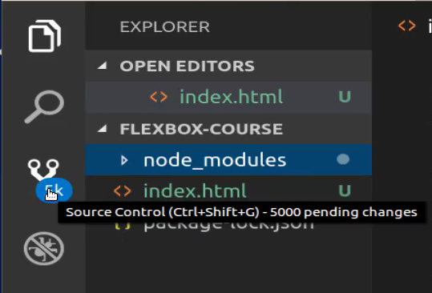

and so the best practice and you'll find this out when you go through the git course is to not include these in version control. So the way you can do that is by creating a new file, not a new file inside of the node modules. This needs to be in the root of the directories. So close that out and create a new file here called .gitignore 

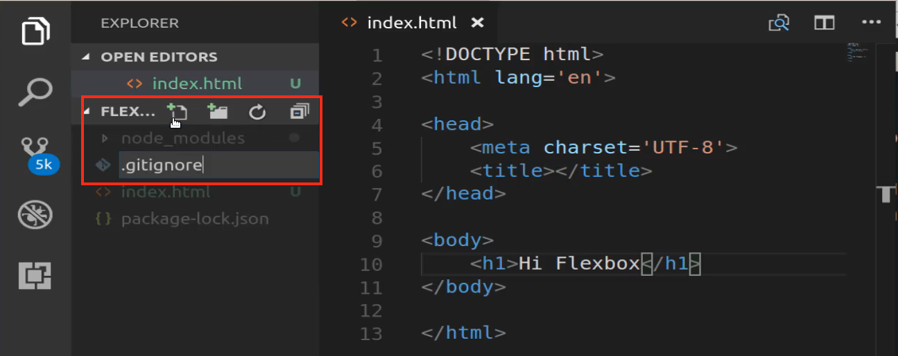

and inside of here just type node_modules and hit save and it will no longer be something that gets checked into version control which means that when we push this up to github it will not push this node modules directory which is what you want because it's because you have this package.json lock file whenever you run npm install it'll bring those down anyway so you don't even need to have those. 

So if you come over here to where it says 5K you can just hit refresh and now it's back to only showing the real changes so that is everything on that side. 

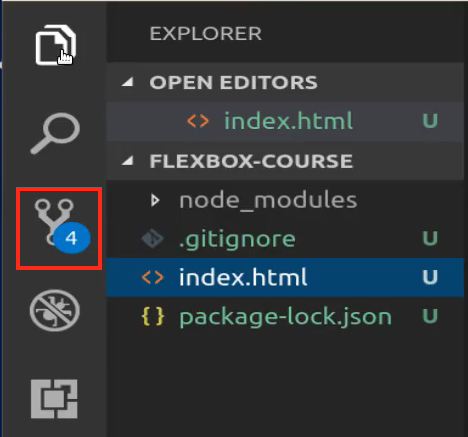

Let's see what else do we have to do, I think we are good. I think we can now add our actual task runner so I'm going to create a new file say `gulpfile.js` and inside of here simply paste this code in and I've added this to your show notes so you can paste this in directly. 

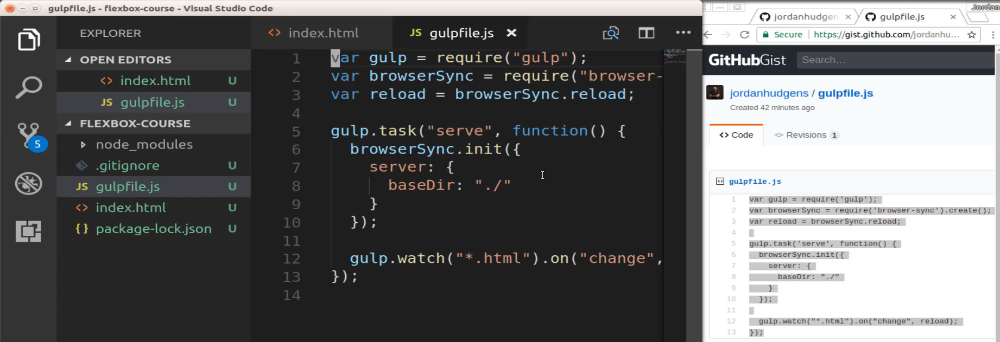

And we'll walk through and all explain exactly what it is doing. But it is bringing in these dependencies so it's bringing in gulp, it's bringing in browsers-sync, and then it's bringing in the reload library from browser-sync and then from there we creating a task so it's going to create a task called serve. So what that means is we're to be able to say gulp serve and then it's going to automatically start this function where it connects to browser sync that's listening for the base directory and that's going to start up a little server for us and then we are going to have gulp watch any changes to the HTML files. And if there are changes then it's going to call reload which if you look all the way back up to the top, that is the reload we imported right there. 

So that is what our gulp file is doing so I can close this out I can hide that on the left-hand side so now you can see everything in the code files and now let's open the terminal back up and I'm going to shrink it just a bit just because we're actually only going to be using this as a background task so I'm going to now make sure you're in the same directory and you can verify that by typing LS you can see our gulpfile and all of our new files we added. 

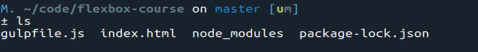

And now you can say gulp serve and if everything is installed correctly this is going to automatically open up a new browser window and it is going to start watching for changes. So I'm going to hit enter and it looks like everything works. So you can see it even says connected to browser sync. 

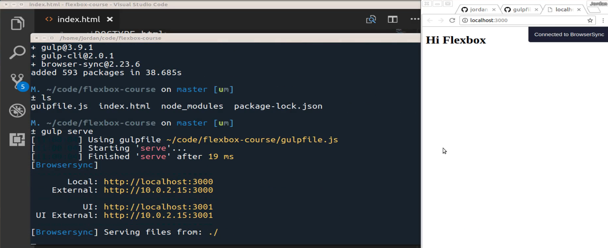

And now if I come inside of the file and now say create a paragraph tag and I say some content and hit save. You can see that that got updated automatically. 

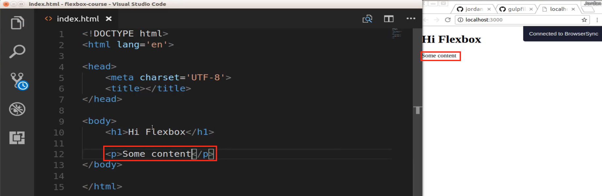

I didn't have to hit refresh just as I'm making the changes. Every time I hit save the gulp task runner is going to process and then it's going to reload the browser for us automatically. So congratulations if you went through that you now have a full task runner set up in a professional type of configuration for your front-end code. 

Now if you are following along and you're wanting to place this on GitHub you can come into the terminal. You can stop the task by typing control c that will stop it and now you can type git status and you can see all of the different items that were added and changed.

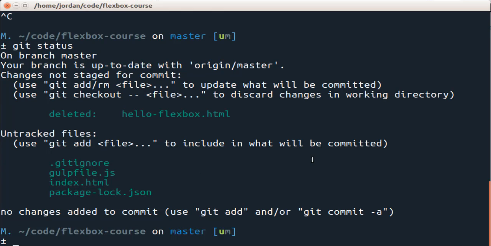

And you can see that I deleted the hello-flexbox file because we're processing everything on index.html now and so I'm going to say `git add .` and then `git commit -m` and we can say `"Install gulp for task running"` and now just type git push and then this is going to go up to GitHub and you'll be able to see that everything is now updated. 

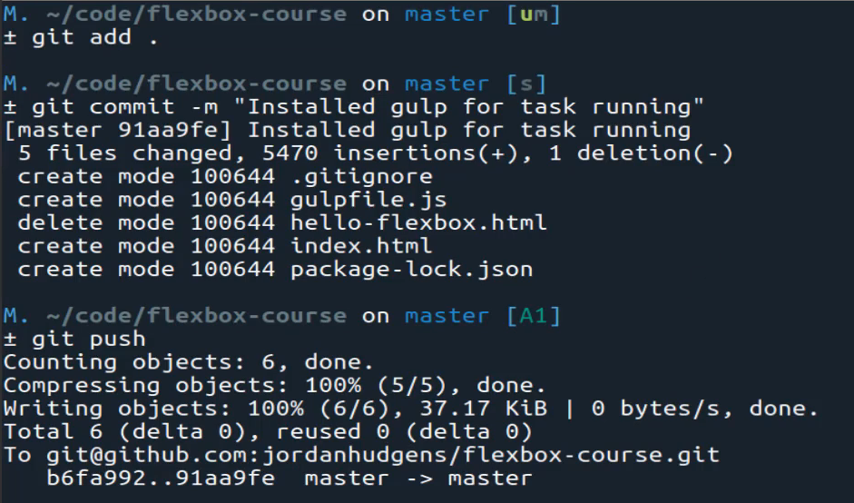

So if you hit refresh you can see that it has our .gitignore file, our gulpfile, our index file, and our package-lock.json. 

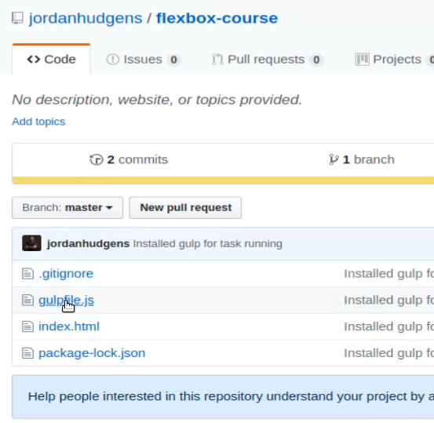

So we are well on our way, we now have our system completely configured for building out front-end code. And now we can start learning about flexbox. 


## Code

```javascript
var gulp = require('gulp');
var browserSync = require('browser-sync').create();
var reload = browserSync.reload;

gulp.task('serve', function() {
  browserSync.init({
    server: {
      baseDir: "./"
    }
  });

  gulp.watch("*.html").on("change", reload);
});
```
