# 01-054:   How to Align Content Vertically and Horizontally on a Page with Flexbox

So we're going to create one of those kinds of error pages that you see where it says oh I'm sorry you reach this page and something went wrong and we're going to add images and we're going to use flexbox to arrange everything on the page or else we're going to use some custom fonts and do some things like that so it looks like a real error page and it's something that you can use in future projects. 

So right here I'm going to place a link to this little [tumbler bot](https://github.com/jordanhudgens/flexbox-error-page/blob/c0a45ebcc6b9bcd567b1995c4511457185a689ab/tbot.png) in the show notes and so this is going to be the image that we're going to be using. So click on download and that is going to give you access to the actual root file. And then you can save the image and then I would go and place this inside of the project itself so we can say flexbox-course and you can just save it right here, later on, you can move it to whatever path that you'd want it to be at. That's going to give you the image that you need. And I'll double-click the top and now we are back to our setup. 

Now I already have gulp running in the background so any changes that I make here to the HTML file are still being updated so I could say some updated content save and you can see updates there on the right-hand side.

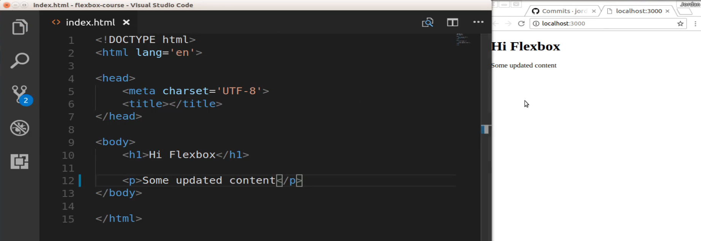

So now with all of this in place let's actually start building and using flexbox. I'm going to have everything here on the same page so I'm going to go in I'm going to be using embedded styles. There is literally no difference between me using embedded styles and having a style sheet in a real project you would have a separate stylesheet and then you'd call it. I'm going to have it here on the same page just so everything is in front of us. 

So let's give this a title, we will say Error Page and now let's go and add some content to the HTML body. So I'm going to create first a wrapper div I'll say div error_wrapper and if you're not using visual studio code then you may have to type that out manually. But that's another one of the nice shortcuts that I really like with vs code if you're on Atom or Sublime. I believe the plugin that allows you to do that is called Emmit but it's a nice way of being able to write your HTML code without having to type each one of the brackets and those kinds of things. 

So now that we have our wrapper div I'm going to create another div inside of it and so I'll say div.error_heading and this is going to be where we place our heading. And right now let's go with an H2 and I'll say yikes and then we can put in whatever kind of error slogan you want to say. I'll put in Who knows when that page will be available, would you like to try another.

```html
<h2>Yike... Who knows when that page will be available, would you like to try another.</h2>
```

And now I can save this file and you can see that that got updated so everything there is working properly. 

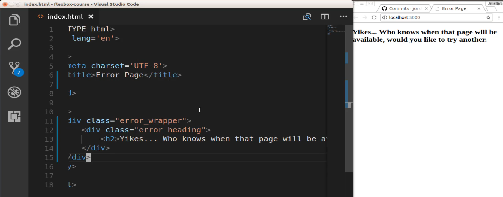

And now let's bring in our image. So this is still going to be inside of the wrapper but not inside of the heading so I can say image and the source of this I should just be able to say `tbot.png` and if I hit save that brought that in, so that is working properly. 

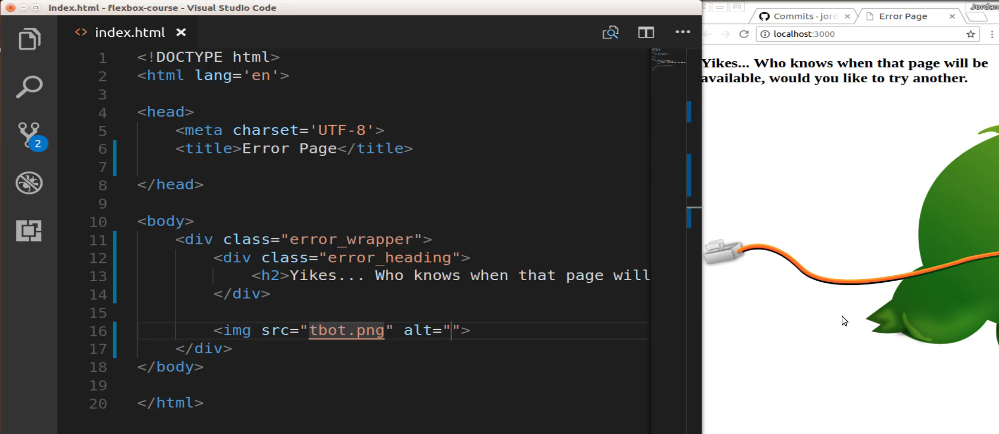

Now I know this looks hideous and that's kind of part of the point. Right now we are simply adding all of the raw HTML we have not touched any of the CSS code or the Flexbox code yet, that is what we're doing next. Now if you get a little error icon and you do not see the little tumbler bot here, what that means is that the file is not at the right location. So if you open up your file explorer here you should see your little tbot.png file here. 

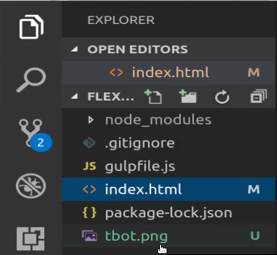

If you don't that means you might have saved in the wrong spot. 

Now that we have that let's start adding our styles so I'm going to come up here to the top and I'm going to need to create my embedded styles and now inside of here this is where all of our embedded flexbox styles are gonna go. So I'll say body and then inside of here, we'll go with a background color. So I want to have some type of background color and I'm going to go with light goldenrod yellow for our background color and if I hit save that got updated so that it's working well. 

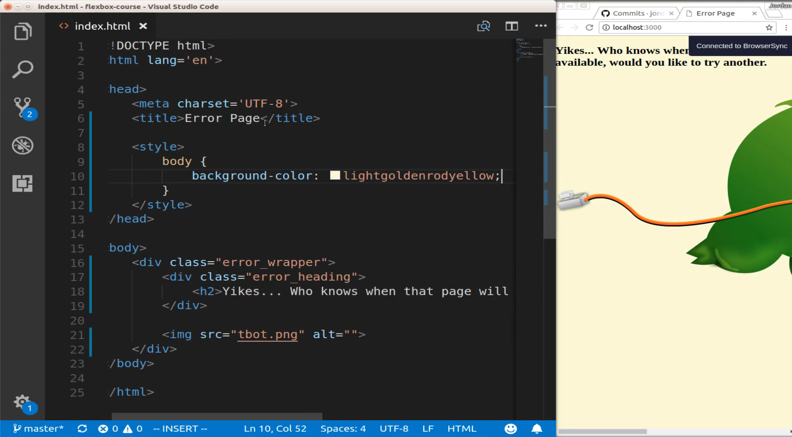

Next, let's create our error wrapper styles. So I'm gonna say `.error_wrapper` and so inside of here, this is going to be our first introduction to flexbox. The very first thing that we're going to need to do is to call display flex so any time that you are working with flexbox this is the first item that you are most likely going to type in. So this is going to give us a very special kind of tooling called flexbox that allows us as you saw right now it just readjusted. It didn't fix it and put it in the kind of styles we want yet but it did rearrange how they're positioned. 

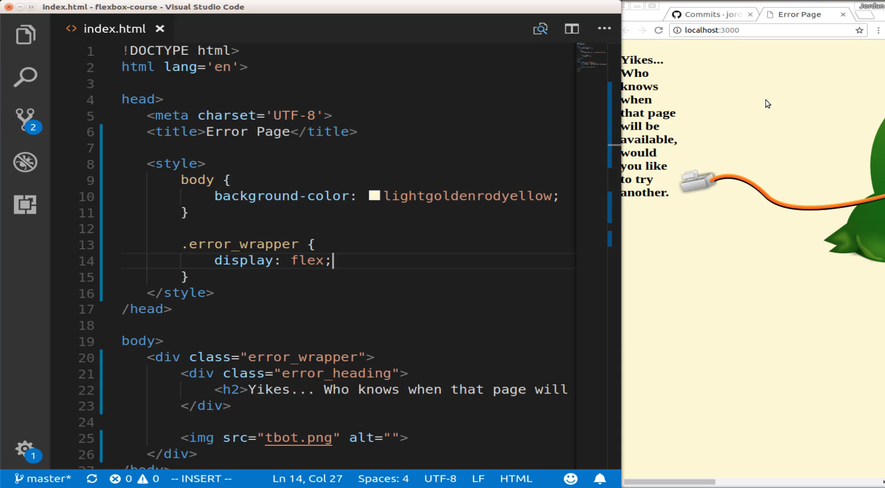

so instead of using some of the older kinds of display methods such as block or absolute or anything like that. What we can do with flexbox is say that we actually want to use flex style definitions here and so that is the way that you can start off by declaring it. Then below that, we're going to add a few other elements so we're going to say justify-content and then this is going to be centered. And then I want to align items and then this is also going to be centered and then I want to set the height of this to 100vh and what that stands for is for 100 percent of the view height and so this is going to take into account different browsers. This is better than just saying 100 percent and then next we need to say flex-direction and then we're going to go with column. So let's save this and see what it's doing. 

```html
.error_wrapper {
  display: flex;
  justify-content: center;
  align-items: center;
  height: 100vh;
  flex-direction: column;
}
```

So this is looking a lot better. 

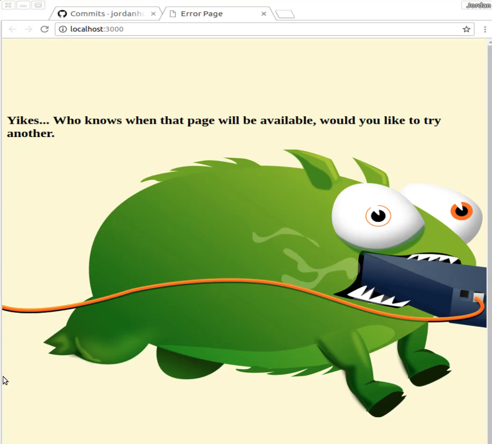

You can see this is starting to shape up, we're not where we want to be quite yet. It's definitely looking a lot better and notice how without us really doing anything besides a few lines of code we're able to do something that used to take a very long time. Now if you have never worked with older versions of CSS or CSS by itself it's very interesting one of the concepts that you think would be incredibly straightforward which would be to align items vertically and horizontally used to take quite a bit of code. 

And this is when I fell in love with flexbox was when I saw that in just about three or four lines of code I could align-items right on the page and place them directly in the center. That is something that with pure CSS is not exactly a trivial matter. So let's keep going because we're not quite done we still have a few other things obviously to get done and then we'll be able to have a really nice looking error page. 

So okay so that is stretched there and now that we have our error wrapper let's come and go to what is called our Flex item. So we're going to talk about this later on but what we have here with our error wrapper This is the wrapper for our entire flex kind of setup and then inside of it we're going to have flex item. So you're going to hear the term flex container, that's what this is, this is a flex container where we are putting our display, justify-content, and align-items in and then inside of it you have flex items. 

And so here we're going to take our .error wrapper and then grab our .error heading and let's just add some margin on the bottom. So margin-bottom of 42 pixels and lastly let's update our image we have one image on there. If you are working with an application that has multiple images on the same page then you can add a class or id to them and select it. But for right now we can just come and grab the actual image itself not dot image and inside of here, I'm going to say width and 50 percent hit save and there we go it is working. 

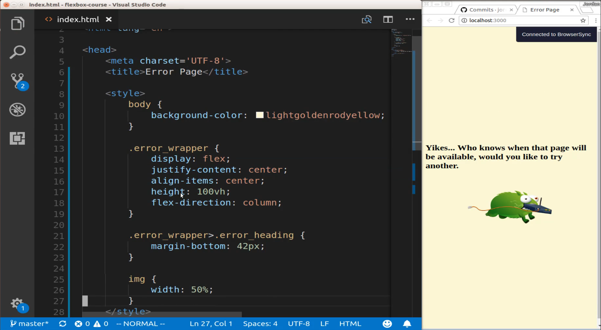

Now you may think he's looking a little bit tiny but the reason for that is because usually, you're going to be looking at him like this. 

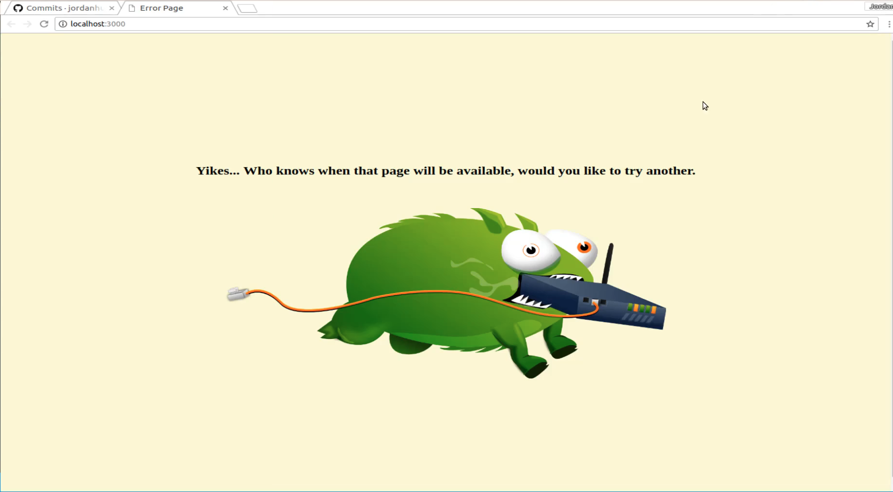

And so you can see when it is full screen this is looking beautiful and you can play with any of those styles to see if there is anything else that you want to do. The only thing that I would say that I would like to do to make this look a little bit more professional something you actually want to show off is let's grab a custom font so let's go to [fonts.google.com](https://fonts.google.com/) and then this is going to give us access to come and grab a much nicer looking font. 

The one that I have been using quite a bit lately is called Merriweather. 

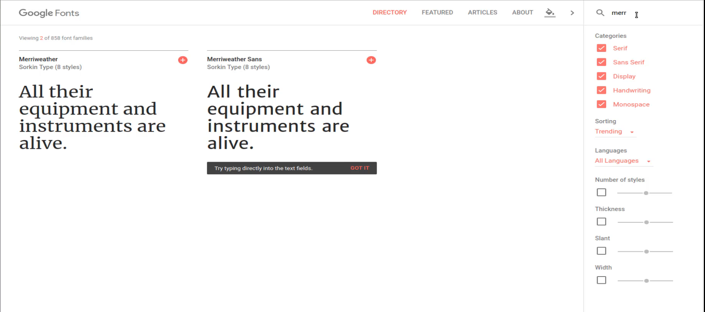

So I'm going to come and get this and the way you get a custom font you just click on select this font 

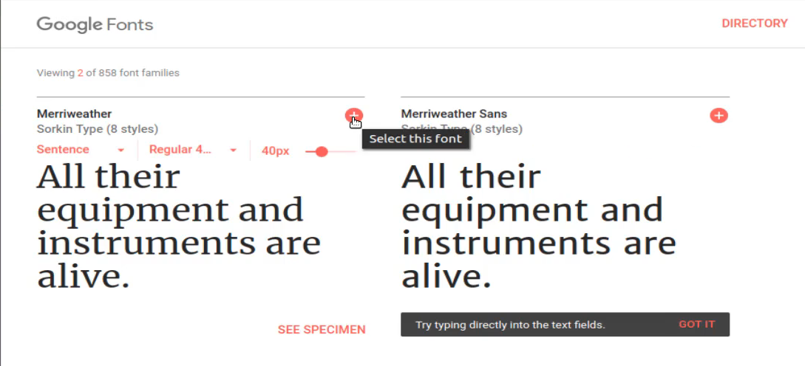

and it's going to pop up right here along with instructions 

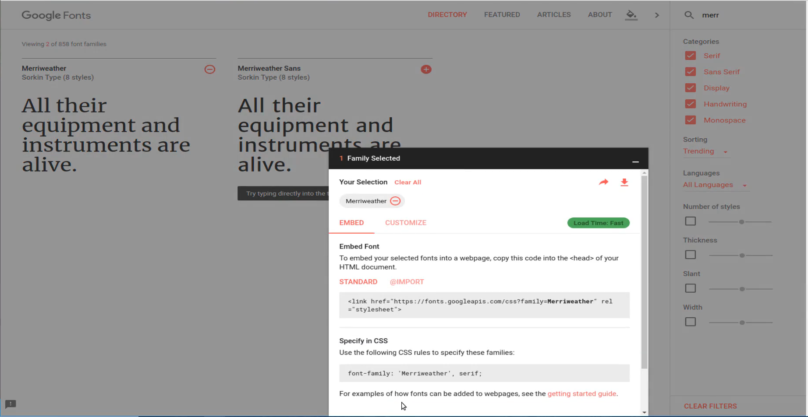

so I can copy this code 

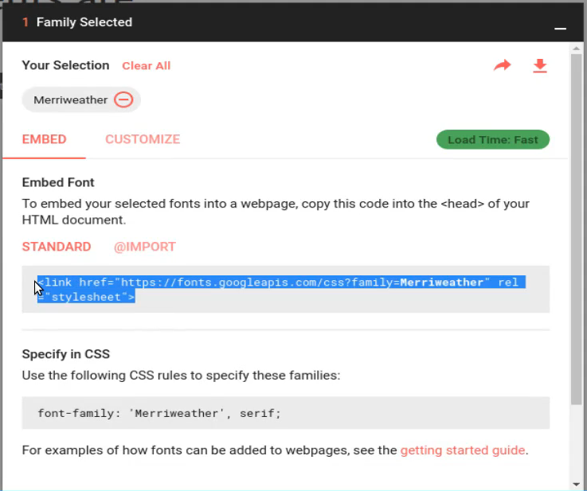

switch back to visual studio code and right up at the top so you could place this line right above your styles and paste that in. 

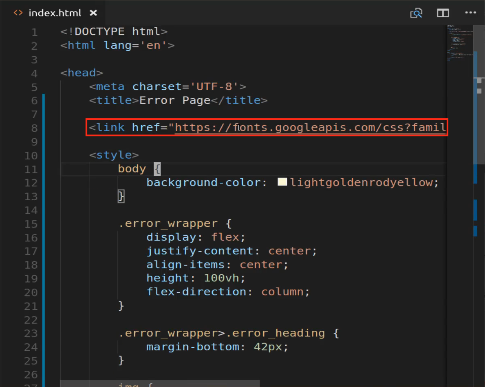

Now that you have that we can now access it exactly like how they said right here. 

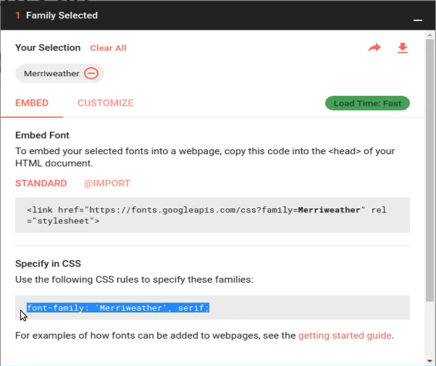

So I'm going to copy that switch back and now inside of the body, I'm going to say font-family Merryweather serif and hit save. 

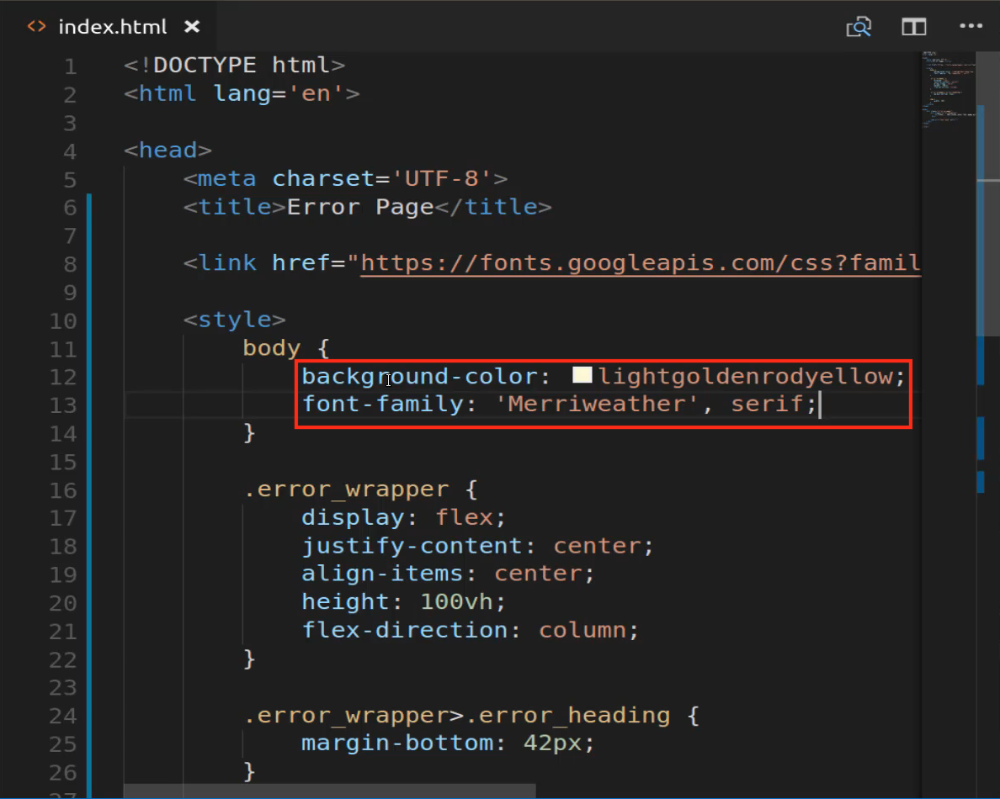

Now if we switch back to the browser and look at our error page you can see this looks a lot cleaner, a more professional looking font. 

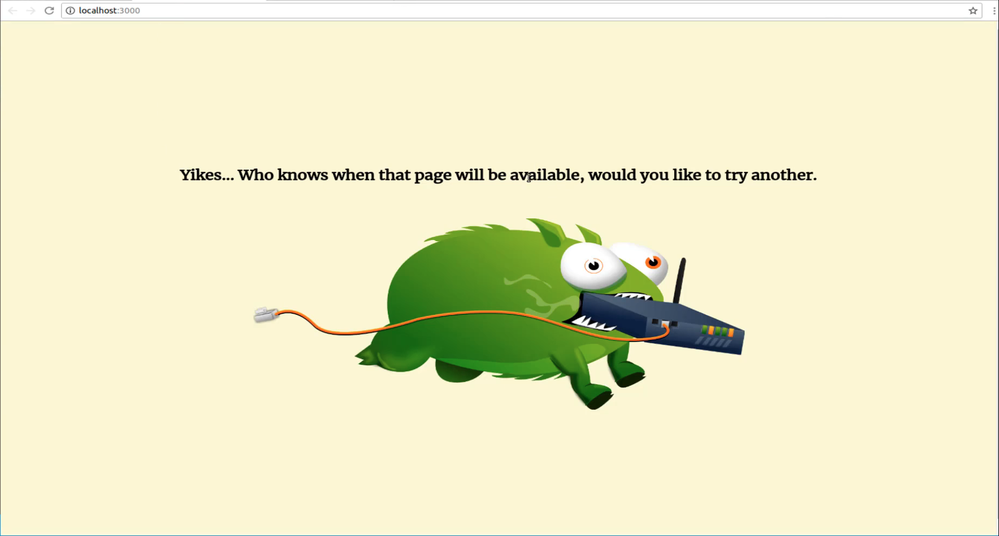

And so this is something that I would actually use and in fact, I am about to integrate this exact error page into a live production application that I have, that's the reason why I picked it out and thought it would be a fun project. 

So let's review the Flexbox elements of everything we just walked through. So as you can see it didn't take a lot of code to integrate flexbox that's part of the reason why people are loving it with just creating a flex container here by saying display flex we called justify-content we centered it, then we set a line item center and then flex's direction column. And that did all of the work for us.

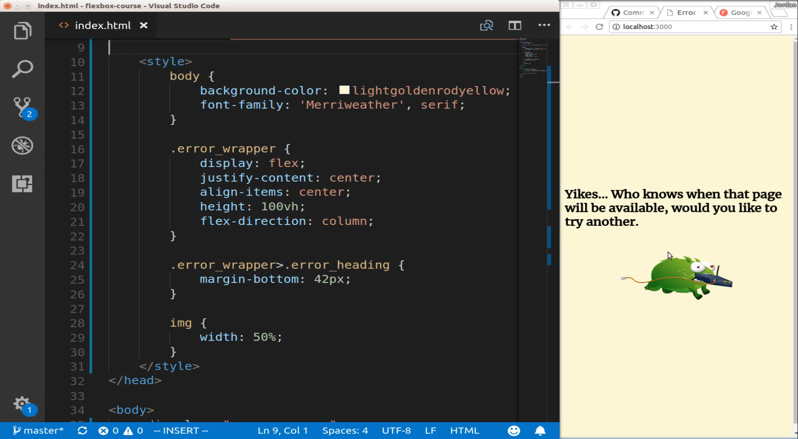

Now if you are wanting some more details on this, do not worry we're actually going to dive into what each one of these elements represent in this course. What I wanted to do was to start off by showing you how with just a few lines of flexbox code we were able to build a pretty cool looking page just by doing that and this is something that I do in a number of real production applications and so whenever you need to have something centered directly on the page and this would also work if your centering needed to center something directly in a div or something like that. Then you can come look at this project and see exactly how to do that. 

And now we're going to get into some more of the details and see exactly what does justify-content represent what other options can we pass to it. And the same thing with the line items and flex-direction and how can we use multiple flex containers and those kinds of things. But for right now great job if you went through that! You now know how to use flexbox to center items on a page.


## Code

```html
<!DOCTYPE html>
<html lang='en'>
<head>
  <meta charset='UTF-8'>
  <title>Error</title>
  <link href="https://fonts.googleapis.com/css?family=Merriweather" rel="stylesheet">

  <style>
    body {
      font-family: 'Merriweather', serif;
      background-color: lightgoldenrodyellow;
    }
    .error_wrapper {
      display: flex;
      justify-content: center;
      align-items: center;
      height: 100vh;
      flex-direction: column;
    }
    .error_wrapper > .error_heading {
      margin-bottom: 42px;
    }
    img {
      width: 50%;
    }
  </style>
</head>
<body>
  <div class="error_wrapper">
    <div class="error_heading">
      <h2>Yikes... Who knows when that page will be available, would you like to try another?</h2>
    </div>

    
  </div>
</body>
</html>
```

## Resources

- [Tumblr Bot Image](https://github.com/jordanhudgens/flexbox-error-page/blob/c0a45ebcc6b9bcd567b1995c4511457185a689ab/tbot.png)
