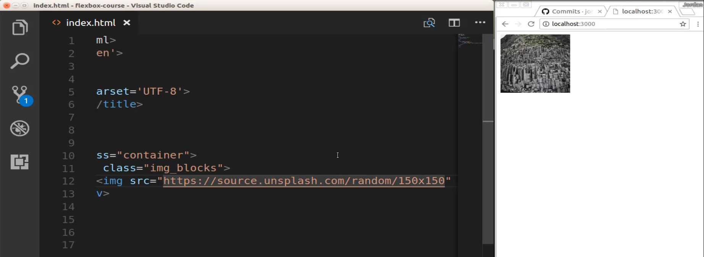
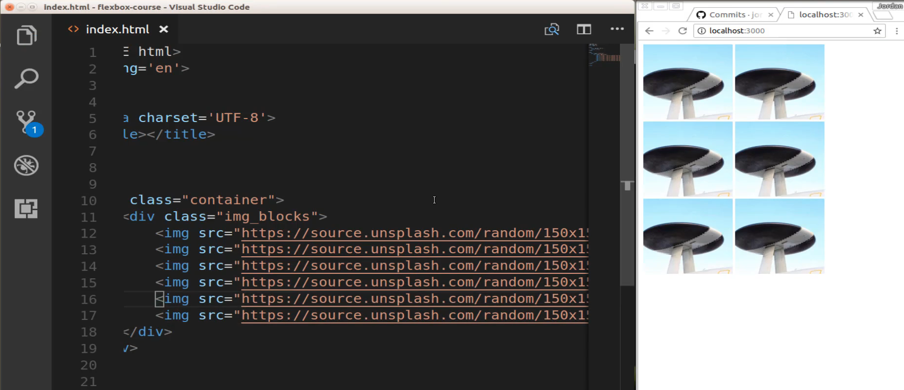
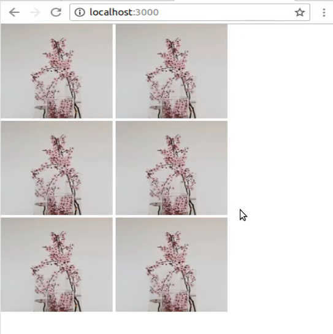
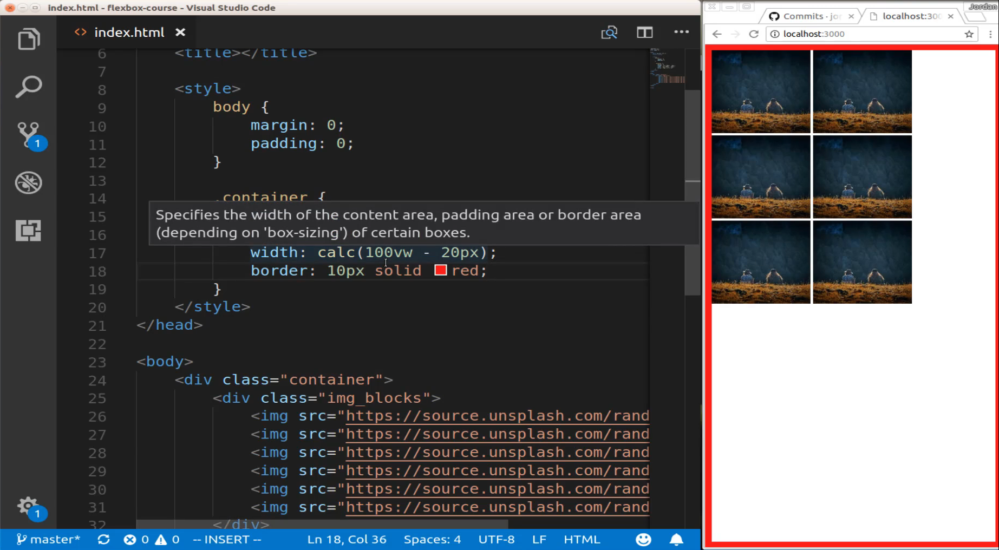
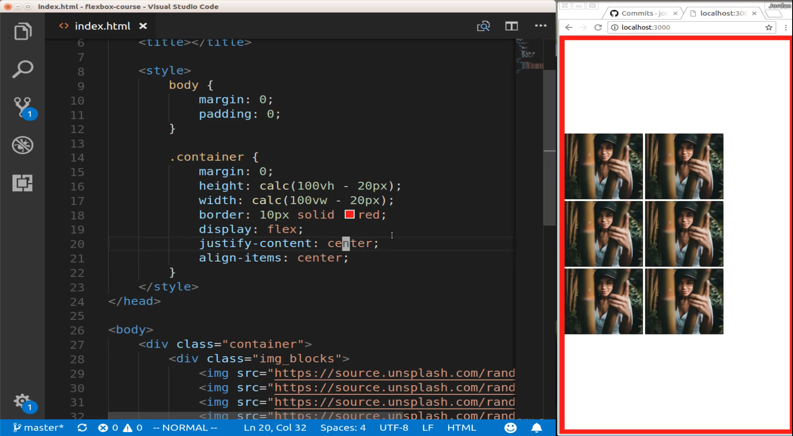
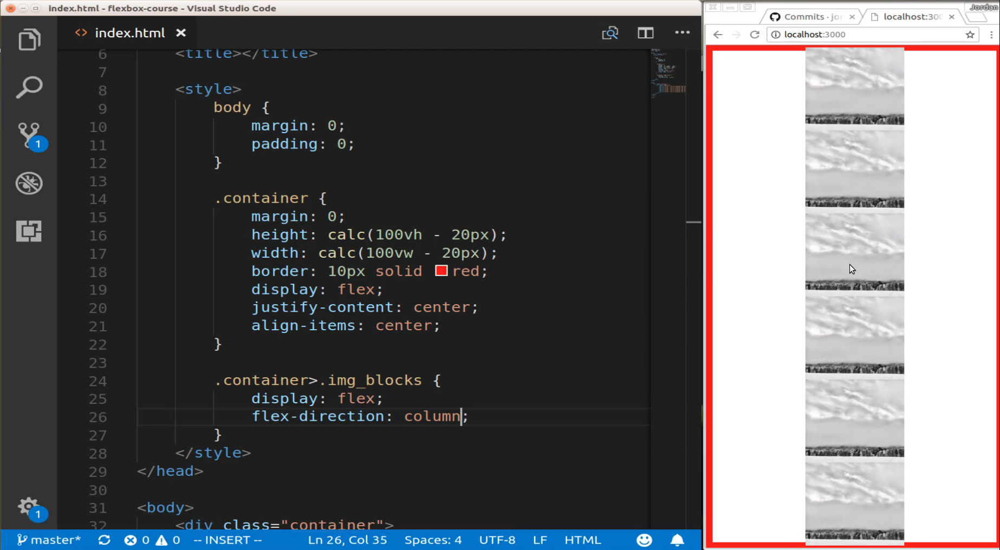
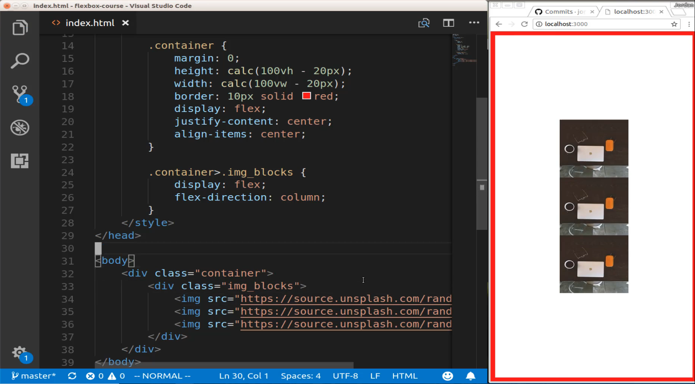
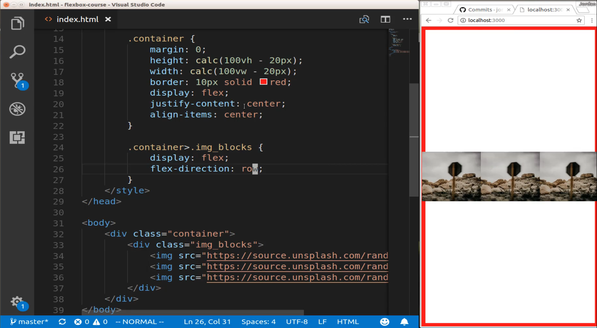

# 01-055:   Overview of Flex Direction

####NOTE: As of June 2024, Unsplash has ended their random image functionality (still available as an API through creating a developer account). Similar functionality is available from picsum:

```
https://picsum.photos/<height>/<width>
(e.g. https://picsum.photos/150/150)
```

If you're following along and you're also organizing your files what I did and this is why I'm going to do throughout the course is I just created a directory inside of the root of the project. And this one I called error-page-project and that's where I put all of the code that we just went through the image and the index and so as you're going through you can just go copy those files in there and then I have a new index file here that's at the root of the application. So that is my process and then you can also see that and access it on GitHub. 

So now what we're going to do is we're going to see and kind of dissect some of the different elements that we saw in that error page and specifically we're going to look at Flex direction. Let's start off by creating some HTML code here I'm going to create a container class. It's going to be div container and let's also close this off so we have some more room here. And inside of the container class, I am going to create a class called Image blocks. So it's div img_blocks and then inside of here, I'm going to have a number of images so I'm going to say img and I'm going to use a pretty cool tool called Unsplash if you never used it before.

But what it allows you to do is to call an url and then it is going to give you a random image from their library. So I can say https://source.unsplash.com and then slash random and then you can pass in a size so here I'm going to say 150X150. And now if I hit save you can see we have an image right there. 



So let's come and let's just create six of these so say 1, 2, 3, 4, 5, and 6 hit save, and as you can see we have 6 images and they are random. 



So that these are the different images that we're going to be using throughout this guide and also in a few other ones. This next part isn't so much necessary for flexbox but what it's going to allow us to do is to visualize exactly what is happening and what the page looks like. Because right now it's just an empty page it is kind of hard to imagine where the elements are in relation to the rest of the page so I'm going to put a border around this entire page and that way we're going to be able to see exactly where everything is in relation to the other parent elements. So I'm going to start off by saying body and then go with a margin of 0. So I'm going to have a body here and it's going to have a margin of zero and then it's going to have a padding of 0.

```
html
<style>
    body {
        margin: 0;
        padding: 0;
    }
</style>
```

All that's going to do is to make sure that we don't have a body tag as you can see right here. We have a margin that is going to kind of confuse us a little bit. If we're trying to perform tasks such as stretching the items from one side of the page to the other. So I'm going to get rid of that and now you can see that we do not have any margin or border that is on the page. 



So we're working with the page as transparently as possible. So now let's go and work with our container class. So we created that container and container is a name you're going to see quite a bit in the CSS side of the world and specifically in flexbox whenever we're creating some type of flex element that contains child elements so right here we have a container that also is going to have multiple elements inside of it such as this image blocks class and these images inside of that. 

So what container allows us to do is to wrap all of that up and then be able to declare our styles on that. So with the container, I want to have a margin of zero here as well. And then I want to have a height and this may look a little bit different if you've never seen it before but we're going to perform a little calculation so I'm going to say height calc and then I want to have 100 percent of the view height minus 20 pixels and then I want to do something very similar for the width so I'll say width except instead of 100 percent of the view height I'm going to say I want that for the view width and in a little bit when we walk through exactly how our entire flex setups going to be, this is going to make sense why we're performing this calculation. 

```
html
.container {
    margin: 0;
    height: calc(100vh - 20px);
    width: calc(100vw - 20px);
}
```

But this is something pretty neat in CSS, this is not related to flexbox you can perform mathematical calculations and that can help if you've ever had an issue where one of your elements is actually overflowing it may be because you have margin and when you perform calculations you can subtract that margin. 

So now that we have that let's create our border I'm gonna say `border: 10px solid red;` save and now you can see that we have this border and this is the canvas that we're going to be working on. 



So now that we have all of that we can start working with flexbox and we will actually be able to see where everything is. So now we're gonna say display flex and if I just hit save right now you will see that nothing really changes because we already had exactly what the defaults would be with flexbox where these elements are just right next to each other, so far no change. 

Now let's talk about justify-content. So we're going to say justify-content and then center it. So nothing still, okay, well let's see what's going on now. Now let's say align-items and say center save and that aligned. 



So why didn't our justify-content align? And well that is kind of the entire point of this guide and that's because justify-content performs one action, align-items performs a different action but they are related to the concept of flex-direction. So by default, if you have a flex container like we have right here the default way that that gets set or how the Flex direction gets at is that it is set as a row based direction and what rows mean is it is going from side to side. So our justify-content here really doesn't do anything. 

So now let's see how to fix this. If I come down here and now I'm going to say container and I want that child set of image blocks. Now I'm going to say display flex and I'm going to change the Flex direction. So instead of going with the default row now, I'm going to go with column, not columns, just column. And now if I hit save you'll see that this has completely changed how the setup works. 



Now all of our items are centered horizontally and technically they're centered vertically. If I come down here it may be hard to see depending on how many of these images you have and how big your screen is but if I were to take three of those away you'll see we're back to having the elements centered directly in the page. 



So that is something that is a little bit interesting and there is something here that I just did that you may or may not have noticed but I actually created two flex containers. Remember the rule that every time you say display flex inside of a class definition that means that that is a flex container. So this container class is a flex container. But then also this container with img blocks, this is also a flex container.

If you want to look at what the kind of box model on how this works each one of these elements is an image and each one of these is a flex element. But then they are nested inside of this image blocks class the image blocks is a flex container for the images. If you move up the hierarchy one more this container class is the Flex container for this img_blocks class. And so if this is a little bit confusing to you don't worry this part takes a little while to get used to. 

But part of the reason why I'm doing it right now is because if you do not understand this part of it or at least if you're not introduced to it then you're going to be constantly confused with how flex style definitions are affecting the elements on the page because the way that it works is with this parent-child kind of relationship. 

And this is really what help me understand flexbox. When I started learning it was that you have the concept of containers and then you have the elements that they affect. And so in this case when I say right here display flex and justify-content center align-items center. What I am doing here is I am saying I want you to do that to this ing_blocks div. Now this is not going to go and affect the images the images are affected here. 

So because when I created a new container here that said display flex this means that I'm turning image blocks into its own flex container and then any changes I make inside of here so adding flex-direction column anything like that it is going to be what affects the image elements. 

If you keep that kind of hierarchy in mind then that is going to really help to kind of solidify everything. So if I come here and I could change this to row and hit save. 



And now you can see that they are no longer stacked on top of each other but now they are side by side. And also I could just delete that entirely and get rid of that because remember flex-direction by default is always row. The only way that it is going to be different is if you explicitly say that you want to change it to column and so any time that you need to stack items on top of each other you want to use flex-direction column and by default, the elements are simply going to go side by side so that is the default behavior when every you're using flexbox and flex-direction.


## Code

```
html
<!DOCTYPE html>
<html lang='en'>
<head>
  <meta charset='UTF-8'>
  <title></title>
  <style>
    body {
      margin: 0;
      padding: 0;
    }
    .container {
      margin: 0;
      height: calc(100vh - 20px);
      width: calc(100vw - 20px);
      border: 10px solid red;
      display: flex;
      justify-content: center;
      align-items: center;
    }
    .container > .img_blocks {
      display: flex;
      flex-direction: column;
    }
  </style>
</head>
<body>
  <div class="container">
    <div class="img_blocks">
      
      
      
      
      
      
    </div>
  </div>
</body>
</html>
```
