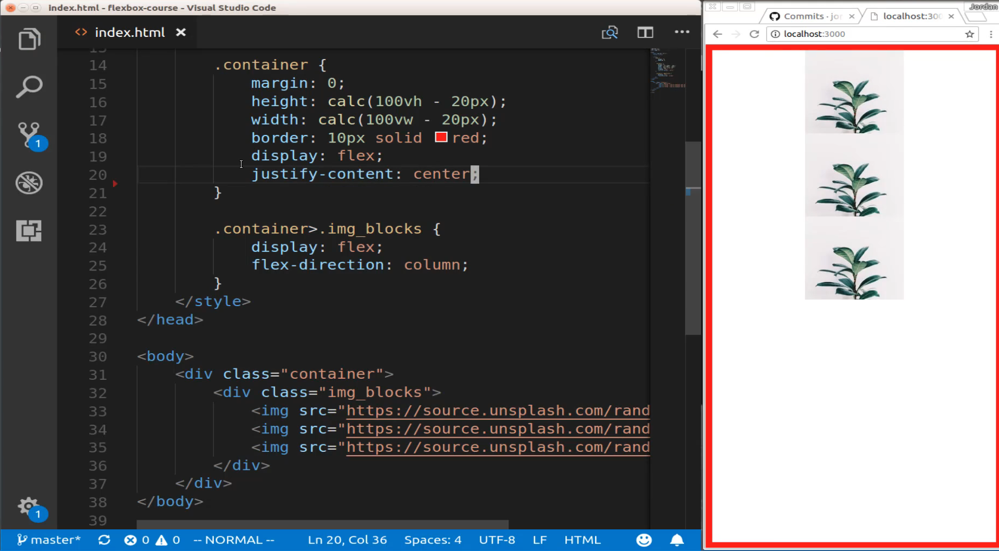
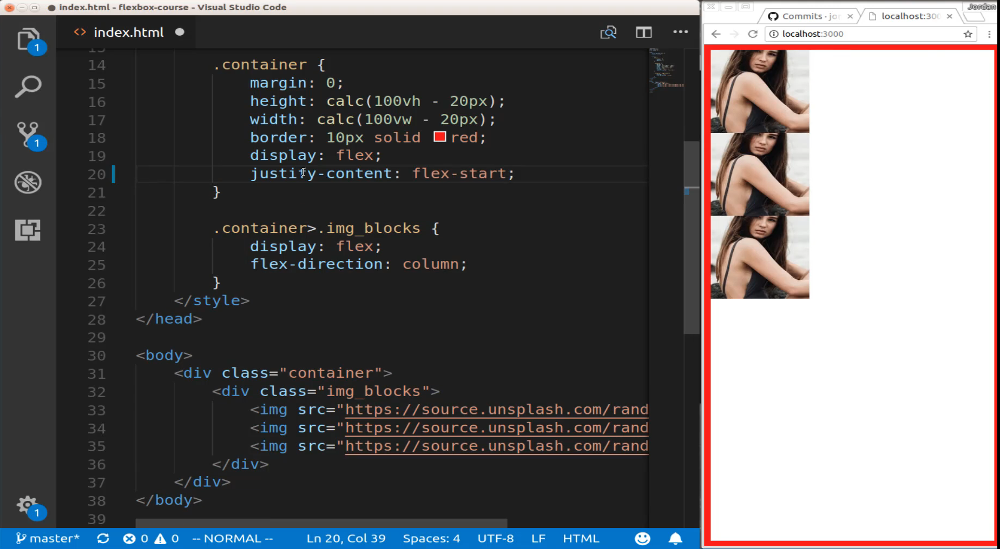
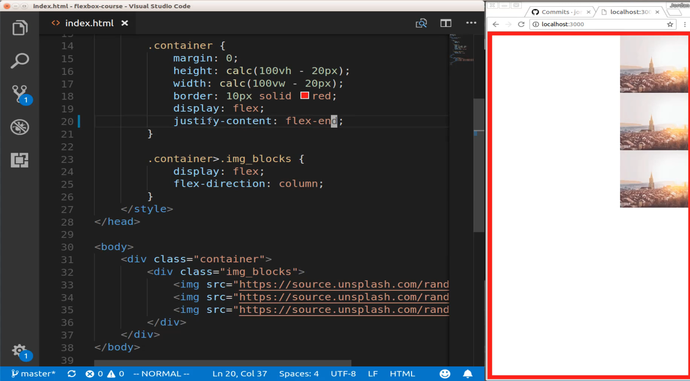
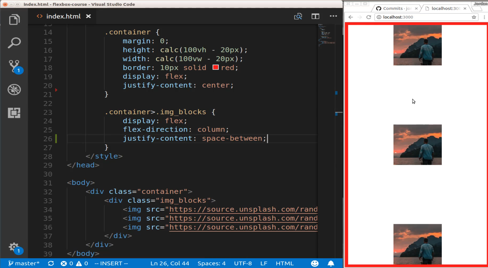
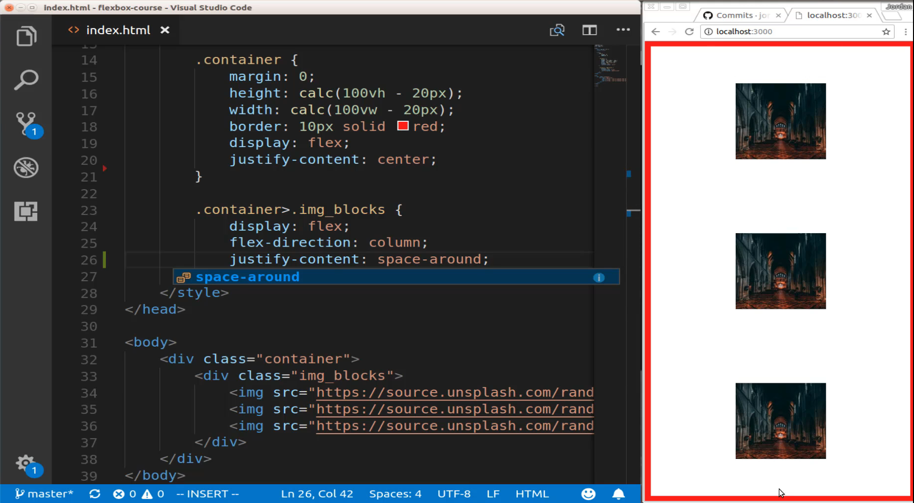
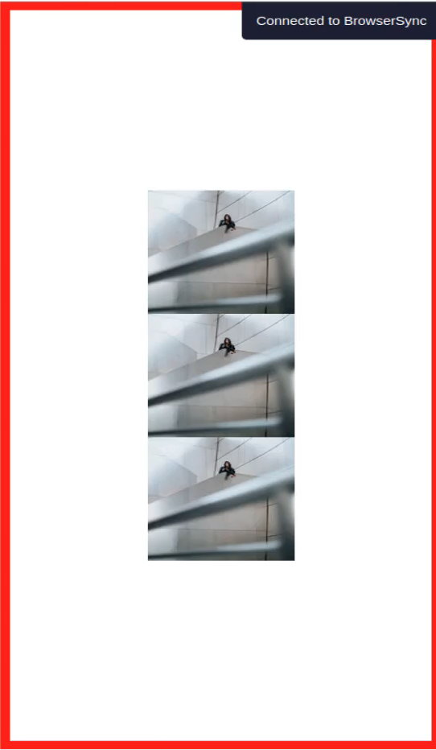
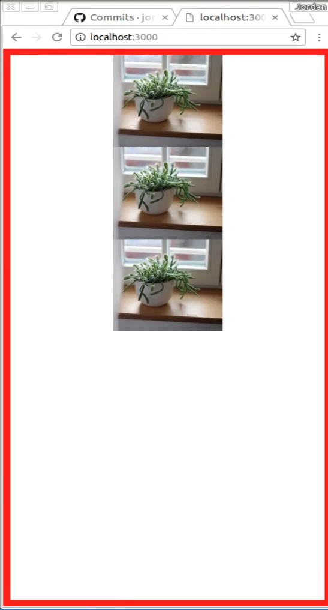
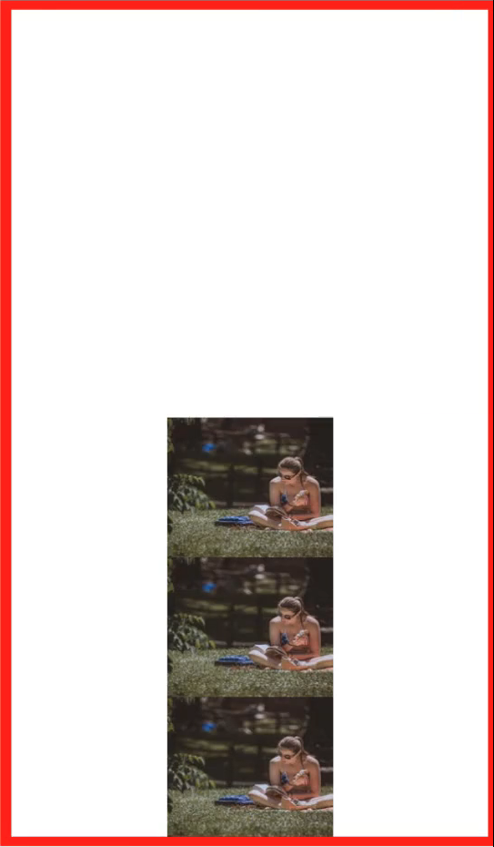

# 01-056:   Overview of Justify Content

So there are a few different things to take into consideration when you're using that. So far what we've really focused on was performing tasks like centering and so here I can say `justify-content: center;` And then you can see it centers that exactly like we would expect. 



I do not have align-items on here just because I don't want that to confuse you. But for right now I just want to focus on justify-content. So we've seen how we could center items. Now, this is where I'm going to bring up again the difference between a flex item and a flex container. Because when we are doing this we are saying we want to justify the content of this entire element. So don't think of it as three images, think of it as just this single div. 

And that will make more sense that's a reason why justify-content simply slides all of the items over here to the center. So that is that parent element. So justify-content and using center is one item. The default is what is called flex dash start. So if I say flex start it is going to place it right at the start. So this is exactly the same as if I just didn't do anything at all and it just was placing it there.



Now flex-start also has flex-end. So if I hit save you can see that flex-end moves it all the way to the right-hand side. 



So we have gone through center, flex start, and flex end. Now, we have a couple other ones that I'm going to show you, but they are a little bit different because in this case, they're not going to do anything for us inside of this container because this container only has one item inside of it, it only has this single div. So what I'm going to do is switch this over to center just so it is back to center. And now we're going to see how we can use the same justify-content options for all of the items. 

So I can come down into this other flex container and now say justify-content and I'm going to use a different one. So here I'm going to say space and we can see we have space-around and space-between. Let's start off with space between hit save. And now you can see that that gives us all of the empty space that's available. 



So what flexbox does is it looks for all of the available space that is accessible by the container and in this case that's everything from the top to the bottom. There may be times where the only space it has available is from like 1/4 on the page to 1/2 depending on what constraints you give it. But for right now we're using the entire page as our canvas. So space between adds all of the empty space it justs spaces it evenly between each one of the items. 

Now there is also one that is kind of close, which is space-around. So if I hit save here what that is going to do is it is going to give us some even distribution from the beginning all the way through the end. 



And so there are many times where you do not want the items going and butting up against the side. Imagine if you had cards on a page and you want it centered on the page and this is something I actually implemented pretty recently with flexbox where I wanted it centered on the page but I didn't want it to go completely from side to side. I wanted them contained and that's where space around can be helpful. So we have five total options we can use with justify-content. Just to review them we have Center which is one of the most common ones I use. That's where it centers on all of the items right there. 



Then we have flex start that is going to be the same as not doing anything because flex start is the default. 



And we have flex end, flex end is going to move that all the way to the bottom. 



And then we have the other ones which are space between and space around. Now like we walked through in our Flex direction guide. If I changed this to row or if I just got rid of flex-direction entirely then it is going to have this kind of behavior that looks a little bit different. 


And so that's because it is stretching them all the way from side to side. And so having flex end here or having space between or anything like that is going to act a little bit odd and so we'll walk through later how we could actually fix this if we wanted to do row but that was part of the reason why for this set of examples I'm going with columns just because it's easier to see on the page and that's also kind of the common behavior that you'd want if you had those images like that. 

So in the review that is the set of options you can use whenever you're working with justify-content its space-between, space-around, center, flex end, and flex start.


## Code

```html
<!DOCTYPE html>
<html lang='en'>

<head>
    <meta charset='UTF-8'>
    <title></title>

    <style>
        body {
            margin: 0;
            padding: 0;
        }
        .container {
            margin: 0;
            height: calc(100vh - 20px);
            width: calc(100vw - 20px);
            border: 10px solid red;
            display: flex;
            justify-content: center;
        }
        .container>.img_blocks {
            display: flex;
            flex-direction: column;
            justify-content: flex-end;
        }
    </style>
</head>

<body>
    <div class="container">
        <div class="img_blocks">
            
            
            
        </div>
    </div>
</body>

</html>
```
