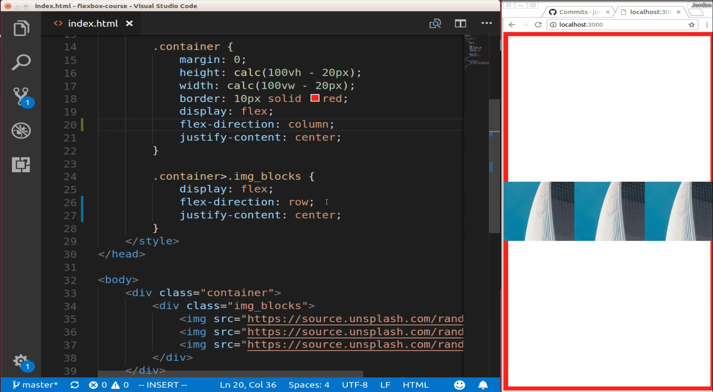

# 01-057:   Using Justify Content with Multiple Flex Containers

If you remember back to the last guide if I remove this column definition and just went with the default of row and in fact lets just change it to row just so you can see that it's clearly using this row style here. We got that very odd behavior where everything just got squished up together. 


The reason for this is it deals directly because we're using two flex containers here and so we are not able to use a row if we have a row used up here in our container. So we have this nested containers situation where we have 1 flex container that holds another flex container. If we use row and then the combination of all these other styles here then we're going to end up with a very odd page. So the way to fix this is to change the Flex direction here. So instead of using the default row now we can say column and if I save this now you can see we get the behavior that you'd expect. 



And so what's going on right here is before we had our flex-direction was using row on this side which meant that it was going it was taking in this entire image block and it was going horizontally but now what we've done is we have changed and we're saying OK flex-direction for all of the elements inside of here which in this case is just our image block div. Now we're going to use columns and so because of that, we are able to now change the type of flex-direction inside of this nested container. 

So this is one of the things if you've noticed I have talked about flex containers and flex items in pretty much every one of the guides in this section. And it's because I've discovered this is one of the more confusing areas of flexbox. But the good thing is if you mastered this part and if you really understand the child parent relationship when it comes to flexbox then the rest of it is actually pretty straightforward. Flexbox only has about a dozen or so style definitions and different attributes that you can call. So they're not that hard to remember. 

And as soon as you can really get a good feel for how you can use multiple containers and then store elements inside of those and work with flex items inside which is why I am using the example that we have here where we have a parent flex container. Then we have another child flex container and then we have flex items inside because this is going to be a pattern that you follow quite a bit when you're building out your own systems and so it's good to become familiar with that. So this is how you can fix that stretching issue by changing up your Flex direction values.


## Code

```html
<!DOCTYPE html>
<html lang='en'>

<head>
    <meta charset='UTF-8'>
    <title></title>

    <style>
        body {
            margin: 0;
            padding: 0;
        }
        .container {
            margin: 0;
            height: calc(100vh - 20px);
            width: calc(100vw - 20px);
            border: 10px solid red;
            display: flex;
            flex-direction: column;
            justify-content: center;
        }
        .container>.img_blocks {
            display: flex;
            flex-direction: row;
            justify-content: center;
        }
    </style>
</head>

<body>
    <div class="container">
        <div class="img_blocks">
            
            
            
        </div>
    </div>
</body>

</html>
```
