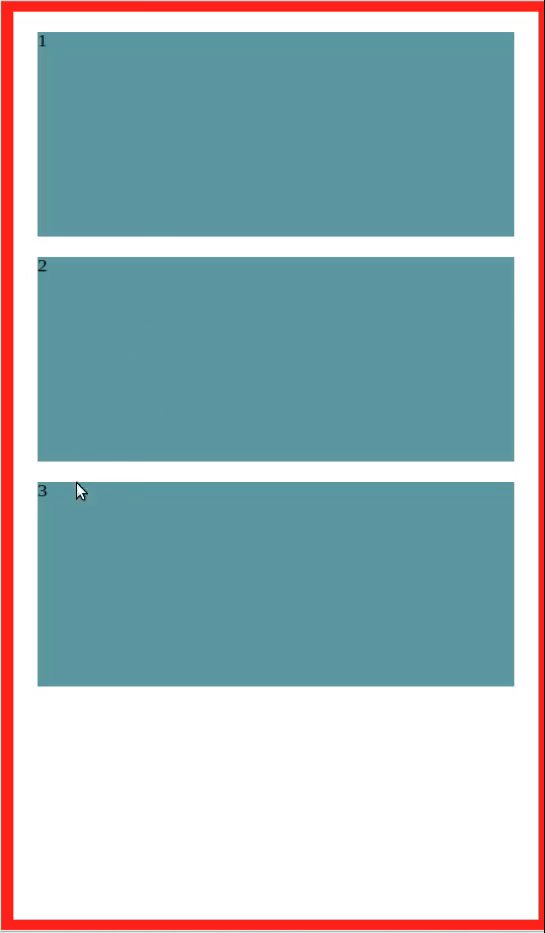
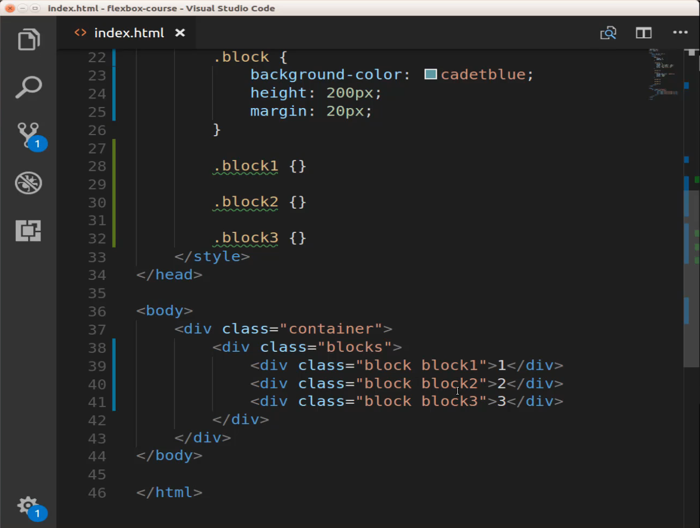
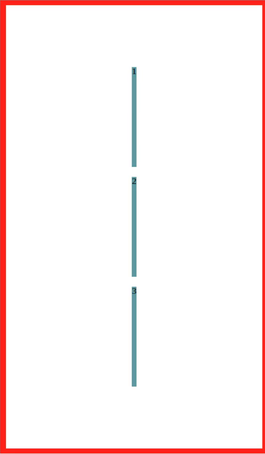
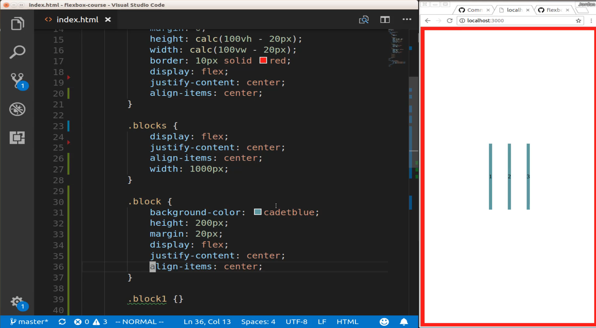
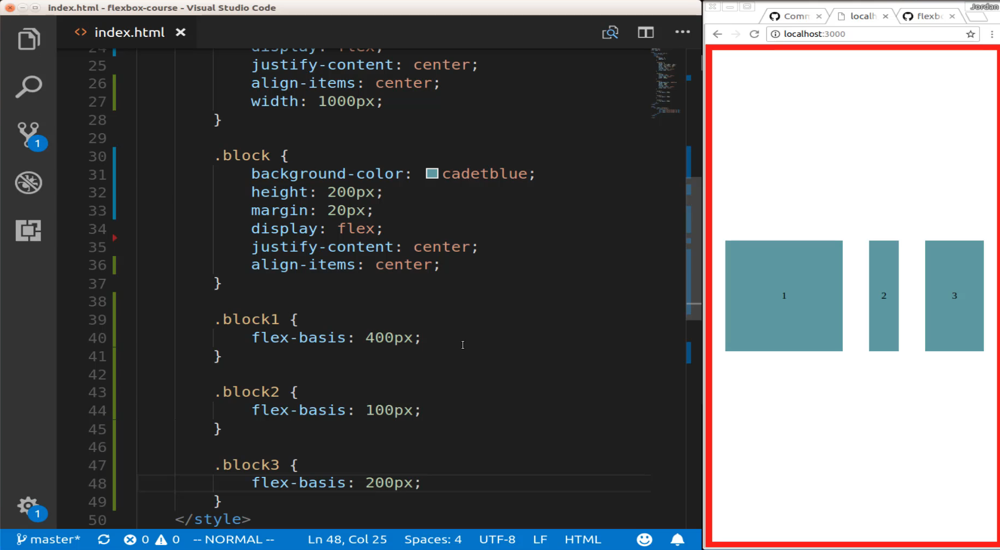
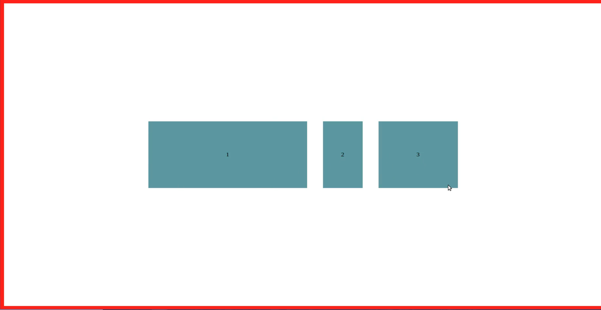

# 01-058:   Overview of Flex Basis

We have these blogs right here and right now they have some pretty basic styles. 



I don't have any flex properties in here whatsoever, that's why they're simply stacking right on top of each other. I have a container that has our normal border and then I have an empty blocks class. And then I have a block class and then I also have these unique ones, so I have block 1, 2, and 3 and if you come down to the HTML here you'll see that we have the couple of different wrappers we have a container class that has a blocks class and the blocks class has three different divs inside of it each one of them have the block class and then this is where I'm assigning those local specific classes to each one of them. 



So what we're going to be talking about in this guide and also in the next few guides is the Flex property. And so we've been talking about how we're able to use display flex and work with aligning items and justify-content working with flex containers and items and in this guide we're going to dive a little bit more into the flex property itself and how we can use it to really dictate the sizes of these elements and especially the sizes in how they relate to each other.

By the end of this I want to have the ability to say that I want this 1 block to be down here. I want it to take up about a little over a third of the screen. Then I want to have that 2 block be much smaller and then I want the 3 at the very end taking up whatever space is left and then we are also going to see how we can center the text in the blocks so that they are always right in the center. So we're going to be working this time with three different flex containers and then we're going to see how we can isolate items and give them their own special styles. 

So let's go all the way up to the container here and in that container we're going to start off with adding our display flex property because remember this is what you're going to have to use every time you're creating a flex container so I'm gonna say display flex. And then I want to use justify-content have it be centered and then for this one I'm also going to align the items. So I'm gonna say  align-items, not content we'll get into that later, align-items and for this, we'll also say centered. So I'm going to save this and you can see that that gives us some very odd behavior. 



So we're going to move down into our next class so we're going to work with blocks and we're going to start off by displaying flex. So this is going to be a flex container as well, so we are going to have display flex. And then I want to do the same thing here so I want to align these items in the center.

So I'm just going to copy both of those lines and for the sake of example for this I'm going to say I want this to have a width of a thousand pixels and you'll see why in a little bit and to properly see the full example we're going to have to look at the entire screen. So what we'll have here is going to have to be seen full width just to get the full effect. So I'm gonna hit save here and so that's moved our item so we're getting closer we're actually very close to what we need. 

Now remember what I want to do now is to start dictating the size of each one of these items so we can do that by moving down into our third class here which is block. It also is going to be a flex container and it also is actually going to have the exact same elements that we have right here. So I can just grab these 3, not the width, and then come and paste them down here. We have display: flex; justify-content: center; align-items: center; hit save on that and you can see that that changed the values of the text properties inside of the block so that is what moved them. 



And right now they are centered vertically and horizontally but because we haven't really applied any kind of sizing to our specific block classes you can't really tell yet, so now let's go and do that. So we're going to use a property here that we have not used before called a flex basis and later on in a few guides I'm going to show you a shortcut. So you're very rarely going to use flex basis but in order to understand the Flex property, you need to understand how flex basis works. 

So that's why I'm isolating here. And so we have flex basis and I have 400 pixels in the first one I'm going to change it to be 100 pixels here and then let me copy this and then just fix the different curly braces. And so I have a hundred pixels here and then let's change this one to be 200 pixels so now if I save this you're going to see we get the behavior we're looking for. 



So what flex basis does is it gives our elements a starting point. So, in this case, we're saying that the starting point for the top block is going to be 400 pixels. Now you may very accurately say that this is not 400 pixels and that's why I said we're going to have to look at this in the full-screen mode as you can see right here, now we are at 400 pixels, this is at 100, and then this is at 200. 



Now the very neat thing with how this works. And this is part of the reason why the entire flexbox tool is used for responsive development is if I were to shrink this back and if I were to grow it and shrink it what you will see is that our boxes are dynamically changing but they're dynamically changing so as they shrink and grow they are changing with these as starting points.

So as it shrinks, 400 pixels may not end up being 400 pixels, but it keeps the same aspect ratio. So imagine that it is not 400 pixels but it's just the property four, and then this is the property one, and then this is a property two. So what that means is that 1 is always going to be the largest. 2 is going to be a fourth of that size and 3 is going to be half of that size. So even when we shrink it down here and this is no longer four hundred pixels it is though as you can tell four times larger than our second box and it's twice as large as our third box because it maintains that ratio. So that is an introduction to the Flex property by working with flex basis.

## Starting Code

```html
<!DOCTYPE html>
<html lang='en'>
<head>
  <meta charset='UTF-8'>
  <title></title>
  <style>
    body {
      margin: 0;
      padding: 0;
    }
    .container {
      margin: 0;
      height: calc(100vh - 20px);
      width: calc(100vw - 20px);
      border: 10px solid red;
    }
    
    .blocks {
    }
    .block {
      background-color:cadetblue;
      height: 200px;
      margin: 20px;
    }
    .block1 {
    }
    .block2 {
    }
    .block3 {
    }
  </style>
</head>
<body>
  <div class="container">
    <div class="blocks">
      <div class="block block1">1</div>
      <div class="block block2">2</div>
      <div class="block block3">3</div>
    </div>
  </div>
</body>
</html>
```

## Finished Code

```html
<!DOCTYPE html>
<html lang='en'>
<head>
  <meta charset='UTF-8'>
  <title></title>
  <style>
    body {
      margin: 0;
      padding: 0;
    }
    .container {
      margin: 0;
      height: calc(100vh - 20px);
      width: calc(100vw - 20px);
      border: 10px solid red;
      display: flex;
      justify-content: center;
      align-items: center;
    }
    .blocks {
      display: flex;
      justify-content: center;
      align-items: center;
      width: 1000px;
    }
    .block {
      background-color:cadetblue;
      height: 200px;
      margin: 20px;
      display: flex;
      justify-content: center;
      align-items: center;
    }
    .block1 {
      flex-basis: 400px;
    }
    .block2 {
      flex-basis: 100px;
    }
    .block3 {
      flex-basis: 200px;
    }
  </style>
</head>
<body>
  <div class="container">
    <div class="blocks">
      <div class="block block1">1</div>
      <div class="block block2">2</div>
      <div class="block block3">3</div>
    </div>
  </div>
</body>
</html>
```
