# 01-059:   Overview of Flex Basis, Flex Grow, and Flex Shrink

So right now we have our preexisting flex basis rules here and if you remember back to the last guide we saw how flex basis gives us the ability to define a baseline size for each one of these elements and then as it grows and shrinks the flex basis doesn't change but it does automatically dictate the percent of the parent element that these items are going to take up. 

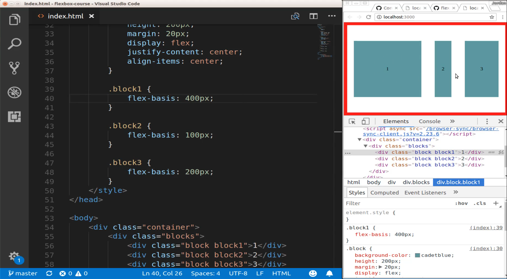

Now you may think and when I show you how flex grow works you may think that flex grow and flex basis are the same thing. And so I'm going to show you why here, I'm gonna comment each one of our basis items out and hit save. And so we're back to where we were in the beginning. 

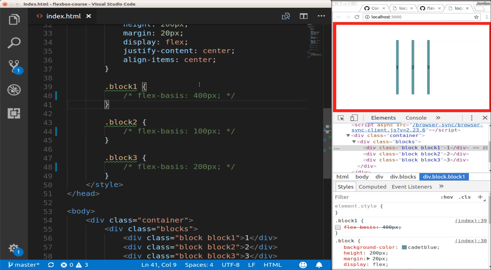

But now let's use our Flex grow property. So here I'm going to keep our same numbers but flex grow doesn't take pixels instead it just takes a number and so flex grow takes essentially a multiple so we have flex grow here being 4 and then I'm going to have this one be one and then this one will be two. And so what this is going to allow us to do is to see the difference between flex basis and flex grow. If I save this you may think that we've pretty much replicated what we had with flex basis but that's not actually the case and I'll show you why we come over here. I'm going to just double-click this and you can see that this is actually larger than 400 pixels. 

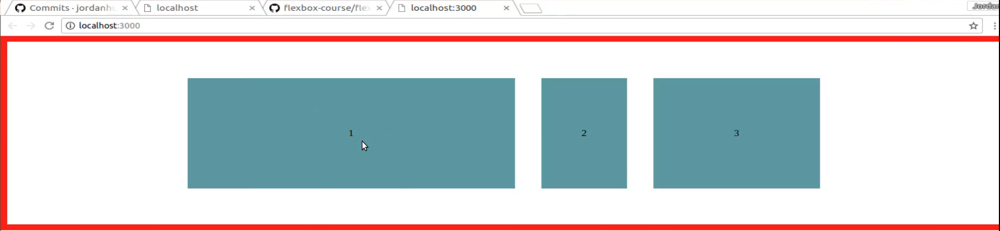

And so if I come down here into the inspector panel if I get in this block one which I have selected if I take flex box grow four off you can see it shrinks all the way down. 

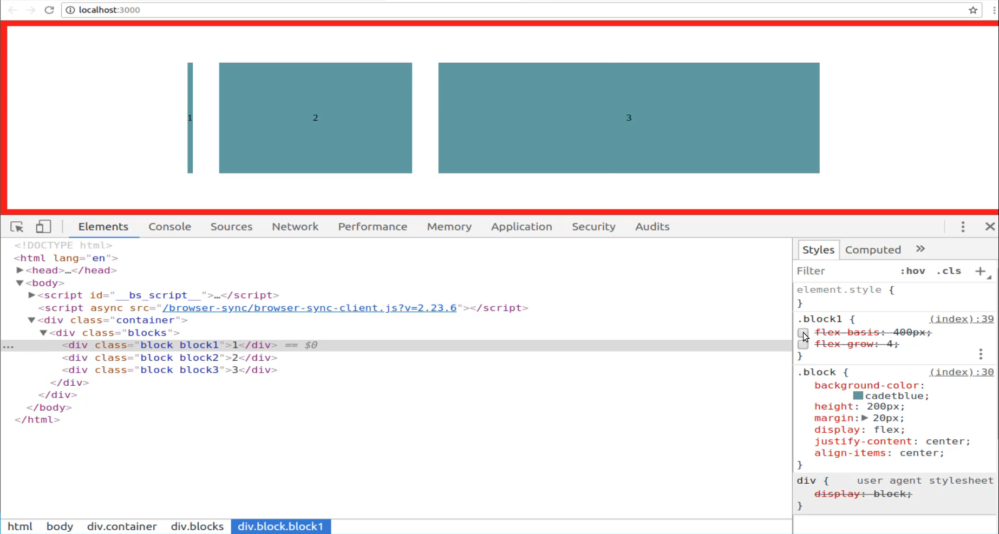

And then if I turn the flex basis 400 on again then you can see that it goes.

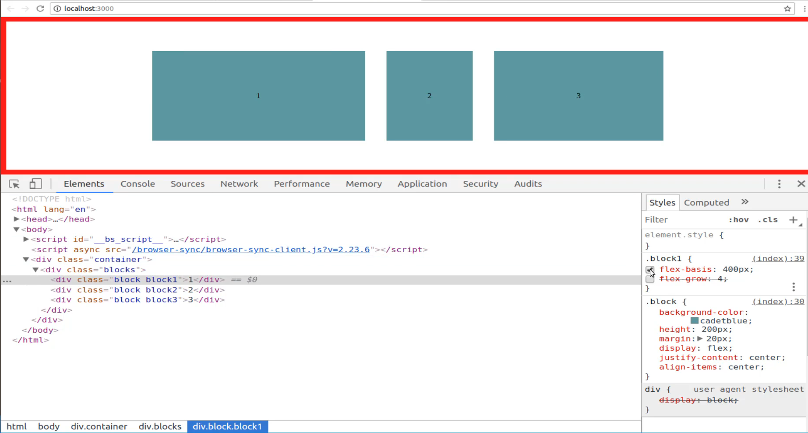

But it's different than when I have flex box grow going. 

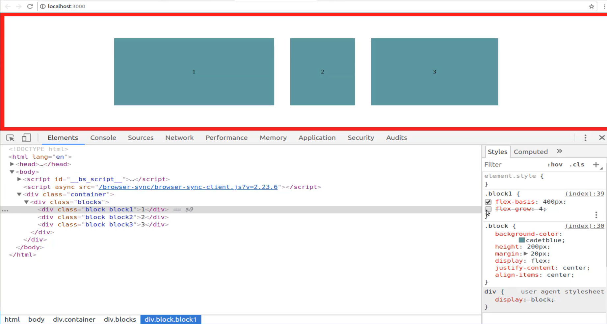

And if you combine both of them then it takes up even more space. 

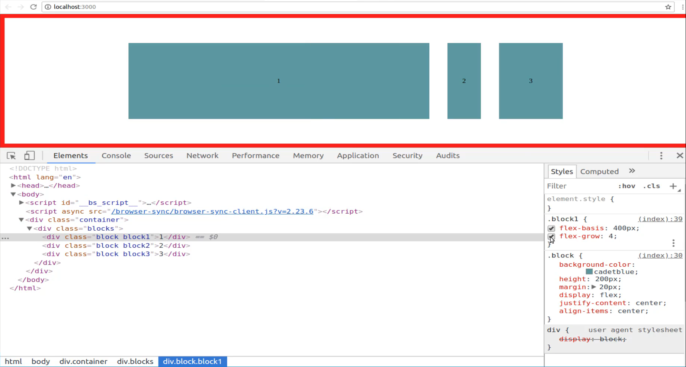

So what is the difference? Well, the key difference is that flex grow is the property that defines the ratio of how fast one of the elements grows in relation to the other items. So when I say flex grow is 4 and let's remove the basis here for a second. When I say flex grow 4 this means that this element, this block 1, is going to grow 4 times faster than an element that for example number two here that has a flex grow of 1. 

The grow element or the grow property is dictating the rate at which an element is going to grow, so that is the key difference. Now let's also look since we have flex grow and we have basis down let's go and let's look at flex shrink. So I'm going to comment all of these out and say flex shrink. And now this one is kind of backward so this is kind of the opposite of the other items. It works the same way as flex grow does except going in the other direction.

So if I say flex shrink here is 2 and then I'll do 1 on this side because it doesn't really make sense if you were to have them all be the same because remember they are multiples of each other. So now you can see that they are all the same 

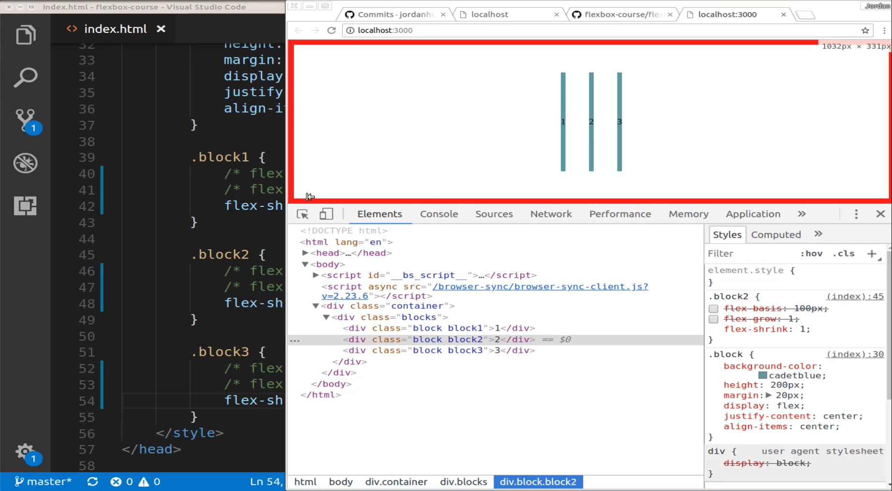

and you're not going to get really any difference in behavior and it's because we haven't given a baseline. So typically the way that you work with flex shrink is you would have a flex basis for one of these items so I'm going to give flex basis here and I'm gonna turn it on actually for each one of these hit save. And now you can see that we are kind of back to where we were. 

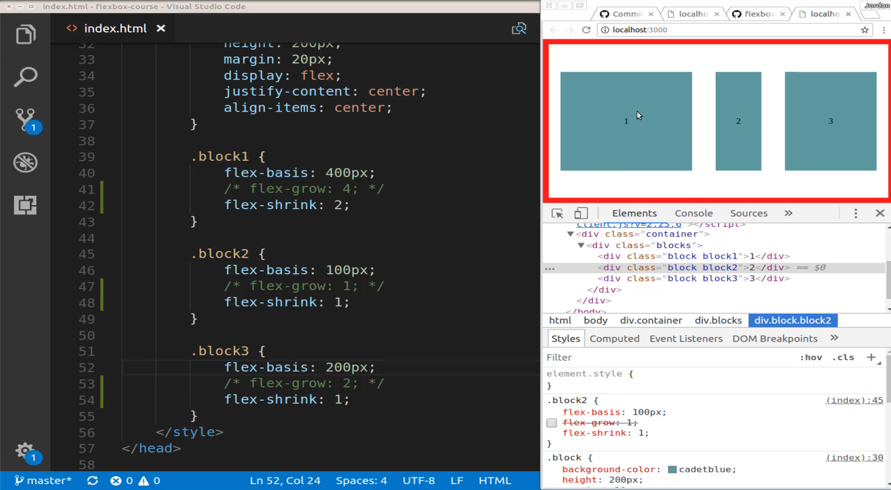

But this is where the key difference is. Do you notice how the one in here is actually taking up quite a bit less space? So I'm gonna come here. 

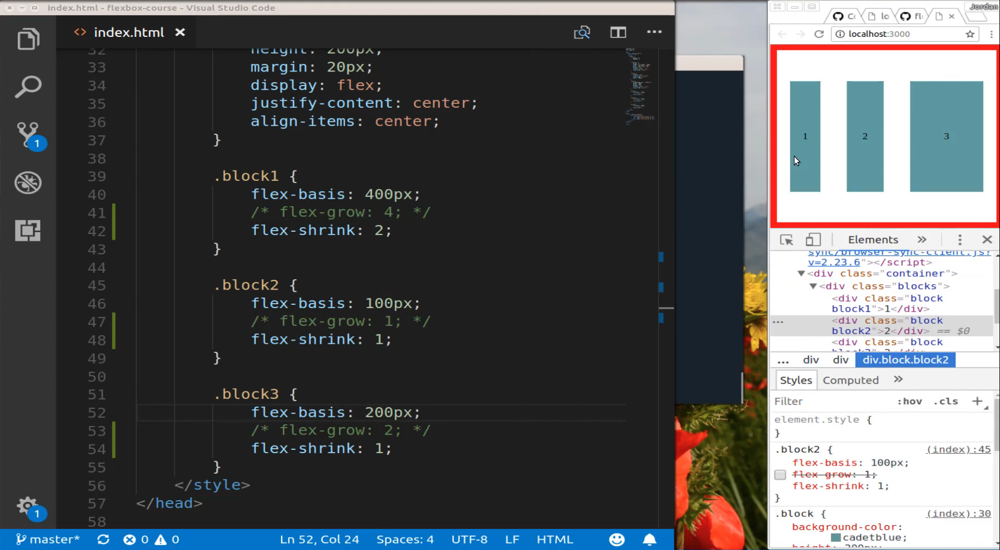

Notice how one the further I shrink down the further that it or the I should say the more narrows. And so if I open this all the way up again you can see one is back to being 400 pixels wide. 

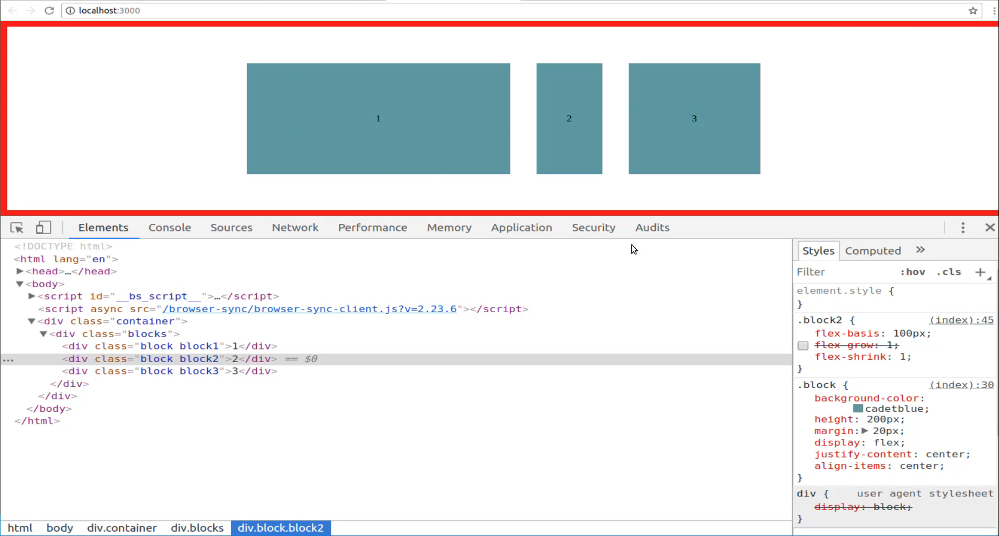

And that's because one has the flex basis of 400 pixels. But when I said flex shrink is 2 this is going to then look at all the other properties it's going to look at each one of the other flex box items here and it's going to say okay block number 1 is going to shrink twice as fast as all of the other element.

So just like when we had flex grow we said 4 the 4 meant that we wanted 1 to grow 4 times faster than the other items. Flex shrink says okay this needs to then shrink twice as fast or 2 times as fast as all of the other elements that would have a flex shrink of 1. So that is a very very important thing to keep in mind because if you apply flex-basis and you want this to be your largest item but then you apply flex shrink to it and you put the highest value on flex shrink then that item is going to shrink the fastest. 

So the smaller the screen gets so if you're building a responsive website that needs to work like this and needs to be able shrink down to this size then that element is going to shrink twice as fast or whatever the value is if I passed in 4 here. It's going to shrink even faster just like you can see all the way down to pretty much be taking up no more width than the content inside of it. 


And if I stretch it out just a little bit you can see that it has shrunk. Now, it is still larger than 2 and it's because it's still the flex basis still affects it. But now all that we're doing is we're saying that as it shrinks I want it to shrink four times faster than each one of these other items. So that is an overview of flex basis, flex grow, and flex shrink. And there is something very helpful there we're going to go through in the next guide that puts all of this together, and that is working with the flex property itself and that combines each one of these items.


## Code

```html
<!DOCTYPE html>
<html lang='en'>
<head>
  <meta charset='UTF-8'>
  <title></title>
  <style>
    body {
      margin: 0;
      padding: 0;
    }
    .container {
      margin: 0;
      height: calc(100vh - 20px);
      width: calc(100vw - 20px);
      border: 10px solid red;
      display: flex;
      justify-content: center;
      align-items: center;
    }
    .blocks {
      display: flex;
      justify-content: center;
      align-items: center;
      width: 1000px;
    }
    .block {
      background-color:cadetblue;
      height: 200px;
      margin: 20px;
      display: flex;
      justify-content: center;
      align-items: center;
    }
    .block1 {
      flex-basis: 400px;
      flex-shrink: 2;
    }
    .block2 {
      flex-basis: 100px;
    }
    .block3 {
      flex-basis: 400px;
    }
  </style>
</head>
<body>
  <div class="container">
    <div class="blocks">
      <div class="block block1">1</div>
      <div class="block block2">2</div>
      <div class="block block3">3</div>
    </div>
  </div>
</body>
</html>
```
