# 01-060:   Using Flexbox and the Flex Property to Implement an HTML Card

I was asked to build out a card feature on devcamp. And so the cards had to act like this where there was an image that was taking up all of the left portion of the card on all of the cards. Then it had some content but sometimes I would have a title and other times it would have a title along with the subtitle and then on the right-hand side there needed to be action buttons and they needed to work kind of like mobile buttons. 

So as you can see right here 

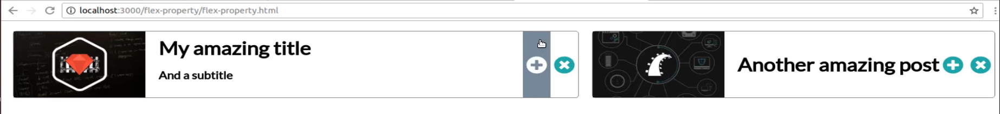

we have these action items but they're not just buttons by themselves but they are actually going and stretching from the top of the card down to the bottom and then in addition to all of this we have to have the cards be responsive and flexible enough so that when they're on a page like this we could have a featured card and then to the right of that we could have kind of an associated card. 

And so we are going to build out all of this in this guide. You're also going to see how we can have some font awesome icons right here. So I've integrated those along with pulling in other images and having custom fonts so we're going to put together quite a few of the things that we've learned not just in this flexbox course but also just in CSS and HTML in general. 

So what we have right now does not look like that quite yet. So I have added all of the base elements so we have links to the image, to that title, subtitle, all the content. You can see we have our little icons here but everything's pretty ugly. The only thing that's really there is the font. And that's because I added the font and applied it to the whole body. 

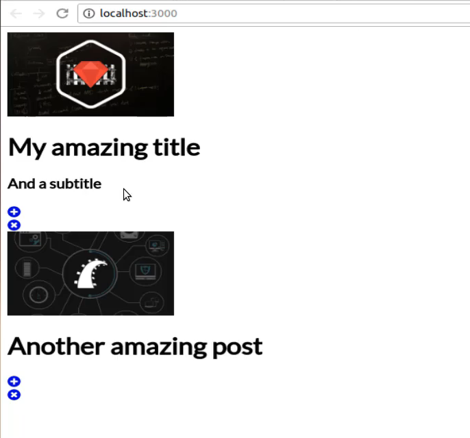

And as we are going through this I'm also going to be viewing this in full-screen mode. So we're just going to switch back and forth between the browser and then the code. So right here you will have access to this starter code in the show notes and so as you can see at the very top I brought in the font from Google APIs and then I brought in the font awesome CDN links so this is how we're able to have those icons. 


and if you're interested in exploring font awesome more you can just go to fontawesome.com and you can get these URLs you can go through their full library of icons and it's a very helpful tool when you need free icons for your application. So right here as you can see we're going to be typing quite a bit of code. I have added all of the styles, at least the style selectors, inside of our embedded styles here along with the HTML so we're not going to make any changes to the HTML whatsoever but let's just take a look at it just so we have an idea of what's here.

We have a container and this is going to be wrapping up everything inside of it so we have this container and then we have a class of item and the other one has a class of item as well. Now the difference is that the first one is a featured item and the second one is an associated item. Now, this is what's also interesting so we have this wrapper of container. Then we have item which is another wrapper. Then we have content inside of that and then that's where we have the image, the title, the subtitle, and all those elements and then we have our button groups that are going to be on the right-hand side. 

And just to give you a little bit of a visual we can take a look at the finished item and so if I click on inspect here and pull this up if I click on body and then come down into the container you can see that container wraps all of the elements 

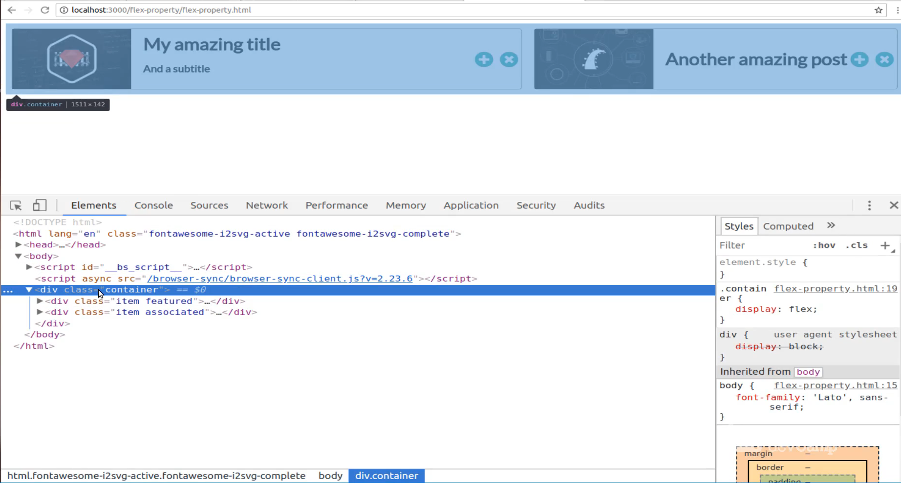

and then if I click on that featured item you can see it simply wraps this one on the left-hand side. 

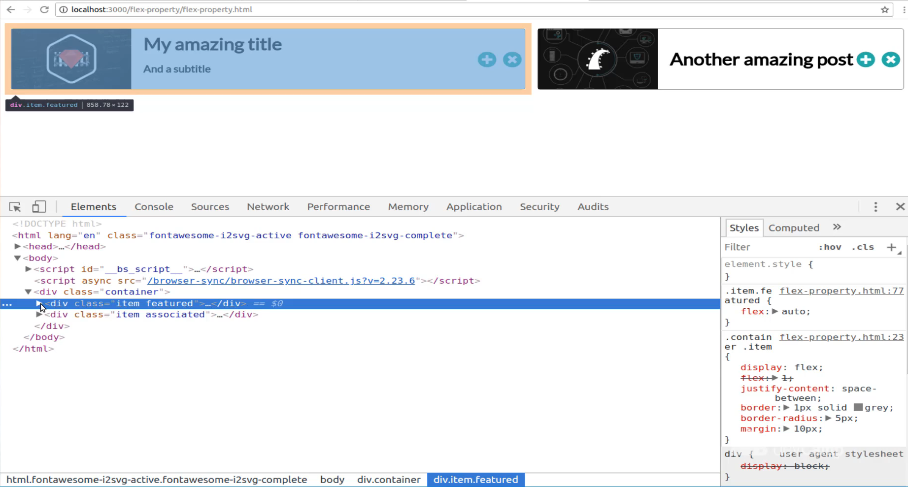

If I open that up a little bit more, our content is going to go from here all the way to the left. And then our button group is going to come all the way over here even though it only needs these items. And so same thing on this side, the only difference is we're going to leverage the Flex property to manage how much space this item takes up compared to this other one.

So let's close out of the inspect console and switch back to the live application and get started. So first and foremost we need to create our parent element. So here we have a container and inside of here, we are going to add a style definition of display flex. So display flex hit save and let's just see what happens. So just with that one display flex call. We have already moved the items into a position 

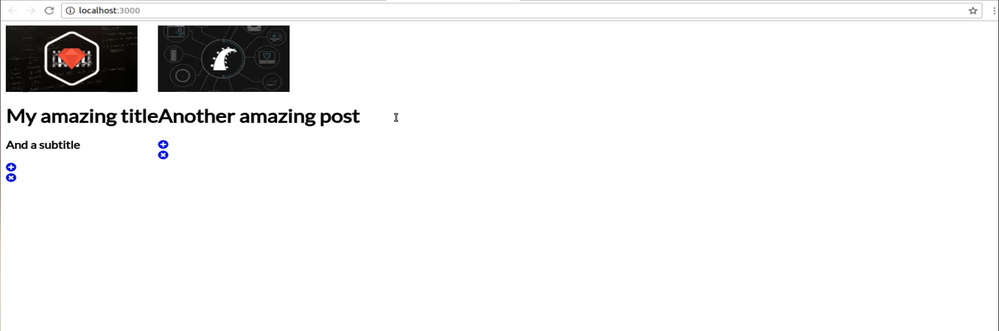

and remember that by the default we can have access to flex-direction row and that's the reason why they're right next to each other because any time you say display flex on this element any of the child elements inside of it are going to be picked up and they're going to move side by side. If we changed it to column then they'd be stacked up on top of each other again, so that is the first step. And our container is going to contain no other class definitions except for that, its just going to have display flex. 

Now let's come into container .item so this is going to be related to anything that is actually on this item or this other item and I think it's a little bit easier to see when you see the final version. So when I say item I mean this entire card and this entire card. So now that we know what we're trying to select, inside of container .item I'm going to say that this also is going to be display flex and then I'm going to introduce finally the property of flex, so this is our flex property.

Now if you remember back when I was explaining the concepts of flex shrink basis and grow but I said that there was a way where we could combine all of those, that is the Flex property. So we want to switch back to display and then go to flex and then we have a flex property of one and we're back to normal. 

```html
.container {
    display: flex;
}

.container .item {
    display: flex;
    flex: 1;
}
```

So now let's switch back and see what we have. So now we've had some changes, each one of our elements is taking up half of the page and this is perfect. 

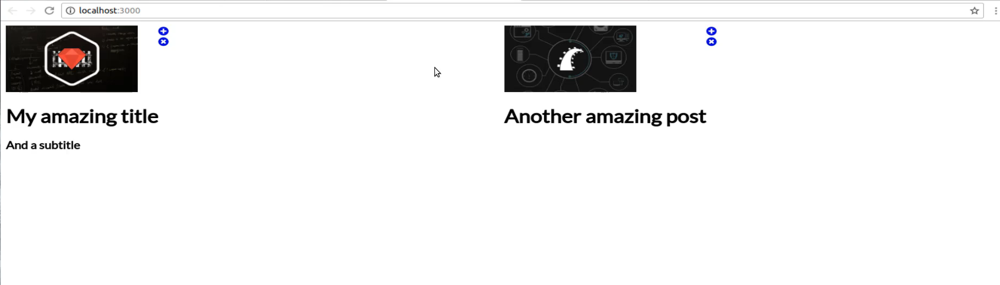

This is exactly what we're looking for because what we've done is when we said display flex it took the divs. If you remember we have content inside of the cards or inside the items. Content is in its own category with the image the title and the subtitle and then we have the button group which has the buttons inside of it and so they are right next to each other right now because they are in different divs so these are the two child elements so they are the flex items. So this is doing exactly what we're looking for. 

And now if you come to the documentation and I will provide this inside of the show notes because this is a very helpful way for understanding how the Fleck's property works. So this is our Fleck's property with the default that we're giving of flex 1. So this simply means that we're going with the default and this is combining the basis shrink and grow. And so if you come down here a little bit you can see that flex can take what properties we gave it which is just flex 1 there and that's the default but then you also can stretch it out. You can say I want the first item to be one and I want the second item to be one and then I want to provide a flex basis of 100 pixels. 

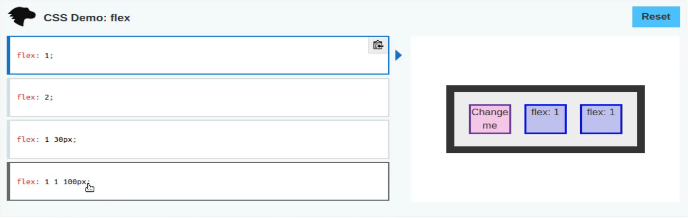

So that's why I said that when you are using shrink, grow in basis that you can combine them and that's going to be the traditional way that you do it, you're usually going to simply use this flex property and if you want to have grow, shrink and basis then you can just add them all on the same line. Now, this is something that's pretty cool down here which is that sometimes these numbers can be a little bit confusing and so what we can do is we can actually have names associated with them. 

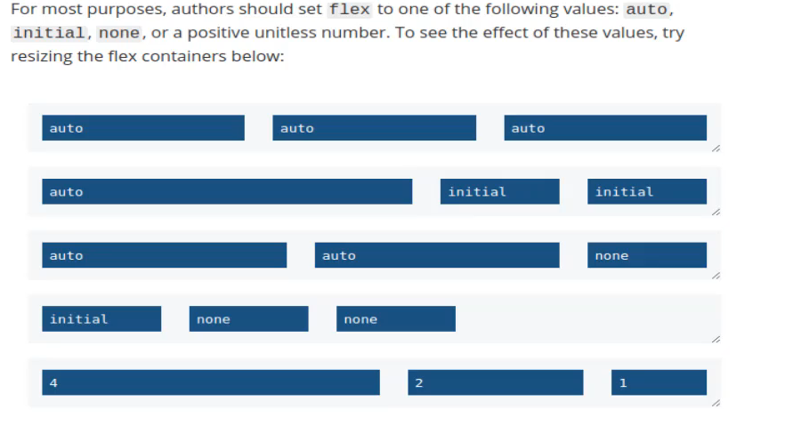

so we can use the auto name and then we can also use initial. And this is going to be the implementation that we end up going with because if you come and look at what our goal is. Our goal is to have a setup like this where we have one card that takes up the majority of the space looks to be about 60 ish percent and then the rest of it is this associated one.

Well if we look at the documentation you may notice right here that this is very similar to that. We don't have two initial items we just have one which is fine. So we're going to use the Flex property of auto and this is automatically going to take up all of this space and then initial is going to have essentially what is left. And so they have some pretty helpful definitions on exactly what this represents. So scroll down a little bit more. It says that auto represents the item is sized according to its width and height properties but grows to absorb any extra free space. This is the key right here, any extra free space in the FLEX container and it shrinks to its minimum size to fit the container. 

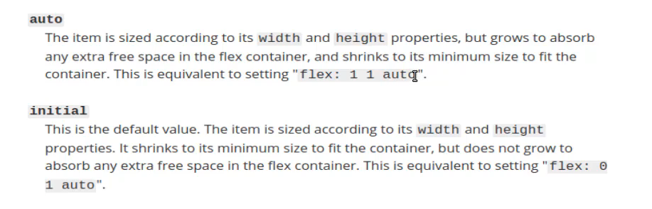

And this is equivalent, so in other words, if you don't type auto you could type `flex: 1 1 auto`. So that is how Auto works is it grows and takes up any free and empty space. Initial is the default value and so what this means is if you look at this card here notice that it is taking up and it's width is being determined by its content. The reason why it's a this wide is not because we're going to hard could this at all. It's because we have an image we have a title and it takes up this much space and then we have these buttons. So initial means simply allocate enough space for this item and no more. So initial is only going to take up as much space as it needs to fit the content in which is very handy. 

There are many times where you want a div to only take up as much space as needs and nothing more. Whereas when you combine that with auto, auto says okay I have all my space here and then anything that's left I'm going to take care of that as well and that's a reason why this auto one is grown here on the left-hand side. So I highly recommend going through the documentation. 

The documentation just in general and flex box is very good, it's very helpful and they have some great types of repl environments where you can play with them change the values and see them changing in real time. So I use this quite a bit when I'm building out my own projects. So we are now completely familiar with the flex properties so we can take it and run with it. We're starting off with just flex 1 but we're going to use a flex property a few other times as well. So this is our container and then our item. 

And so now that we have that we still have some other things that we need to work with. So I'm going to say justify-content and in this case, I want to use space between. So we're going to be combining all kinds of things that we've learned so far and I want to have a border for this of one pixel, I want it to be solid and gray, and I also want to have a border radius because this is going to be a card so we want to have some kind of radius for it. So it's just going to curve the edges of the card a little bit and then let's also have some margin so they're not buddying up against everything else. 

```html
.container .item {
    display: flex;
    flex: 1;
    justify-content: space-between;
    border: 1px solid grey;
    border-radius: 5px;
    margin: 10px;
}
```

So hit save there and now you can see that we have actual cards. 

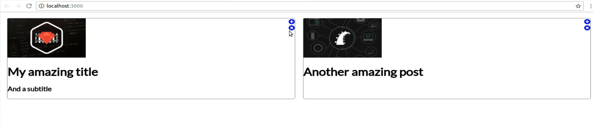

so now we have some type of way of distinguishing where the card ends and where it begins. So that is our container and just in case you're not familiar with the syntax, what I'm doing here is I'm selecting the container and then I'm saying for any items in that and I don't mean items in the plural sense I just mean item in the if there is any elements that has a class name of item inside of the container apply these properties to the way that selector is working. 

So now that we have that now we can go to container item and then content. So the way I have this set up is we're really just traversing this tree. So if you see container item content we have the entire container which is really the whole page in this case. Then we have the item, so it's each one of these cards, and then we have content which is everything inside of the cards. So that's what we're going to do here and we're just going to give this a single one and say display flex 

```html
.container .item .content {
    display: flex;
}
```

and now you can see we're getting very close. And so what we did when we did that is before when we didn't have a display of flex all that was happening was the items were being treated like regular vanilla HTML divs. 

But now because they have display flex they automatically have that flex direction row and so they're placed right next to each other, so that is working very nicely.

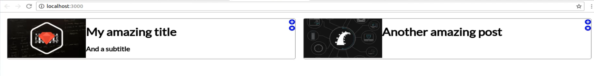

Moving down we have `.container .item .content .metadata`. OK let's take a quick look at what metadata is and also just in case you're curious this is exactly the same type of flow that I follow whenever I'm building out my own frontend implementations. So I don't go and try to write just a whole pile of code and then see what happens. I like to traverse down to each one of the elements exactly like how we're doing right now and see exactly how I can style them. 

So now the next item we're going to be attacking is `.container .item .content .metadata`. If we use our inspector here we can see what the metadata is, so if I click here you can see the metadata represents all of this content and same thing over here on the other card. 

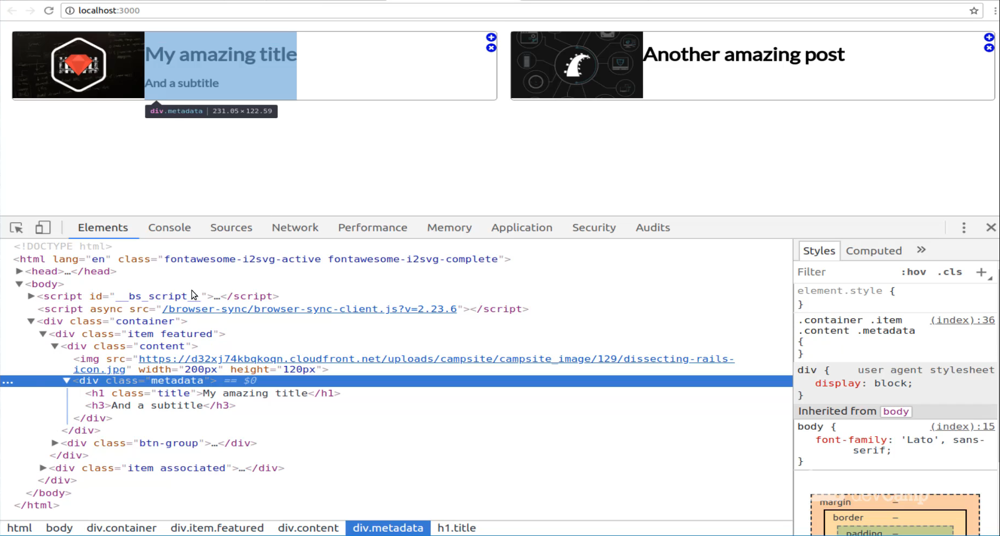

If I click the inspector and click on this, this is also our metadata. 

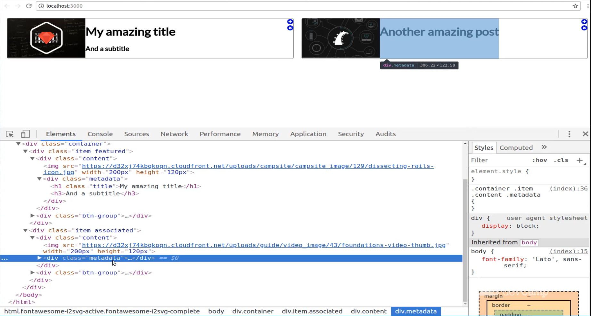

So that is what we're going to be using for our content. So inside of here, we're going to have a few items that we need to add. So we need to have a display of flex so this is going to be a flex container as well and then for this one we want flex-direction we need to override it. So we need this to be column, not row. And then I want to justify the content to be center and then when I do this, this means it's going to center the content vertically because it's going to take this flex-direction column and it's going to then center it that way.

By default, if I was using row then it would move it from right to left and not up and down. So justify-content and let's also just add a little bit of margin-left at 20 pixels just to make sure we have some space. 

```html
.container .item .content .metadata {
    display: flex;
    flex-direction: column;
    justify-content: center;
    margin-left: 20px;
}
```

Let's hit save and there we go. Now you can see that our content is looking a lot better. 

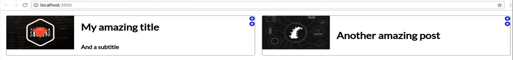

We have our subtitle and this content here and then notice how if there are two items the items are still being placed there and aligned centered vertically and then if there's only one. So if we do not have a subtitle as it is in this case then this is getting placed there and it's being centered vertically as well. This is really helpful I can't tell you how many times I've had to write some really ugly CSS code before there was flexbox to be able to perform this exact same behavior to where I wanted one item to be centered this way. 

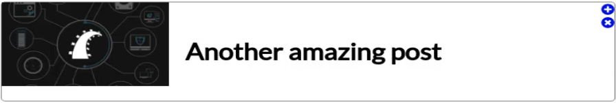

But if there were two I wanted it centered like this 

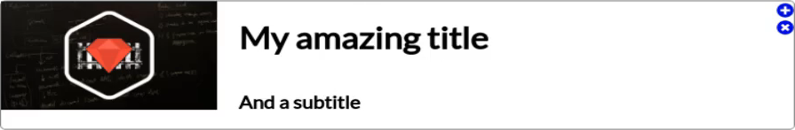

so it's nice that flexbox gives us this pretty much by default. So we're making our way we only have a few more items to add. So now we are going to be working with the `.container .item .content .metadata .title`. So for this one, it's going to be pretty straightforward and all you need to do is say margin 0 pixels 

```html
.container .item .content .metadata .title {
    margin: 0px;
}
```

hit save and now you can see that we fixed the issues.

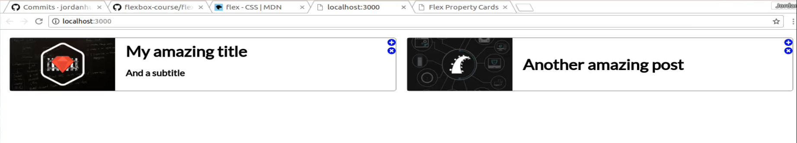

The reason why we had that little bit of margin down there at the bottom was because this H1 was actually overwriting it and it was pushing everything down. So when you say I just want to remove that then that fixes that. Coming down so that's everything taken care of on the left-hand side. One thing I love is see we have the image here fitting perfectly on and it rests up against the bottom, the left, and the top. 

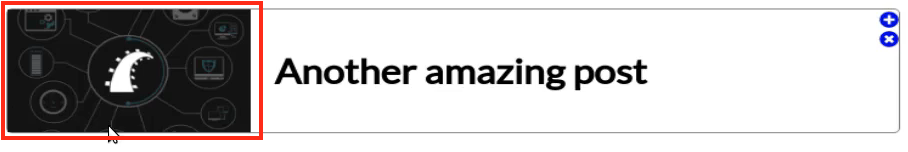

This is also not a trivial thing to do if you're not using flexbox. So being able to have this item placed perfectly there aligned right next to all of the other metadata that's a really nice benefit that you get. So now let's move onto the button group (`.container .item .btn-group`) so we have some fun with setting these up. We're going to start off with display flex and then from there we are going to align our items so here you can say align-items and here I want to have them centered so I'm gonna say align-items center. 

```html
.container .item .btn-group {
    align-items: flex-end;
    align-items: center;
}
```

If we come back we can see that that now has our buttons lined up exactly like how we want them. 

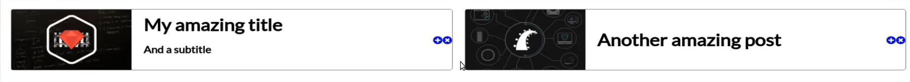

We still need to add our styles but at least they're positioned in the right spot. And so now if we come down we have inside of our button group each one of those has a button class and so inside of the button class we're going to add a number of items. So first we're going to add a height because remember the behavior we're looking for? I want to have these cool little hover effects where when I hover over it, it treats it kind of like the way you'd imagine something in a mobile environment would work like where you have all of these cards and they're all on top of each other and then you can click and press on one of these and just one of these actions and it gives you this nice hover effect that goes all the way from top to bottom. 

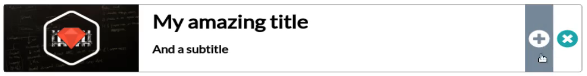

Well, the way that we can do that is by declaring a height and for this one, I'm going to say 100 percent on height. And this is also going to be a flex container because it has links inside of it. So I'm gonna say display flex align-items center. Then we're going to do flex direction row which is really the default one but we didn't have we don't have to have that but I'm just going to do it just to make it clear that that's what's there. Let's give it a width of 42 pixels because 42 is always the best number to go with whenever you can and then justify-content center and then let's also give it a font size because that's one cool thing about working with font awesome icons is you can treat them like fonts. So I'm going to say font awesome 2 em. So it's going to give them pretty much double the size. 

```html
.container .item .btn-group .button {
    height: 100%;
    display: flex;
    align-items: center;
    flex-direction: row;
    width: 42px;
    justify-content: center;
    font-size: 2em;
}
```

Now look at that, we are looking a lot better. 

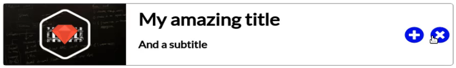

Okay, so this is this is fantastic. We still need to fix our colors and we need to add our hover effects but we're at the right size and we are aligned perfectly, these are aligned exactly the way that I wanted them to be.

So moving down we just have five items left and two of them are pretty small as well. So now we need to inside of that button class the button has a link. And so that is how we are able to override that ugly blue color that's the default with HTML. And so we're just going to say this color should be light sea green. I think that's a good one to go with. And then I also don't want any text decorations so text-decoration will be none just to make sure we don't have any issues like where you hover over it and it adds an underline or anything like that. 

```html
.container .item .btn-group .button a {
    color: lightseagreen;
    text-decoration: none;
}
```

So if we switch back now and you hover over we don't have any underlines and we have our nice little sea green color. 

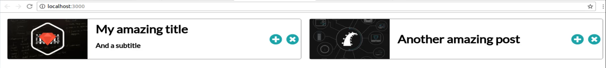

Moving down, now let's manage our hover state. So with the hover state here and remember the way that you can do this is with this pseudo selector of colon hover. Now what we can do is say background color and lets for this one go with light slate gray and then we want to also one thing you may notice and let's save this first is whenever you're building out these kinds of custom elements that sometimes and in my case with the browser that I'm using it changes the cursor but that's not always the case. 

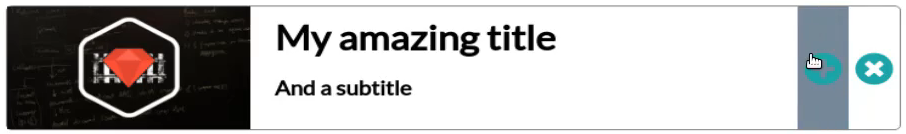

So if you do need to I had to do this for my devcamp implementation you also can add your own cursor. So here I'm going to say cursor pointer and that is something that if you're ever doing something like this where you're creating your own elements not all browsers are going to recognize that these are all links because the link is really just this icon. But we want to treat the entire thing like the link so you can change the cursor that way. 

```html
.container .item .btn-group .button: hover {
    background-color: lightslategray;
    cursor: pointer;
}
```

So now we have that nice background color which is looking excellent but as you can see it's kind of whenever you have this kind of green and this charcoal or the light slate gray then it's hard to see. So we need to change the color of our button on the hover effect so that's what this next selector does (`.container .item .btn-group .button:hover a`). And so here we can just say the background color is just a regular color so it's good as a white color, lets hit save and come check it. 

```html
.container .item .btn-group .button:hover a {
    color: white;
}
```

And now when we hover you can see it changes to white. 

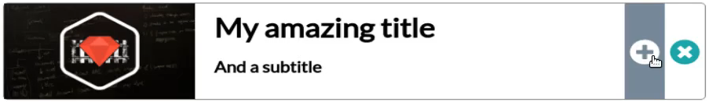

That looks much better! So far everything is going very well and there are going to be many cases where all that you need to do is to have exactly what we have right here. Many times I'll have a situation where all of these cards are simply going to kind of come across the screen in two columns and it's fine for them all to be the right size. And so, in that case, you could just pretty much stop right where we're at right now you're completely done. But now in our case remember that we want to be able to have this type of behavior where we have a featured item and then we have an associated one that should only take up as much space as it needs and the featured one should take up more space. 

So moving down, we only have 2 items left and this is where we're going to finish up with our flex properties. So here, it's as easy as saying flex auto 

```html
.item .featured {
    flex: auto;
}
```
and then if we come down into associated now he can say flex and then initial. 

```html
.item .associated {
    flex: initial;
}
```

Hit save come back and we are done. So see what it's done right here is it's taken all of that content and says okay this only needs this much space and then the one on the left-hand side takes up everything else that is left. 

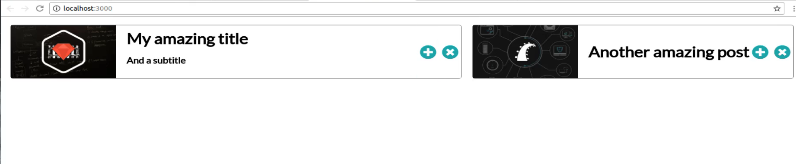

Now from a responsive element. If I were well one I wouldn't shrink them down to be the size. If that's the case you're gonna have to do some media queries but say that your screen is a little bit smaller or anything. Notice here now that the initial state is still going to be capped so this is kind of like what you'd see on a tablet. The initial state is capped it doesn't keep shrinking but the featured item because it's on auto does shrink. It is going to shrink down so it's not going to be a kind of a related shrinking. It is simply going to look at this left-hand side. It's going to only give it extra space if extra space is available. So that's the way that flex auto works and I highly recommend going through the documentation and exploring all kinds of different ways that you can use it for your own projects.

Great job if you went through that, this I know this was a much longer guide than all of the other ones but I wanted to take you through a real project and this is literally almost the exact same code that I have on devcamp for some cards that look exactly like this, so this could very well be something that you are asked to build out and now you know how to do it using flexbox and flex properties.


## Starter Code

```html
<!DOCTYPE html>
<html lang='en'>

<head>
    <meta charset='UTF-8'>
    <title></title>

    <link href="https://fonts.googleapis.com/css?family=Lato" rel="stylesheet">
    <script defer src="https://use.fontawesome.com/releases/v5.0.8/js/solid.js" integrity="sha384-+Ga2s7YBbhOD6nie0DzrZpJes+b2K1xkpKxTFFcx59QmVPaSA8c7pycsNaFwUK6l"
        crossorigin="anonymous"></script>
    <script defer src="https://use.fontawesome.com/releases/v5.0.8/js/fontawesome.js" integrity="sha384-7ox8Q2yzO/uWircfojVuCQOZl+ZZBg2D2J5nkpLqzH1HY0C1dHlTKIbpRz/LG23c"
        crossorigin="anonymous"></script>

    <style>
        body {}

        .container {}

        .container .item {}

        .container .item .content {}

        .container .item .content .metadata {}

        .container .item .content .metadata .title {}

        .container .item .btn-group {}

        .container .item .btn-group .button {}

        .container .item .btn-group .button a {}

        .container .item .btn-group .button:hover {}

        .container .item .btn-group .button:hover a {}

        .item.featured {}

        .item.associated {}
    </style>
</head>

<body>

    <div class='container'>
        <div class='item featured'>
            <div class='content'>
                
                <div class='metadata'>
                    <h1 class='title'>My amazing title</h1>
                    <h3>And a subtitle</h3>
                </div>
            </div>
            <div class='btn-group'>
                <div class='button'>
                    <a href="#">
                        <i class="fas fa-plus-circle"></i>
                    </a>
                </div>
                <div class='button'>
                    <a href="#">
                        <i class="fas fa-times-circle"></i>
                    </a>
                </div>
            </div>
        </div>
        <div class='item associated'>
            <div class='content'>
                
                <div class='metadata'>
                    <h1 class='title'>Another amazing post</h1>
                </div>
            </div>
            <div class='btn-group'>
                <div class='button'>
                    <a href="#">
                        <i class="fas fa-plus-circle"></i>
                    </a>
                </div>
                <div class='button'>
                    <a href="#">
                        <i class="fas fa-times-circle"></i>
                    </a>
                </div>
            </div>
        </div>
    </div>

</body>

</html>
```

## Final Code

```html
<!DOCTYPE html>
<html lang='en'>

<head>
    <meta charset='UTF-8'>
    <title></title>

    <link href="https://fonts.googleapis.com/css?family=Lato" rel="stylesheet">
    <script defer src="https://use.fontawesome.com/releases/v5.0.8/js/solid.js" integrity="sha384-+Ga2s7YBbhOD6nie0DzrZpJes+b2K1xkpKxTFFcx59QmVPaSA8c7pycsNaFwUK6l"
        crossorigin="anonymous"></script>
    <script defer src="https://use.fontawesome.com/releases/v5.0.8/js/fontawesome.js" integrity="sha384-7ox8Q2yzO/uWircfojVuCQOZl+ZZBg2D2J5nkpLqzH1HY0C1dHlTKIbpRz/LG23c"
        crossorigin="anonymous"></script>

    <style>
        body {
            font-family: 'Lato', sans-serif;
        }

        .container {
            display: flex;
        }

        .container .item {
            display: flex;
            flex: 1;
            justify-content: space-between;
            border: 1px solid grey;
            border-radius: 5px;
            margin: 10px;
        }

        .container .item .content {
            display: flex;
        }

        .container .item .content .metadata {
            display: flex;
            flex-direction: column;
            justify-content: center;
            margin-left: 20px;
        }

        .container .item .content .metadata .title {
            margin: 0px;
        }

        .container .item .btn-group {
            display: flex;
            align-items: flex-end;
            align-items: center;
        }

        .container .item .btn-group .button {
            height: 100%;
            display: flex;
            align-items: center;
            flex-direction: row;
            width: 42px;
            justify-content: center;
            font-size: 2em;
        }

        .container .item .btn-group .button a {
            color: lightseagreen;
            text-decoration: none;
        }

        .container .item .btn-group .button:hover {
            background-color: lightslategray;
            cursor: pointer;
        }

        .container .item .btn-group .button:hover a {
            color: white;
        }

        .item.featured {
            flex: auto;
        }

        .item.associated {
            flex: initial;
        }
    </style>
</head>

<body>

    <div class='container'>
        <div class='item featured'>
            <div class='content'>
                
                <div class='metadata'>
                    <h1 class='title'>My amazing title</h1>
                    <h3>And a subtitle</h3>
                </div>
            </div>
            <div class='btn-group'>
                <div class='button'>
                    <a href="#">
                        <i class="fas fa-plus-circle"></i>
                    </a>
                </div>
                <div class='button'>
                    <a href="#">
                        <i class="fas fa-times-circle"></i>
                    </a>
                </div>
            </div>
        </div>
        <div class='item associated'>
            <div class='content'>
                
                <div class='metadata'>
                    <h1 class='title'>Another amazing post</h1>
                </div>
            </div>
            <div class='btn-group'>
                <div class='button'>
                    <a href="#">
                        <i class="fas fa-plus-circle"></i>
                    </a>
                </div>
                <div class='button'>
                    <a href="#">
                        <i class="fas fa-times-circle"></i>
                    </a>
                </div>
            </div>
        </div>
    </div>

</body>

</html>
```

## Resources

- [Flex Docs](https://developer.mozilla.org/en-US/docs/Web/CSS/flex)
