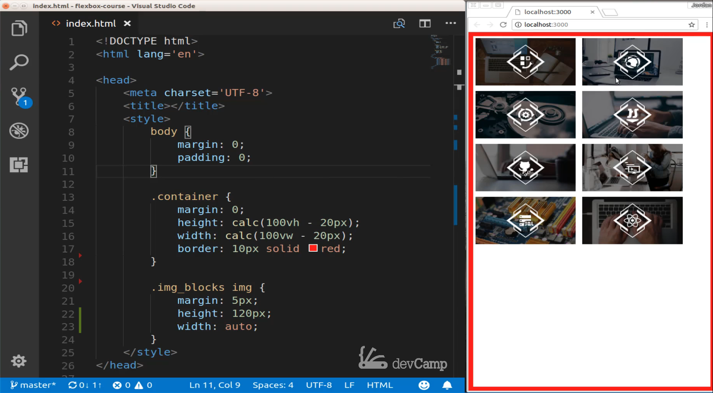
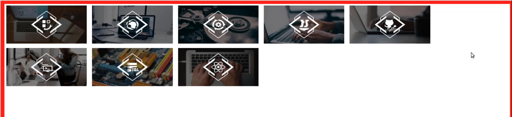
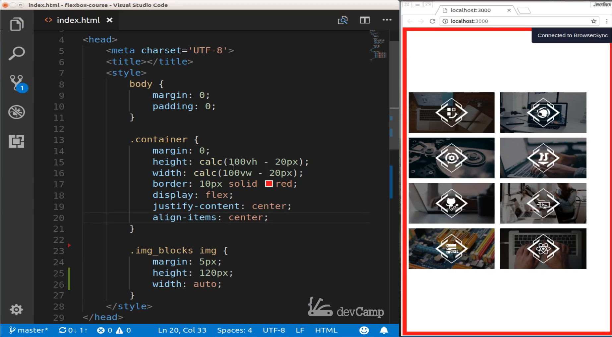
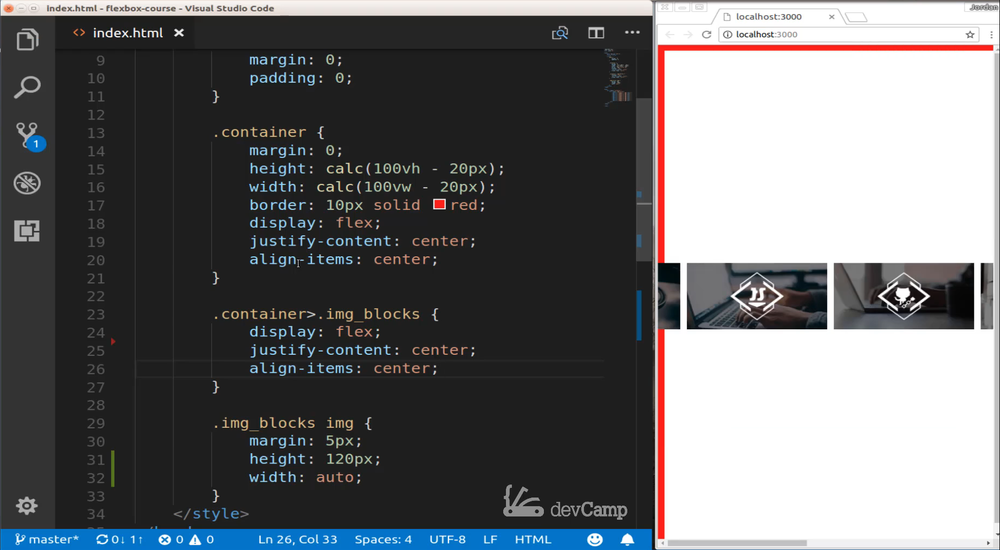
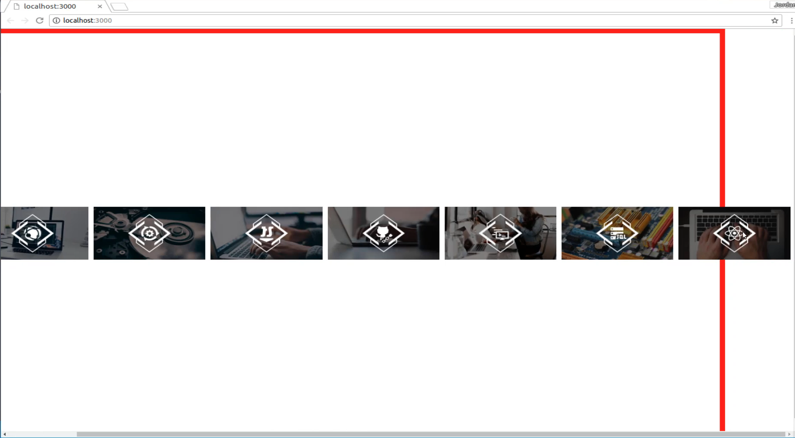
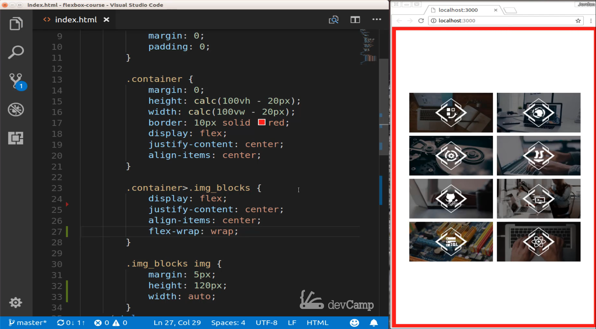
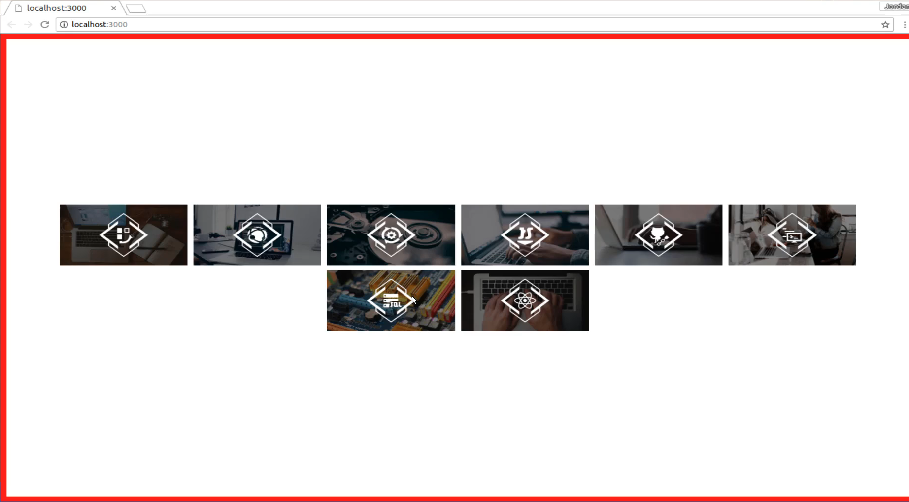

# 01-061:   How to Use the Flex Wrap Property to Implement Responsive Page Elements

So right here on the right-hand side 



I have a set of images and also as a side note well I was recording this the Unsplash API which I usually use to grab my images was having some downtime so I added some sample images to the project repository so that you can go and grab these yourselves and use them just in case you do not have access to the Unsplash image API or if it's down like it is for me right now. 

So right here what we have is a situation where we have all of these images and if we go down and look at the HTML you can see that we have a div of class container and then inside of that. So that is going to be our flex container and then we also have this class of image blocks which is another div and then inside of that, we have a number of images. 

```html
<body>
    <div class="container">
        <div class="img_blocks">
            
            
            
            
            
            
            
            
        </div>
    </div>
</body>
```

Now with what we're looking to do. Imagine that you're building out a portfolio site for an agency or something like that and they want to showcase all of their projects and their past work. This is a pretty common thing that you'll be asked to build out. And so the basic behavior is kind of similar to what we typically will do just with plain vanilla HTML and CSS. If you come up here and look you can see we're pretty close to what we want to do.

So what I ideally want if I stretch this out is I want to kind of mimic the standard behavior that you get with HTML where if you have this screen wide enough right here then you can have 4 items and if you keep on stretching out the screen then they'll keep on popping up right here. 



So without us even touching any HTML or CSS this is the way that it works. But now imagine a scenario where you don't only want to have this kind of behavior you may also want to have all of this content all these images centered and you want to use flexbox in order to do that. You might think that you could do something like this so we're going to walk through this. Shrink it down so that we have the right size and so I'm going to go into our container and let's start adding some flexbox styles so I'm going to say that this is going to display inline that's going to display flex and then I want to justify-content and I want to center it. And then I want to align items and then I want to center them.

```html
.container {
    margin: 0;
    height: calc(100vh - 20px);
    width: calc(100vw - 20px);
    border: 10px solid red;
    display: flex;
    justify-content: center;
    align-items: center;
}
```

So I'm going to save. 



And you can see we get a little bit of behavior we're looking for. But remember because this is our flexbox container it only has one child element which is this image blocks div. And so all that we are doing right now when we're saying justify-content and align-items. All we're going to be able to do is to center this one entire div not each one of the elements inside of it. So this is getting us a little bit closer but now we need to go and add some styles to our image blocks class so let's come down here and say that inside of our container and our image blocks class we want to also make this a flex containers. 

So I'm gonna say display flex and then from there I'm going to say justify-content center and I'm gonna use pretty much the same thing I just copied it and cause I'm gonna say align-items and we want to center those as well. 

```html
.container>.img_blocks {
    display: flex;
    justify-content: center;
    align-items: center;
    flex-wrap: wrap;
}
```

Now if I save this, that is not the behavior that we're looking for. 



So come here and let's stretch this over the entire screen you can see that this is not what we were looking to do whatsoever we have all kinds of weird issues where the images are starting too far to the left. They're actually causing the entire page to go to the right and go over the border of the parent div. 



That is definitely not what we want to happen and so that is where the flex-wrap property comes into play. If we come into this `.container>.img_blocks`. If I come down and right under align-items I say `flex-wrap` and just pass in a wrap. 

```html
.container>.img_blocks {
    display: flex;
    justify-content: center;
    align-items: center;
    flex-wrap: wrap;
}
```

And if I save this you can see that now that's working perfectly. 



So what flex-wrap does is it simply tells each one of the items that as soon as it gets to the boundary of the container than to simply move down to the next line. So it's mimicking the standard HTML behavior but it's combining that and it's merging into what we have with flexbox.

So now if we look at this on a large screen you can see that we're getting the exact behavior we want where it is simply going right next to each other. And then as soon as it hits the edge instead of stretching over and pushing to the left or doing anything like that, it simply goes down to the next line or it wraps to the next line which is the genesis of the name. 



So that is how you can use flexbox and the flex-wrap property. 

## Starter Code
```html
<!DOCTYPE html>
<html lang='en'>

<head>
    <meta charset='UTF-8'>
    <title></title>
    <style>
        body {
            margin: 0;
            padding: 0;
        }
        .container {
            margin: 0;
            height: calc(100vh - 20px);
            width: calc(100vw - 20px);
            border: 10px solid red;
        }

        .img_blocks img {
            margin: 5px;
            height: 120px;
            width: auto;
        }
    </style>
</head>

<body>
    <div class="container">
        <div class="img_blocks">
            
            
            
            
            
            
            
            
        </div>
    </div>
</body>

</html>
```

## Final Code

```html
<!DOCTYPE html>
<html lang='en'>

<head>
    <meta charset='UTF-8'>
    <title></title>
    <style>
        body {
            margin: 0;
            padding: 0;
        }
        .container {
            margin: 0;
            height: calc(100vh - 20px);
            width: calc(100vw - 20px);
            border: 10px solid red;
            display: flex;
            justify-content: center;
            align-items: center;
        }
        .container>.img_blocks {
            display: flex;
            justify-content: center;
            align-items: center;
            flex-wrap: wrap;
        }
        .img_blocks img {
            margin: 5px;
            height: 120px;
            width: auto;
        }
    </style>
</head>

<body>
    <div class="container">
        <div class="img_blocks">
            
            
            
            
            
            
            
            
        </div>
    </div>
</body>

</html>
```

## Resources

- [Images](https://github.com/jordanhudgens/flexbox-course/tree/master/images)
