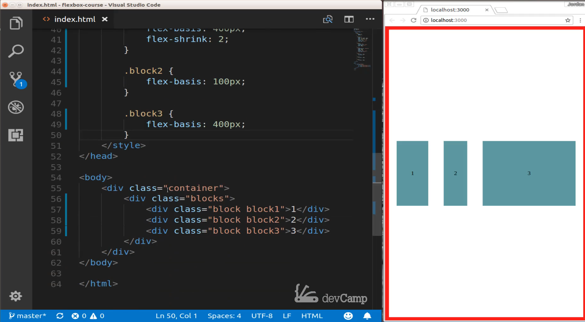
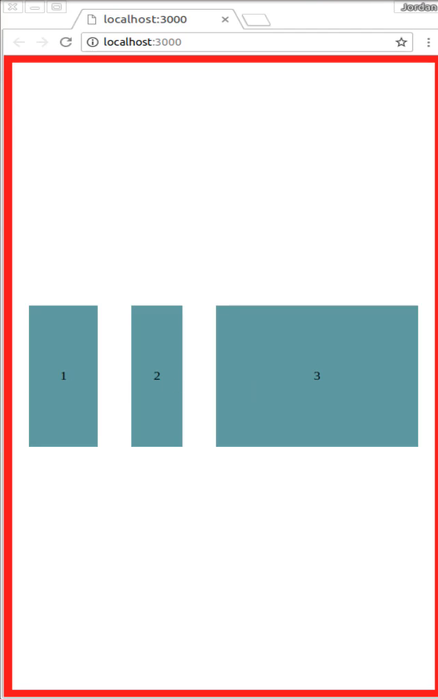
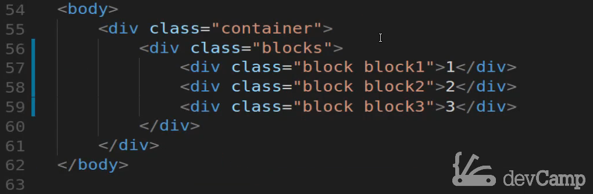
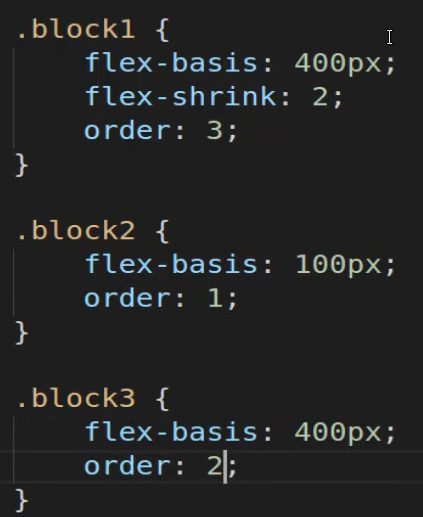
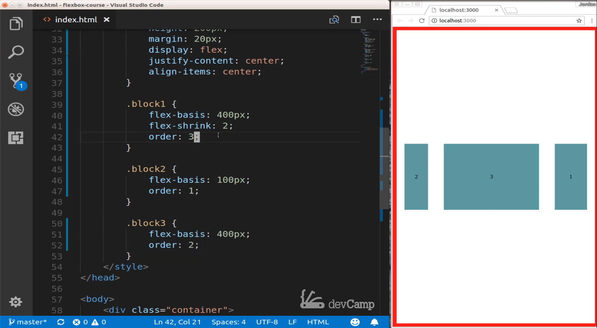
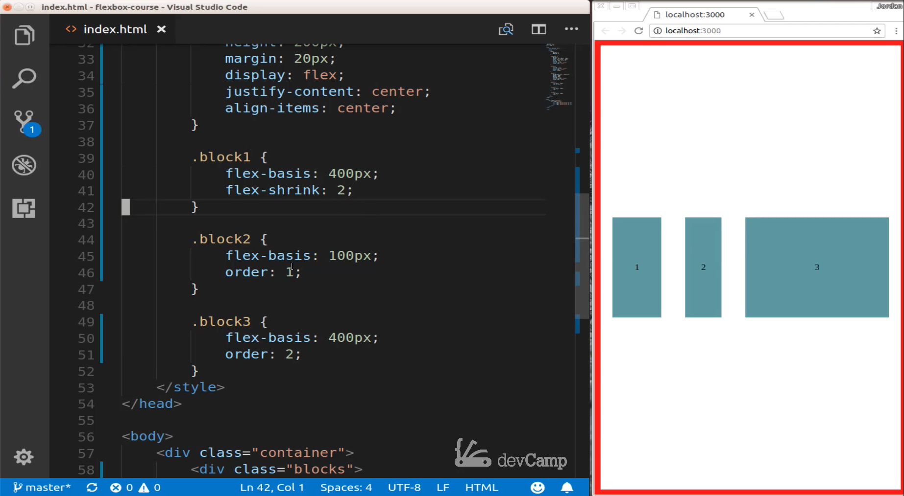
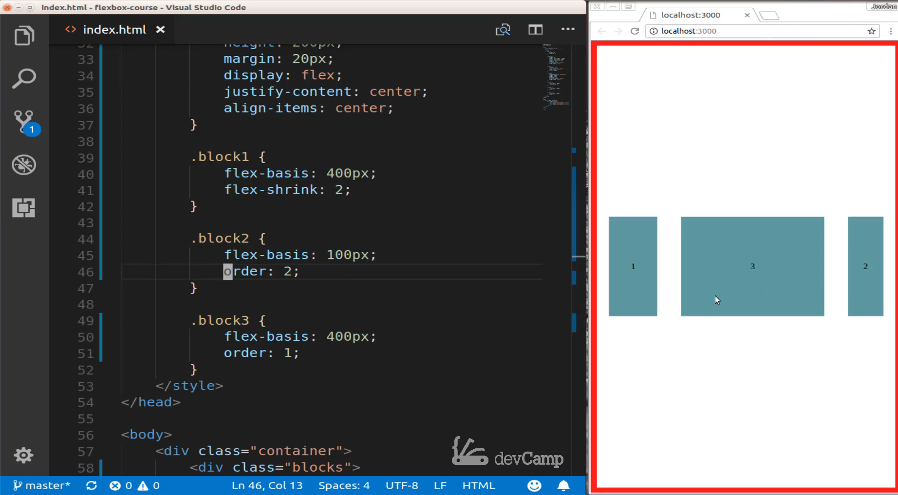

# 01-062:   How to Change the Order of Flexbox Items with the Order Property

Now if you ever find yourself running into a situation where you need to change the order of the elements programmatically. So you need the ability in your CSS code to dictate what order the elements are going to appear inside of a flexbox container we can control that by using the order property. 

So right here I brought back the blocks that we used when we were walking through the flex-basis grow and shrink properties. 



And if I come down here you can see we have a div of class container. We have another div of class blocks and then we have three child elements inside of that. So and I kept most of the code here actually, I kept all the code the same. So we have the container is a flexbox container we can see that here on line 18 where it says display flex and then blocks is also a nested flexbox container which means that each one of these block items is a flexbox item and so in order to do what we're going to do where we're going to programmatically change the order using flexbox and CSS we need to make sure that these elements are a flexbox item. 

 So this is specific to CSS but typically when you're going to implement this it's going to be whenever you are using flexbox. So if I come down here as you can see on the right and side I have our blocks and just their standard default order of 1, 2, 3. 



And so that's because we listed them as 1 2 and 3 right here. 



Now if I want to change this though, I can come here and say I want block 1 to actually be moved all the way to the end. And so I can say order 3 and if I copy this and I'll say that I want to move block 2 to the beginning I can say order 1 and then here I can change this to order 2. 



Now if I save this you can see on the right-hand side because we changed that order property the block that was at 2 is now 1 and it's because we gave it an order value of 1. And the same thing the one that was 3 has been changed 2 because we gave it 2. And then 1 right here is the last one because it's 3. 



Now if I delete this, so if I say I'm not going to give a hardcoded value to 1. You can see that by default if we do not pass in an order property then each one of these other items is not going to we're not going to have that same definition. 



But now watch this, this is kind of interesting if I swap blocks 3 and 2 and change these. You can see that that change is still reflected. 



So when I said that block 2 is going to have an order value of 2 and then block 3 is going to have an order value of 1. You can see that changes the order but because we didn't pass anything to this block 1 class then it simply gets ignored and that order property is then going to move down the chain to those next items. 

Now I'm going to give you a little bit of a caveat that I use flexbox almost every day on the various projects that I work on and I very rarely use the order properties, so this is not something that you will most likely be doing on a day in day out basis. However, there is a good chance that you're going to run into situations where you find this order property in someone else's code or in some documentation. So it's helpful to have an idea of the way it operates and then also to have an understanding of what happens with odd edge cases like we see right here, where a couple of the items received this order property but then one of the items or a few of the items don't and so it's important to understand what happens when that's the case. 

## Starter Code
```html
<!DOCTYPE html>
<html lang='en'>
<head>
  <meta charset='UTF-8'>
  <title></title>
  <style>
    body {
      margin: 0;
      padding: 0;
    }

    .container {
      margin: 0;
      height: calc(100vh - 20px);
      width: calc(100vw - 20px);
      border: 10px solid red;
      display: flex;
      justify-content: center;
      align-items: center;
    }

    .blocks {
      display: flex;
      justify-content: center;
      align-items: center;
      width: 1000px;
    }

    .block {
      background-color:cadetblue;
      height: 200px;
      margin: 20px;
      display: flex;
      justify-content: center;
      align-items: center;
    }

    .block1 {
      flex-basis: 400px;
      flex-shrink: 2;
    }

    .block2 {
      flex-basis: 100px;
    }

    .block3 {
      flex-basis: 400px;
    }
  </style>
</head>
<body>
  <div class="container">
    <div class="blocks">
      <div class="block block1">1</div>
      <div class="block block2">2</div>
      <div class="block block3">3</div>
    </div>
  </div>
</body>
</html>
```

## Final Code

```html
<!DOCTYPE html>
<html lang='en'>
<head>
  <meta charset='UTF-8'>
  <title></title>
  <style>
    body {
      margin: 0;
      padding: 0;
    }

    .container {
      margin: 0;
      height: calc(100vh - 20px);
      width: calc(100vw - 20px);
      border: 10px solid red;
      display: flex;
      justify-content: center;
      align-items: center;
    }

    .blocks {
      display: flex;
      justify-content: center;
      align-items: center;
      width: 1000px;
    }

    .block {
      background-color:cadetblue;
      height: 200px;
      margin: 20px;
      display: flex;
      justify-content: center;
      align-items: center;
    }

    .block1 {
      flex-basis: 400px;
      flex-shrink: 2;
      order: 3;
    }

    .block2 {
      flex-basis: 100px;
      order: 1;
    }

    .block3 {
      flex-basis: 400px;
      order: 2;
    }
  </style>
</head>
<body>
  <div class="container">
    <div class="blocks">
      <div class="block block1">1</div>
      <div class="block block2">2</div>
      <div class="block block3">3</div>
    </div>
  </div>
</body>
</html>
```
