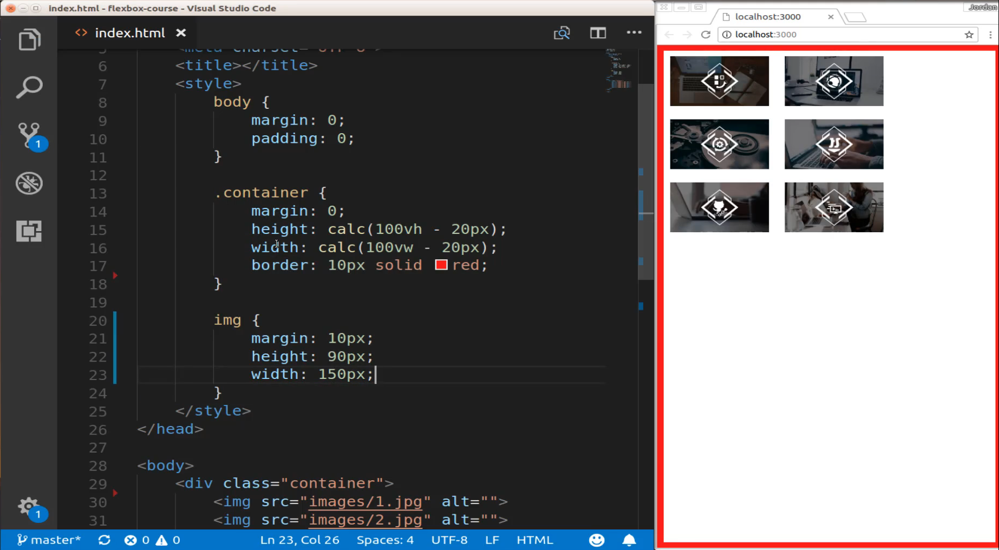
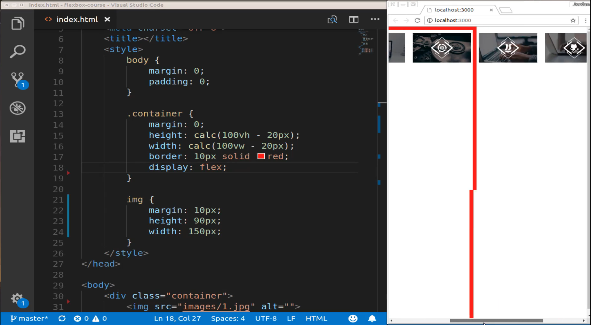
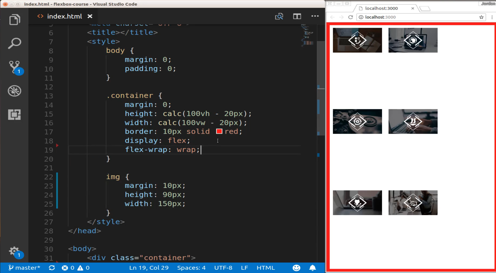
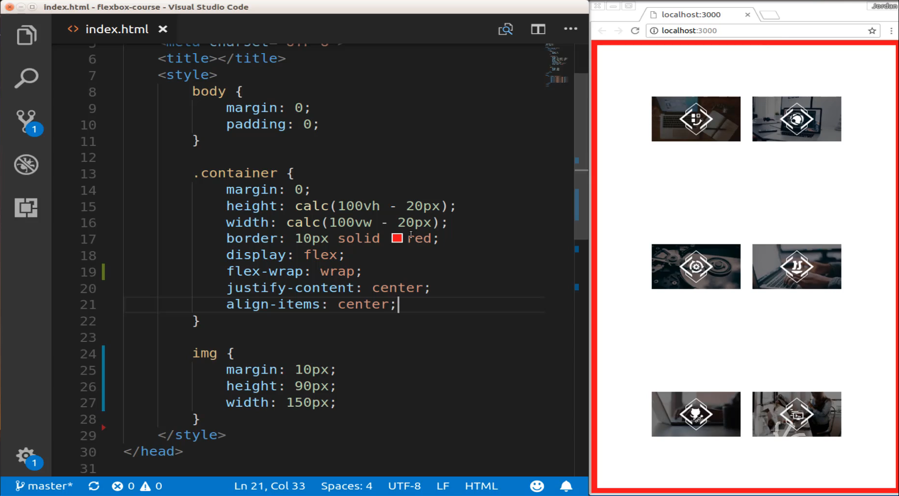
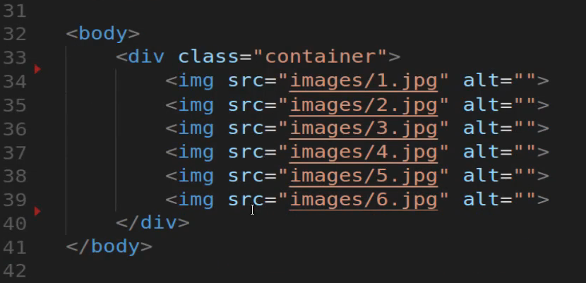
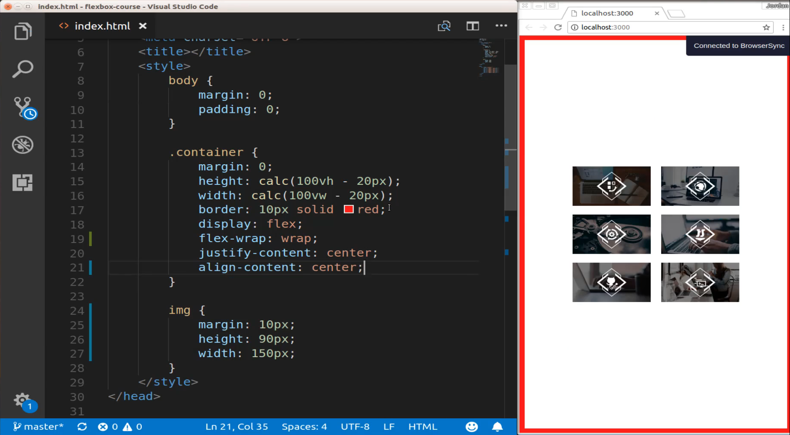
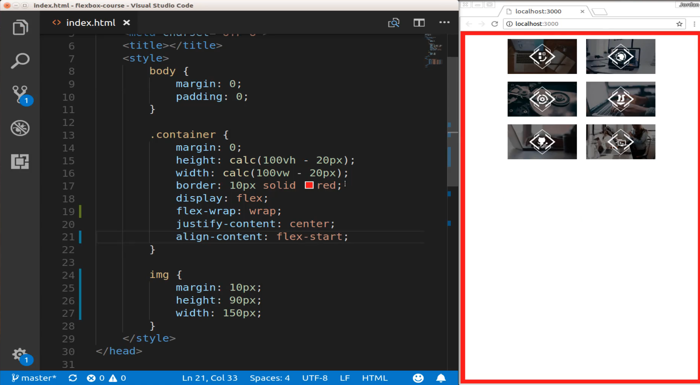
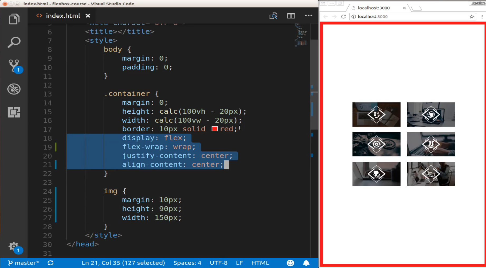

# 01-063:   Align Content vs Align Items in Flexbox

 Right here, I have a plain and pretty much empty html page. I just have a single container tag inside of the body and I haven't added any kind of flexbox components into it yet. So the first thing I'm going to do is do that, I'm going to add let's say six images so I can just do that by saying `img[src =""` and then inside of here I'm going to use emmet to have some numbers and so I'll say images just number JPEG and then that's all I'm going to do for right now. I'm not going to add classes or anything and then I'm going to create 6 of these and so that creates our 6 images. 

```html


```

And now if I hit save I can see those 6 images there. Let's add some custom styles to the images so I'm just going to like the image tag by itself. Obviously, if you're doing this in a production application with multiple images then you would want to add some type of class or something. But right now I just want to walk through the key differences between align-items and align content so I'm just going to treat all the images on the page the same. So I'll say 10 pixels for margin and will give a height 90 pixels and then a width of 150 pixels. 

```html
img {
    margin: 10px;
    height: 90px;
    width: 150px;
}
```

Now, if I save this you can see our images all on one page and you can see they're all aligned on the top left-hand side.



Right now we don't have any kind of flex properties inside of our style so let's start off with that. So I'm going to say display flex and if I do that then he can see right now everything now has moved to be side by side and it's no longer really responsive because we're not using flex-wrap or anything like we've already talked about. 



So let's add that to our system. So I'm going to say flex-wrap and we're going to allow this to wrap. 

```html
.container {
    margin: 0;
    height: calc(100vh - 20px);
    width: calc(100vw - 20px);
    border: 10px solid red;
    display: flex;
    justify-content: center;
    align-content: center;
    flex-wrap: wrap;
}
```

And now this is working. 



And you can see that we have each one of the elements and they are right next to each other as soon as one does not fit to the side then it moves down to the next line. Now if I use some properties such as justify-content I can say justify-content center and then this is going to align it like that and if I were to say align-items center. If I save that you can see that this is now centered on the page. 



And in many cases, this is exactly what you're looking for where you want to have everything centered and then you have the same space from the top as you do on the bottom. And this is how align-items works when you combine it with justify-content and if you've followed along with the rest of my flexbox course then this should be pretty familiar to you. 

But what if you want to treat the entire set of items as one component? So right here you can see we have this class of container and then inside of it we have these six image items. 



Well, this is fine but there are many times where you don't want them to have all of this space in between them. And so when it comes to fixing that what we can do is actually get rid of align-items and now let's say align content and say center. Now if you hit save you can see that these are now grouped together. 



And so there are many times where this is the actual behavior that you're wanting. So if you're building out some kind of portfolio application and you want to have everything focused and centered right in the middle of the page and you're dealing with a single flex container then this is a great way of doing it. 

Now there are many ways of also replicating this behavior if you work with multiple flex containers and we've done that a few times in this course and in those cases you can combine justify-content and then align-items to replicate this behavior. But if you're working with a very simple component like with what we have. Where we have a single flex container like we have here with this class and then that has a number of items inside of it. Then you do not have to go through the entire process of having multiple flex items and can nested containers and those kinds of things. This is a really easy way of being able to have this centered kind of behavior. 

Now align content takes a number of different parameters so we could say flex-start and if we save that it moves up to the very top.



If we say flex-end this is going to move it to the bottom. 


Now, I will say that typically when I'm using flex content I am using it with this centered behavior because usually when I'm using flexbox I'm trying to align items kind of like I'm doing right here. It's pretty rare that I will move all of the content down to the very bottom of the page, it's happened a few times, but this is the typical use case that I personally have for it. 

Where I have this data I have this kind of flex container and then I want to keep everything centered inside of it and in order to do that you can see all we needed was really just four lines of code inside of our sass file. 



So it's a very nice and easy way that flexbox gives us the ability to center our items both horizontally and vertically. 

## Starter Code
```html
<!DOCTYPE html>
<html lang='en'>

<head>
  <meta charset='UTF-8'>
  <title></title>
  <style>
    body {
      margin: 0;
      padding: 0;
    }
    .container {
      margin: 0;
      height: calc(100vh - 20px);
      width: calc(100vw - 20px);
      border: 10px solid red;
    }
  </style>
</head>

<body>
  <div class="container">
  </div>
</body>

</html>
```

## Final Code

```html
<!DOCTYPE html>
<html lang='en'>

<head>
  <meta charset='UTF-8'>
  <title></title>
  <style>
    body {
      margin: 0;
      padding: 0;
    }
    .container {
      margin: 0;
      height: calc(100vh - 20px);
      width: calc(100vw - 20px);
      border: 10px solid red;
      display: flex;
      justify-content: center;
      align-content: center;
      flex-wrap: wrap;
    }
    img {
      margin: 10px;
      width: 150px;
      height: 90px;
    }
  </style>
</head>

<body>
  <div class="container">
    
    
    
    
    
    
  </div>
</body>

</html>
```
