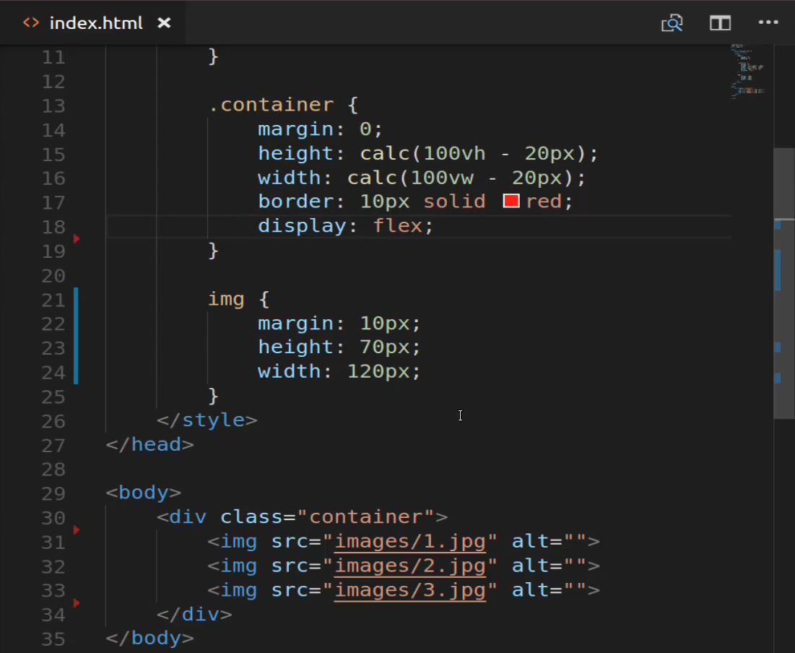
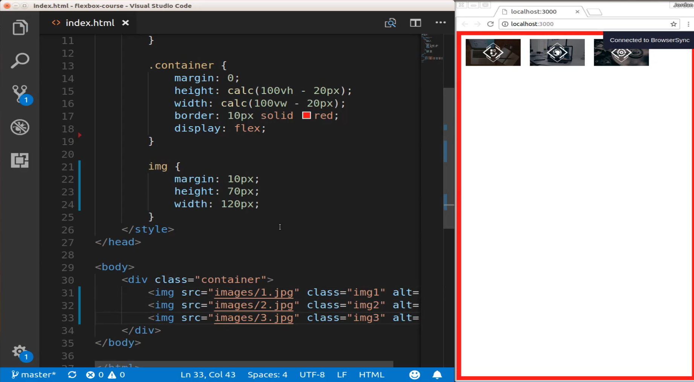
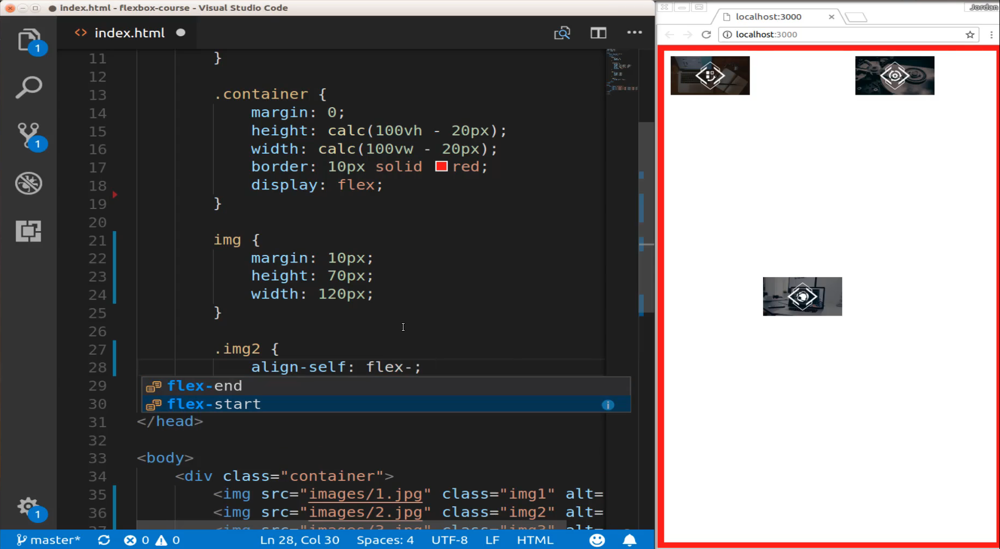

# 01-064:   Overview of Align Self in Flexbox

I think in the entire time I've used flexbox I have used this one principle maybe one time. So this is not going to be something that you'll most likely be using on a day to day basis. However, it is helpful to understand how to use it especially if you are reading through other people's documentation and you're looking at other people's examples. I'd be doing a disservice to you if I did not at least show you what this behavior does. 

And so right here we have a basic HTML file with just a few style definitions. Our container class right here is the only piece of flexbox that we have in the entire program and all we have here is a rule that says to display flex so we're not going to have to do a lot of writing here. 



So all we are going to do is I'm going to come down and you can see with each one of these images we have just a regular image path and then a blank alt. So let's come and create a class so I'm gonna come down here and let's just create one we're only going to use one technically but I'll create one for every value. So say class and then the image and I'll say one but then it comes and change it so this one's going to be image two and then this one's going to be image three.



Now that doesn't make any changes whatsoever because we need to actually add a value here. And so what I can do is I can call say Image 2 and then inside of here I'll say align-self and then I can pass in any kind of value here, any kind of flexbox values, I can say align start is going to give us the same behavior we have here. So I'll say flex-end then you can see that that second item has been changed. Now it is on the very bottom of the page. 


If I wanted to change this and say center then it's going to be on the center of the page 



and you could tell the very beginning and I said that if I type flex-start there would be no change because everything else is already there at the top. But if you imagine a scenario where you have all of the other elements scattered in different spots of the pages then flex-start here will just make sure that it starts at the very top. 

So what align-self essentially does is it gives you the ability to call a flex item and that is the one key takeaway that I want you to have here is that align-self allows you to treat a single flexbox item independent from the rest of the items within a container. So right now this image 2 is part of a flex container that container class that we have up here. And even though by default if you don't pass any values it's going to be treated like all the other ones.

But if you decide to put a value in here such as align-self then you can override all of those other elements so if you do want this at the center of the page then you can treat it independent of those other flex items and so you may run into this whenever you're looking at someone else's flexbox implementations so I really wanted you to mainly just have an idea of how this works.

Now, the reason why you don't particularly like using this often is because usually if I want to treat one element different than the others what I'll do is create its own flex containers or create a separate container in a wrapper class and then I will put all of the rules of one set of items inside of it. Usually around some other kind of div and then I will create a separate div and a separate class for the item that I want to treat differently. 

The main reason is because that way I can have some more flexibility on how I'm trying to implement it so I don't have to even rely on align-self. I could use justify-content I could use align-items I could use anything like that and so my personal approach is I would rather create more divs and more containers more flexbox containers and then that will allow me to have a little bit more control. But if you ever do run into a scenario where you have a container that has a certain number of flexbox items and then you want to treat one of them slightly different then that is what align-self is there for. 

## Starter Code
```html
<!DOCTYPE html>
<html lang='en'>

<head>
  <meta charset='UTF-8'>
  <title></title>
  <style>
    body {
      margin: 0;
      padding: 0;
    }
    .container {
      margin: 0;
      height: calc(100vh - 20px);
      width: calc(100vw - 20px);
      border: 10px solid red;
      display: flex;
    }
    img {
      margin: 10px;
      width: 100px;
      height: 60px;
    }
  </style>
</head>

<body>
  <div class="container">
    
    
    
  </div>
</body>

</html>
```

## Final Code

```html
<!DOCTYPE html>
<html lang='en'>

<head>
  <meta charset='UTF-8'>
  <title></title>
  <style>
    body {
      margin: 0;
      padding: 0;
    }
    .container {
      margin: 0;
      height: calc(100vh - 20px);
      width: calc(100vw - 20px);
      border: 10px solid red;
      display: flex;
      flex-wrap: wrap;
      flex-direction: row;
    }
    img {
      margin: 10px;
      width: 100px;
      height: 60px;
    }
    .img2 {
      align-self: flex-end;
    }
  </style>
</head>

<body>
  <div class="container">
    
    
    
  </div>
</body>

</html>
```
