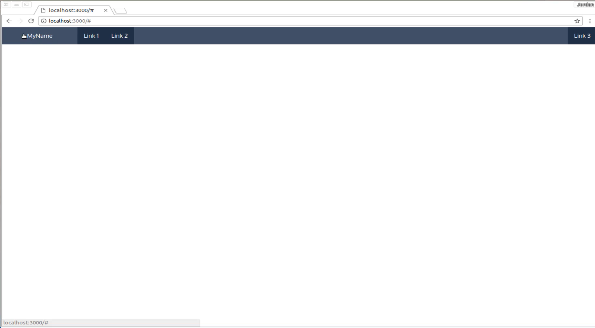
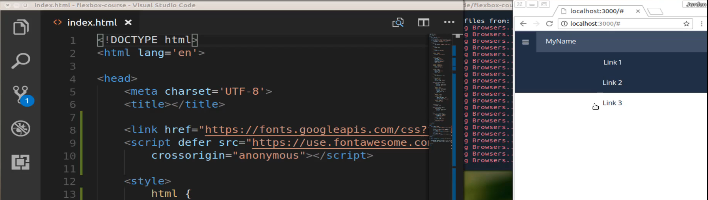
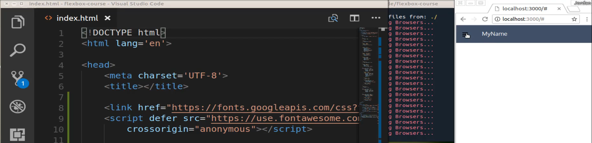
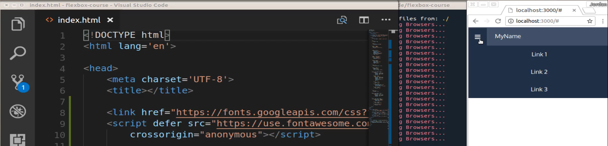

# 01-065:   Flexbox Capstone Project Requirements

What I wanted to give you here was more than just a busy work kind of project. I wanted to give you something that you'd actually be able to use as you go throughout your development journey. And I think I'm going to give you here is something that will accomplish exactly that. 

So we're going to build a completely responsive navigation bar using flexbox and we are going to combine a number of different CSS and flexbox and HTML skills in order to accomplish this. So right here is the final project that we're going to build out. 

We're going to have a branding component here on the left-hand side. So technically this could be a link or just some text like we have here it could be a logo. And then you can have any number of navigation links right next to it. And then all the way on the right-hand side here you could have another set of links. Now you only need to have one for this particular project but just know that the way you can think about this is we have a number of different components on this page. And so they can be grouped where you have some on the right-hand side and then some on the left-hand side and these elements on the left-hand side are not just links they also can be images and they can be treated independently of each other.

Notice how if I hover over the logo branding area here it has a different effect than if I come to one of these links. 

 

and then in addition to this because remember I said that this is going to be responsive. What I want you to do is to also build out the full responsive component here. So if I were to drag this and shrink it down here then what you're going to see is that this is going to transition into the little hamburger. This is something that you probably have seen in other sites and so now because we're on a smaller screen than I could just click on this and it's going to pop this open. 

Now I will say that when you do this and you may also notice the color changes when I click on this this is going to require a little bit of JavaScript so I recommend that you as you are going through and you're building this out that you look for how you can leverage Javascript in order to make this possible. I'm also going to bring in some custom fonts but because this is a capstone project I really want this to be something that you really own. 

So this is something that is not going to look identical to what I have. You may choose to go with another font so you may also have a full other color scheme that you want to go with and that's perfectly fine. I want this to be something not just that you're going to turn in. But something that you're going to be able to use in your own projects for years to come. 

Whenever you're building out some kind of web application typically you need to have some kind of navigation component and nowadays you really need that to be something that's responsive. And that's exactly what flex box gives you the ability to do just like you can see right here. 

Notice that when I shrunk this down to a smartphone size that it removed all the other links besides for the logo. And as I shrink that down you can see that logo stays within the same distance of the hamburger navigation component. 

And if I click on it then all of those links that you saw before are now going to drop down into this little dropdown that when you click on it that's going to pop up so you can imagine that this is what a user would see if they accessed the site on a mobile application. 

Just to give you a little bit of a hint on what you're going to need to do this, you're going to obviously need flex box in order to build this out. You're also going to have to use media queries. You're going to need to know exactly at what stage and at what size the browser is at so that you can readjust the sizing of the navigation component. And like I said earlier if you want to build out this full type of dropdown then you're going to need a little bit of JavaScript or Jquery as well. 

So that is the full set of requirements. Its this complete nav bar here that has all of this kind of functionality that you just saw. So good luck in building that out and I will see you in the solution.
