# 01-066:   Flexbox Capstone Project Solution: Build a Responsive Navbar

---

## PROPOSED SOLUTION

So this is going to be a pretty fun and pretty comprehensive guide. I'm gonna start off here and I'm going to create some HTML5 boilerplate and let's just test our system just to make sure it's working. So create an H1 here and just say Hi there. And if you're using a tool such as gulp and you start from scratch as I have right here then you are going to for your very first time we're going to have to hit refresh so if you followed me in my other guides and you've seen how I've shown you how to build out a gulp watcher then I didn't want that to be kind of a confusing thing for you. 

If you saw that no changes were being reflected it's because you have to have a valid piece of HTML and after you have that and you've hit refresh in the browser then you'll start auto-updating just like right there. 

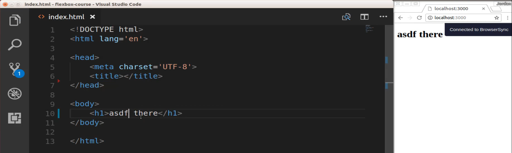

So now with all that in place let start building out our NAV component. Now the very first thing that I'm going to create is a wrapper that is going to store all of the nav links and all the elements that we're going to have. So I'm going to say .navbar and that's going to create our wrapper div and now let's add an a link and add a link and the class for this one is going to be brand.

So say class brand and you can put whatever you want in here I'm just going to say my name hit save. Now, you can see that that's been updated on the right-hand side. 

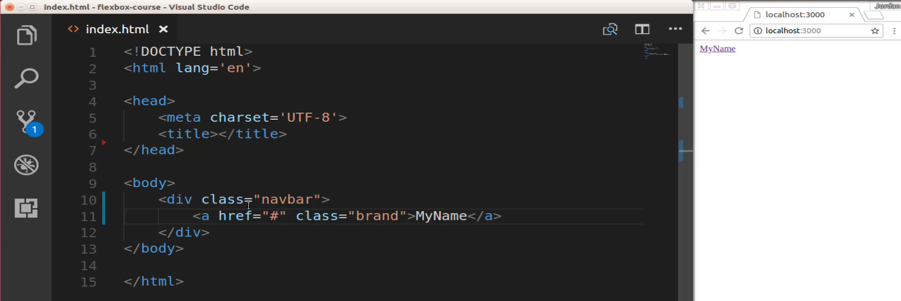

Now inside of here, I'm going to have two sets of links so because of that I'm going to create two divs one of them I'm going to call left and then the other one I'm going to call right. And so the ones on the left-hand side are going to contain the links that we want budding up next to the brand component and the ones on the right are going to be all the way to the right-hand side of the nav bar. 

Now inside of here, I'm going to say a.link this is going to create an a link that for right now is not going to go to anything but I can just say link 1, duplicate this and we'll have link 2. And now on the right-hand side, we're going to do the same exact thing except now I'm going to have it say Link 3 just so once we actually have it live we'll be able to take a look at it. Now you can see that that's been updated. 

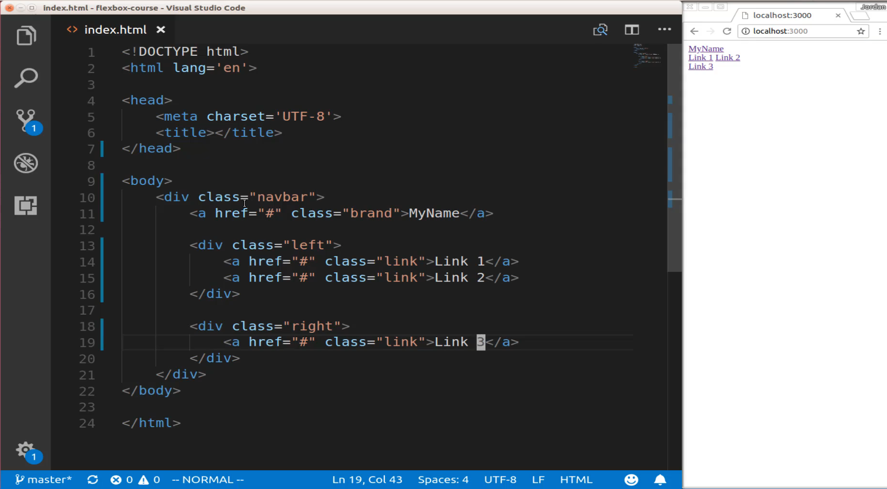

This is using no CSS at all right now, so there is going to be no styles and that's what we're going to get into next. So this is going to be about 99 percent of the code that we need to write on the HTML side and now we can start building out our custom CSS styles. 

So I'm going to use embedded styles but you could use this inside of some other specific style file. And that's perfectly fine but right here I'm going to have them all in one spot just so it's nice and easy to see. Now you may notice they are on the top and the left-hand side that we have a little bit of margin and that is something that you get by default with HTML. 

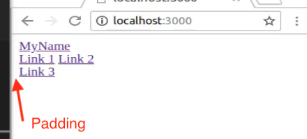

So what I want to do is override that because I want to have our navigation bar butting up against the top the left in the right-hand side and say you can override that by just saying body margin zero pixels you save that. Now you can see that our links are moved up against that so that's all we need for our body. 

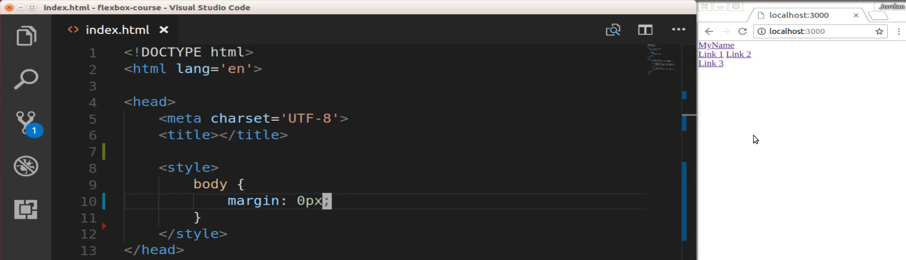

Now, let's grab that nav bar and for now let's just add a background color to it. I'm going to go at the dark blue color of #425068 hit save then it's going to give us that nice little dark bluish color there for the nav bar. 

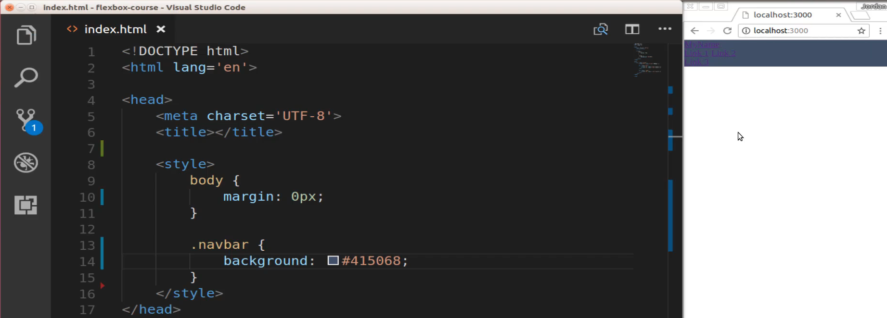

Now we're not done with that nav bar class but when I'm going to do is all of the other styles that I'm going to add I'm going to add inside of a media query. The whole point of this exercise is building out a responsive nav bar component so I'm going to keep our base styles pretty basic and then anything that is specifically targeted to having the responsive element thats going to go inside of a media query.

So here I'm just going leave nav bar by itself and next I'm going to say nav bar div so this is going to be for any of the divs inside of nav bar. I want the display to be none and the reason I'm doing that is because I want to manage all of this. I want to manage if something's being shown or not inside of the media query. So now if I hit save then it's going to hide all of those elements inside the nav bar. Which is fine that's what we're looking for because the media query is going to be responsible for showing them or not. 

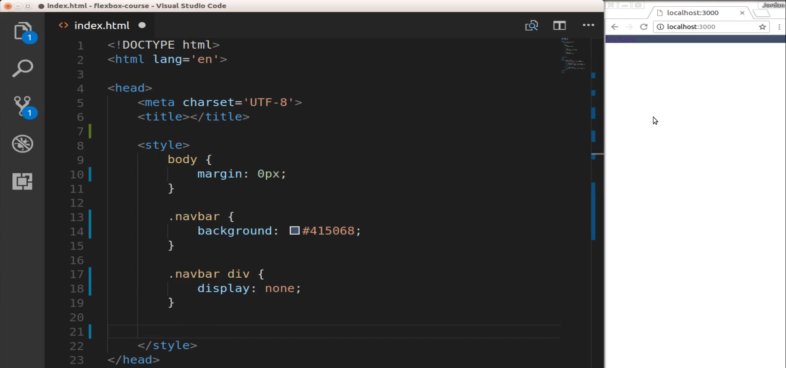

So now let's add a couple more styles. I'm going to use one that we've not added yet but we will shortly and that's our toggle class, we'll add that in a little bit. Now let's add a style for our brand as well, these are both going to be the same and they're going to use display: inline block. And the reason why I'm using inline block here is because eventually once we have fully launched this then inline block gives us a nice default kind of sizes. This is not going to have anything to do with what we're doing with the flex box containers or items or anything like that it just helps give us a nasal baseline set of styles. 

So now that we have that we can start adding classes to our links so I'm going to say `.navbar .link` and now inside of here this is where I'm going to add quite a few styles so I we'll say that this is going to be `display: block;` because these are going to be flex items not flex containers so we don't have to say display flex here and in fact if we did it wouldn't work right. 

Then I want these to be aligned in the center, so I'm going to say text align center, padding is going to be 1 em, text decoration of none, background here of #223047 which is more of that dark blueish color, not exactly like it but very close to it, and then lastly color is going to be white. 

```html
.navbar .link {
    display: block;
    text-align: center;
    padding: 1em;
    text-decoration: none;
    background: #223047;
    color: white;
}
```

Now you're not going to see any of these because in line 18 there were hiding them but as soon as I open it up in the media query then you will start to see these links. 

Now let's move down and we have all of the styles for a link. Now we're going to work with our pseudo classes, so I'll say navbar link hover and also navbar link active. Now here what we're going to do is add a color that is actually going to be the exact opposite of what we have here as our background color. So I can just copy this and then that's going to be our color and then for our background, it's going to be white. So what this means is whenever you hover over one of these links it's going to have the exact opposite effect of their baseline style so it's going to have this dark blue color originally and then as soon as you hover over it then it's going to switch and that's going to be the font color or the link color. And then the actual background is going to change to white and that's all we need to do. 

Now let's move down the line. We only have three more base styles that we need to add. So one is going to be for the brand. Now our brand we're going to give it a width of 10 em. We want this to be aligned in the center as well the text align center than padding is going to be 1 em and the color will be white 

```html
.navbar .brand {
    width: 10em;
    text-align: center;
    padding: 1em;
    color: white;
}
```

Hit save and now you can see that that did get updated because we're not hiding our brand because we always want that available, so that looks good.

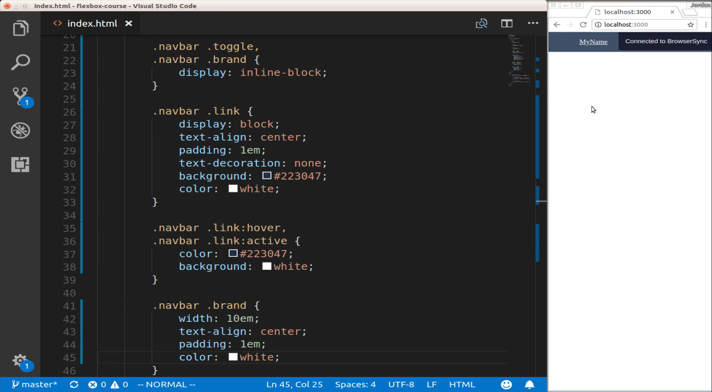

You may notice that we have that little underline there. I want to get rid of that. So I'll say nav bar and then a. So any items any link items inside of here. I want to hide the underline so text decoration none save and the underline is gone. 

```html
.navbar a {
    text-decoration: none;
}
```

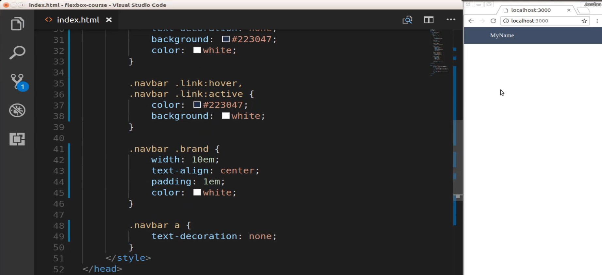

Now we're on our very last style definition for our base styles and this is going to be for our toggle class. Which we have not implemented yet but we do know we're going to need it. So I can say .navbar .toggle padding 1 em and colors going to be black. 

```html
.navbar .toggle {
    padding: 1em;
    color: black;
}
```

So this is going to be for our little hamburger. Okay so everything is there. Let's go and add this toggle functionality or not the functionality but at least let's add what we're going to be seeing here. So this is going to bring in font awesome and then here on the top left hand side there's going to be three little bars there. And that's going to be the traditional way I'm sure you've seen that in a number of different mobile applications. 

So I'm gonna add a new link here and it's going to be of class toggle and the href is not going to point anywhere. But I do want to add an idea here and it's because I want to be able to grab it. So I'll say nav hamburger and then inside of here this is where we're going to add our icon but we do not know what our icon is yet and we wouldn't be able to bring it in yet because we have to import it using font awesome, so let's go grab that. 

I'll switch over to a browser and if I stretch this all the way let's go to [font awesome](https://fontawesome.com/get-started) we will bring in a Google font but not right now. So for us so there you go and if you navigate to get started then you can come down and just grab the free CDN version of this. 

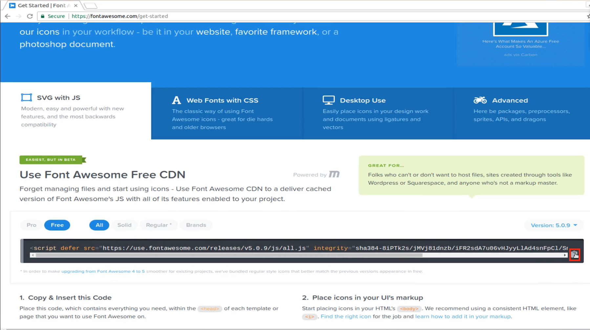

Switch over to your text editor and then right below the title tag, just paste that in so you can hit save. And now with that in place we can find the icon that we want to use. So if you switch back to font awesome and then click on icons you can just search for hamburger here and it's going to give you exactly what you needs. Type in hamburger and you can see we have our three bars here 

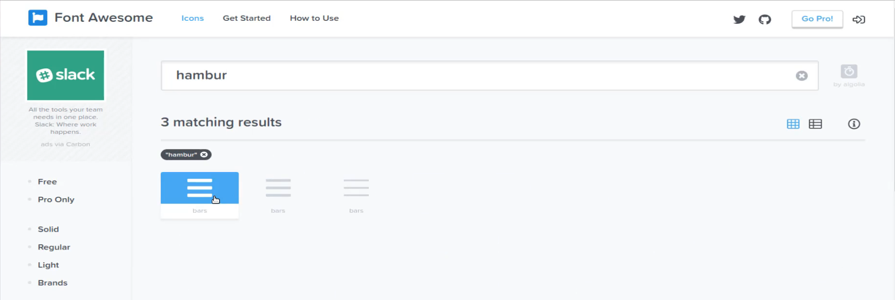

and then it will even give you the HTML that you need so you can just copy that code.

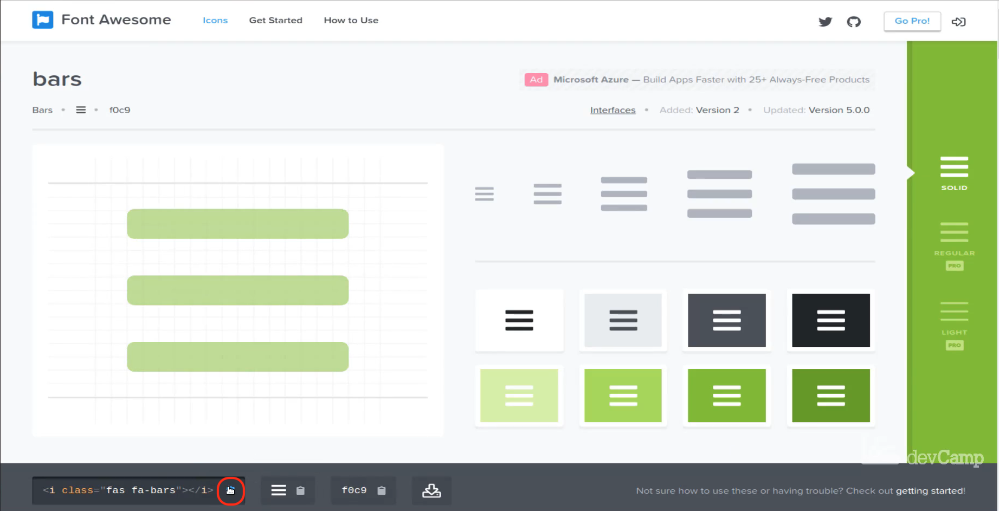

Now we can paste this inside and then make sure you indent it properly and so that is now as you can see there that gives us our three little hamburgers that icon was imported properly and now you can see them, so I'm happy with that. 

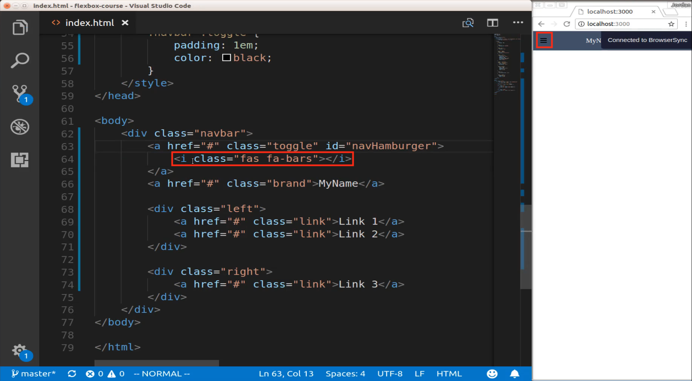

OK, so we left off where it said .navbar .toggle, this doesn't do anything yet we are going to need Javascript in order to use that. But for right now at least we know what's showing up there and on that side of it it is working. So let's switch back and now what we're going to do is build out our media queries. So the way you do that is by saying media and then you pass in the screen size that you're wanting to target. So I'll say min-width and I want this width to be in this case let's say 48 em. And so anything inside of here is only going to happen when the screen is in desktop mode. 

So here I'll say nav bar and this is where we're going to get into using flex box so I'll say navbar flex and then let's add a navbar and we're going to wrap up our two containers. So those items on the left hand side and the right hand side. So say navbar left and navbar right. And now we're going to make these flat containers as well. So say display flex give them a flex property of 1 and now you're not going to see any changes here and the reason is because this is a small screen. Let's stretch it all the way out and now you can see that our navbar is actually starting to look like a real navbar so it's exciting. I think that looks pretty cool.


Now if we come down we can start updating these values so let's grab that navbar link class again. Navbar link say we want the width to be auto and then you may have noticed that our link 3 here is kind of in the middle it's kind of in no man's land I want to have it all the way on the right hand side. So the way we can do that is by saying nav bar and then .right justify content and then we want this to be flex and which will move it all the way to the right hand side and you can even see it right here. Now that link is all the way over here.

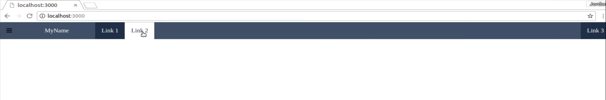

Link one and two are in the spots we want them. The brand is where we want it and then our Hamburger is where we want it. So this is coming along quite nicely. Now we don't want the hamburger up there so we still have more work to do but it's coming along. So let's fix that hamburger issue I'm going to say `.navbar .toggle` and for this size we are going to say display none. And now if we switch back you can see that the hamburger is now gone which is exactly what we are wanting in this specific case. So that is it, that's all we need to do for that specific media query. 

Now let's target smartphones so we can shrink this back now because the different styles we're going to use now are what we want to occur when this is on a smaller screen like you can see right here.

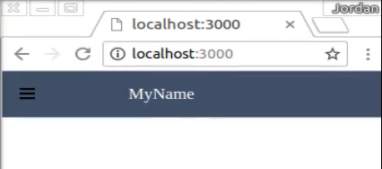

So you notice how the hamburger came back because now we are on a smaller screen. I'm going to say min width and so on actually and what if I have min width here scroll up just a little bit. And yes I forgot one item, I need to make sure that we add in a nav bar and then  .navbar div. And so we need to make sure that all of the divs inside of here are flex. 

The reason why I did this separately was because usually when I'm using this element or when I'm integrating this into one of my own applications I don't always just have a left and a right class. I may have other classes inside of it like maybe a search bar or anything like that. And so in this specific example you wouldn't need this code 

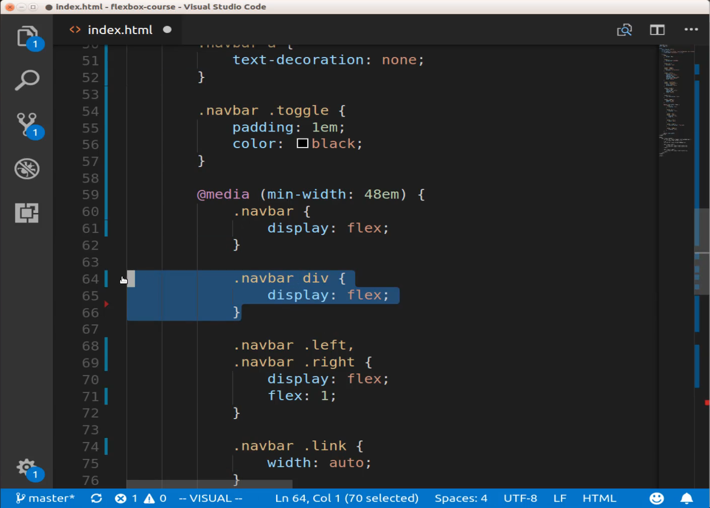

but if you are having other divs inside of your nav bar then you will need some way of wrapping all of them up. So this is kind of optional. But I did have it in my notes to make sure that that was included and so let's keep that there. But now let's move down and so now let's target smartphones so we can say max width and let's go with 48em. 

```html
@media (max-width: 48em)
```

So this is essentially just the opposite of what we had before so this is going to be for smartphones. And now we can go to .navbar .active .toggle and let's make the background that dark blue so #223047 and then we'll make the color white. So this is going to be what happens when you click on that and you're going to have the different toggle functionality live. So now that we have that we can say .navbar .brand and now we want the text alignment to be on the left say text alignment left and you can see our brand has moved over because I want that closer to our Hamburger when ever it's on a smartphone. 


And then believe it or not we only have one more class to add. So it's going to be .navbar .active div and then this is going to be display block. Now we don't see any changes and the reason is because you may have noticed I've introduced a new class here called active. And what we're going to do is we're going to have this active class come onto the screen. So it's going to be added to the dom whenever you click on the hamburger icon. And so we're going to leverage Javascript in order to do that and the first thing we need to do is select this nav hamburger. 

So what I want to do is have javascript listen in for this click. So every time we click on this toggle class it's going to grab the nav hamburger and then we're going to have it do some kind of task. So let's come down below body and I'm gonna say script and now lets perform our selector. So I'll say const navHamburger and we'll perform our query of documents query selector and lets pass in that navHamburger. 

Now that we have that let's add an event listener. So navHamburger add event listener listen for a click and if you've watched any of my javascript tutorials  especially those revolving around event listeners you know that we can then pass an event listener an event. So I'm going to use this arrow syntax for the function and inside of here I'll say navHamburger .parentElement. So we're going to traverse the DOM move one element above so whatever is above that parent element which in this case is that navbar class I'm going to then add or toggle I should say the active class. 

So I'm gonna say parentElement.classList.toggle and then pass in active. Lets hit save because I believe that we should have everything now working. I'm gonna come over here and if I click on this you can see this is working perfectly. 

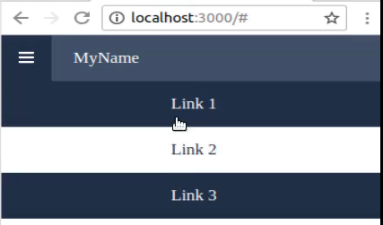

We have our fully responsive nav system set up if I double-click this and we switch to desktop mode. You can see that the navbar now looks completely different. 

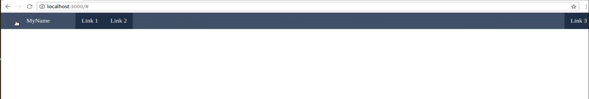

It hides the hamburger and then it has our links, if we shrink down to a smartphone size then we have this helpful drop-down. Now the last item that I want to do here is let's fix these fonts because these fonts are pretty ugly and I would hate to give you a navbar that looks like that. So let's switch over to [google fonts](https://fonts.google.com/) and specifically when I was researching this topic I found one font that I thought looked really nice. 

It's called oxygen and so you can click here on select this font 

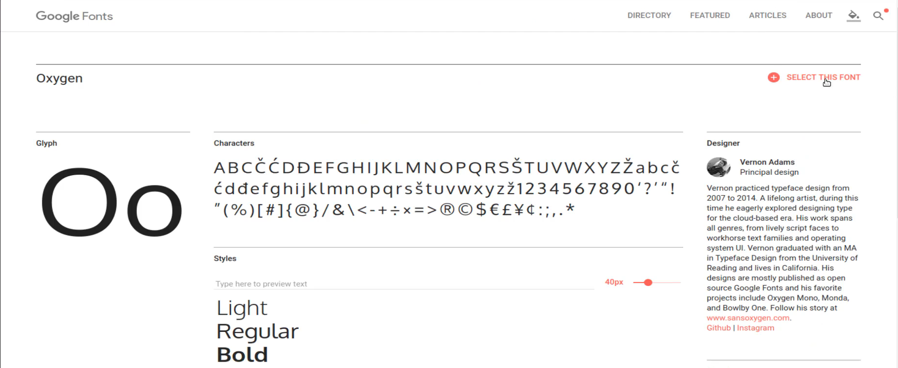

and then Google gives you all the instructions that you need in order to implement it so you can copy this little link importer.

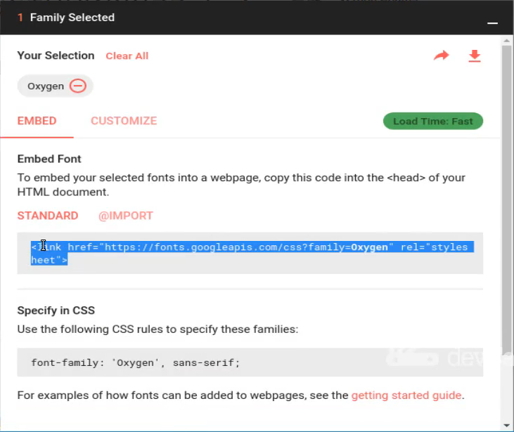

Come up to the top and just paste it right below what we have here with font awesome. And then inside of an HTML style definition you can just say that you want to have this font family. Let's click that copy it. 

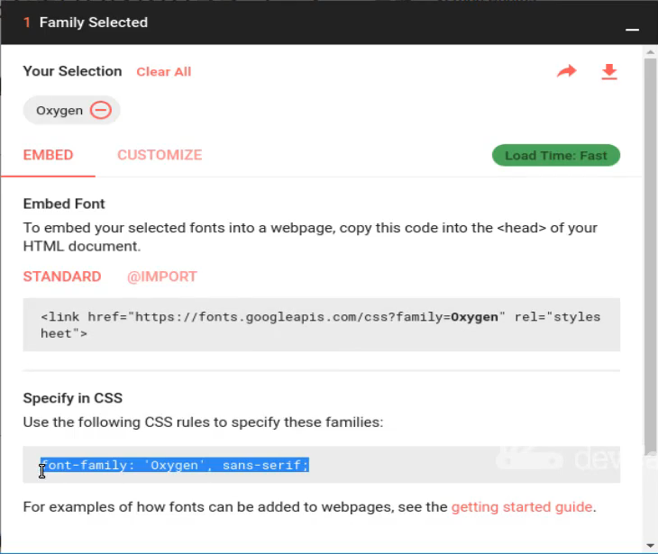

pasted in it hit save. 

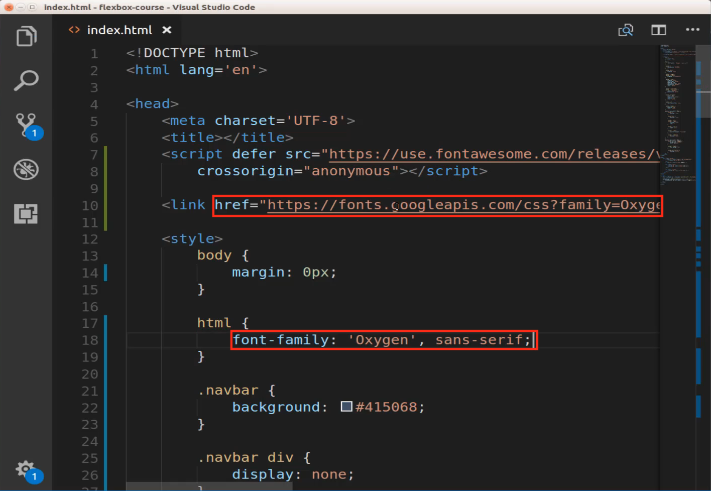

Now come back and look how much better those fonts look 

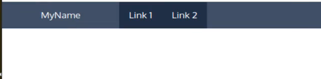

fonts and typefaces make such a huge difference in any kind of front end development. And now you can see that it looks much better this looks like a fully professional kind of navigation component. 

So great job if you went through that you now know how to build out a fully responsive navigation component in HTML, Flexbox, and JavaScript.


## Code

```html
<!DOCTYPE html>
<html lang='en'>

<head>
    <meta charset='UTF-8'>
    <title></title>

    <link href="https://fonts.googleapis.com/css?family=Oxygen" rel="stylesheet">
    <script defer src="https://use.fontawesome.com/releases/v5.0.8/js/all.js" integrity="sha384-SlE991lGASHoBfWbelyBPLsUlwY1GwNDJo3jSJO04KZ33K2bwfV9YBauFfnzvynJ"
        crossorigin="anonymous"></script>

    <style>
        html {
            font-family: 'Oxygen', sans-serif;
        }
        body {
            margin: 0px;
        }
        .navbar {
            background: #415068;
        }
        .navbar div {
            display: none;
        }
        .navbar .toggle,
        .navbar .brand {
            display: inline-block;
        }
        .navbar .link {
            display: block;
            text-align: center;
            padding: 1em;
            text-decoration: none;
            background: #223047;
            color: white;
        }
        .navbar .link:hover,
        .navbar .link:active {
            color: #223047;
            background: white;
        }
        .navbar .brand {
            width: 10em;
            text-align: center;
            padding: 1em;
            color: white;
        }
        .navbar a {
            text-decoration: none;
        }
        .navbar .toggle {
            padding: 1em;
            color: black;
        }
        @media (min-width: 48em) {
            .navbar {
                display: flex;
            }
            .navbar .left,
            .navbar .right {
                display: flex;
                flex: 1;
            }
            .navbar .link {
                width: auto;
            }
            .navbar .right {
                justify-content: flex-end;
            }
            .navbar .toggle {
                display: none;
            }
        }
        @media (min-width: 48em) {
            .navbar div {
                display: flex;
            }
        }
        @media (max-width: 48em) {
            .navbar.active .toggle {
                background: #223047;
                color: white;
            }
            .navbar .brand {
                text-align: left;
            }
            .navbar.active div {
                display: block;
            }
        }
    </style>
</head>

<body>
    <div class="navbar">
        <a href="#" class="toggle" id="navHamburger">
            <i class="fas fa-bars"></i>
        </a>
        <a href="#" class="brand">MyName</a>
        <div class="left">
            <a href="#" class="link">Link 1</a>
            <a href="#" class="link">Link 2</a>
        </div>
        <div class="right">
            <a href="#" class="link">Link 3</a>
        </div>
    </div>
</body>

<script>
    const navHamburger = document.querySelector('#navHamburger');
    navHamburger.addEventListener('click', (e) => {
        navHamburger.parentElement.classList.toggle('active');
    })
</script>

</html>
```
