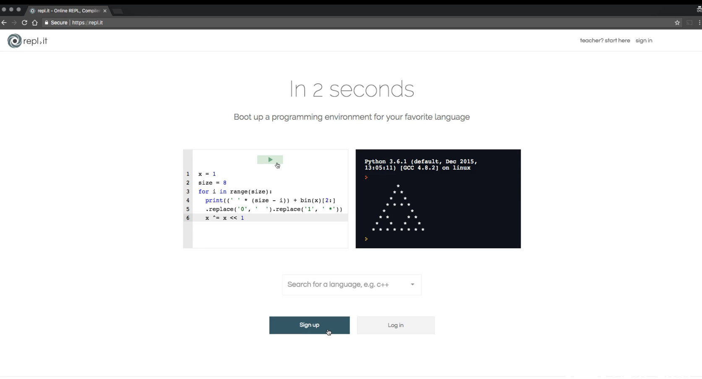
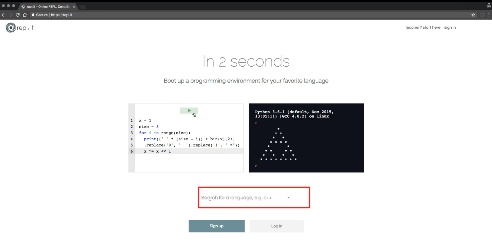
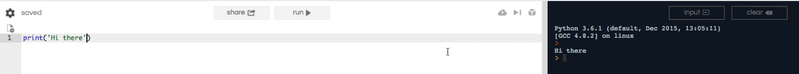

# 02-005:   How to Use Repl.it for Running Python in the Browser 

In the next few guides, we're going to talk about how you can do that on a practical basis and we're going to help set up your development environment. 

Now, I'm going to present you with a number of different options because of the variety of computers you may be using-- Mac, PC, a Linux device, or maybe you don’t want to set up an environment just yet. If you’re wanting to jump straight into the code, I will demonstrate an example for each one of those scenarios, so you can pick which is best for you. 

The first example is a cloud-based environment called [repl.it](https://repl.it/repls). To go to [repl.it](https://repl.it/repls), go to our repl.it which is also completely free to use. 

You can sign up for an account and get started right away. 

Click where shown below:

Here, it says “search for a language” and you can locate Python 3. I want you to sign up version 3, however, we will discuss the differences between the various Python versions. I already have an account and will not be creating a demonstration for this, but the process is fairly simple as well as free. 

You will notice as we go through this course, this is the development environment I will be using—especially in the early modules. This is because I want to provide you with the fastest path to writing code, but also because repl.it gives a screencast. If you have already been through the Ruby course, you will have already seen this tool. 

The main reason is, I can input code on the left and the output will be shown on the right-hand side. was because I can write code right here making everything easy to follow and organize.

To test to make sure it works, type a simple program. For example, I used print and inserted “hi there”. To run this small Python program, I can hit run or command and enter. On the right-hand side, you should see the output of “hi there”. 

This is the most basic and simple way to begin writing Python code. In the next few guides, I will show you have to install the Python system and run Python scripts on your local machines. 

