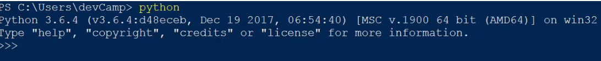
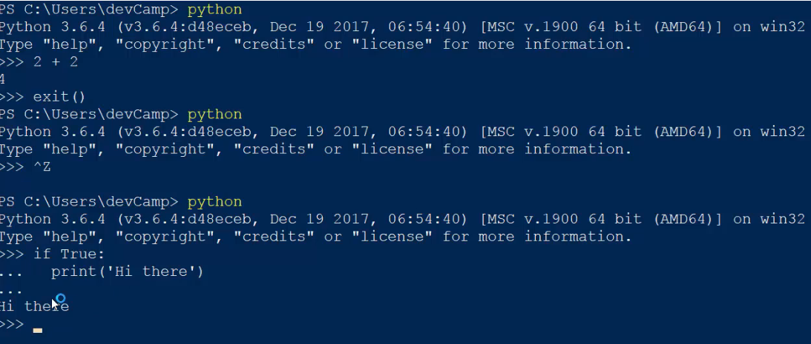
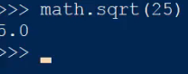
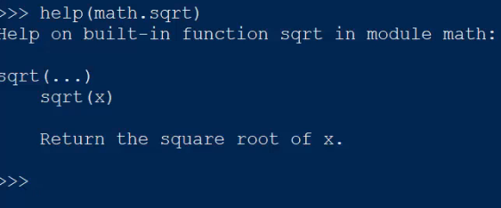

# 02-008:   Basic Usage Tips and Tricks for the Python Repl

Now, all the code that I am going to run will be completely identical whether you are on a PC with a command prompt or Windows Power Shell, or on a Mac. This guide is going to be all about the basic usage for the command prompt. Below is our Repl that gives us the ability to run code into a process Python code to see its output. and see its output. To start up our Repl session, type “Python” or if you're on Mac, type “Python 3”.



First, I will expose you to some of the things that are possible. Within this section, we have shown a number of print statements, but you can also process normal code such as run calculations. Anything that you would put in a file and run (like we will do later in the course and in the online Repl ID), you are able to do right here. Because I want you to pick out whatever you prefer, I showed you all the different versions and variations prior. 

To extend our knowledge beyond basic usage, we will see how to quit Repl. To do so, type in “(exit)”, and you will automatically be kicked out. However, if you are following along for the first time and haven’t exited a Python Repl before, you can also open it back up by typing control z then return. Now that we are back in, let’s walk through a few other examples to truly familiarize you with this Repl. 

However, if I want to do some type of conditional (we will go through the details of this code later), I can do a basic “if” statement and say: 

```
if True:
```

Then, I can hit return. Now, what I wanted you to notice is that the Repl allows you to have multiline line code. The way Python code appears, you can see our 3 angled brackets and 3 dots. This means that Python is expecting us to write even more code. To give you a preview of conditionals, add some spaces and “print ('Hi there')”. This will work because it’ll always be true. 

If I hit return twice, you can see it printed out as expected.  



This is the basic way to use multiline code inside of the command line interface. 

The next task to accomplish is importing other modules built into Python for necessary additional functionality. However, we will not go through all of them since there are way too many nor we will bring in third-party modules since they require a different package manager to install them. We will have a different section dedicated to this. 

Right now, I'm going to show you how to use a basic one, so when I do so in the course, it will not be brand new to you. First, type in the word “import”. For example, say “import math”. This will go into the Python code to go get the extra math library. If I hit return and don’t get an error, then it found the library, and we have access to it. 

For example, if I say `math.sqrt` and pass a number like 25 in parentheses code, I will get 5 from the math library’s square root function. 



This is how you import another library. 

The last thing I will demonstrate is the ability to get help. There are many times where I have questions about a function or I just want to know the documentation without googling. Thankfully, there is a help function built into the command line interface.

For example, if I say `help`, I can pass in whatever I need help on—let’s use `math.sqrt`. Hit return, and you can now see that it has brought up the square root documentation. 



This is a very basic function, so it is simple in what it returns. For this, it says this square function returns a square root of X. What this means is that I must call this function name then pass in a value. It will also describe what the behavior is going to do.

In review, we've walked through the basic usage for the command line interface also called the Repl. We have seen how we can run commands, multiline commands, import libraries inside of Python, and get help and additional documentation on functions.
