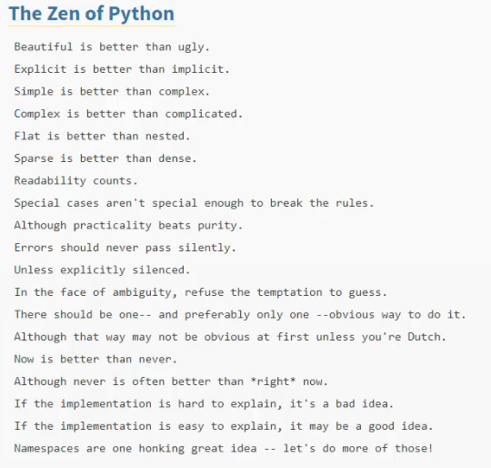

# 02-009:   Introduction to the Zen of Python (PEP 20)

Now, this is a [PEP](https://www.python.org/dev/peps/pep-0020/), an update to the documentation of programming language. This gives a multitude of guidelines that Python believes you should follow, making it impossible to go through every single one. 

However, there a few I will introduce you to since we will be referencing them later in the course when you begin building Python programs. These Zen items, instructions, and guidelines towards the best practices with the Python language will begin to make more sense as you go through the course. 

If you scroll down and you simply search for the Zen of Python, you'll see this full list:

Each line is an item and/or guideline starting with “beautiful is better than ugly” and ending with “namespaces are one honking great idea—let’s do more of those”. 

As I said, we cannot cover what each one of these represents since it is an abstract way of looking at the Python language as a whole. 

Nevertheless, these will be referenced later on throughout different examples of code. For now, just be aware of it. Also, there is an Easter Egg if you ever want to see the full set of guidelines once again. 

If you open up a Repl, say Python, then say “import this”, you can see the full Zen of Python with each one of the items. I will do my best to always follow these guidelines throughout the course, and the longer you build out Python programs, the more these are going to make sense. 
