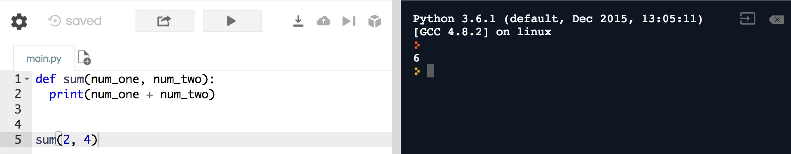
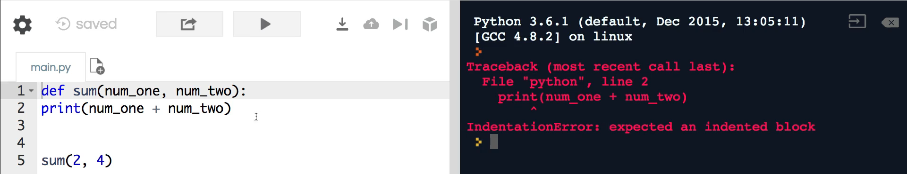
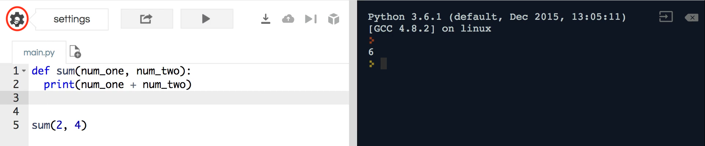
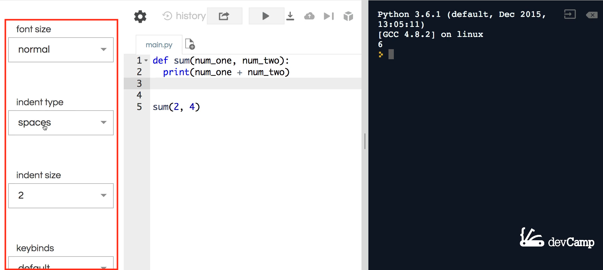
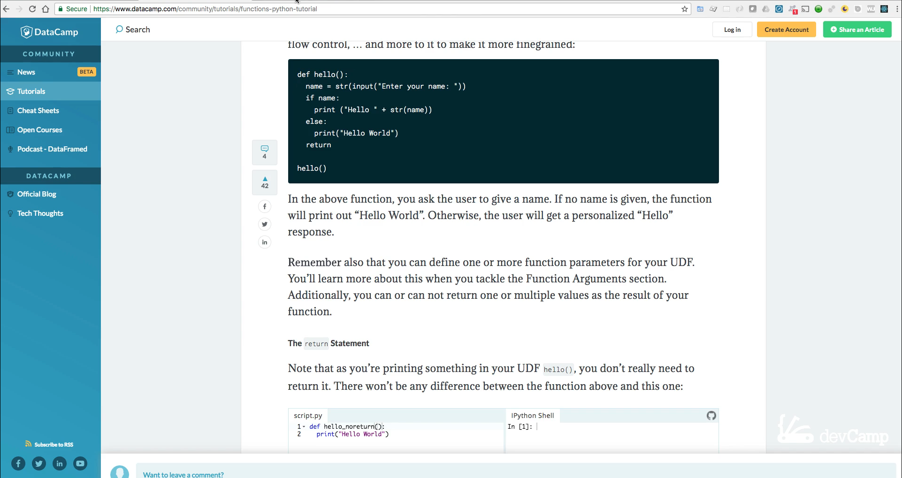
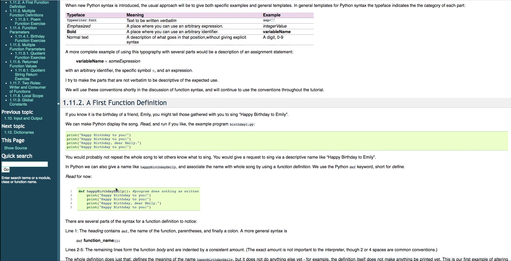
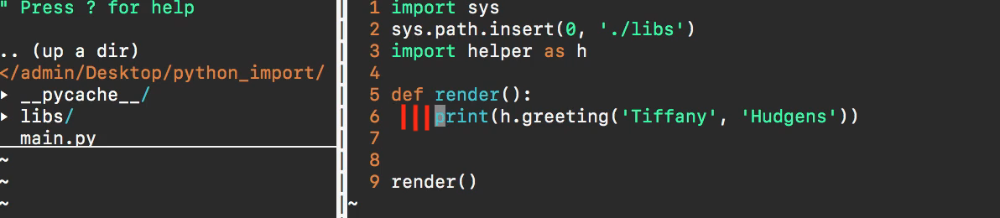
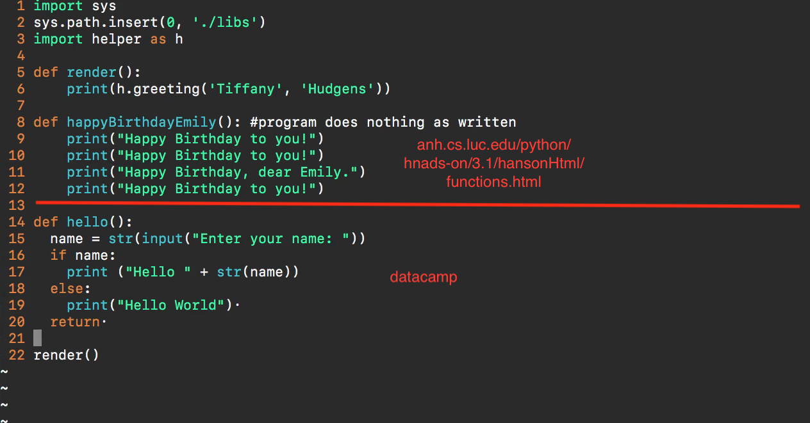

# 02-011:   Overview of Indentation in Python Programs

In order to fully demonstrate some concepts, we are going to have to use examples that include code that we have yet to learn such as functions and code blocks. Do not be intimidated or feel overwhelmed by syntax. 

Stay focused on the discussions on style and indentation because they will help you when we do enter into more advanced topics.

Here, I have a basic sum function which takes in a number 1 and number 2, then it prints out the sum of both of those numbers. So, if I run this by passing in 2 and 4 and I get 6, showing that it is working properly. 

On line 2, we have what is called a code block. This is where indentation is going to be used. This is important because if I don't use indentation, I will get an indentation error like in the example below where I had the print statement lined up right underneath the definition. 

It gives some helpful tips, such as saying it expected an indented block. This gives us a hint that we need to indent our code in order for it to work. Once I fix the bug and try again, it returns to working properly. 

We will explore indentation with more detail when entering the section on how functions work in Python, but this was simply a basic introduction. The next topics that I want to discuss are specifically about following the community recommendations, whether to use spaces or tabs and how many spaces to utilize when they are used. For example, in the large majority of the times, I am using [repl.it](https://repl.it/repls) throughout this course, then this will use two spaces by default. If you would like to change that, you can click on the settings icon. 

Here, you can change any of the settings that you want. 

This automatically converts tabs into spaces however, you could use tabs if you desire. I personally prefer spaces. You could also edit the indent size. I also set mine to two since I use repl.it for both Python and Ruby programming and those in the Ruby community typically use two spaces. This is a debate within the Python community, so you can choose what you prefer; two spaces is just my personal recommendation. 

In Python, you're going to see many individuals using two and others using four. Although there is still debate on which is the better practice, this popular online tool for data science, [data camp](https://www.datacamp.com/community/tutorials/functions-python-tutorial) utilizes two spaces in their code. 

If I go to a different site, http://anh.cs.luc.edu/python/hands-on/3.1/handsonHtml/functions.html, one of the key pieces of documentation you’ll run into often. When you're googling various concepts in Python, you can see others’ code blocks have four spaces.

 

All three code blocks will be looked at by the Python compiler and work perfectly fine from a pure coding perspective. The one that you will utilize will depend on your preferences and/or the team of developers in your organization. My personal preference for when I am working on my own projects is to have the local text editor set to four spaces. Your options are 1, 2, 3, or 4. 

My reasoning for doing this is because whenever I'm copying and pasting codes from web sites, tutorials, and code libraries, they tend to use four spaces. For example, if I copy the code from the website, http://anh.cs.luc.edu/python/hands-on/3.1/handsonHtml/functions.html, you can see the function I wrote maps out to this happy birthday function. If I copy this other example at [datacamp](https://www.datacamp.com/community/tutorials/functions-python-tutorial), you can see that it does not line up.

There isn’t any strict rule that you need to use from an indentation perspective, but I do recommend that you find what works best for you. If I take in code with different spaces, I would simply have to move it to four spaces afterward so it lines up with the rest of my program.

In review, this guide has discussed indentation, spaces versus tabs, and code blocks in Python.  

The last piece of advice is that I would highly recommend that you do not use tabs because it will transfer differently with every system. If you push your code up to a third-party repository such as GitHub, then your tabs may differ from developer to developer. Rather, decide between 2 and 4 spaces to avoid bugs. 

