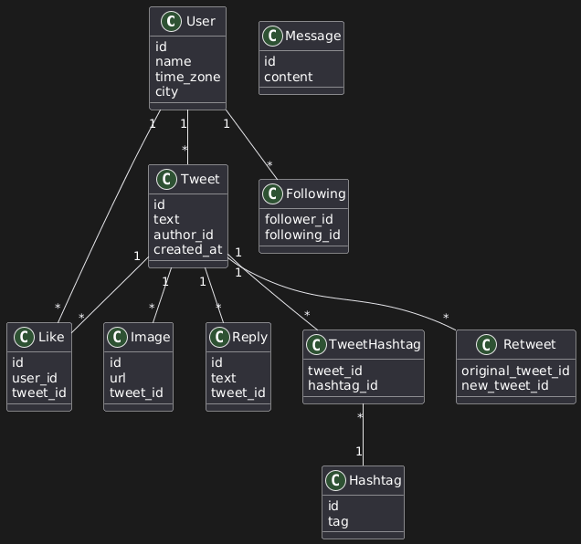
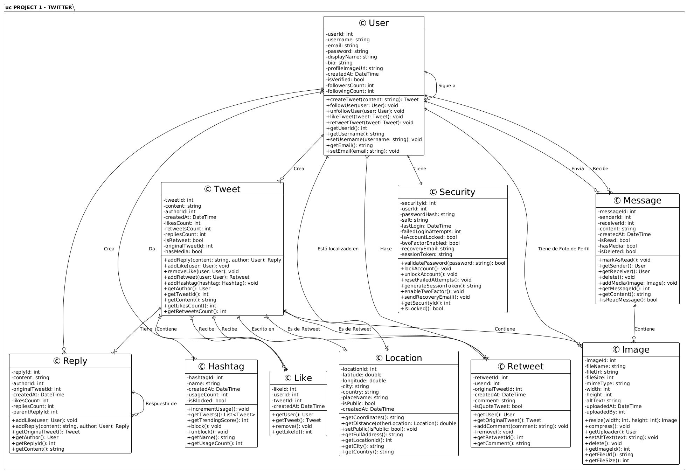
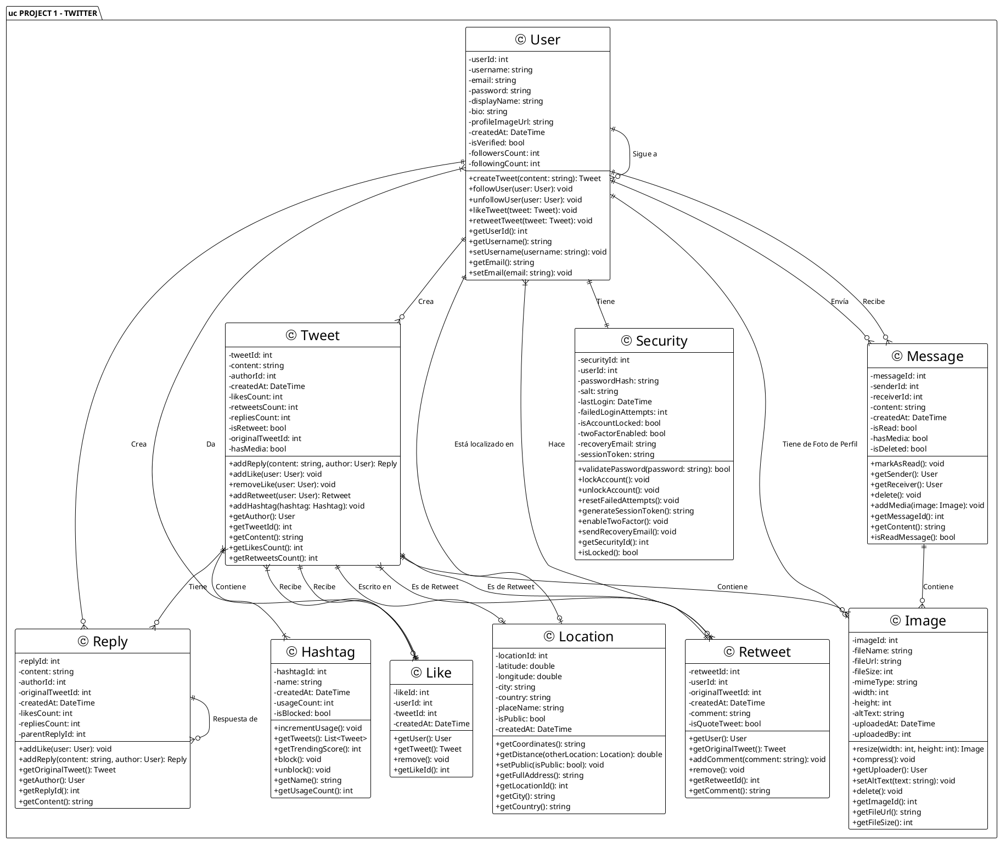

## B) Class Diagram



**Tweet Class (Central Entity)**

Attributes:

- `id`
- `text`
- `author_id` (reference to User)
- `retweeted` (boolean)
- `created_at` (timestamp)
- `like_count`
- `hashtag`

Operations:

- `new()`
- `create()`
- `edit()` (optional)

**Design Philosophy:** The instructor intentionally omits data types (text, varchar, int) unless they're custom types requiring explanation. This saves time and reduces clutter.

---

### **Critical Concept: Multiplicity**

**Example: Tweet → Like**

```
Tweet (1) ────→ (*) Like
```

**What this means:**

- One tweet can have many likes
- Each like belongs to one tweet
- **Database implication:** The `likes` table must have a `tweet_id` foreign key

**Why multiplicity is critical:** If multiplicity is incorrect, developers will build the wrong database structure and have to refactor later.

---

### **Join Tables (Many-to-Many Relationships)**

**Visual Convention:** Represented with dotted lines to distinguish from regular classes.

**Example: TweetHashtag**

```
Tweet (1) ····→ (*) TweetHashtag (*) ←···· (1) Hashtag
```

**Why dotted lines?**

- Visual distinction: Easy to identify join tables at a glance
- Functional distinction: Join tables have no operations, only IDs
- Dependency ordering: You cannot create `TweetHashtag` until both `Tweet` and `Hashtag` tables exist

**Navigability:** Join tables enable bidirectional queries:

- From Tweet: "Show me all hashtags for this tweet"
- From Hashtag: "Show me all tweets with this hashtag"

---

### **Self-Referential Tables**

**1. Retweet (Self-Referential Join Table)**

```
Retweet
─────────────
original_tweet_id
new_tweet_id
content (optional: for quote tweets)
```

**Concept:** A retweet IS a tweet. No separate class needed—just a reference to itself.

**Real-world example:** When you retweet a friend's post:

1. System creates new tweet record (your retweet)
2. `Retweet` table stores: `original_tweet_id` (friend's tweet) + `new_tweet_id` (your tweet)

---

**2. Following (Self-Referential for Users)**

```
Following
─────────────
follower_id (User A)
following_id (User B)
```

**Relationships:**

```
User (1) ────→ (*) Following (*) ←──── (1) User
```

**This enables:**

- "Show all users that John follows" (query `following_id` where `follower_id = John`)
- "Show all of Mary's followers" (query `follower_id` where `following_id = Mary`)
- **Generate feed:** Retrieve tweets from all users in John's `following_id` list

**Applications beyond social networks:**

- Notification systems
- Organisational hierarchies
- Any system requiring self-referential relationships

**Why it's critical:** Nearly every large-scale application needs this pattern somewhere. Understanding it thoroughly is essential.

---





