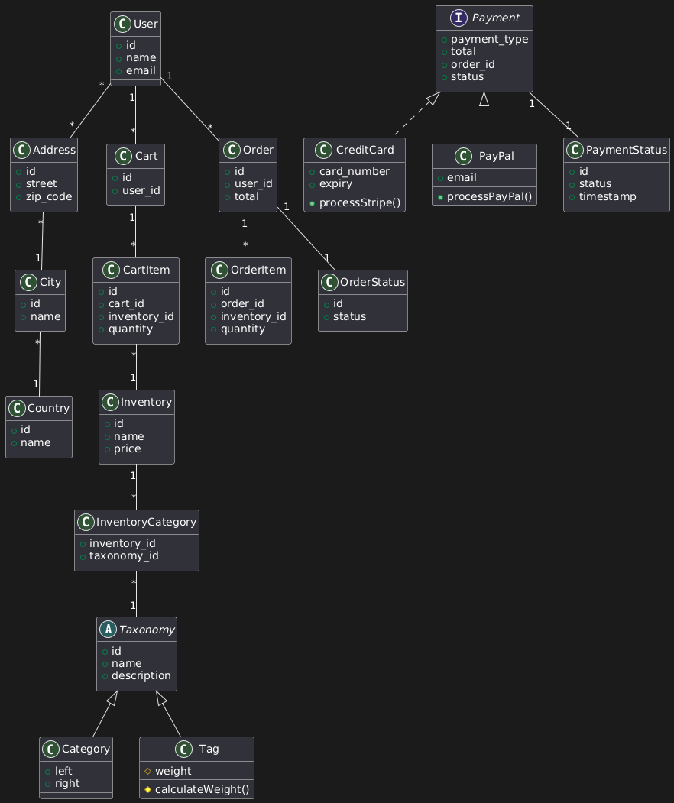

## B. CLASS DIAGRAM



### Overview

This is a larger, more complex class diagram than the Twitter project. The focus is on proper database normalisation and breaking tables into appropriate pieces for enterprise-level efficiency.

### Database Normalisation: The Address Example

**Why separate User, Address, City, Country?**

**The Problem with One Table:** If you store everything in the User table:

```
User
────────────
id
name
street
city
country
```

Issues:

1. No history of previous addresses
2. Cannot handle multiple shipping addresses
3. Typos in city/country names cause shipping failures
4. Data duplication (thousands of users in "London")

**The Solution: Normalised Structure**

```
User (1) ←→ (*) Address (*) ←→ (1) City (1) ←→ (1) Country
```

**Why many-to-many for User ↔ Address?**

Real-world scenario (using Amazon as example):

- User A lives at 123 Main St
- User A moves away
- User B moves into 123 Main St
- System should NOT say "address already taken"

Multiple users can legitimately share an address (families, roommates, office buildings). The system must accommodate this.

**Why separate City and Country tables?**

**Validation Benefits:**

- Prevent typos ("Lodnon" vs "London")
- Enable auto-complete functionality
- Zip code lookup can auto-populate city/country
- Shipments don't get returned due to address errors

**Data Integrity:** City and Country become **controlled vocabularies**. Users select from a list rather than free-form typing, dramatically reducing errors.

### Taxonomy: Abstract Classes and Inheritance

**The Setup:**

```
        Taxonomy (abstract)
              |
        ┌─────┴─────┐
        |           |
    Category       Tag
```

**What is Taxonomy?**

An **abstract class** that provides foundational rules for child classes but is never instantiated directly.

**Taxonomy attributes:**

- `id`
- `name`
- `description`

These are common to all children. You will never create a "Taxonomy" object—only Category and Tag objects.

**Category Example:**

- "South American Coffee Blends"
- "Organic Products"
- "Fair Trade"

Used for primary product organisation.

**Tag Example:**

- "Over 1 pound"
- "Under £10"
- "New Arrivals"

Used for secondary filtering and sorting.

**Why separate them?**

Both are taxonomies at a high level, but they serve different purposes and have different attributes. Category might have `left` and `right` values for nested set model. Tag might have `weight` for sorting priority.

**Visibility: Protected Attributes**

```
Tag
────────────
# weight
# calculateWeight()
```

The `#` symbol means **protected**:

- Tag class can access these
- Any class inheriting from Tag can access these
- External systems and objects CANNOT access these
- Different from `+` (public) and `-` (private)

### The Payment Architecture: Interface Pattern

**The Challenge:**

Users need two payment options:

1. Credit card (via Stripe/Authorize.Net)
2. PayPal

These are fundamentally different integrations with different APIs and different error handling.

**The Solution: Interface Pattern**

```
        Payment (interface)
              |
        ┌─────┴─────┐
        |           |
   CreditCard    PayPal
```

**Payment Interface Attributes:**

- `payment_type`
- `total`
- `order_id`
- `status`

**Why CreditCard and PayPal don't inherit from Payment:**

CreditCard is not a **type** of payment—it's a **payment source**. Same with PayPal. They **implement** the Payment interface rather than inherit from it.

**Benefits of This Architecture:**

**Separation of Concerns:**

- CreditCard class handles Stripe/Authorize.Net API
- PayPal class handles PayPal API
- They never interfere with each other

**Scalability:**

- Want to add Apple Pay? Create new class implementing Payment interface
- Want to add cryptocurrency? Same pattern
- Existing code doesn't break

**Maintainability:** If you merged both into one Payment module with if/else logic:

```
if payment_type == 'credit_card'
  # Stripe logic here
elsif payment_type == 'paypal'
  # PayPal logic here
end
```

This becomes unmaintainable quickly. Any change risks breaking both payment methods.

**The Separate Class Approach:**

```
class CreditCard implements Payment
  # All Stripe/Authorize.Net logic isolated here
end

class PayPal implements Payment
  # All PayPal logic isolated here
end
```

Changes to one don't affect the other. This is **loose coupling**—the goal of good architecture.

### PaymentStatus: Mission-Critical Security

**Why a separate class?**

```
PaymentStatus
─────────────
id
status
timestamp
order_id
```

**Financial Transaction Security:**

You must track payment status meticulously. Holes in your system could allow:

- Declined cards still receiving shipments
- Double-charging users
- Orders shipping without payment confirmation

**The Status Workflow:**

```
pending → processing → completed
                     → failed → retry
                              → cancelled
```

Every state change must be logged. Every transition must be validated. This class wraps all that critical functionality in one auditable place.

### Parts and MaintenanceParts: Scalability Example

**The Question:** Why separate `Part` and `MaintenancePart`?

**The Short-term View:** Technically, you could connect `Part` directly to `ServiceList`. It would work.

**The Long-term Problem:** Coffee shop does well. Expands services. Now needs to track:

- Maintenance parts (current system)
- Inventory parts (for sale to customers)
- Wholesale parts (for B2B clients)

If `MaintenancePart` is your only option, you'd have to:

1. Create `InventoryPart`
2. Create `WholesalePart`
3. Refactor all existing code

**The Scalable Solution:**

```
Part (generic)
  └─ MaintenancePart (specific)
  └─ InventoryPart (future)
  └─ WholesalePart (future)
```

Separation now prevents massive refactoring later.

**Key Principle:** In enterprise applications, assume success and plan for growth. Structure your database so adding features doesn't require rebuilding foundations.
