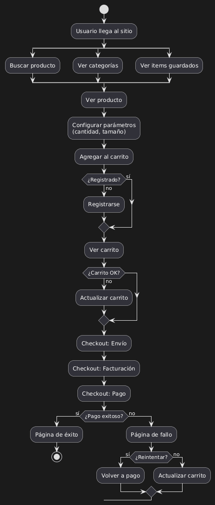

## A. ACTIVITY DIAGRAM



### Overview

This diagram models the complete shopping and checkout process, with multiple decision points that reflect real-world scenarios where users don't follow the perfect path.

### Starting Point

The user arrives at the application. From here, three immediate branches are possible:

1. Search for a product
2. Browse categories
3. View previously saved cart items

**Note:** A fourth option (selecting featured products on homepage) could be added, but the solution focuses on core functionality.

### Flow Breakdown

**Search Path:**

```
Search for product → Found? 
  └─ Yes → View product page
  └─ No → Browse categories → Select product → View product page
```

**Category Path:**

```
Browse categories → Select product → View product page
```

**Saved Items Path:**

```
View saved cart items → Directly to cart page
```

### Product Interaction

Once at the product page:

```
Set product parameters (size, quantity, colour, etc.)
  ↓
Add to cart
  ↓
Check: Is user registered?
  ├─ No → Registration page → View cart
  └─ Yes → View cart
```

**Design Decision:** Registration is required before proceeding to cart. This is a business logic choice—some sites allow guest checkout, but this model requires registration.

### Cart Management

```
View cart
  ↓
Is cart OK?
  ├─ No → Update cart → Checkout
  └─ Yes → Checkout
```

**What "cart OK" means:**

- Correct quantities
- All desired items present
- Prices acceptable
- No items removed due to stock issues

### Checkout Process

The checkout stage may occur on one page or multiple pages (depends on UX design):

```
Checkout: Enter shipping information
  ↓
Checkout: Enter billing information
  ↓
Checkout: Choose payment type
  ↓
Process payment
  ↓
Payment successful?
  ├─ Yes → Payment success page → END
  └─ No → Payment failure page
           ↓
           Try again?
           ├─ Yes → Return to "Choose payment type"
           └─ No → Update cart (remove items, try different products)
```

### Critical Decision Points

**1. Product Search Validation** If product not found, don't dead-end the user—redirect to categories.

**2. Registration Gate** User must be registered to proceed. This prevents abandoned carts from anonymous users and enables order tracking.

**3. Cart Validation** Give users opportunity to review and modify before committing to purchase.

**4. Payment Failure Handling** **Most Important:** When payment fails, users need two options:

- Retry with different payment method
- Go back and modify cart (perhaps remove expensive items)

Never leave users stranded at a failed payment screen with no clear path forward.

### Why This Matters

This activity diagram could take pages of written requirements to explain. With the visual diagram, a developer can immediately see:

- What pages need to be built
- What validation checks are required
- What error handling must be implemented
- Where users can loop back or exit the flow

Real-world application: This same pattern applies to any workflow with validation steps—expense approval systems, document review processes, multi-stage applications.

---
