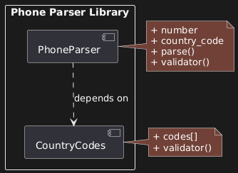

## A. PACKAGE DIAGRAM



### Overview

This diagram represents the high-level organisation of the phone parser Ruby gem. It's intentionally simple—only two modules—to provide a clear case study you can reference for future projects.

### The Two Modules

**1. PhoneParser (Main Module)**

Responsibilities:

- Accept phone number input
- Clean the input (remove symbols)
- Coordinate validation
- Return parsed result

Key methods:

- `parse(number, country_code: '1')`
- `digit_length_validator(number)`

**2. CountryCodes (Helper Module)**

Responsibilities:

- Store valid country codes
- Validate country codes
- Provide country code lookup

Key methods:

- `country_code_validator(number, country_code)`

### The Critical Dependency

```
PhoneParser -----> CountryCodes
   (depends on)
```

**Represented by:** Dotted line with arrow pointing from PhoneParser to CountryCodes

**What This Means:**

**PhoneParser cannot function alone.** It requires CountryCodes to perform validation. Looking at the actual code:

```ruby
require "phone_parser/country_codes"

module PhoneParser
  def self.parse(number, country_code: '1')
    # ... cleaning logic ...
    CountryCodes.country_code_validator(number, country_code)
  end
end
```

The `require` statement and the method call prove the dependency.

**CountryCodes CAN function alone.** It's a self-contained helper library that doesn't call PhoneParser. You could extract it and use it in a completely different application.

### Why Dependencies Matter

**Visualising System Constraints:**

When you see this diagram, you immediately know:

- You cannot test PhoneParser without CountryCodes present
- Deployment must include both modules
- Changes to CountryCodes interface could break PhoneParser

**Planning for Changes:**

Imagine adding 10 new features to the phone parser. Without this diagram:

- You might accidentally remove the CountryCodes dependency
- You might break the connection between modules
- In a 100-module system, tracking dependencies becomes impossible

With the diagram:

- Clear checklist of what depends on what
- Safety check: "If I modify PhoneParser, does it still properly use CountryCodes?"
- Documentation for other developers

**The Most Critical Part:** In large systems, understanding dependencies is often more important than understanding individual module functionality.

### Frame Notation

The solution uses a frame labelled `pkg` (short for package) to immediately identify this as a package diagram. Anyone reviewing the diagram instantly knows what type of UML they're looking at.

### Level of Detail

Notice what's NOT included:

- Exact parameter types
- Full method signatures
- Implementation details
- Class internals

This is intentional. Package diagrams are about **organisation**, not **implementation**. Save the details for class diagrams and sequence diagrams.

### When to Use Package Diagrams

**Ideal Scenarios:**

1. **First thing you do** before writing any code
2. Building a code library (gem, npm package, etc.)
3. Unclear about architecture—need to brainstorm
4. Showing high-level structure to non-technical stakeholders
5. Planning potential migration from monolith to microservices

**The Ruby Gem Use Case:**

This pattern is perfect for gems because:

- Gems are self-contained modules
- Dependencies must be explicit
- Other developers need to understand structure quickly
- Documentation requires high-level overview

**The Java Connection:**

Java has "packages" built into the language—groups of related classes. Package diagrams originated from Java developers needing to visualise these groupings. The concept proved so useful it became a standard UML diagram type.
