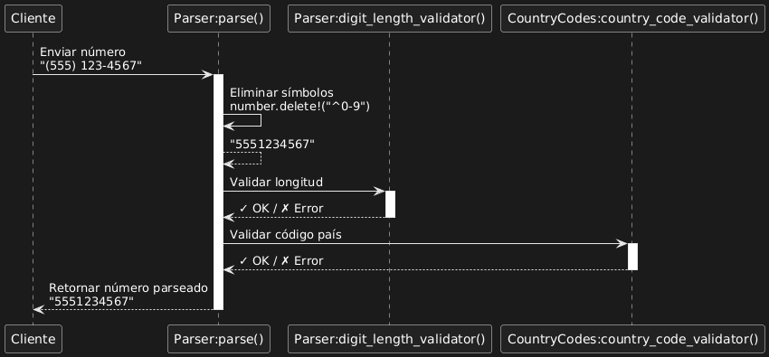

## B. SEQUENCE DIAGRAM



### Overview

This diagram shows the complete message flow through the phone parser library, from initial input to final output.

### The Participants

**1. Client/User**

- External caller of the library
- Provides the phone number string
- Receives the parsed result

**2. Parser:parse()**

- Main entry point
- Orchestrates the entire process
- Calls validators
- Returns final result

**3. Parser:digit_length_validator()**

- Validates number has sufficient digits
- Returns OK or raises error

**4. CountryCodes:country_code_validator()**

- Validates country code is legitimate
- Returns OK or raises error

### Message Flow Breakdown

**Step 1: Initial Input**

```
Client → Parser:parse()
  Message: "(555) 123-4567"
```

The client passes in a raw phone number string. Could include:

- Parentheses: `(555)`
- Dots: `555.123.4567`
- Dashes: `555-123-4567`
- Spaces: `555 123 4567`

**Step 2: Self-Referential Cleaning**

```
Parser:parse() → Parser:parse()
  Message: "Delete all non-numeric characters"
  Result: "5551234567"
```

**Self-referential message:** The parser communicates with itself. This is visualised by an arrow that leaves the participant and comes back to the same participant.

The cleaning logic:

```ruby
number.delete!("^0-9")
```

Removes everything except digits. This is an internal operation—no other module involved.

**Step 3: Length Validation Request**

```
Parser:parse() → Parser:digit_length_validator()
  Message: "5551234567" (solid line - request)
```

The main parser sends the cleaned string to the validation method.

```
Parser:digit_length_validator() → Parser:parse()
  Response: ✓ OK or ✗ Error (dotted line - response)
```

**Solid vs Dotted Lines:**

- **Solid line (→):** Sending a message/request
- **Dotted line (--→):** Receiving a response

This visual distinction is critical. At a glance, you can see:

- Which direction messages flow
- What's a request vs a response
- The conversation pattern between components

**The Validation Logic:**

```ruby
def self.digit_length_validator(number)
  number.length < 10 ? (raise PhoneLengthError) : (number)
end
```

If fewer than 10 digits, raise error. Otherwise, return the number.

**Step 4: Country Code Validation**

```
Parser:parse() → CountryCodes:country_code_validator()
  Message: ("5551234567", "1")
  Response: ✓ OK or ✗ Error
```

This crosses module boundaries. Parser is now communicating with a completely different module.

The validator checks if "1" (or whatever country code provided) exists in its lookup table of valid country codes.

**Step 5: Return to Client**

```
Parser:parse() → Client
  Response: "5551234567" (cleaned, validated phone number)
```

If all validations pass, return the cleaned phone number. If any validation fails, an error is raised and propagates back to the client.

### Lifelines Explained

The dotted vertical lines extending from each participant represent their **lifeline**—they exist throughout the entire sequence.

**Purpose:**

- Visual reference for where messages should connect
- Shows the "lifespan" of each participant in this interaction
- Helps align messages chronally

**Why Dotted?**
To distinguish them from other elements:

- Action lines (solid)
- Activation bars (vertical rectangles)
- Message arrows

### Activation Bars

The vertical bars on the lifelines show when a participant is **actively processing**.

When you see a bar on `Parser:digit_length_validator()`, that participant is:

- Receiving a message
- Executing logic
- Preparing a response

When the bar ends, processing is complete.

### Why This Level of Detail Matters

**For Developers:**

Looking at this sequence diagram, a developer immediately understands:

1. Entry point is `parse()` method
2. First action is cleaning (self-referential)
3. Two validations must occur in sequence
4. Each validation can fail
5. External dependency on CountryCodes module

**For Testing:**

This diagram is essentially a test specification:

- Test 1: Does parse() correctly clean symbols?
- Test 2: Does digit_length_validator() reject <10 digits?
- Test 3: Does digit_length_validator() accept ≥10 digits?
- Test 4: Does country_code_validator() reject invalid codes?
- Test 5: Does country_code_validator() accept valid codes?
- Test 6: Does the full flow return correct result?

**For Debugging:**

When something breaks, this diagram tells you:

- Where in the sequence the failure occurred
- What messages were being passed
- Which participant was responsible

### Small System, Big Lessons

This is intentionally a small, simple system. The goal isn't to overwhelm you with complexity—it's to provide a clear reference for:

- How to structure sequence diagrams
- How messages flow between participants
- How to show self-referential operations
- How to distinguish requests from responses

In a real-world application, you might have:

- 10+ participants
- 50+ messages
- Multiple loops and conditional branches

But the fundamental patterns remain the same. Master them here, apply them everywhere.

---

## KEY TAKEAWAYS

### Package Diagram

**Dependencies Are Everything:**

The single most important aspect of a package diagram is showing **what depends on what**. In this project:

- PhoneParser depends on CountryCodes
- This is non-negotiable for functionality
- Any changes must preserve this relationship

**High-Level Thinking:**

Package diagrams force you to think about:

- Module organisation
- Separation of concerns
- Which components can be reused
- What can live independently vs what needs other modules

**First, Not Last:**

Create package diagrams **before writing code**. They're your whiteboarding session, your brainstorming tool. Once you start coding, it's too late—you're already locked into an architecture.

### Sequence Diagram

**Input/Output Clarity:**

The fundamental principle: if you can reduce a component to "this is my input, this is my output," you can build it. Sequence diagrams force this clarity.

**Message Passing is Everything:**

Modern software is about communication between components. Sequence diagrams visualise:

- Who talks to whom
- What information is exchanged
- In what order
- What responses are expected

**Self-Referential Operations:**

Don't forget: components can (and often do) perform internal operations. These self-referential messages are just as important as cross-component communication.

### Universal Principles

**Visualisation Prevents Problems:**

Both diagrams prevent common mistakes:

- Accidentally removing dependencies
- Forgetting validation steps
- Unclear responsibility boundaries
- Poor separation of concerns

**Documentation for Future You:**

In six months, when you need to modify this library:

- Package diagram: "Oh right, I can't change PhoneParser without considering CountryCodes"
- Sequence diagram: "Ah, the cleaning happens before validation, not after"

**Patterns Are Transferable:**

This Ruby gem example teaches patterns applicable to:

- npm packages
- Python modules
- Java libraries
- Any encapsulated, reusable code

The language changes. The architectural principles don't.
