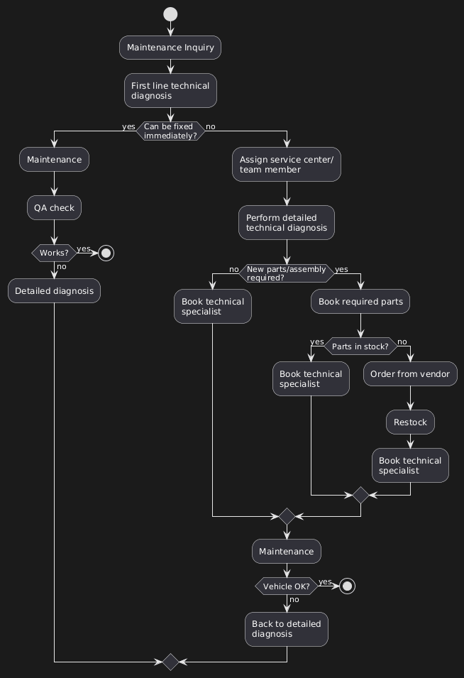

## A. ACTIVITY DIAGRAM



### Overview

This diagram tracks the complete maintenance process, from initial inquiry through to completion. The focus is on visualising branching logic—what happens when expectations aren't met.

### The Fundamental Principle

**Most Important:** Activity diagrams aren't about the "happy path" where everything works perfectly. The complexity comes from modelling what happens when one or multiple things don't go right.

If everything works perfectly, the diagram would be trivial:

```
Maintenance inquiry → Technical diagnosis → Maintenance → Done
```

But reality is messy. That's what we're modelling.

### Flow Breakdown

**1. Starting Point: Maintenance Inquiry**

A truck driver reports: "Something might be wrong with my truck" or it's simply time for regular maintenance (oil change, new brakes, etc.).

**2. First Line Technical Diagnosis**

Initial review process. An admin or system user sees all the data and performs a high-level check.

This isn't detailed—it's a triage:

- Can we fix this immediately?
- Do we need parts?
- Is this a major issue or minor?

**3. First Decision: Can it be fixed immediately?**

```
Can fix immediately?
  ├─ YES → Maintenance → QA Check → Done
  └─ NO → Continue to detailed process
```

**The Easy Path:** If it's a quick fix (loose bolt, simple adjustment), send directly to maintenance, verify everything works, and complete.

**Reality:** This rarely happens. Most issues require the detailed process.

**4. Assign Service Center/Team Member**

Common activity in many systems:

- Workflow management systems
- Expense approval processes
- Document review systems
- Any multi-stage process with role assignment

**5. Detailed Technical Diagnosis**

Different from "first line diagnosis." This is thorough:

- Full inspection
- Diagnostic tools
- Detailed notes
- Assessment of all potential issues

The level of detail you build into the diagram should match the level of functionality needed in the codebase.

**6. Critical Decision: New Parts or Assembly Required?**

```
Parts/Assembly needed?
  ├─ NO → Book technical specialist
  └─ YES → Book required parts
            ↓
       Parts in stock?
       ├─ YES → Book technical specialist
       └─ NO → Order from vendor
                ↓
           Restock → Book technical specialist
```

This is where the activity diagram connects to the package diagram. The system must check inventory (Parts module) and potentially interact with external vendors (Partners module).

**7. Book Technical Specialist**

All paths converge here. Whether parts were needed or not, we now need a specialist to perform the work.

**8. Perform Maintenance**

The actual repair/service work.

**9. Final Validation: Vehicle OK?**

```
Vehicle OK?
  ├─ YES → END
  └─ NO → Loop back to Detailed Technical Diagnosis
```

**Critical Loop:** If the maintenance didn't solve the problem, we don't just give up. Loop back and start the detailed diagnosis again.

This loop represents:

- Misdiagnosis
- Additional problems discovered
- Parts that didn't solve the issue
- Need for different approach

### Why This Structure Matters

**Real-World Patterns:**

This exact pattern appears in:

- **Expense Systems:** Employee submits → Approval check → Approved/Denied/More info needed
- **Document Review:** Submit → Initial review → Detailed review → Accepted/Revisions needed
- **Support Tickets:** Create → Triage → Assign → Resolve → Verify/Reopen

The maintenance workflow is a template for countless business processes.

**Building from Diagrams:**

A developer receiving this diagram would know to build:

- Forms for maintenance inquiry
- Role-based access (who can perform diagnosis vs maintenance)
- Parts inventory system
- Vendor ordering system
- Specialist scheduling system
- QA verification system
- Loop-back logic for failures

All from one visual diagram.
