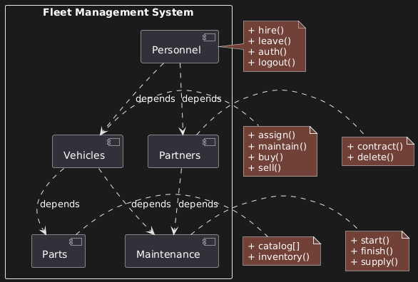

## B. PACKAGE DIAGRAM



### Overview

Five modules comprise the fleet management system. The most important element: showing dependencies.

### The Five Modules

**1. Personnel**

Tracks drivers, admins, technicians, etc.

Operations:

- `hire()`
- `leave()`
- `auth()` (authentication)
- `logout()`

May include users who never log into the system (truck drivers who don't need system access).

**2. Vehicles**

The fleet itself.

Operations:

- `assign()` (assign vehicle to driver)
- `maintain()` (schedule maintenance)
- `buy()` (acquire new vehicles)
- `sell()` (dispose of vehicles)

The buy/sell operations were critical in the original system—knowing purchase price dictated maintenance budget decisions.

**3. Parts**

Catalogue of available parts.

Operations:

- `catalog[]` (list all parts)
- `inventory()` (check stock levels)

This is relatively straightforward—directly translates to a database table with methods.

**4. Maintenance**

The entire maintenance workflow.

Operations:

- `start()` (begin maintenance process)
- `finish()` (complete maintenance)
- `supply()` (manage supply chain)

This is NOT just a database table. It's a mini-application:

- Multiple classes
- Helper methods
- Workflow logic (as seen in activity diagram)
- Complex business rules

**5. Partners**

External vendors and suppliers.

Operations:

- `contract()` (add new vendor)
- `delete()` (remove vendor)

Provides information to Personnel (who can add/delete contracts) and to Maintenance (parts availability, ordering).

### The Dependency Map

```
Personnel ──→ Partners
Personnel ──→ Vehicles

Vehicles ──→ Parts
Vehicles ──→ Maintenance

Partners ──→ Maintenance
```

**Why These Dependencies?**

**Personnel → Partners:** Only users (in Personnel) can add or delete vendor contracts. Partners provides data, but Personnel controls access.

**Personnel → Vehicles:** Users interact with vehicles. Could be designed differently (authentication as separate app), but in this system, it's a direct dependency.

**Vehicles → Parts:** Vehicles need the parts catalogue. "Needs access to" = dependency. When maintaining a vehicle, you must know what parts are available.

**Vehicles → Maintenance:** Maintenance processes are tied to specific vehicles.

**Partners → Maintenance:** Partners provide parts availability data. This connects to the activity diagram: when checking if parts are in stock, the system queries Partners.

### Critical Insights

**Dependency ≠ Just "Don't Delete":**

Dependencies also represent **access levels**. Personnel can access Vehicles, but Vehicles doesn't access Personnel directly. It's a one-way relationship.

**Could Be Different:**

If Personnel were a standalone authentication app serving multiple systems (fleet management + asset management + others), it wouldn't depend on Vehicles. It would be completely independent.

In this design, Personnel is tightly coupled to the fleet management system, so dependencies exist.

**Parts vs Maintenance:**

Both look similar in the diagram, but they're fundamentally different:

- **Parts:** Simple database class. CRUD operations. Straightforward.
- **Maintenance:** Complex subsystem. Multiple classes. Workflow engine. Business logic. Almost its own application.

This is why package diagrams are **abstract**—they don't reveal implementation details. That comes in class diagrams.

### The Evolution Reality

**This is a First Draft:**

The instructor explicitly states: the actual built system is much larger and different. This diagram was the initial planning, not the final architecture.

**No One Gets It Perfect First Time:**

Package diagrams are for brainstorming and organisation. You'll discover missing components as you build. You'll realise some modules need splitting. Some need combining.

The point isn't perfection—it's getting a **head start**. Structure your thinking before code locks you into an architecture.
