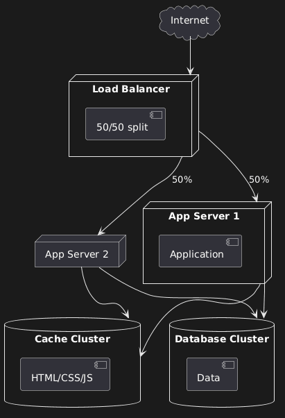

## C. DEPLOYMENT DIAGRAM



### Overview

This diagram models the physical infrastructure for an enterprise fleet management system, including redundancy, caching, and load balancing.

### The Architecture

```
              Internet
                 ↓
          Load Balancer
           (50/50 split)
          ↙            ↘
    App Server 1    App Server 2
          ↓                ↓
          └────────┬───────┘
                   ↓
          ┌────────┴────────┐
          ↓                 ↓
    Cache Cluster    Database Cluster
```

### Load Balancer: Traffic Distribution

**Concept:** 50/50 split means alternating requests between servers.

**Flow:**

- User A visits site → Load balancer sends to Server 1
- User B visits site → Load balancer sends to Server 2
- User C visits site → Load balancer sends to Server 1
- And so on...

**Benefits:**

**1. Balance the Load:** Don't overburden one server whilst another sits idle. Distribute traffic evenly.

**2. Redundancy:** If App Server 1 crashes, Server 2 handles all requests. System stays online.

**Configuration:** Load balancers perform health checks:

- Ping servers regularly
- If a server doesn't respond, route traffic elsewhere
- When server comes back online, add it back to rotation

This is basic implementation. More sophisticated setups use:

- Weighted distribution (70/30 if one server is more powerful)
- Geographic routing (send EU users to EU servers)
- Load-based routing (send to least busy server)

### Cache Cluster: Performance Optimisation

**What Gets Cached:**

- CSS stylesheets
- JavaScript files
- HTML templates
- Images
- Static assets

**What Doesn't Change Regularly:**

These files might update weekly, daily, or even less frequently. Loading them from cache is dramatically faster than regenerating them for every request.

**The Process:**

1. User requests page
2. System checks cache: "Do I have this CSS file?"
3. If yes: Serve from cache (milliseconds)
4. If no: Generate/fetch file, store in cache, serve to user

**Cache Expiration:**

When you deploy updates:

- Push new CSS to server
- Force cache expiration
- Next request fetches new version
- New version gets cached

**Third-Party Services:**

Common providers:

- Cloudflare
- Amazon AWS CloudFront
- Fastly

These services cache your assets geographically close to users. A user in Australia gets assets from an Australian cache server, not from your UK-based origin server.

### Database Cluster: Data Management

**Why Separate from Cache?**

**The Key Difference:** Cache is for data that doesn't change often. Database is for data that changes constantly.

**Example: Maintenance Status**

User wants to check maintenance request status:

- If cached: Shows old status, even if technician just updated it
- If from database: Shows current status, updated in real-time

**What Goes in Database:**

- User accounts
- Maintenance records
- Parts inventory (changes as parts are used)
- Vehicle information
- Service histories

**Data Caching Considerations:**

You CAN cache some database queries:

- "List of all vehicle makes" (changes rarely)
- "Company locations" (static data)
- "Service types offered" (mostly stable)

But be selective. Always ask: "How often does this change? How important is real-time accuracy?"

**Database Clustering:**

Multiple database servers working together:

- Master handles writes
- Replicas handle reads
- Automatic failover if master goes down
- Geographic distribution for global systems

### How It All Works Together

**Request Flow:**

1. User visits site
2. Load balancer routes to App Server 1
3. App Server 1 needs CSS: checks Cache Cluster → gets cached file
4. App Server 1 needs maintenance data: queries Database Cluster → gets current data
5. Response combines cached assets (fast) + live data (current)
6. User sees up-to-date page, loaded quickly

**Why This Architecture?**

**Scalability:** Add more app servers as traffic grows **Reliability:** Multiple points of redundancy **Performance:** Caching reduces database load **Maintainability:** Can update one server whilst others stay online
