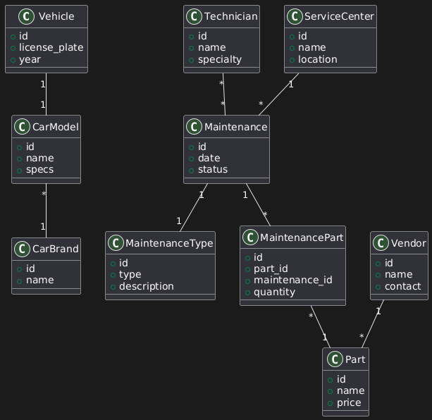

## D. CLASS DIAGRAM



### Overview

This is a CRUD-based application (Create, Read, Update, Delete). The focus is on breaking tables into appropriate pieces for enterprise efficiency.

### The Normalisation Example: Parts

**The Question:** Why separate `Part` and `MaintenancePart`?

**Could Be Combined:**

Technically, `MaintenancePart` is a type of `Part`. You could use inheritance:

```
Part
  └─ MaintenancePart (inherits from Part)
```

Or you could just have one `Part` table.

**The Scalability Argument:**

Fleet management does well. Expands services. Now the company wants to track:

- Maintenance parts (current)
- **Inventory parts** (parts for sale to customers)
- **Wholesale parts** (B2B client orders)

If you only have `MaintenancePart`:

1. Create `InventoryPart` class
2. Create `WholesalePart` class
3. Refactor all existing code that assumed only maintenance parts existed

**The Better Design:**

```
Part (generic/shared)
  ├─ MaintenancePart (specific)
  ├─ InventoryPart (future)
  └─ WholesalePart (future)
```

Separation now prevents massive refactoring later. This is **planning for success**.

**Could Connect Directly:**

Could you connect `Part` directly to `ServiceList`? Yes, technically. But when you need to add inventory parts, you're stuck. Future-proofing requires separation.

### One-to-One Relationships

**The Vehicle → CarModel Relationship:**

```
Vehicle (1) ←→ (1) CarModel
```

**Benefits:**

**Direct Navigability:**

```ruby
vehicle.car_model
```

Simple, clean, efficient. One vehicle has exactly one model.

**Common Misconception:**

Many developers assume every relationship must be:

- One-to-many (1:*)
- Many-to-many (*:*)

**Reality:** One-to-one relationships are common and powerful. They clean up your codebase by simplifying object communication.

**When to Use One-to-One:**

- Vehicle has one Model
- User has one Profile
- Order has one ShippingAddress (at time of order)
- Invoice has one PaymentMethod

Not everything needs multiplicity. Sometimes the relationship is simple and direct.

### The Complete Picture

**Main Entities:**

**Vehicles:**

- Vehicle, CarModel, CarBrand
- ProductionFacility, Dealer

**Personnel:**

- Technician, Role

**Maintenance:**

- Maintenance, MaintenanceType
- ServiceCenter, Service, ServiceList

**Parts:**

- MaintenancePart, Part
- Vendor, Assembly

**Relationships to Consider:**

- Technician hasMany Maintenance jobs
- Maintenance belongsTo MaintenanceType
- ServiceCenter hasMany Maintenance records
- Vendor supplies many Parts
- Parts used in many ServiceLists (many-to-many)

The diagram doesn't have surprising complexity—it's a well-structured CRUD application. The lesson is in the **proper separation** of concerns and **planning for scale**.
