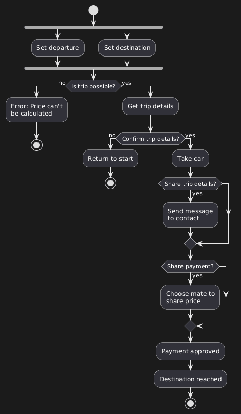

## A. ACTIVITY DIAGRAM



### Flow Structure

**Start:** Car ordered

**Initial Branch (without "?"):** This is NOT a decision—it's multiple inputs converging.

- Set departure (geolocation)
- Set destination (typed address)

Both inputs merge into the next step.

**First Validation:**

```
Is trip possible?
  ├─ NO → Error: Price can't be calculated → END
  └─ YES → Get trip details (price, drivers, ETA)
```

Example failure: NYC to Australia = impossible.

**User Confirmation:**

```
Confirm trip details?
  ├─ NO → Return to start
  └─ YES → Take car
```

**Optional Features:**

```
Share trip details?
  ├─ YES → Send message to contact
  └─ NO → Continue

Share payment?
  ├─ YES → Choose mate to share price
  └─ NO → Continue
```

**End:** Payment approved → Destination reached

### Key Concepts

**Branch without "?":** Represents multiple inputs, not a decision. UML mechanism for showing several flows converging into one activity.

**Validation Points:** Each "?" represents a potential failure or user choice that changes the flow.

**Optional vs Required:** Trip validation is required. Sharing features are optional but enhance UX.
