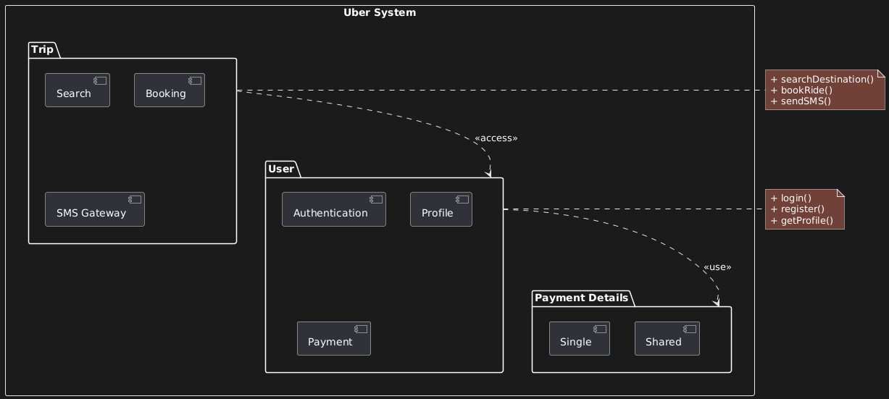

## B. PACKAGE DIAGRAM



### Module Structure

**User Module**

- Authentication (login/security)
- Profile (user data, ratings, history)
- Payment
  - Single payment
  - Shared payment

**Trip Module**

- SMS Gateway (imported library)
- Search (destinations, addresses)
- Booking (ride management)

### Dependencies

```
User ──<<use>>──→ Authentication
User ──<<use>>──→ Payment
Trip ──<<access>>──→ User
```

**Critical Distinction:**

**`<<use>>`:** Deep dependency. User NEEDS Authentication to function. Strong coupling.

**`<<access>>`:** Light dependency. Trip only needs to read User data (who's logged in). Weak coupling.

**`<<import>>`:** Third-party library (SMS Gateway). Not built by you, just imported.

### Nesting Rules

Payment module contains Single and Shared. These are NOT directly accessible from User—only through Payment interface.

**Why?** Encapsulation. User interacts with Payment abstraction, not specific implementations.
