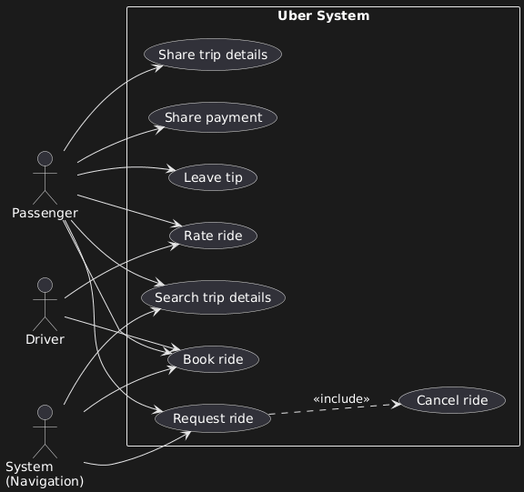

## C. USE CASE DIAGRAM



### Actor Capabilities

**Passenger (full access):**

- Search for trip details
- Request a ride
- Book a ride
- Share trip details
- Share payment
- Rate the ride
- Leave a tip

**Driver (limited):**

- Book a ride (accept passenger request)
- Rate the ride

**System (automated):**

- Process geospatial searches
- Manage ride requests
- Update navigation in real-time

### Special Relationships

**Cancel a ride:**

```
Request a ride ──<<include>>──→ Cancel a ride
```

Cannot cancel what doesn't exist. Cancel depends on Request being active. Once booked, cancellation is no longer available.

**System interactions:**

- Search → Geospatial engine
- Request → Navigation component
- Book → Live tracking

### Authorization vs Authentication

- **Authentication:** Login securely (who you are)
- **Authorization:** What you can do (permissions/features)

Use Case diagrams define **authorization**, not authentication.
