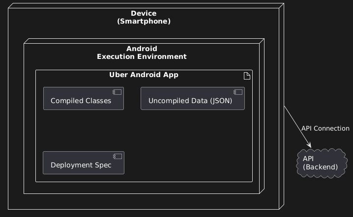

## D. DEPLOYMENT DIAGRAM



### Android App Architecture

```
Device (Smartphone)
  └─ Execution Environment: Android (Java)
      └─ Uber Android App
          ├─ Compiled: Java code
          ├─ Uncompiled: JSON data from API
          └─ Deployment Specification: versions, changelogs
              ↓
         API Connection (CRITICAL)
              ↓
          Backend API
```

### Key Components

**Device:** Physical smartphone hardware.

**Execution Environment:**

- Android uses Java
- iOS uses Swift/Objective-C
- Completely different → require separate diagrams

**Compiled vs Uncompiled:**

- **Compiled:** Java code, processed before execution
- **Uncompiled:** JSON data from API, dynamic, not compiled

**Deployment Specification:**

- Version numbers
- Change logs
- Deployment checklist
- NOT code implementation

### Why Android ≠ iOS

**Languages:**

- Android: Java
- iOS: Swift/Objective-C

**Deployment Speed:**

- Android (Google Play): Updates live in minutes
- iOS (App Store): Updates take days (manual review)

**Architecture:** Completely different environments requiring separate deployment diagrams.

### The Critical Dependency

**App CANNOT function without API.** Every search, every booking, every piece of data requires API communication.

No API = no app. This dependency is non-negotiable and must be clearly shown.
