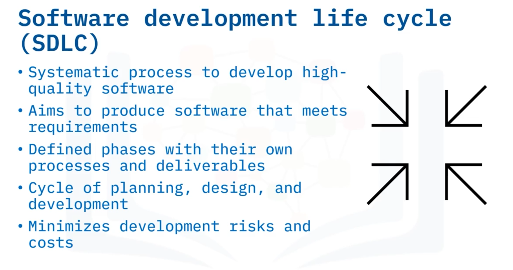
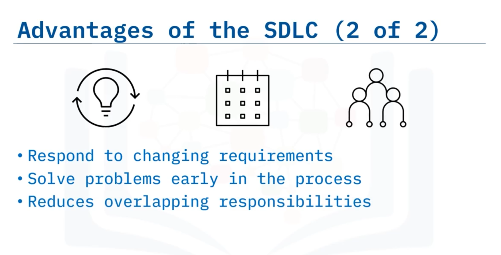

# 01-005: SDLC Introduction

## Theory

**Software Development Life Cycle (SDLC)** is a systematic process to develop high-quality software in a predictable timeframe and budget, with the goal of producing software that meets a client's business requirements.

### Definition and Structure

The SDLC defines phases of the software development process, each encompassing its own process and deliverables. It functions as a cycle of planning, design, and development that can be implemented as an iterative approach.

Adherence to the SDLC minimises risks and costs whilst producing deployable software.

### Historical Development

The SDLC emerged in the **mid-1960s** as software development's growing complexity necessitated a more detailed, systematic approach.

Large corporations needed to manage complex business systems requiring substantial computational resources.

Initially, it employed the **"waterfall method"**—a linear pattern through discrete stages. The SDLC has since evolved to adopt more **iterative methods** in response to evolving customer needs and shifting requirements.

### Advantages of the SDLC

 

1. **Process Roadmap**: Provides development teams with a structured approach rather than ad hoc methods, improving efficiency and reducing risks
2. **Well-Defined Phases**: Each phase is clearly defined, enabling team members to understand their responsibilities and timelines
3. **Enhanced Communication**: Facilitates dialogue between customers, stakeholders, and the development team; provides an overview of the entire process
4. **Clear Deliverables and Transitions**: Discrete phases allow cross-domain teams to understand task completion and progression to subsequent phases
5. **Iterative Capability**: Allows the process to circle back and incorporate additional requirements at cycle end
6. **Early Problem-Solving**: Issues are addressed during the design phase rather than during coding, ensuring timely resolution
7. **Defined Roles**: Each team member has well-defined responsibilities, reducing conflict and overlapping duties

***

***

## Video Lesson

Welcome to the introduction to the **software development life cycle**. After this lesson, you will be able to **describe what the software development life cycle is, explain its history**, and **discuss some key advantages** of using it.

The **Software Development Life Cycle**, known as the **SDLC**, is a **systematic process to develop high-quality software** in a **predictable timeframe and budget**. The **goal** of the SDLC is to **produce software that meets a client's business requirements**. The SDLC **defines phases** of the software development process that **encompass their own process and deliverables**. It is a **cycle of planning, design, and development** that can be implemented as an **iterative approach** to software development. **Adherence to the SDLC** minimises **risks and costs** to the development of high-quality, deployable software.

The software development life cycle began to take shape in the **mid-1960s** as software development began to necessitate a **more detailed approach** because of its **growing complexity**. The SDLC led to a **more deliberate approach** as large corporations needed to **manage complex business systems** requiring heavy computational resources. In its initial conception, it used what is called the **"waterfall method"** to manage projects where the **development of software follows a linear pattern** through **discrete stages**. The SDLC has since been adapted, however, to **more iterative methods** in response to **addressing customer needs and shifting requirements**. Waterfall and other approaches to software development will be discussed in another lesson.

There are some **key advantages** for businesses in following the SDLC. The first advantage is that it **gives development teams a process to follow** rather than using an **ad hoc approach** to improve efficiency and reduce risks.

Secondly, there are **discrete phases** to the SDLC. Each phase is **well defined** so that **team members know what they should be working on and when**. The phases of the SDLC will be discussed in another lesson. Because of the **well-defined phases**, it **facilitates communication** between the customer, other stakeholders, and the development team. The SDLC **offers an overview** of the process, so **stakeholders know where they fit** in to that process. Also, since each phase is **discrete**, cross-domain teams know **when they have completed their tasks** and **when development can move to the next phase**.

The SDLC **provides room for iteration** where, at the **end of a cycle**, the process can **circle back to incorporate additional requirements** as needed.

**Problem solving** is **incorporated early** in the cycle so **problems are addressed** in a **timely fashion** and can be **addressed in the design phase** rather than **during coding**. Finally, each **team member** has a **well-defined role** which **reduces conflict** and **overlapping responsi****bilities**.

In this lesson you learned that the **SDLC** provides a **systematic process** for software development. Its initial development in the **60s and 70s** was driven by the need for a **systematic approach** because of the **growing complexity** of software. **Key advantages** of the SDLC include: A **roadmap** to the software development process, helping to **reduce risk and improve efficiency**, **Increased communication** between the team and stakeholders, **Clearly defined and understood responsibilities** for each team member, and **The ability to be used iteratively**, allowing for **changing requirements**.
