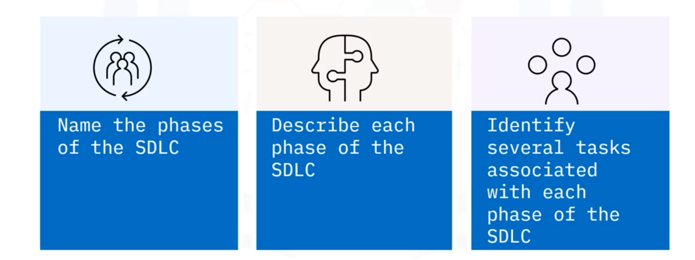
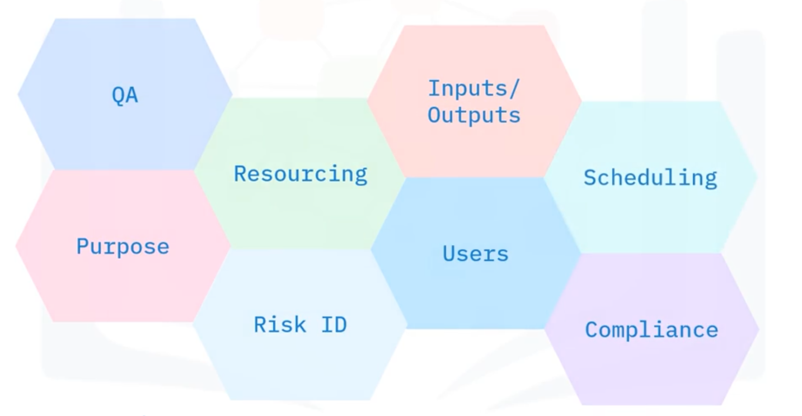
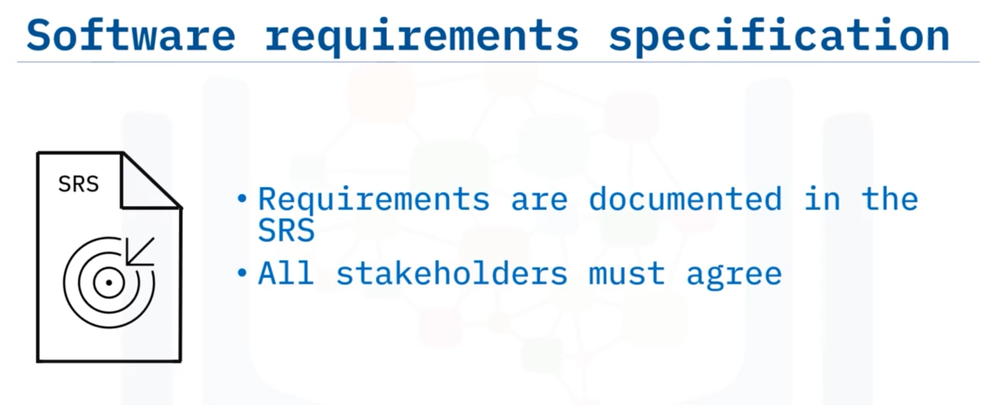

# 01-006: SDLC Phases

***

The SDLC generally comprises **SIX distinct phases**:

1. **Planning**
2. **Design**
3. **Development**
4. **Testing**
5. **Deployment**
6. **Maintenance**

Each phase is discrete, meaning tasks do not overlap between consecutive phases, though modern iterative approaches allow requirements to shift and be accommodated throughout the cycle.

Some organisations use different phase names (e.g., "requirements," "strategy," "analysis" instead of "planning") or have additional/fewer stages.

***

### Phase 1: Planning

Requirements are gathered, analysed, documented, and prioritised.

Key considerations might include:

* Identifying users
* Defining the solution's purpose
* Specifying data inputs/outputs
* Eensuring legal/regulatory compliance
* Identifying risks
* Establishing quality assurance requirements, allocating resources, and scheduling the project

**SRS DOCUMENT**: A **Software Requirements Specification (SRS)** document, approved by all stakeholders, and estimated labour, material costs, and team assignments. 

**Prototypes** may be developed to clarify requirements—small-scale replicas used for stakeholder feedback and testing basic design ideas. 

***

### Phase 2: Design

The SRS Requirements inform the development of software architecture.

Multiple team members collaborate to design the architecture, which is reviewed by stakeholders and the development team. Prototypes may be designed as preliminary mock-ups for demonstration.

**Deliverable**: A **DESIGN DOCUMENTS** used by developers in the subsequent development phase.

***

### Phase 3: Development

Also called the "building" or "implementation" phase, developers begin coding based on the design document.

Project planners assign coding tasks, and the phase typically involves programming tools, multiple languages, software stacks, and organisational standards or guidelines.

### Phase 4: Testing

Once coding is complete, the code undergoes thorough testing to ensure stability, security, and compliance with SRS requirements.

Testings may be manual, automated, or hybrid.

Common testing levels includes:

* Unit testing
* Integration testing
* System testing
* Acceptance testing.

**Process**: Product bugs are reported, tracked, and fixed; code is retested iteratively until stability is achieved.

***

### Phase 5: Deployment

The application is released into the production environment and made available to users.

This may occur in stages: first to a **User Acceptance Testing (UAT)** platform, then to production following customer sign-off.

Releases can be distributed via websites, mobile app stores, or corporate software servers.

***

### Phase 6: Maintenance

After deployment, this phase identifies any remaining bugs, user interface (UI) issues, and unaddressed requirements.

Code enhancements are identified. High-priority bugs are fixed immediately; others may be incorporated into future software releases, potentially initiating another development cycle.

***

## Video Lesson

Welcome to the **Phases of the Software Development Life Cycle**. After watching this video, you will be able to **name the phases involved in the SDLC, describe each phase**, and **identify several tasks associated with each phase**.

There are generally **six phases** in the SDLC process: **planning, design, development, testing, deployment, and maintenance**. Each phase is **discrete** meaning that **tasks from a previous phase do not overlap** with tasks in the next phase. The original SDLC was conceived as a **traditional waterfall method** where the **phases are linear**, but have since been **adapted to introduce iteration** so that **shifting requirements** can be accommodated. Waterfall and other approaches to software development will be discussed in another video.

Note that **some organisations may have different names** for each stage. For example, **"planning"** may be called **"requirements"** or **"strategy"** or **"analysis"**. Also, some organisations may have **additional or fewer stages**.

In the first stage of the SDLC, the **planning phase**, **requirements are gathered, analysed, documented and prioritised**. When planning a software solution, the following factors must be considered: **users** of the solution, the **overall purpose** of the solution, **data inputs and outputs**, **legal and regulatory compliance**, **risk identification**, **quality assurance requirements**, **allocation of human and financial resources**, and **project scheduling**.

As part of the planning process, **labour and material costs** are estimated and weighed against **time constraints**. Also, **project teams are identified**, and **roles of each team member are proposed**. If stakeholders are struggling to define requirements, often the **development team may produce prototypes** during the planning stage to **tease out those requirements**.

A **prototype** is a **small-scale replica** of the end product used to **get stakeholder feedback** and **establish requirements**. A prototype is used to **test basic design ideas**. Though prototyping usually occurs during the planning stage, **prototyping can occur at various phases** of the SDLC **whenever requirements need to be reconsidered or clarified** as the project develops.

After requirements have been gathered, they are combined into a document called a **software requirements specification, or SRS, document**. The **SRS needs to be clearly understood and approved** by all stakeholders. The **developers are also involved** at this stage so they can **gain a clear understanding** of these requirements. Requirements and the SRS will be discussed in more detail in a later video.

In the **design phase**, the requirements gathered from the SRS are used to **develop the software architecture**. **Several team members work together** at this stage to **design the architecture**. The architecture is **reviewed** by the stakeholders and team. And during this phase, **prototypes can be designed**. A prototype is a **preliminary mock-up** of the system, or parts of the system, used for **demonstration purposes**. The document created in this phase is called a **design document**, and is used by developers during the next phase, which is the **development phase**.

The **development phase**, sometimes called the **"building" phase** or the **"implementation" phase**, is when the **developers start the coding process** once the **design document is completed**. The project planners use the design document to **determine and assign coding tasks**. This phase often requires the use of **programming tools, different programming languages, and software stacks**. Organisations may also have **standards or guidelines** that need to be followed.

The **testing phase** is next in the process **once the coding is complete**. And some large projects have **dedicated testing teams**. **Code needs to be thoroughly tested** to ensure it is **stable, secure, and meets the requirements** outlined in the SRS. **Testing can be manual, automated, or a hybrid** of both.

**Product bugs are reported, tracked, and fixed**, and **code is retested** until the software is stable. Some common levels of testing include **unit testing, integration testing, system testing, and acceptance testing**. Each of these testing levels will be described in further detail in another video.

The **deployment phase** is where the **application is released into the production environment** and **made available to users**. This can also happen in **stages**— first, it is **released onto a user acceptance testing, also called UAT, platform** and **once the customer signs off** on the functionality, it is **released to production**. This approach can be used for making software available on a **website, mobile device app store, or a software distribution server** on a corporate network.

Finally, the **maintenance phase** happens **once the code has been deployed** into a production environment. This phase **helps to find any other bugs, identify user interface issues, or UI for short, and identify other requirements** that may not have been listed in the SRS. **Code enhancements** can also be identified at this stage. If **bugs are discovered** in this phase that were **missed during testing**, these errors may need to be **fixed for high-priority issues** or **incorporated into the requirements** as part of a **future software release** and the process can start over again.

In this video, you learned that the **SDLC** can be divided into **six phases**. **Planning** involves **requirement gathering and development** of the **SRS**. The **architecture** is developed during the **design phase** and the **design document** is created. The **Development phase** is when **coding takes place**, and then during the **testing phase** issues with the code are **found and fixed** if possible.

**Deployment** is when the code is **released to the production environment**. And finally, in the **maintenance stage** **feedback is collected** from stakeholders, other **UI issues** may be identified, and **code enhancements suggested**. And this information then can be **fed into another software development cycle** if necessary.
