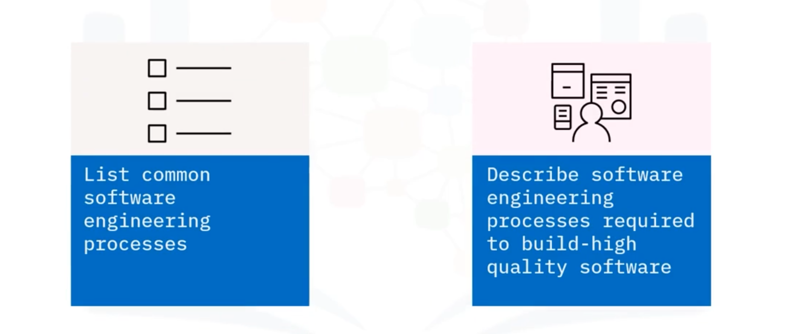
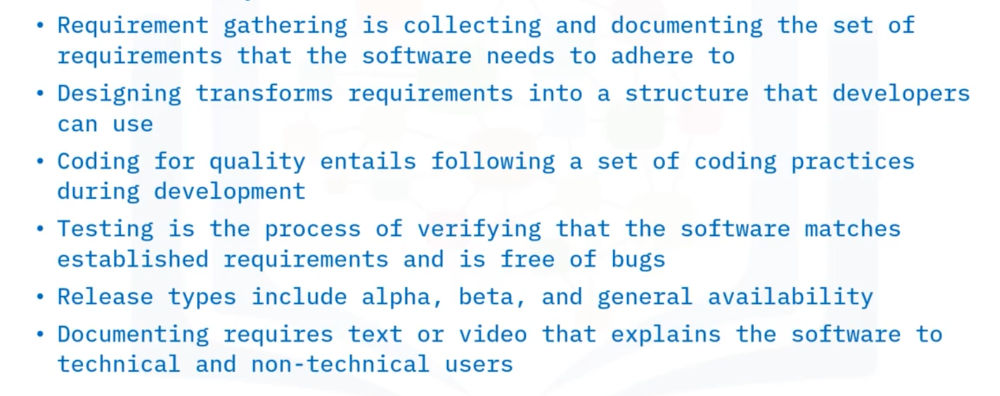
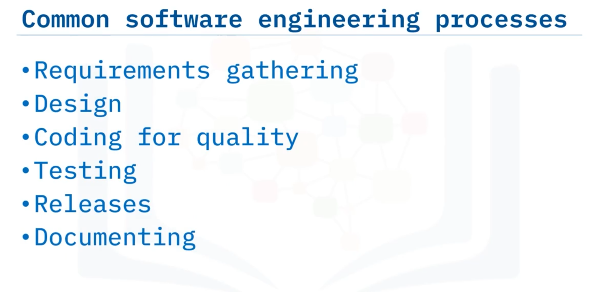
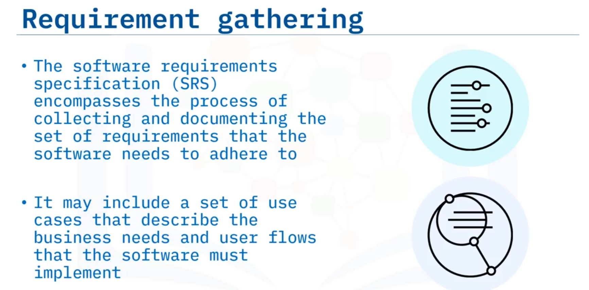
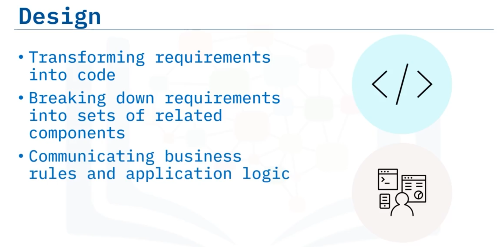
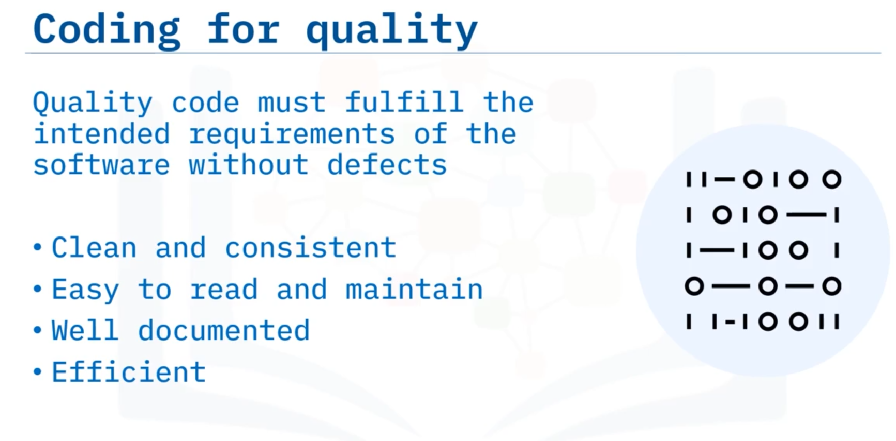
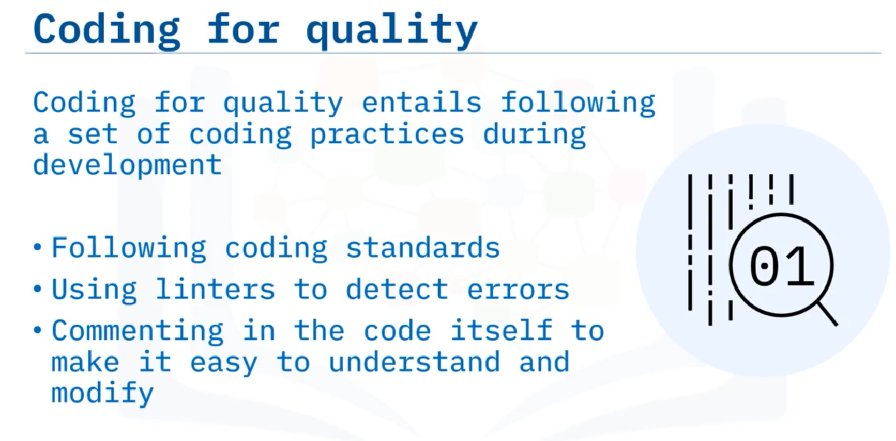
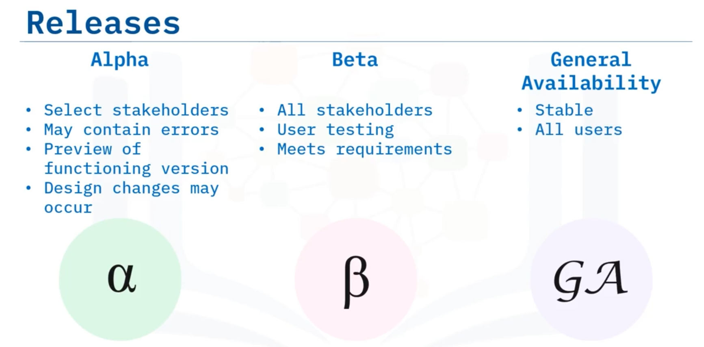

# 01-007: SDLC - Building Quality Software (QA)

Building high-quality software requires adherence to **SIX common software engineering processes**: 

1.  Requirements gathering
2.  Design
3.  Coding for Quality
4.  Testing
5.  Releasing
6.  Documenting

---

### 1.  Requirements Gathering (SRS) Stage

The **Software Requirements Specification (SRS)** encompasses collecting and documenting the set of requirements the software must adhere to.  

It may include use cases describing business needs and user flows.  

Software requirements are classified into four broad categories: 

1.  **Functional**
2.  **External and User Interface (UI)**
3.  **System Features**
4.  **Non-Functional**

---

### 2.  Design Stage

Software design transforms requirements into an implementable structure, translating them into a language developers can use.  

The technical lead breaks down requirements into related components with clearly defined behaviours, boundaries, and interactions, defining the system architecture.   

Design incorporates guidance on system functions, performance, security, platform characteristics, business rules, application logic, **API (Application Programming Interface)** design, user interfaces, and database design.

---

### 3.  Code Quality Stage

**Code quality** encompasses attributes including maintainability, readability, testability, and security.  

Quality code must fulfil intended requirements without defects, be clean and consistent, easy to read and maintain, well documented, and efficient.  

**Coding for quality** involves following coding standards, conventions, patterns and styles; using **linters** (automated tools) to detect programmatic and stylistic errors; and including code comments for clarity, etc.

---

### 4.  Testing Stage

Software testing verifies that code matches established requirements and is free of bugs, identifying errors, gaps, or missing requirements. Properly tested software ensures reliability, security, performance, and efficiency.

#### **Testing Levels**

- **Unit testing** (smallest isolated code component, often developer-performed)

- **Integration** (testing integrated components)

- **System** (full product testing)

- **User acceptance** (UAT/beta testing by intended end users)

#### **Testing Categories** 

1. **Functional**
2.  **Non-functional**
3.  **Regression testing**

---

### 5.  Release Stage

Software distributions are called "releases," intended for different audiences:

- **Alpha**: First functioning version released to select stakeholders; likely contains errors, may lack full feature set, design changes possible

- **Beta** (Limited Release): Released to external stakeholders; tests software under real conditions, identifies outstanding bugs, meets all functional requirements

- **GA** (General Availability): Released to all users; stable, tested version following beta refinements

---

### 6.  Documentation Stage

Software documentation serves both technical and non-technical users.

- **System Documentation** (Technical Users): README files, inline comments, architecture and design documents, verification information, maintenance guides

- **User Documentation** (Non-Technical End-Users): User guides, instructional lessons and manuals, online help, inline help

---

## Lesson Speech

Welcome to **Building Quality Software**. After this lesson, you will be able to: **list common software engineering processes and describe the common software engineering processes required for building high quality software**.

There are **numerous processes** that are common to software engineering projects. In this lesson we will discuss **six of them: requirements gathering, design, coding for quality, testing, releases, and documenting**.

The **software requirements specification, or SRS**, encompasses the **process of collecting and documenting** the **set of requirements** that the software needs to adhere to. It may include a **set of use cases** that describe the **business needs and user flows** that the software must implement. **Software requirements** can be classified into **four broad categories: functional, external and User Interface, or UI, system features, and non-functional**.

These categories are discussed in more detail in another lesson. **Software design** is the **process of transforming the requirements** into a **structure that is implementable** using code. The **software design process** translates the requirements into a **language the developers can use** to write the code. It **transforms the requirements** into a **software solution**. The **technical lead** breaks down requirements into **sets of related components** with **clearly defined behaviours, boundaries, and interactions**. These components **define the system architecture**. The **system design** incorporates **guidance on system functions, performance, security, and platform characteristics**.

The design **communicates business rules and application logic, application programming interface design**, which is **how apps talk to each other** or **communicate with the database**, **user interfaces, and database design**.

**Code quality** refers to the **characteristics of the code** including attributes such as **maintainability, readability, testability, and security**. **Quality code** must **fulfil the intended requirements** of the software **without defects**. Additionally, it should be **clean and consistent, easy to read and maintain, well documented, and efficient**. **Coding for quality** entails **following a set of coding practices** during development. These include: **following common coding standards, conventions, patterns and styles**, using **automated tools, known as linters**, to **detect programmatic and stylistic errors**, and **commenting** in the code itself to make it easy for others to **understand and modify**.

**Software testing** is the **process of verifying** that the **software matches established requirements** and is **free of bugs**. Its **purpose** is to **identify errors, gaps, or missing requirements** when compared with stated requirements. **Properly tested software** ensures **reliability, security, performance, and efficiency**. **Software testing** can often be **automated or done manually**. **Levels of testing** include **unit, integration, system, and user acceptance**.

**Unit testing** is often done by the **developer** and **tests the smallest component** of code that can be **isolated** from the rest of the system. Once the components are **integrated** into the larger product, **integration testing** occurs. Then, after the larger product is deemed completed, **system testing** can take place.

**User acceptance testing, or UAT** for short and sometimes called **beta testing**, is when the **software is tested by the intended end user**. **Types of testing** can broadly be divided into **three categories, functional, non-functional, and regression**. Testing levels and types will be further explained in an upcoming lesson.

When the newest version of the software is distributed, it is referred to as a **"release."** **Different types of releases** are intended for **different audiences**. There is generally an **"alpha," a "beta," and a "GA" release**. **GA stands for general availability**.

The **alpha release** is the **first functioning version** of the system **released to a select group of stakeholders**. The **alpha release** likely **contains errors** and may **not contain the full feature set** but does **contain most of the desired functionality**. **Design changes** may still occur during this release stage.

The **beta release**, also called a **limited release**, is **given to the stakeholders** outside of the developing organisation. One of the **intents** of the **beta release** is to **try out the software** under **real conditions, test the functionality, and identify any outstanding bugs or errors**. The **beta release** should **meet all the functional requirements**.

Then, after **beta release changes** are **agreed upon, made, and tested**, and a **stable version is released**. The **audience** for the **GA release** is **all users**.

**Software documentation** should be **provided** to both **non-technical end-users and technical users**. **System documentation** is geared towards the **technical user**. **Technical users** may be **other engineers, developers, or architects**. **System documentation** explains **how the software operates** or **how to use it**. It consists of **README files, inline comments, architecture and design documents, verification information, and maintenance guides**.

**User documentation** is **provided** to the **non-technical end-users** to **assist them** in the **use of the product**. Generally, **user documentation** is provided in the form of **user guides, instructional lessons and manuals, online help, and inline help**.

More details about documentation will be discussed in another lesson.

In this lesson, you learned that: **Requirement gathering** is **collecting and documenting** the **set of requirements** that the software needs to adhere to. **Designing** transforms **requirements** into a **structure** that **developers can use**. **Coding for quality** entails **following a set of coding practices** during development. **Testing** is the **process of verifying** that the **software matches established requirements** and is **free of bugs**. There are **three types of releases** including: **alpha, beta, and general availability**. And finally, **documenting** requires **text or lesson** that **explains the software** to **technical and non-technical users**.
