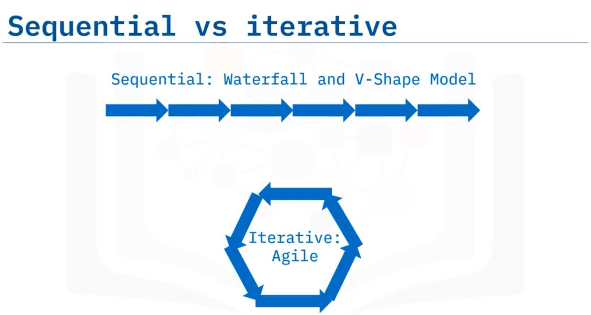
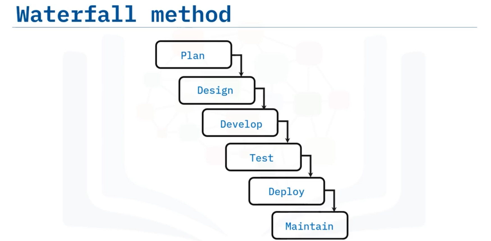
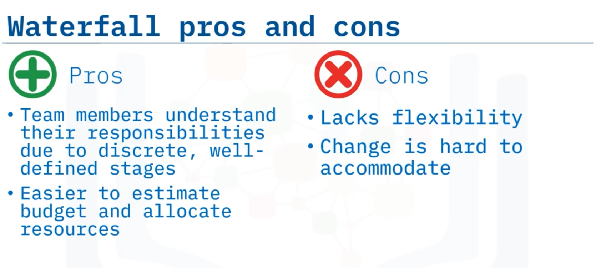
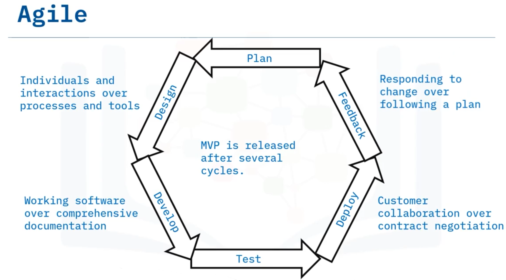
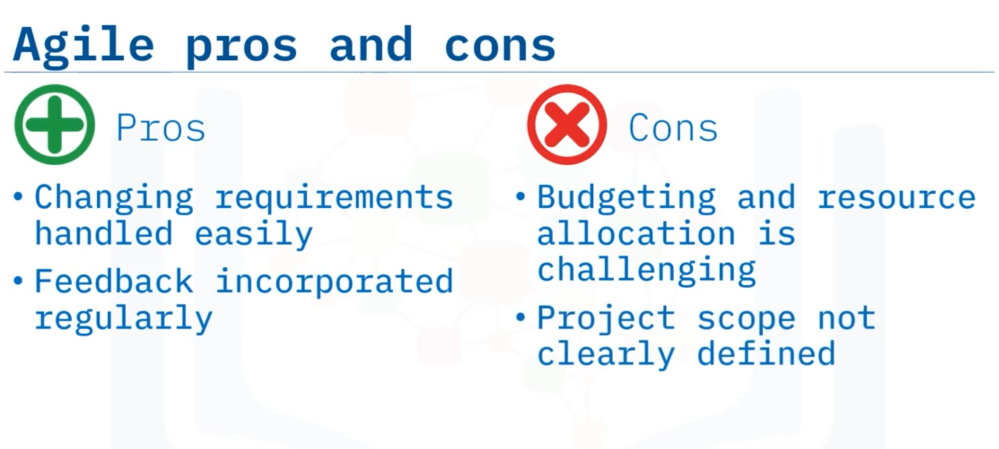

# 01-009: SDLC - Methodologies

 

Software development methodologies clarify communication amongst team members and determine how and when information is shared.

Three primary approaches are:

* Waterfall
* V-shape model
* Agile

***

### Comparative Analysis

**Sequential vs. Iterative**: Waterfall and V-shape are sequential; Agile is cyclical.

**Customer Feedback**: Waterfall and V-shape centre on complete product development before requesting feedback; Agile emphasises quick, short development bursts with continuous feedback.

**Modern Preference**: Agile is the most popular methodology in contemporary software development, facilitated by modern coding languages and technologies enabling modular design.

***

### Waterfall Method

A **sequential method** where each phase's output becomes the next phase's input. All planning (requirements, architectural design) occurs upfront; subsequent phases begin only after the previous completes.

Customers typically see the product only during testing.

Major releases result in long intervals (years) between versions.

**Pros**: Easy to understand; discrete, well-defined stages; roles clearly defined; upfront planning simplifies budget estimation and resource allocation.

**Cons**: Lacks flexibility; changing or overlooked requirements are difficult to incorporate later; unforeseen complications cannot be easily accommodated.

***

### V-Shape Model

Named for its V-shaped visual structure, this **sequential method** mirrors waterfall with enhanced testing rigours.

* The left side descends through **verification phases** (planning, system design, architecture design, module design), culminating at the bottom in the **coding phase**.
* The right side ascends through **validation phases** (unit testing, integration testing, system testing, acceptance testing). Each verification phase corresponds to a validation phase. Tests are written during verification and executed during validation.
* The node for all is the Coding phase.

**Pros**: Simple, easy to use; test plan design during verification saves considerable time during coding and validation.

**Cons**: More rigid than waterfall; does not readily accommodate changing requirements; modifying functionality during testing is extremely difficult.

***

### Agile Method

An **iterative, cyclical approach** focusing on collaborative development over multiple short cycles rather than strict top-down linearity.\
Teams work in **sprints** (typically 1-4 weeks).\
Unit testing occurs in each sprint to minimise failure risk.\
The final sprint stage is **feedback** rather than traditional maintenance.

**Sprint Process**: At sprint end, working code is released at a **sprint demo** where stakeholders observe new functionality and provide feedback. The entire process repeats each cycle. After multiple sprints, a **Minimum Viable Product (MVP)**—containing core features to validate assumptions—is developed for stakeholder feedback.

**Core Values** (Agile Manifesto): Individuals and interactions over processes and tools; working software over comprehensive documentation; customer collaboration over contract negotiation; responding to change over following a plan.

**Pros**: Handles changing requirements quickly and easily; planning initiates at each sprint's beginning; most resources focus on the building phase; QA, stakeholders, and customers test working code frequently; modular design allows incremental releases.

**Cons**: Upfront planning (budgeting, scheduling) is challenging due to unclear overall product scope; requires significant stakeholder engagement.

***

***

## Video Lesson

Welcome to **Software Development Methodologies**. After this lesson, you will be able to **list several commonly used approaches to the software development life cycle, explain waterfall, V-shape model, and Agile methods, and compare the pros and cons of each of these three methods**.

There are **many ways** to approach software development. A **specific methodology** for developing software is commonly used in order to **assist the development team** to **clarify communication** amongst team members and **determine how and when the information is shared**. In this lesson, we will discuss **three of these approaches: Waterfall, V-shape model, and Agile**.

In the beginning, when the SDLC was conceived, it implemented what is known as the **waterfall method**. **Waterfall** is a **sequential method** of software development where the **output of one phase** is the **input for the next phase** of the cycle.

**Development and work** on the next phase **start only after the completion** of the previous phase. **All planning**, such as **defining requirements and architectural design**, is **done up front**. The customer usually **does not see the product** until it is in the **testing phase**. For a major version release of the product, the **same process is repeated** resulting in **long intervals, such as years**, between releases.

The **V-shape model** is **named as such** because the **phases form the shape of a V**. The phases going down the **left side of the V** are called **"verification"**. Then, going up the **right side of the V**, those phases are called, **"validation."**

The **V-shape model** is **like waterfall** in that it is also **sequential**. **Each phase** in verification **corresponds with a validation phase**. There are **four stages** that occur on each side of the V. Going down the V are **planning, system design, architecture design, and then module design**. The **bottom of the V** is the **coding phase**. And going back up the V are the **four phases** that correspond to the phases going down the V: **unit testing, integration testing, system testing, and acceptance testing**. The **tests are written** during the verification phases on the left and **executed** during the validation stages on the right.

Now, the **Agile model** is different. It **focuses on a collaborative software development process** over **multiple short cycles** rather than a **strictly top-down linear process**. **Agile** is what is called an **iterative approach** to development. It still **aligns with the SDLC**, but **each phase is short**. **Teams work in cycles, or sprints**, which are usually **one to four weeks long**. **Unit testing** happens **in each sprint** to **minimise the risk of failure**. Rather than the **"maintenance" stage** of the SDLC, the **final stage of the sprint** is a **feedback stage**.

At the **end of each sprint**, a **chunk of working code** is **released** at a meeting called the **"sprint demo"** where **stakeholders can see the new functionality** and **provide feedback**. After the sprint demo, the **entire process is repeated** for every sprint cycle. After **several sprint cycles**, a **minimum viable product, or MVP, is developed** so stakeholders can provide feedback on the **basic feature set**. The **MVP** contains a **feature set to validate assumptions** about the software.

The **four core values** of Agile development outlined in what is known as the **"Agile manifesto"** are: **individuals and interactions** over processes and tools **working software** over comprehensive documentation **customer collaboration** over contract negotiation, and **responding to change** over following a plan.

The **main difference** between **traditional SDLC methods** such as waterfall and the v-shape model compared to the **Agile method** of software development is the **former are sequential** whereas **Agile is cyclical**. **Traditional SDLC methods**, such as waterfall and V-shape, **centre around the whole product** being developed before **soliciting customer feedback**, whereas **Agile focuses on quick, short bursts** of development.

There are **pros and cons** to each method, though **Agile is probably the most popular** method used in **modern software development**. Regarding the **pros of the waterfall method**, it is **easy to understand and follow**. Each stage is **discrete and well-defined**, making it **easy for all team members** to **understand their roles**. Also, since **planning is done upfront**, it is **easier than iterative methods** to **estimate a budget and allocate resources**.

That said, **waterfall lacks flexibility**. Since all planning is done upfront if a **requirement is changed or overlooked** that change can be **hard to incorporate** at a later date. **Inevitably, unforeseen complications happen**, or **agreed upon functionality shifts** from what was initially envisioned.

Like waterfall, the **V-shape model** is **simple and easy to use**. It is **even more rigid** than waterfall but **designing test plans** during the verification phase **saves considerable time** during coding and validation phases. **Drawbacks** are also **similar to waterfall** because it **does not readily accommodate changing requirements**. Once an application is in the **testing phase** it is **extremely difficult** to go back and **change functionality**.

**Agile development** is different, relying on **ongoing research, planning, and testing** during product development. When adding new features to a project, **development still goes through the same phases** as in traditional SDLC, but with **Agile, new, and changing requirements** are **handled quickly and easily** because **planning is initiated** at the **beginning of each sprint cycle**. **Most resources** are **spent on the building phase**.

At the **end of each cycle**, the **QA team, stakeholders, and the customer** have **some piece of working code** to **test against requirements** and are **encouraged to provide feedback**. As coding languages and technologies have developed in recent years, they now allow for **modular design**, where developers can **focus on smaller chunks of code** that are **readily integrated** into the larger product. These **small chunks can be released** to provide the **MVP**.

**Cons of Agile** are that **upfront planning** such as **budgeting and scheduling** can be **challenging** because the **overall scope of the product** is **not clearly defined**.

In this lesson, you learned that: **Three of the common approaches** to software development include **waterfall, V-shape model, and Agile** **waterfall and V-shape are sequential** whereas **Agile is iterative** both **waterfall and V-shape models are easy to implement** but neither **accommodates changing requirements well** and **Agile allows for changing requirements** but **resource allocation can be challenging**.
