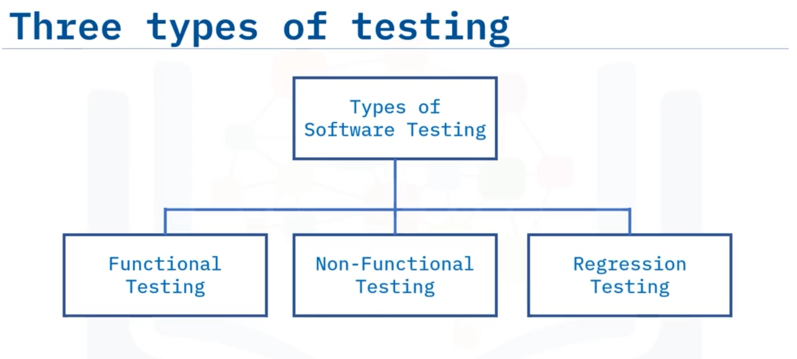
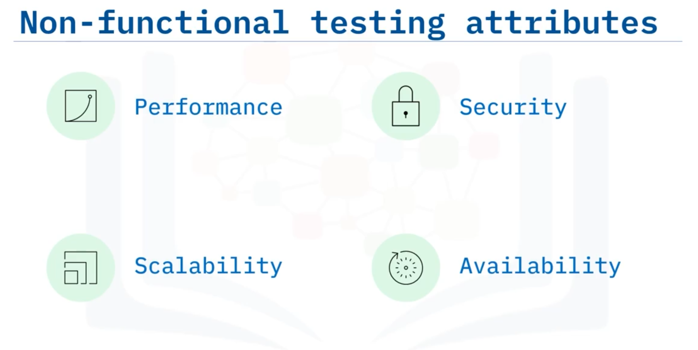
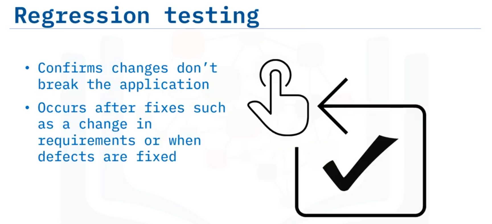

# 01-011: SDLC - Software Testing

 

**Software Testing** is the practice of integrating quality checks throughout the software development cycle.

Its purpose is verifying software matches expected requirements and ensuring error-free code.

Testing involves writing **test cases**—step-by-step procedures containing inputs, data, and expected outputs—to verify functionality and requirement satisfaction.

Test cases should be written after requirements are finalised, though timing varies by development method (Agile, waterfall).

***

## Three Testing Categories

***

### **Functional Testing**

Uses black-box testing (testing without examining source code or internal structure), focusing only on inputs and corresponding outputs of the system under test (SUT).

Tests functional requirements through manual or automated methods, ensuring applications are usable and accessible.

Validates that user errors and input edge cases are handled seamlessly with appropriate error messages.

***

### **Non-Functional Testing**

Evaluates application attributes including performance, security, scalability, and availability.

Answers critical questions like:

> How does the application behave under stress? What occurs when many users login simultaneously? Are documentation and user manuals consistent with application behaviour? Does the application behave similarly across operating systems? How does disaster recovery function? How secure is the application?

***

### **Regression Testing** (Maintenance Testing)

Confirms recent changes (bug fixes, updates) do not adversely affect existing functionality.\
Occurs when requirements change or defects are fixed.

Selection challenges depend on factors including frequent defects, frequently used functionality, recently changed features, complex test cases, edge cases, and randomly successful/failed cases.

***

## Four Testing Levels

1. Unit testing
2. Inntegration testing
3. System testing
4. Acceptance testing

Each level occurs at different SDLC stages, reducing testing overlap and time:

### **Unit Testing**

Verifies specific code sections, typically at the function level.

Performed by developers during the development phase, eliminating construction errors before code integration. Increases software quality and development efficiency.

### **Integration Testing**

Black-box testing identifying errors when two or more independent code modules combine.

Tests smaller units (previously passed unit testing) incorporated into larger applications.

Exposes bugs in module interaction, communication deficiencies with new modules, differing programming logic, and poor exception handling.

### **System Testing**

Conducted on fully integrated systems after integration testing, evaluating compliance with specified requirements.

Tests both functional and non-functional aspects in a staging environment mirroring production. Validates the complete software product.

### **Acceptance Testing**

Formal testing against user needs, requirements, and business processes. Determines whether systems satisfy user, customer, and stakeholder needs.

Usually performed by customers or stakeholders during the maintenance SDLC stage.

***

## Video Lesson

Welcome to **Software Testing**. After this lesson, you will be able to: **Define the terms functional testing, non-functional testing, and regression testing, and compare and contrast typical testing levels**.

**Software Testing** is the **practice of integrating quality checks** throughout the software development cycle. The **purpose of testing** is to **check whether the software matches expected requirements** and **ensure error-free software**. In order to test software, the team writes **"test cases."** These **test cases** are written to **verify the functionality** of a software application and **ensure requirements have been satisfied**.

**Test cases** can be **written in different stages** of the SDLC and may **vary depending on the type of test** or the **method used** to develop the software, such as Agile or waterfall.

A **test case** contains: **steps, inputs, data, and the expected corresponding outputs**. Regardless of the test type or development method, **test cases should always be written** after **requirements are finalised**.

**Software testing** helps **evaluate the software** to **identify** whether or not the **software product meets requirements** and is **error-free**. **Types of testing** can be broadly classified into **three categories: Functional testing, Non-Functional testing, and Regression testing**.

**Functional testing** usually involves **black box testing** which is a **method of testing without looking at source code** or **internal structure**. **Functional testing** is only concerned with **inputs and corresponding outputs** of the **system under test, also called the SUT**. It is entirely based on **testing functional requirements**. **Functional testing** can be carried out **manually or using automated tools**.

The **goal** is to **test the functionality** of the application making sure the application is **usable and accessible**. **Functional testing** tests the **SUT, to make sure it meets functional requirements**. **Functional testing** makes sure that when **user errors or input edge cases** occur, the **software handles those exceptions seamlessly** by **displaying appropriate error messages**.

**Non-functional testing** includes **testing the application** for attributes like **performance, security, scalability, and availability.** **Non-functional testing** checks to see if the **SUTs non-functional behaviour** is **performing properly**. **Non-functional testing** should answer questions like the following: **How does the application behave under stress? What happens when many users log in at the same time?**

**Are the instructions** in documents and user manuals **consistent** with the **application's behaviour? Does the application behave similarly** under **different operating systems? How does the application handle disaster recovery? And how secure** is the application?

**Regression testing**, also called **maintenance testing**, **confirms** that a **recent change** to the application, such as a **bug fix**, does **not adversely affect** already existing functionality. **Regression testing** should occur when there has been a **change in requirements** or when **defects have been fixed**. In order to **conduct regression testing**, **all or some of the test cases** should be **selected** to **test against the application**. **Regression test case selection and prioritisation** can be **challenging** and can **depend on several factors**.

**Common reasons** for regression test case selection include cases that: **have frequent defects, contain frequently used functionality, contain features with recent changes, or are complex test cases, edge cases, and randomly successful or failed test cases**.

Now that we have discussed **different types of testing**, let's discuss **testing levels**. There are **four testing levels: unit, integration, system, and acceptance**. **Each level occurs at a different time** in the SDLC. There are **4 different levels** in order to **reduce the amount of time** spent on testing by **preventing overlap**. We will discuss each of these testing levels next.

**Unit testing** refers to **tests that verify the functionality** of a **specific section of code**, usually at the **function level**. It is **performed by the software developer or engineer** during the **development phase** of the software development life cycle. **Unit testing** aims to **eliminate construction errors** before code is **integrated with other modules**. **Unit testing** is intended to **increase the quality** of the resulting software as well as the **efficiency** of the overall development process.

**Integration testing** seeks to **identify errors** when **two or more smaller, independent code modules** are **combined**. **Integration testing** is another type of **black-box testing**. **Prior to integration testing**, smaller, independent code modules that **passed unit testing** are **incorporated into the larger software application**. After modules are **integrated together**, then **integration testing** can occur.

**Integration testing** **exposes bugs** that occur when those **smaller units of code interact** with each other. **Integration testing** **uncovers deficiencies** in **communication** with a **new module** in conjunction with **other existing modules, databases, or external hardware**. **Integration testing** uncovers situations where **bugs develop due to differing programming logic** between modules, for instance. Also, sometimes during module development, **requirements change**, and the **module isn't fully unit tested**. **Poor exception handling** can cause problems when **modules are integrated together**.

**System testing** occurs **after integration testing** and is **conducted on a complete, integrated system** to **evaluate the system's compliance** with its **specified requirements**. It **validates the system** as a **fully completed software product**. **System testing** is **both functional and non-functional**. **System testing** is done in a **staging environment**, which should be **similar to the production environment**.

And finally, **acceptance testing** is **formal testing** with respect to **user needs, requirements, and business processes**. It **determines** whether a **system satisfies the needs** of the **users, customers, and other stakeholders.** **Acceptance testing** is usually done by the **customer or the stakeholders** during the **maintenance stage** of the SDLC.

In this lesson you learned that: **There are three categories of testing: functional, non-functional, and regression.** **Unit testing** verifies **small, independent chunks of code**. **Integration testing** looks for errors when **two or more small chunks of code** are **combined**. **System testing** validates the system as a **fully completed software product** and **acceptance testing** verifies **correct implementation** of **user requirements and business processes**.
