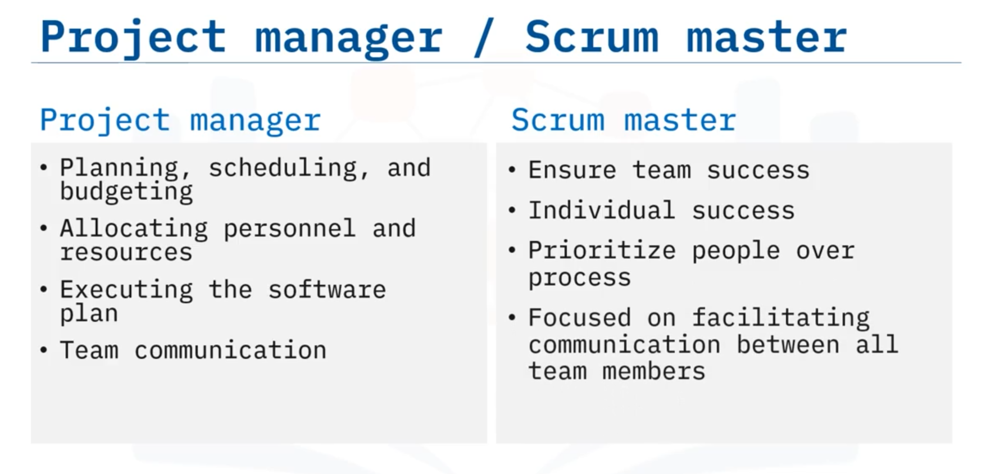
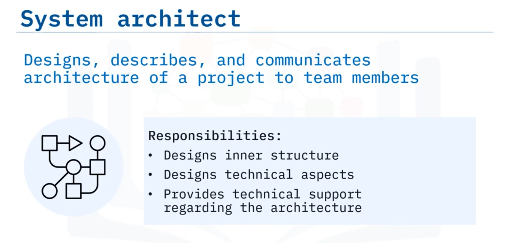
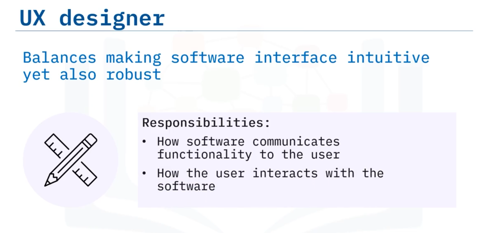

# 01-013: SDLC - Roles

Software development projects comprise multiple roles with varying titles depending on methodology (Agile vs. waterfall) and organisational preferences.  
Not all projects include every role.  

**NINE** common roles are: 

-   Project manager/Scrum master
-   Stakeholder
-   System / Software Architect
-   UX Designer
-   Software Developer
-   QA engineer / Tester
-   Site Reliability engineer
-   Product Manager / Owner
-   Technical Writer / Information developer.

---

### Project Manager / Scrum Master

#### **Traditional SDLC** -> **Project Manager** 
Ensures smooth project execution and facilitates communication, addressing planning, scheduling, budgeting, personnel and resource allocation, software plan execution, and team communication.

#### **Agile** -> **Scrum Master**
Prioritises team and individual success, facilitating communication aligned with Agile values emphasising people and collaboration over process.

---

### Stakeholder

Individuals for whom the product is designed: 

-   Customers
-   End-users
-   Decision-makers
-   System administrators
-   Any other key personnel

Responsible for defining project requirements and providing requirement clarification or feedback when proposed solutions require adjustment. 

May participate in beta and acceptance testing before release.

---

### System / Software Architect

Designs and communicates project architecture to team members. Also called **solution architects**.   

Responsible for designing essential characteristics of the software's inner structure and technical aspects.  
Provides technical support across SDLC stages.

---

### UX Designer

Balances intuitive design with robust functionality meeting requirements.  
Determines how software behaves from the user's perspective, communicating functionality to end-users and defining user interaction methods.

---

### Software Developer

Writes code powering the software, implementing architecture from design documents, incorporating SRS requirements, and employing UX requirements determined by UX designers.

---

### QA Engineer / Tester

Ensures product quality and customer requirement compliance.  
Writes and executes test cases identifying bugs and deficiencies, providing feedback to development teams.

---

### Site Reliability Engineer (SRE) / Ops Engineer

Bridges development and operations, combining software engineering expertise with IT systems management.        

*   Tracking incidents
*   Facilitates incident discussions
*   Automates systems and procedures
*   Assists  on troubleshooting
*   Ensures customer reliability

---

### Product Manager / Product Owner

Possesses product vision and intimate understanding of client requirements and end-user needs.  
Leads development efforts ensuring the product delivers stakeholder value.

---

### Technical Writer / Information Developer

*   Writes end-user documentation on technical material for non-technical audiences.  

*   Assists end-user software operation and enables timely customer feedback.       
*   May author user manuals, reports, white papers, and press releases.

---

## Video Lesson

Welcome to **Roles in Software Engineering Projects**. After this guide, you will be able to **list the common roles on a software engineering project, describe each role, and explain the responsibilities of each role**.

There are **several common roles** on a software development project. And these **roles can have different names** depending on the **approach being used**, such as Agile or waterfall. Sometimes **different companies** have **different names** for similar jobs. But, **not all projects** will have **all these roles**. The roles we will discuss in this guide are **project manager or scrum master, stakeholder, system or software architect, UX designer, software developer, tester or QA engineer, site reliability or Ops engineer, product manager or owner, and technical writer or information developer**.

Now let's describe each role and some of the **responsibilities** for each job.

**Traditional SDLC methods** have **project managers** but in **Agile** the equivalent role is called a **Scrum master**. A **project manager** makes sure the **project runs smoothly** and **facilitates communication** about the project. The **project manager** often deals with **bigger picture issues** such as: **Planning, scheduling, and budgeting; Allocating personnel and resources; Executing the software plan; and Team communication**.

In **Agile**, there is a **Scrum master**. Rather than **focusing on planning**, the **Scrum master** is **focused on ensuring team and individual success**. Remember that the **four core Agile values** prioritise **people and communication** over process, and the **Scrum master** is **responsible for facilitating that communication**.

The **stakeholders** are the **people** for whom the **product is being designed**. They include individuals such as the **customer, end-users, decision-makers, system administrators, and other key personnel**. The **stakeholder** is mainly **responsible for defining project requirements** and **providing feedback** if the team members need **clarification on requirements** or if a **proposed solution cannot be solved as planned**. The stakeholders may also sometimes **participate in beta testing and acceptance testing** before the software is released.

The **system architect**, **designs and describes the architecture** of a project as well as **communicates that architecture** to team members. They are sometimes also called a **software architect** or a **solution architect**. They are **responsible for designing the essential characteristics** of the **inner structure and technical aspects** of the software. The **architect** provides **technical support** across the different stages of the SDLC.

**Note**: software architecture will be discussed in further detail in another module.

**UX** means **user experience**. The **goal** of a **UX designer** is to **balance making the software intuitive** but also as **robust as it needs to be** to **address requirements**. They **define how the software behaves** from the **user's perspective**. The **UX designer** determines **how the software communicates its functionality** to the **end-user** and **how the end-user interacts** with it.

Next, the **developers** **write the code** that **powers the software**. **Responsibilities** include **implementing the architecture** laid out in the design document, **incorporating the requirements** laid out in the software requirements specification, and **employing the UX requirements** determined by the **UX designers**.

**Testers** or **QA engineers** are **in-charge of ensuring the quality** of the product and that the **software solution meets customer requirements**. They are **responsible for writing and executing test cases** to **identify bugs or deficiencies** and **provide this feedback** to the development teams.

A **site reliability engineer**, sometimes called an **SRE or ops engineer**, **bridges development and operations** by **combining software engineering expertise** with **IT systems management**. They **track incidents** and **facilitate meetings** to discuss them. They also **automate systems, procedures, and processes; assist with trouble shooting; and ensure reliability** for the customer.

The **product manager** or **product owner** has the **vision** of what the **product should look like**. They have an **intimate understanding** of the **client's requirements, and the end-user's needs**. They are **responsible for leading development efforts** to **create the software** and for **ensuring the product provides the value** stakeholders are looking for.

Finally, the **technical writer** or **information developer** **writes documentation** for the **end-user**. They **write documentation on technical material** geared towards a **non-technical audience**. Not only does this **documentation** help the **end-user to use the software**, but it also helps the **customer** so they can **provide timely feedback** to the development teams. **Technical writers** may be asked to **write user manuals, reports, white papers, and press releases**.

In this guide you learned that: **There are a variety of job roles on a software development project and each occupation has responsibilities unique to each role**.
