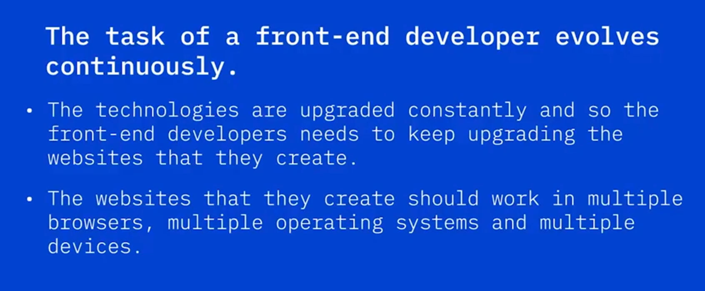

# 02-002: Front-End Basics

### Front-End Developer Role

Front-end developers create website structures, apply styling and appeal, ensure multi-browser and multi-device compatibility, and continuously upgrade technologies as they evolve.

### Core Languages: HTML, CSS, JavaScript

**HTML** (Hypertext Markup Language) creates the physical structure of websites, encompassing text, links, images, videos, page dividers, and buttons. HTML ensures proper formatting so browsers display pages consistently.

**CSS** (Cascading Style Sheets) adds visual appeal, providing a standardised method to define, apply, and manage style characteristics. CSS ensures uniformity in appearance, colours, fonts, designs, and layouts, and enables cross-browser compatibility across multiple devices (PC, mobile, iPad).

**JavaScript** is an object-oriented programming language adding interactivity to websites. Combined with HTML and CSS, it transforms static structures and styles into functional, interactive applications.

### Modern Stylesheet Languages

#### **SASS** (Syntactically Awesome Style Sheets)
An extension of CSS supporting variables, nested rules, and inline imports. Enables faster, easier stylesheet creation whilst maintaining CSS compatibility.

#### **LESS** (Leaner Style Sheets)

Enhances CSS with additional styles and functions, remaining backwards compatible. LESS.js converts LESS styles to CSS.

### Responsive and Adaptive Design

**Adaptive design** displays website versions tailored to specific screen sizes, providing device-specific content.

**Responsive design** automatically resizes to the accessed device, maintaining functionality across all screen dimensions.

---

### JavaScript Frameworks

#### **Angular Framework** (Google)

Open-source framework rendering HTML pages quickly and efficiently with built-in routing and form validation tools.

#### **React.js** (Meta)

A JavaScript library building and rendering web page components. Not a complete framework suite; routing requires third-party tools. Specialises in component manipulation and page composition.

#### **Vue.js** (Community-maintained)

Focuses on the Vue layer (user interface, buttons, visual components). Flexible, scalable, integrates well with other frameworks, and functions as both library and framework.

---

## Video Lesson

Internet websites offer lots of **different services**, one of the most popular being **online shopping**. When you explore an **online shopping website**, **navigating through pages, choosing different product categories, or comparing products**, you are **interacting with the front end** of a website. Let us see **how the front end of a website is developed** by **front-end developers**. For this, we need to understand **how a website is made**.

To **create a website**, web developers usually use **Hypertext Markup Language, HTML, Cascading Style Sheets, CSS, and JavaScript**. **These languages are designed to work in conjunction** with each other. **HTML** is used to **create the physical structure** of a website.

The **physical structure** contains elements such as **text, links, images and videos, page dividers, and buttons**. The **HTML code** ensures a **proper formatting** of all **text and image elements** so that **browsers display the page consistently**. The **front-end developer** codes the **structure of the website**.

A website is like a house, which has only been constructed. Just like we need **interior designers** to add style to a space, we need **front-end developers** to **add the necessary glamour and appeal** to a website. When you order products from any website, you realise that the pages have a **pleasing font, attractive colours, and are easy to navigate**. **Developers use CSS** to **create stylish websites**.

**CSS** provides **front-end developers** with a **standard method** to **define, apply, and manage** different sets of **style characteristics** for a website and each of its components. **CSS** ensures **uniformity in look and feel, style, colours, fonts, designs, and layouts**. So **HTML** is used to **create the structure**, and **CSS** is used to **design it and make it appealing**.

**CSS** is also used to **create websites** that have **cross-browser compatibility**, which means that they are **compatible with multiple browsers** and **multiple devices**, such as **PC, mobile devices, iPads, etc.**

**Online shopping websites** are **intuitive, interactive, and quick to load**. This is where **JavaScript** comes into the picture. **JavaScript** is an **object-oriented programming language** that is **used in conjunction with HTML and CSS** to **add interactivity** to a website.

For example, you **use HTML** to **add a login button** to a page and **CSS** to **style that button**. Then, you **use JavaScript** to **add login functionality** to that button.

A **new front-end development language** is **Syntactically Awesome Style Sheets, SASS**, called **SAS**. It is an **extension of CSS** that is **compatible with all versions of CSS**. **SASS** enables you to **use things like variables, nested rules, and inline imports** to **keep things organised**. **SASS** allows you to **create style sheets faster and more easily**.

Another language that is being used now is **Leaner Style Sheets, LESS or LESS**. **LESS** enhances **CSS**, adding **more styles and functions**. It is **backwards compatible with CSS**. **LESS.js** is a **JavaScript tool** that **converts the LESS styles to CSS styles**.

Using all these languages, websites are designed as **adaptive and responsive**. **Adaptive websites** display the **version of the website designed for a specific screen size**. For example, a website can **provide more information** if opened on a **PC** than when opened on a **mobile device**. **Responsive design** of a website means that it will **automatically resize** to the **device it is being accessed from**.

For example, if you **open up a product's website** on your **mobile device**, it will **adapt itself** to the **small size of the screen** and **still show you all the features**.

A **JavaScript framework** is an **application framework** that is **written in JavaScript**. **Programmers** can **manipulate the different functions, use them wherever required**, and can **create device-responsive applications**. A few examples of several frameworks being used are **Angular Framework**, an **open-source framework** being **maintained by Google**. **Angular Frameworks** allow **websites to render the HTML pages quickly and efficiently**. It has **built-in tools for routing and form validation**.

**React.js** has been **developed and maintained by Facebook**. It is a **JavaScript library** that **builds and renders components** for a web page. It is **not a complete suite of tools**. For example, **routing** is **not a part of this framework** and will need to be **added using a third-party tool**. **React.js** only helps **build and drop components** into a page.

**Vue.js** is **maintained by the community** and its **main focus is the Vue layer**, which includes **user interface, buttons, and visual components**. It is **flexible, scalable, and integrates well** with other frameworks. It is **very adaptable**. It can be a **library or it can be the framework**.

The **task of a front-end developer** evolves continuously. The **technologies are upgraded constantly**, and so **front-end developers** need to **keep upgrading the websites** that they create. The **websites** that they create should **work in multiple browsers, multiple operating systems, and multiple devices**.
