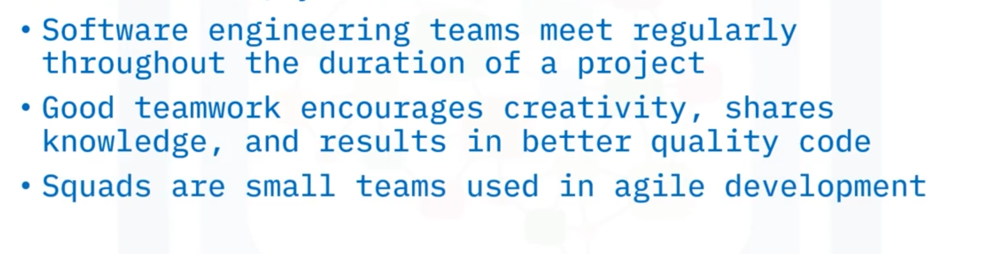
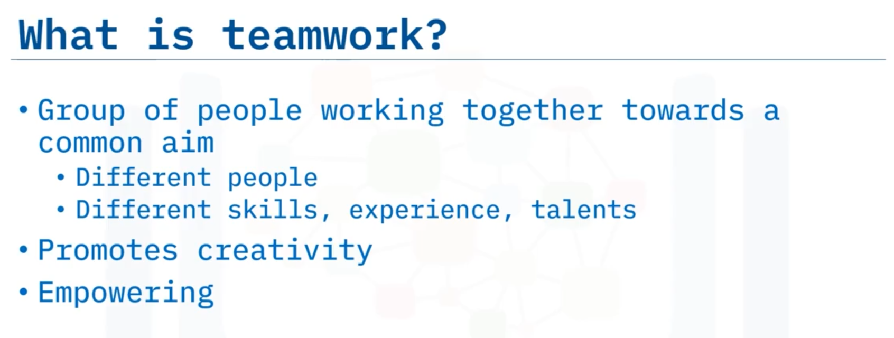
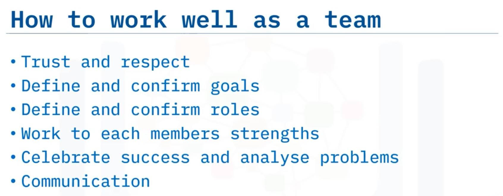
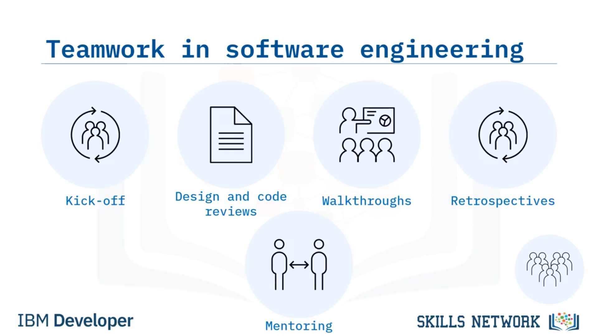
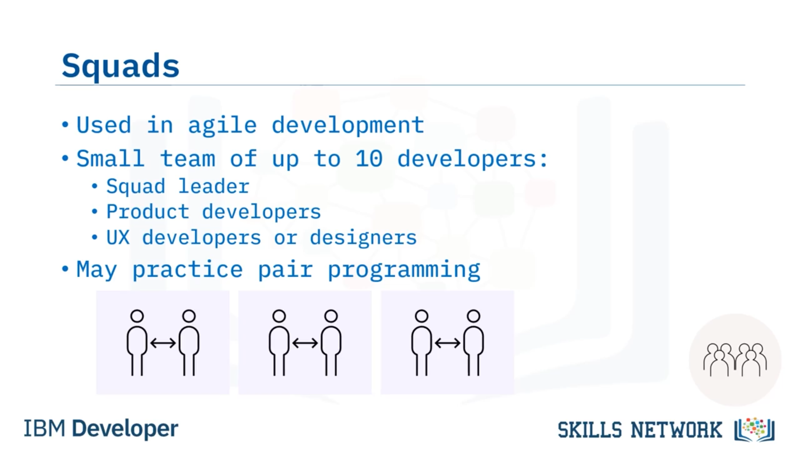

# 02-004: Teamwork / Squads

### Definition and Benefits of Teamwork

A **team** is a group of people working together towards a common aim.   
Teams comprise individuals with diverse skills, experience, and talents, enabling specialisation whilst expanding skillsets through collaboration.  

Teamworking promotes creativity through idea discussion and intellectual challenge, whilst positive attitudes and behaviours create positive results.

### Foundations for Team Success

Successful teamwork requires: 

-   **Trust and respect** amongst members
-   **Clearly defined and agreed goals** ensuring alignment
-   **Defined roles** avoiding task duplication or omission
-   Working with **individual strengths**
-   Celebrating successes
-   Analysing problems

But, the most important part:

-   **Vital communication** using methods accessible to all team members

### Teamwork in Software Engineering

Teams conduct kick-off meetings to plan projects, assign tasks, and establish goals. Throughout project lifecycles, whole-team and sub-team meetings review progress.  

**Design and code reviews** occur at team level.

**Walkthroughs** present individual sections to team members and stakeholders

**Retrospective meetings** occur post-project to analyse successes and improvements. 

**Mentoring** (informal or formalised) facilitates knowledge sharing. Internal teams may maintain code standards, legacy systems, or evaluate new software.

### Benefits of Team Collaboration

- **Creativity and knowledge-sharing** leveraging individual strengths
- **Improved code quality** through corporate standard adherence and documentation
- **Better code maintainability** with reduced bugs through enhanced accountability
- **Stress reduction** through peer support and collaborative problem-solving
- **Increased understanding** of broader project scope and coherent solutions

---

### Squads in Agile Development

Some Agile-following organisations term teams **"squads"** (typically small teams of up to 10 developers),  comprising:

-   A **Squad leader** (anchor developer and coach)
-   **Software engineers** (developing, implementing features, and writing test cases)
-   Optionally, **UX designers or developers**. 

Some squads employ **pair programming** practices.

---

## Video Lesson

Welcome to **Teamwork and Squads**. After this guide, you will be able to **define teamwork and describe the advantages of collaboration in software engineering and describe squads**.

By definition, a **team** is a **group of people** working together towards a **common aim**. Within a team, you'll find a **range of different people** with **different skills, experience, and talents**. Each person can **give their attention and effort** to the **things that they are good at**, and by **working alongside others** on **tasks outside their current repertoire**, they can **expand their skillset**.

**Working in a team** promotes **creativity**. **Collaborating with others** gives you the **opportunity to discuss ideas** and **challenge one another's thinking** about a subject. **Good teamwork** is **empowering**: **positive attitudes and behaviours** can **impact the rest of the team** and **create positive results**.

**Working well as a team** doesn't always come naturally, but there are some things you can consider to help your team succeed. Each member **needs to trust and respect** the other members of the team. This generally comes with time, but depends on **all of the members contributing equitably**. **Defining and agreeing on goals** for a project is **essential** so that the **whole team knows** what they are **working towards**. And you also need to **define and agree on roles** to **avoid any duplication of effort** or **missed tasks**.

**Working with each members strengths** is important to **make the most of the talent** within your team, as is **celebrating success and analysing problems**. **Communication** is **vital** in a **team environment**. **Ensure that you choose a method** that **works for everyone** so you **know that the whole team** is **seeing and responding to information**.

So, what does **teamwork look like** in **software engineering**? **Teams** often **start projects** with a **kick-off meeting** where they **plan how they will complete the project, assign tasks, and agree on goals**. Throughout the **lifetime of a project**, you're **likely to have whole team and/or sub team meetings** to **review progress and plans**.

**Design and code reviews** can be **requested at the team level** and **undertaken by whoever has availability** at that point in time. **Team members** might **present walkthroughs** of their **sections of responsibility** to the **rest of team** so that the **whole team has oversight** of **all parts of the project**.

And, **key team members** will likely **present walkthroughs** to **stakeholders** at **various times** during the project. When a **project is complete**, **retrospective meetings** may be held to **review what went well** and **what could be improved** in **future projects**.

You may have a **mentor** who may or may not be in your **current project team**. You might also be **asked to be a mentor**. Sometimes **team mentoring** is used so **everyone can learn from each other**. Some groups also have **teams working on internal projects** such as **defining code standards, maintaining or updating legacy cross-project code, or reviewing potential new software** for usefulness to the team.

**Good teamwork** can bring **many benefits** to a project. **Working alongside others** can **encourage creativity** and **enable you to take advantage** of **each person's strengths** while also **allowing them to gain knowledge and skills** from **other members of the team**.

When **working as part of a team**, **software engineers** are **more likely to adhere to corporate coding standards** and **regularly document their code**. The **additional accountability** that **teamwork creates** results in **better quality code, fewer bugs, and more maintainable code**.

From a **software engineer's point of view**, **working as a team** can **reduce stress** because **there's always someone to turn to** and **get help from**. And **having someone to discuss problems with** can help you to **increase your understanding** and **resolve more issues** by yourself.

By **working in a team**, each member has a **greater idea of the bigger picture**, resulting in a **more coherent overall solution**.

Some organisations that **follow Agile development methodologies** may call a team a **squad**. Typically, a **squad** is a **small team of up to 10 developers**. It is **likely to consist of**: A **squad leader** who **acts as the anchor developer and coach** for the squad. And a **few software engineers** who **develop and implement the product features and test cases**. It may also include **one or two user experience developers or designers**.

In some squads the **developers** may **work together in pairs** to **practise pair programming**. You'll learn more about pair programming in another guide.

In this guide, you learned that: **Software engineering teams meet regularly** throughout the **duration of a project**. **Good teamwork encourages creativity, shares knowledge, and results in better quality code**. **Squads** are **small teams** used in **agile development**.
