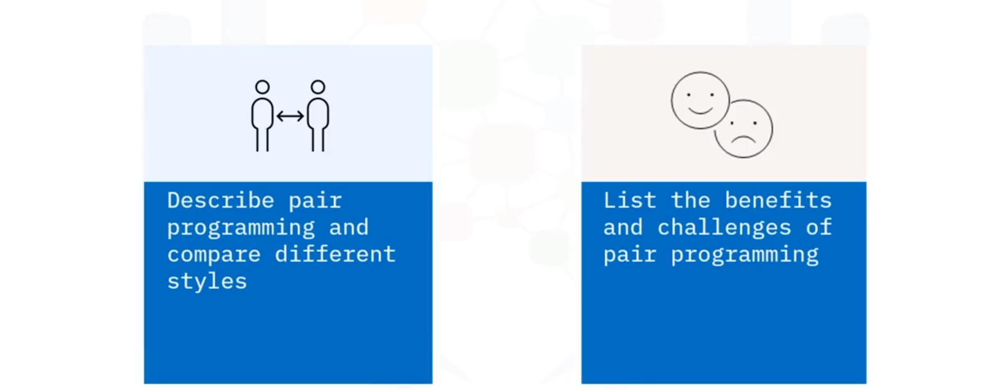

# 02-006: Pair Programming

**Pair programming** is an extension of teamwork where **two developers work side-by-side at one computer**, either physically co-located or virtually via video link or shared screens. 

As an **Agile development technique**, it enables continuous planning and idea discussion, generally producing superior end products.

---

### Three Pair Programming Styles

#### **Driver/Navigator Style** (Most Common)

One developer (driver) types code whilst the other (navigator) reviews code in real-time, provides directions, and maintains awareness of the broader solution.   

Regular role-swapping keeps both developers engaged throughout tasks.

#### **Ping-Pong Style**

Incorporates test-driven development.       

For each task, one developer writes a failing test; the second writes code to pass it. Roles swap for each new task, alternating test-writer and implementer.       

Both developers collaboratively refactor successful code to refine and improve.

#### **Strong Style Pair Programming**

Particularly effective for junior engineers learning from experienced practitioners. 

**Defining rule:**  
> Ideas must pass through another's hands to reach the computer.

*   The experienced developer navigates whilst the junior drives, learning through witnessing implementation and thought processes. 

*   Drivers should withhold challenges until full implementation completes, preserving navigator idea flow.

---

### Benefits of Pair Programming

- **Knowledge and skill sharing** between developers and team integration
- **Technical skills enhancement** combined with **soft skills development** (communication, problem-solving)
- **Code quality improvement**: Two sets of eyes reduce typos, logic errors, and bugs
- **Real-time code review** enabling additional review layers (complementing formal reviews)
- **Optimal problem-solving**: Multiple perspectives converge on superior approaches earlier
- **Overall efficiency**: Despite longer initial development time, reduced review, testing, and debugging time yields better code with less total effort

### Challenges

- **Mental fatigue**: Prolonged focus periods exhaust both programmers
- **Schedule conflicts**: Personal or work commitments disrupt pair continuity
- **Role imbalance**: One developer controlling the entire process creates ineffective "typist/programmer" pairing, negating benefits
- **Personality incompatibility**: Individual differences may hinder collaboration
- **Environmental disruption**: Multiple pair-programming sessions generate noise affecting other workers

---

## Video Lesson

Welcome to **Pair Programming**. After watching this video, you will be able to **describe pair programming and compare different styles and list the benefits and challenges of pair programming**.

**Pair programming** is an **extension of teamwork** where **two developers** work **side-by-side at one computer**. They can either be **physically at the same computer** or **work virtually via video link or shared screens**. The **former** is the **preferred option**, but **virtual pair programming** can also be **productive**.

**Pair programming** is a **type of Agile development** where **two developers** can **plan and discuss their ideas continually** as they **create a solution**, generally resulting in a **better end product**.

There are **various styles of pair programming**: **Driver/navigator style** is the **most common style**, where **one developer** is the **driver, typing in the code**, and the **other** is the **navigator, reviewing the code** as it's written and **giving directions** where to go next.

The **navigator** also **keeps an eye on** the **bigger picture** of the overall solution. When **working in this way**, it's **important to regularly swap roles** to **keep both of the pair engaged** across the whole task.

**Ping-pong style** incorporates **test-driven development**. For each task, **one developer writes a failing test** and then the **second developer writes code** to **pass that test**. For each new task, they **swap roles**, so regularly **changing who writes the test** and **who writes the implementation**. The **two developers** work together at the **end of each task** **refactoring the successful code** to **refine and improve it**.

**Strong style pair programming** is a **good way** for **junior software engineers** to **learn from more experienced ones**. The **defining rule** for this is that **for an idea to go from your head to the computer, it must go through someone else's hands**. So, the **more experienced** of the pair is the **navigator** and the **driver learns** from **witnessing their implementation and thought processes**. For this to work well, the **driver shouldn't challenge** any ideas until the **full implementation is complete** so as **not to interrupt the flow of ideas** from the **navigator**.

Now **pair programming** has **many benefits**. It's a **good way to share knowledge and skills** from **one developer to another** or **between the two** and a **great way** for a **new team member** to **get up to speed** on a project. As well as **enhancing the technical skills** of the pair, it's also a **good way of building soft skills** such as **communication and problem solving**.

**Having two sets of eyes on the code** often **results in fewer typos, logic errors, and bugs**. And it **enables code reviews** to be **done on the fly**. While this **doesn't replace formal code reviews**, it does **enable another layer of review**.

**Having two people thinking about a problem** can result in **multiple initial ideas**, but is **likely to result in the optimal approach** being **chosen earlier in the process**. And although **pair programming can take longer** than **individuals writing the same solutions**, it's **likely to result in better code** with **less time spent reviewing, testing, and bug fixing**.

There are also a **few challenges** to overcome. **Working in a pair** requires **long periods of focus** which can be **exhausting for the two programmers**. And **personal or other work commitments** can **impact the pair schedule**.

**Sometimes one of the pair** can **end up controlling the entire process**, resulting in a **more typist/programmer pairing** which **doesn't benefit** from **any of the positives of pair programming**. And at other times, **individual personalities** may **not work well together**.

When **multiple sets of pair programmers** are **present**, their **discussions** can result in a **noisy environment** for the **other workers in the room**.

In this video, you learned that: **Pair programming** is an **Agile development technique** where **two developers** work **alongside each other**. **There are multiple styles of pair programming**. And **pair programming** builds **technical and soft skills**, **results in better quality code and solutions**, and **increases overall efficiency**.
