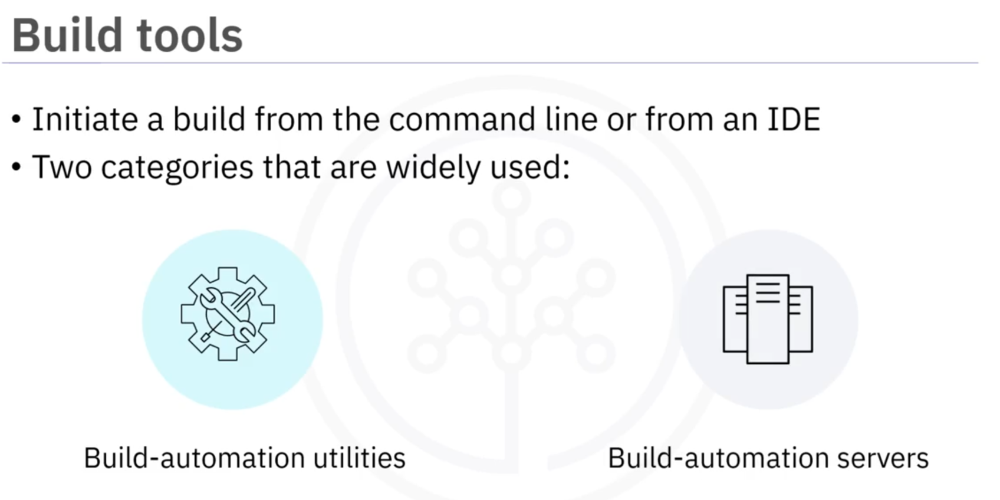
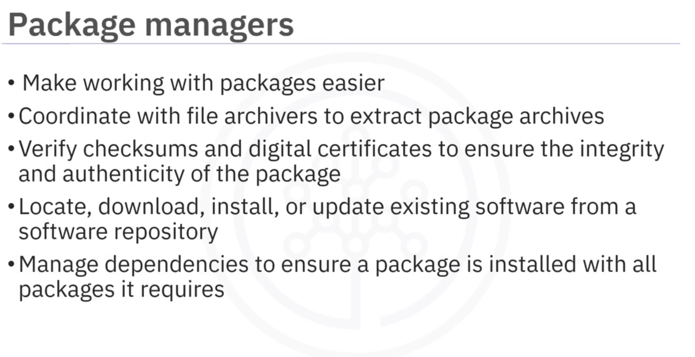
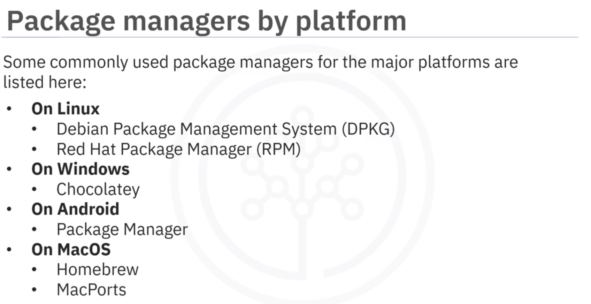
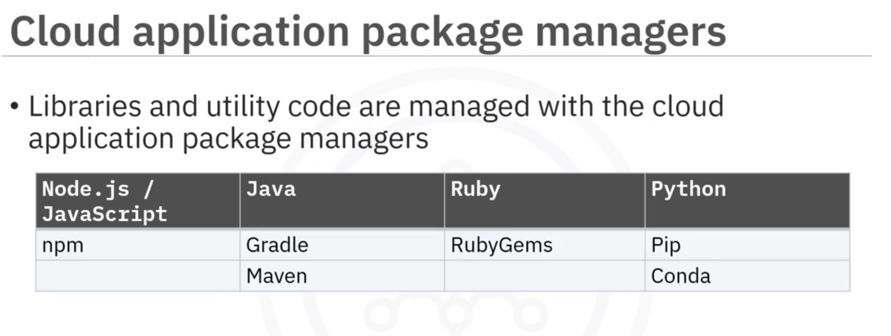

# 02-009    Development Tools 2

Application development tools facilitate building and deploying apps: 

-   **CI/CD**
-   **Build tools**
-   **Packages** / **Package managers**

---

### CI/CD (Continuous Integration / Continuous Deployment)

**CI/CD** represents DevOps best practices enabling developers to deliver frequent, reliable changes.

#### **Continuous Integration (CI)**

Implemented through build-automation servers, CI ensures code components work together smoothly. 

A CI build environment integrates newly developed code frequently—daily or hourly, depending on project change velocity—automatically building and testing code.

#### **Continuous Delivery (CD)**

Beginning where CI ends, CD deploys all code changes from a build to testing or staging environments for further validation before production release.

---

### Build Tools

**Build tools** transform source code into installation-ready binaries, organising source code, setting compile flags, and managing dependencies.   
Essential in multi-project environments with multiple developers, they automate previously manual daily tasks.

**Automated tasks**:
- Downloading dependencies
- Compiling source code into binary code
- Packaging binary code
- Running tests
- Deployment to production systems

#### **Two build tool categories**

- **Build-automation utilities**: Generate build artefacts (executables) by compiling and linking source code

- **Build-automation servers**: Execute build-automation utilities on scheduled or triggered basis

**Examples**: Webpack (JavaScript module bundler), Babel (JavaScript compiler), Web Assembly (binary instruction format for browsers).

---

### Packages and Package Managers

**Packages** are archive files containing app files, installation instructions, and metadata. Metadata includes package description, version, and dependencies (packages requiring prior installation).

**Package managers** handle software discovery, installation, maintenance, and uninstallation tasks, coordinating with file archivers, verifying checksums and digital certificates, locating and downloading software from repositories, and managing dependencies.

#### **Platform package managers**

- **Linux**: DPKG (Debian), RPM (Red Hat)
- **Windows**: Chocolatey
- **Android**: Package Manager
- **macOS**: Homebrew, MacPorts

#### **Language-specific package managers**

- **Node.js/Javascript**: npm
- **Java**: Gradle, Maven
- **Ruby**: RubyGems
- **Python**: Pip, Conda

---

## Video Lesson

Welcome to **More Application Development Tools**. Let's look at some **tools** which can help you **get your app built and deployed: CI/CD, Build Tools, Packages, and Package Managers**.

**CI/CD** refers to the **practices of continuous integration** and either **continuous delivery or continuous deployment**. **CI/CD** is a **best practice** for **devops teams** enabling **developers to deliver frequent changes reliably**.

**Implemented through a build-automation server**, **Continuous Integration (CI)** ensures that **all the code components work together smoothly**. A **CI build environment** enables you to **integrate newly developed code frequently**, at least **every day, if not every hour**, depending on **how quickly the project changes**.

**Continuous delivery (CD)** begins where **CI ends**. The **CI process** automatically **builds and tests your code**, then **CD deploys all code changes** in a **build** to a **testing or staging environment**.

A **build tool** transforms your **source code** into the **binaries needed for installation**. **Build tools** organise your **source code**, **set compile flags**, and **manage dependencies**. They are **most important** in **environments where there are many inter-connected projects**, with **multiple developers** contributing to each project.

In these environments, it can be **very difficult** to **keep track of** what **changes were made, in what order, what dependencies exist, and what needs to be incorporated** in the next build, so **automation is key** to **keeping everything running smoothly**.

**Build automation** can **automate a wide variety of tasks** that developers do in their **day-to-day activities** like: **Downloading dependencies. Compiling source code into binary code. Packaging that binary code.**

**Running tests. And deployment to production systems**. You can **initiate a build** from the **command line** or from an **IDE**.

There are **two categories of Build Tools** widely in use: **Build-automation utilities**, which **generate build artefacts** like executables, by **compiling and linking source code**. **Build-automation servers**, which **execute build-automation utilities** on a **scheduled or triggered basis**.

Some **examples of build tools** are: **Webpack** – a **module bundler for JavaScript**. **Babel** – a **JavaScript compiler**. And **Web Assembly** - a **binary instruction format** that **runs in your browser**.

Now that you have your **app developed and tested**, you're **ready to deploy**. But **how does that happen**? The **app needs to be simple and trouble-free** for the user to install, so a **commonly used technique** is to **collect all the necessary files** and **bundle them together** into a **package**.

**Packages** are **archive files** that **contain the app files, instructions for installation, and any metadata** that you choose. They have **their own metadata too**, including the **package description, package version, and any dependencies**, like **other packages that need to be installed beforehand**.

Once you have **bundled your app** into a **package**, you can use a **package manager** to **distribute it**. **Package managers** take care of the **tasks of finding, installing, maintaining or uninstalling. software packages** at the **user's request**.

**Package management systems**:
- **Coordinate with file archivers** to **extract package archives**.
- **Verify checksums and digital certificates** to **ensure the integrity and authenticity** of the package.
- **Locate, download, install, or update existing software** from a **software repository**.
- And **manage dependencies** to **ensure a package is installed** with **all packages it requires**.

Some **commonly used package managers** for each of the **major platforms** are listed here: On **Linux** - **Debian Package Management System (DPKG). Red Hat Package Manager (RPM).**

On **Windows** - **Chocolatey**. On **Android** - **Package Manager**. On **MacOS** - **Homebrew and MacPorts**.

Any **libraries or utility code** that is **developed as part of the application** is **managed with the cloud application package managers**. Here are some **examples of package managers** for **popular languages**: For **Node.js/Javascript** - **npm**. For **Java** - **Gradle and Maven**. For **Ruby** - **RubyGems**.

For **Python** - **Pip and Conda**.

In this video you've learned about some of the **tools** that you will **utilise** in your **career as a developer**, including: **CI/CD, Build Tools, Packages, and Package Managers**.
