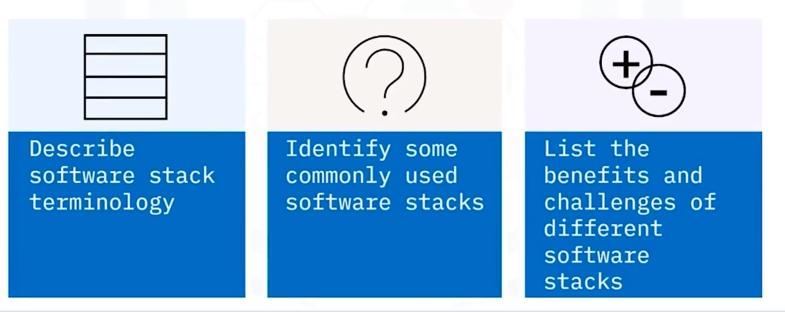
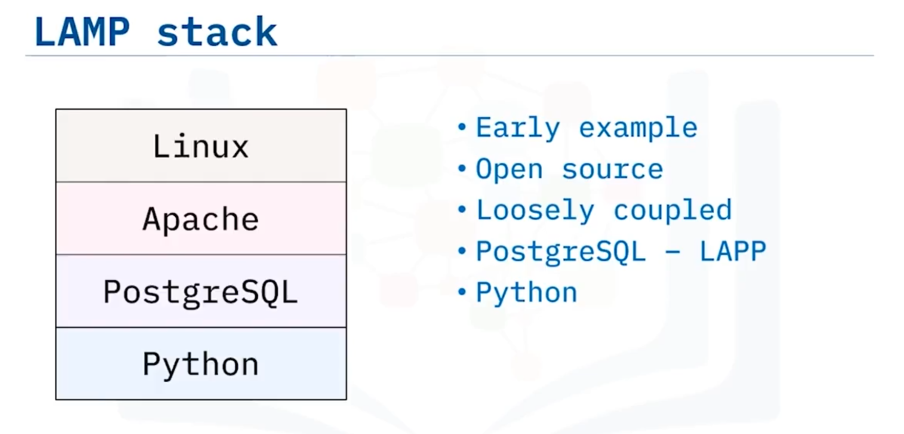
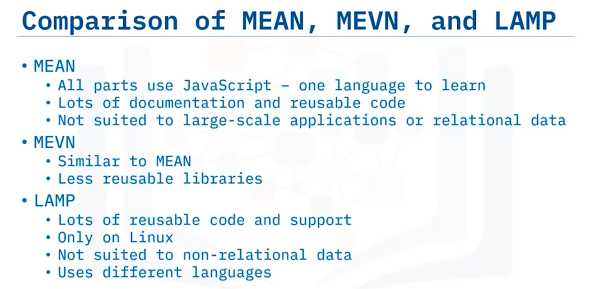

# 02-010: Software Stacks

 

***

## What is a software stack?

A **software stack** is a structured set of software components that together enable an application to be developed, executed and maintained.

Components are arranged in layers; higher layers provide user-facing features, while lower layers manage data, system resources and interactions with hardware.

When the definition expands to include hardware and infrastructure (load balancers, virtual machines, storage), the expression **technology stack** is used.

***

## Parts of a software stack

### Stack Components

**Front-end technologies**: Programming languages, frameworks, user interface tools.

**Back-end technologies**: Programming languages, frameworks, web servers, app servers, operating systems, messaging applications, and databases.

### Stack Architecture

**Simple implementation** comprises three layers: presentation (user interface), business logic, and data layers.

**Complex applications** include virtualisation software, scheduling and orchestration, runtime environments, database connectivity, networking, and security.

**Technology stack** (broader term) encompasses hardware and infrastructure (virtual machines, containers, storage, load balancers) alongside software stacks.

### Stack Flexibility

No formal structure exists; only requirement is that software and services support application development, functionality, or deployment. Not all available layers require use—only those relevant to solutions. Components originate from internal resources, third-party providers, or cloud providers.

### Presentation layer (Top)

**Purpose:** Deliver the application’s interface and user experience. **Contains:** HTML/CSS/JavaScript, single-page application frameworks, native mobile UI frameworks, templates, accessibility aids. **Responsibilities:** Rendering, client-side validation and state, responsive layout, accessibility, user interaction patterns and local caching (where applicable). **When to focus here:** If user experience, performance perceived by users (time-to-interact) and accessibility are primary goals.

### Logic layer (Business logic / Middle)

**Purpose:** Implement application rules and orchestrate behaviour. **Contains:** Back-end services, APIs, controllers, domain models, service layers, task queues and integration adapters. **Responsibilities:** Validation, business rules, coordinating reads/writes to the data layer, orchestrating third-party services and exposing APIs (REST/GraphQL/gRPC). **When to focus here:** When domain complexity, reuse of logic across clients, or integration with multiple systems is required.

### Data layer (Bottom)

**Purpose:** Persist and manage application state and supporting data. **Contains:** Relational or document databases, caches, search engines, object stores and data pipelines. **Responsibilities:** Data modelling, queries, indexing, transactions, backups, replication, access control and performance tuning. **When to focus here:** When durability, consistency, analytics or complex querying are required.

***

## Supporting infrastructure layers (optional)

These layers are commonly added beneath the data tier for scale, security and operational control.

### Security (cross-cutting)

**Role:** Applies across every layer. **Includes:** Authentication, authorisation, encryption, secrets management, network policies and monitoring for intrusion and misuse. **Focus areas:** Least privilege, secure defaults, data protection (at rest and in transit) and compliance.

### Virtualisation / Runtime abstraction

**Role:** Abstracts physical hardware to provide isolation and portability. **Includes:** VMs, container runtimes and hypervisors. **Benefits:** Resource isolation, portability and environment reproducibility.

### Orchestration

**Role:** Automates deployment, scaling and lifecycle management for services. **Includes:** Scheduling, service discovery, rolling updates and self-healing mechanisms. **Technologies:** Kubernetes, Nomad, Docker Swarm.

***

## Where components come from

* **Internal:** Custom-built services and libraries tailored to organisational needs.
* **Third party:** Open-source libraries, commercial products and vendor SDKs.
* **Cloud providers:** Managed databases, serverless functions, managed Kubernetes and serverless storage.

Mixing sources is normal; managed services reduce operational effort at the cost of vendor lock-in and ongoing costs.

***

## Common software stacks — descriptions and typical uses

### LAMP (Linux, Apache, MySQL, PHP/Perl/Python)

 **or...**\

A traditional stack for web applications running on a Linux server with Apache, a relational DB, and dynamic server-side scripting.

**Best for:** Classic web apps, content management systems, projects that benefit from mature tooling and wide hosting support.

**Pros:** Vast community support, stable, easy to host and maintain; clear separation of concerns.

**Cons:** Heterogeneous languages between front/back ends; relational DB focus makes unstructured data less natural; less platform-agnostic.

***

### MEAN (MongoDB, Express, Angular, Node.js)

Full-JavaScript stack using a document-oriented database and Angular for the front-end.

**Best for:** Rapid development where JavaScript end-to-end accelerates development and team skills align to JS.

**Pros:** Single language across stack; rich Node.js ecosystem.

**Cons:** Not ideal for complex relational data; Express-based monolith services can hinder reusability in large systems.

***

### MERN (MongoDB, Express, React, Node.js)

Similar to MEAN but React replaces Angular, emphasising component-driven UI.

**Best for:** High-performing, interactive front-ends with a JavaScript-centric backend.

**Pros:** React’s ecosystem and component model; flexibility for server-side rendering or client-only apps.

**Cons:** Still document-db centric; front/back skillset remains JavaScript.

### MEVN (MongoDB, Express, Vue, Node.js)

**Overview:** Like MEAN/MERN but Vue.js provides a lightweight front-end framework. **Best for:** Teams valuing a gentler learning curve and smaller framework footprint. **Pros:** Fast initial performance and easier onboarding for smaller teams. **Cons:** Fewer mature, enterprise-grade libraries than Angular.

### Python–Django

**Overview:** Python with the Django web framework, batteries-included approach with ORM, admin interface, and conventions. **Best for:** Rapidly-changing, large-scale web apps; data-heavy applications where Python’s ecosystem is valuable. **Pros:** Strong conventions, excellent libraries, good for team productivity. **Cons:** Opinionated structure may feel limiting for bespoke architectures.

### Ruby on Rails

**Overview:** Opinionated full-stack framework with strong conventions, emphasising developer happiness and rapid development. **Best for:** Startups and projects where rapid prototyping is critical. **Pros:** Productivity and convention-over-configuration; efficient use of JSON/XML for APIs. **Cons:** Performance and scaling considerations for certain workloads; smaller ecosystem than JavaScript or Python in some areas.

### ASP.NET (Microsoft stack)

**Overview:** Microsoft stack with ASP.NET MVC, IIS, SQL Server and Azure services. **Best for:** Enterprise environments, Windows-centric infrastructures or where tight integration with Microsoft products is desired. **Pros:** Enterprise-grade tooling, good Windows integration and Azure-managed services. **Cons:** Historically more proprietary; licensing and platform choices may be limiting for some organisations.

***

## Comparative analysis — practical trade-offs

When comparing stacks consider:

* **Language uniformity:** Single-language stacks (MEAN/MERN/MEVN) ease hiring and cross-layer development.
* **Data model fit:** Relational databases suit transactional consistency; document stores suit flexible schemas and rapid iteration.
* **Ecosystem and libraries:** Mature ecosystems reduce build time (e.g., LAMP, Django).
* **Scalability pattern:** Some stacks and components scale horizontally easily (microservices + containers), others rely on vertical scaling or complex partitioning.
* **Operational effort and cost:** Managed cloud services reduce ops work; self-hosting increases control but requires investment in DevOps.

***

## Advantages and disadvantages (summary)

**MEAN / MERN / MEVN**

* Advantages: JavaScript across the stack, rapid prototyping, large NPM ecosystem.
* Disadvantages: Less ideal for relational workloads; potential code quality and architecture drift without discipline.

**LAMP**

* Advantages: Mature, stable, excellent legacy and hosting support, relational strength.
* Disadvantages: Mixed-language contexts, less natural for unstructured data, fewer modern reactive front-end patterns built in.

**Django / Rails**

* Advantages: Productivity, mature patterns, rich ecosystems for data processing and APIs.
* Disadvantages: Opinionated; may require more vertical scaling planning for extreme loads.

**ASP.NET**

* Advantages: Enterprise tooling, integration with Microsoft ecosystem.
* Disadvantages: Perceived vendor lock-in and licensing complexity in some cases.

***

## How stacks evolve in practice

Teams typically start with a simpler three-tier stack and then:

1. Add caching layers (Redis) to improve latency.
2. Introduce containerisation for deployment parity.
3. Adopt orchestration for scale and resilience.
4. Add observability (metrics, tracing, logging) and CI/CD pipelines.
5. Replace or augment components (e.g., move from MySQL to a managed cloud DB or add search with Elasticsearch).

***

## Choosing a stack

* What are the data characteristics (relational vs unstructured)?
* What is the team’s language and operational expertise?
* What are the non-functional requirements (latency, throughput, availability, security, compliance)?
* What is the expected growth and how will you scale?
* What is the budget for managed services vs in-house operations?

***

## Video Lesson

Welcome to **Introduction to Software Stacks**. After watching this video, you will be able to **describe software stack terminology, identify some commonly used software stacks, and list the benefits and challenges of different software stacks**.

A **software stack** is a **combination of technologies** that includes **software and programming languages**. **Developers** use a **software stack** to **create applications and solutions** such as **web and mobile apps**. The **set of individual technologies** is **stacked in a hierarchy** and **work together** to **support the execution of an application**.

The **higher levels** in the stack **provide tasks or services** for the **user** and the **lower levels** interact with the **computer hardware**.

**Software stacks** typically include: **Front-end technologies** such as **programming languages, frameworks, and user interface tools**. And **back-end technologies** such as **programming languages, frameworks, web servers, app servers, operating systems, messaging applications, and databases**.

You might hear the term **technology stack** used in place of **software stack**. However, a **technology stack** is a **broader term** that includes **hardware and infrastructure** like **virtual machines, containers, storage, and load balancers**, as well as the **software stack**.

The **simplest implementation** of a **software stack** consists of a **presentation layer, a business logic layer, and a data layer**. However, **more complex applications** use **more complex stacks**, which could include **software for virtualisation, scheduling and orchestration, runtime environments, database connectivity, networking, and security**.

The **software and services** that **make up a stack** can be from a **variety of sources**: from **internal resources**, to **third party providers**, to **cloud providers**. There's **no formal definition** of the **structure of a stack**, the **only rule** being that the **software and services included** must **support an application's development, functionality, or deployment**.

When you're **using a software stack**, you **don't have to use all of the available layers**, you **only need to use** those which are **relevant to your solution**.

There are **many different examples of software stacks**, The **Python-Django stack**, uses the **popular Python programming language** alongside the **Django web framework**. This combination is **all open source** and **commonly used** for **large-scale, fast-changing web applications**.

The **Ruby on Rails stack**, uses the **Ruby programming language** with a **server-side web application framework**. **Ruby on Rails** is **great with JSON or XML** for **data transfer** and **HTML, CSS, and JavaScript** for **front-end development**.

And the **ASP.NET stack** includes **Microsoft technologies** such as the **ASP.NET MVC framework, the IIS web server, SQL Server, and Azure**. You'll learn more about the **LAMP, MEAN, MEVN, and MERN stacks** next.

The **LAMP stack** runs on the **Linux operating system**. It uses the **Apache HTTP or Web server, MySQL databases, and the PHP programming language**. **LAMP** is an **example of an early incarnation** of a **software stack** designed for **building websites and cloud applications**. **All its constituent parts** are **open source and loosely coupled**, so it's **easy to swap different options** into the stack.

For example, you could **choose to use PostgreSQL** instead of **MySQL** for your **database server**, changing the **LAMP stack** to be the **LAPP stack**. Similarly, you could **use the Python programming language** instead of **PHP**.

The **MEAN stack** uses a **MongoDB database** with an **Express.js web application server framework**, the **Angular.js framework** for **front-end JavaScript development**, and the **Node.js platform** for **server-side scripting**. The **MEAN software and services** are **platform agnostic, free, and open source**.

There are **other stacks related to the MEAN stack**, including: The **MERN stack** which **replaces Angular.js with React**, and is a **flexible and high-performing framework** for **developing front-ends**. And the **MEVN stack** which **replaces Angular.js with Vue.js**. **Vue** is a **lighter-weight JavaScript framework** with **less capabilities**, but it can **provide better performance** than **Angular.js**.

Let's consider some **advantages and disadvantages** of **three different software stacks: MEAN, MEVN, and LAMP**.

**MEAN** is a **free and open-source JavaScript software stack** used for **building web applications**. The **biggest advantage** of the **MEAN stack** is that **all of the parts use JavaScript**, so **developers only need to know a single language**. The **stack is also open source** which means the **cost is lucrative** to businesses and there is a **lot of documentation and re-usable code** for developers to use.

**Development can happen quickly** because **Node.js** has a **huge collection of free, reusable module libraries**. However, the **MEAN stack** may **not be well-suited** for **large-scale applications**. When **using Express.js**, the **business logic** often **resides on the server** preventing the **reuse of some services** like **batching operations**. And **MongoDB** is **great for unstructured data**, but it **doesn't provide the same level of functionality** as a **relational database**.

The **MEVN stack** is a **web stack** like **MEAN**, but it **uses Vue.js** instead of **Angular.js** for **user interfaces**. **MEVN and MEAN stacks** have **similar advantages**, but **Vue.js** is a **much newer technology** and **doesn't have as many reusable libraries** as **Angular.js**.

Like **MEAN and MEVN**, the **software and services** in the **LAMP stack** are **open source** meaning there are **lots of reusable chunks of code** available to the developers. And because **LAMP** is **one of the oldest software stacks** it's **easy to find support and reusable solutions**.

However, because the **Linux operating system** is an **integral part of the stack**, it **isn't as flexible** as **MEAN and MEVN** which are **platform agnostic**. **MySQL** is a **relational database**, so the **stack cannot take advantage** of **unstructured data**. The **other disadvantage** of the **LAMP stack** is that the **back-end runs on PHP, Perl, or Python**, whereas the **front-end uses JavaScript and HTML**, making it **harder for developers to switch back and forth** than the **MEAN and MEVN stacks** which **use JavaScript throughout**.

In this video, you learned that: **Software stacks** are a **combination of technologies** for **creating applications and solutions**. **Software stacks** can **range from simple three-layered systems** to **many layers**. **There are numerous types of software stacks** for **different developers and environments**. The **biggest advantage** of the **MEAN stack** is that **all of the parts use JavaScript**, so **developers only need to know a single language**. And, the **LAMP stack on Linux** works **well for relational data**.
