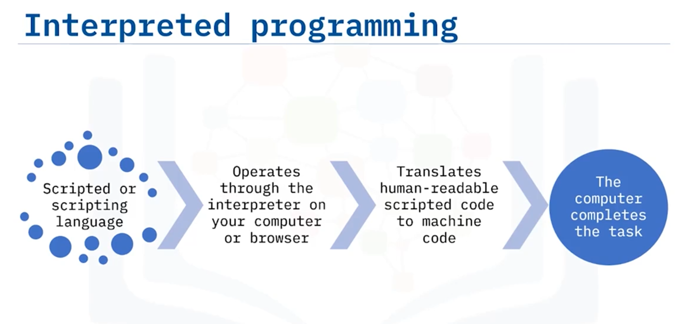

# 03-001: Interpreted / Compiled Languages - 1

### Language Categories

**Programming languages** translate human-readable code into machine code (binary: ones and zeros) for computer execution. Two primary categories exist: **interpreted (scripting)** and **compiled** languages.

---

### Interpreted Languages (Scripting Languages)

**Interpreted languages** execute through interpreters—software translating human-readable code to machine code at runtime. Interpreters operate via web browsers or locally installed programmes.

**Characteristics**:
- Runtime translation from source code to machine code
- Platform-agnostic (require appropriate interpreter)
- Suitable for repetitive, frequently-executed scripts
- Easier to learn; more versatile

**Evolution**: Some interpreted languages become outdated; versatility and ease-of-learning determine modern adoption rates.

**Examples**: **JavaScript** (web browser interpreter), **Python** (popular for ease of learning), **Lua** (lightweight game scripting language).

---

### Compiled Languages

**Compiled languages** produce executable applications and programmes (e.g., operating systems, music applications) packaged into single executable files. Compilation occurs before execution.

**Process**:
1. Source code (programming language) conversion to machine code
2. Compilation into executable file
3. Programme execution upon user selection

**Characteristics**:
- Faster execution (pre-compiled)
- Suited for complex problems and large-scale applications
- Typically larger programme files
- Cross-platform capability via appropriate compilation

**Common compiled languages**: **C** and variations (**C++**, **C#**) used in Windows, macOS, Linux; **Java** (Android OS) providing strong cross-platform compatibility.

**Real-world examples**: Operating systems (Windows, macOS, Linux, Android), device applications, system software.

---

## Video Lesson

Welcome to **Interpreted and Compiled Programming Languages**. After this guide, you will be able to **Identify Interpreted Programming Languages and Identify Compiled Programming Languages**.

**What are programming languages?** **Programming languages** help us **tell computers what to do**. **Computers** don't use **human language**. They use **their own language, called machine code**. **Machines** understand **binary code, that is, ones and zeros**.

So, to make **communicating with computers easier**, we have **human-readable programming languages**. **Two common categories** for programming languages are **Interpreted and Compiled**. These are **broad categories**, and there are **many programming languages** that are **classified under Compiled Languages and Interpreted Languages**. The **purpose of the project** helps a **developer determine** which **programming language** is best.

**Interpreted language** is also commonly referred to as **scripted or scripting language**. **Programs written** in **interpreted or scripted language**, like **Python**, **run through the programming interpreter** on your **computer's operating system** or in your **web browser**. Remember that **programming languages** are in **human-readable code**, so the **interpreter takes the human-readable scripted code** and then **translates it into machine code**, enabling the **computer to complete the requested task**.

As **computers and web pages** have **changed and advanced**, some **interpreted programming languages** are **outdated**, and they are **not as useful or relevant**. Some **other languages** are **more versatile and easier to learn**, which means they are **preferred over other scripting languages** and are **used more often**.

**All interpreted programming languages** need an **interpreter** to **translate the source code**. **Translators** are **built into your web browser**, or they **require a program on your computer** to **translate the code**. **Several different interpreted programming languages** exist. Some **examples of common interpreted programming language types** are **JavaScript**, a **simpler scripting language that runs through the web browser interpreter**, **Python**, a **language that is popular** because it is **easy to learn and use** for developers, **Lua**, a **general-purpose, lightweight game scripting language** that is **easy to learn and use**.

**Another category** of programming languages is the **compiled programming languages**. **Compiled programs** are **applications and programs**, like your **music app or your operating system**, that you **run on your computer or device**. **Programs** are **packaged, or compiled, into one executable file**. They are usually **larger programs**. **Compiled programs** are **used to help solve more challenging problems** like **interpreting source code**.

**Compiled programming languages** are often **referred to more simply as programming languages**. A **compiler program** creates a **program file**, which **runs the software**. Simply put, it **piles the code into one file** that **runs when you double-click** on the **app on your device**.

The **program runs faster** and it **can be done repeatedly**. The **source code** is **converted from the programming language to machine code**. Then it is **compiled into one executable file**. Finally, the **program runs** when you **select the icon or file** on your **device**.

Some **examples of compiled programming languages** are **C and its variations, C++ and C Sharp**, which are **used in many operating systems**, like **Microsoft Windows, Apple's Mac OS, and the open-source operating system, Linux**. **Java** is **another compiled programming language**. It **shouldn't be confused with the interpreted language, JavaScript**.

The **Android OS** is **written in Java** because it **works well across computing platforms**.

Let's look at this process. When you **update to a new version** of your **operating system**, like **Microsoft Windows**, your device might **download an installation program**. That **program is made up of many files**. The **files are written in a compiled programming language**. These **files give instructions** to your **device in machine code**. The **compiled program** is **running on your device**.

A **compiled program** that you commonly use is your **device's operating system**, such as **Linux, Microsoft Windows, Apple's Mac OS, or Android**. Your **operating system** is **written in a compiled programming language**, like **C, C++, C Sharp, or Java**.

In this guide, you learned that **interpreted programming languages run scripts** that are **repetitive and need to be run often**. **Interpreted programming languages** are **more versatile** and **can be used across platforms**, as long as there is the **correct interpreter**. Some **examples of interpreted programming languages** are **JavaScript, Python**. **Compiled programming languages** are for **more complex programs** that **complete larger tasks**. **Compiled programming languages** are used for **creating executable files** that **can run directly from your device**.

And some **examples of compiled programming languages** are **C and Java**.
