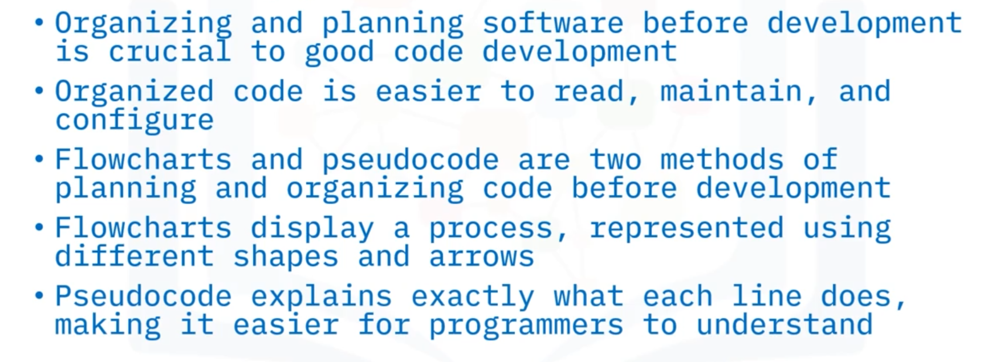
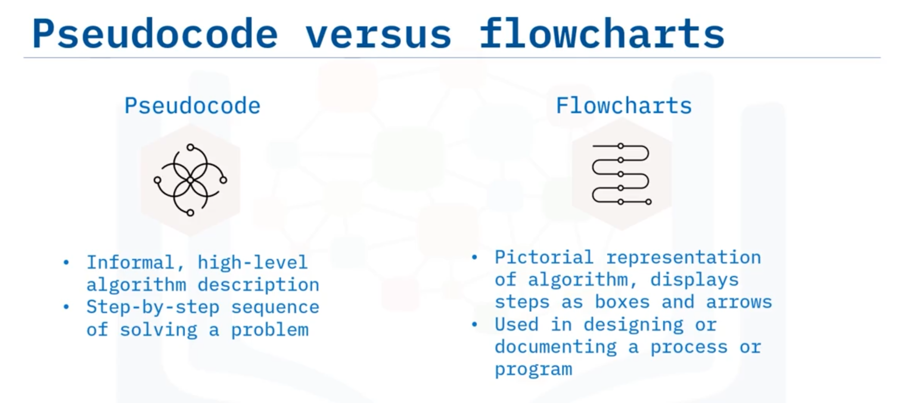
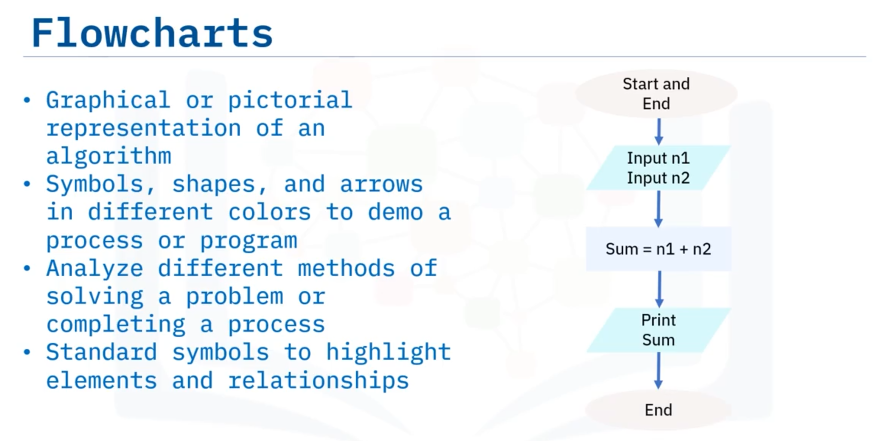

# 03-004: Code Organisation Methods

### Importance of Code Organisation

Well-planned software design **improves code readability, maintainability, and scalability whilst reducing bugs and errors throughout project lifecycles.**

Visual planning formats enhance code quality, establish consistency, and support logical structure during development.

***

### Two Primary Organisation Methods

* **PSEUDOCODE**
* **FLOWCHARTS** (Also related to some UML theory)

 

**Pseudocode** and **flowcharts** serve complementary purposes, each excelling in different scenarios.

***

### Flowcharts: Visual Algorithm Representation

**Flowcharts** provide pictorial algorithm representations using standardised symbols, shapes, arrows, and colours to demonstrate processes or programmes.

**Standard Symbols**:

* **Start/End**: Capsule/oval
* **Process**: Rectangle
* **Decision**: Diamond
* **Data**: Parallelogram
* **Connectors**: Arrows indicating sequence

**Characteristics**:

* Graphical, easy-to-understand format
* Ideal for smaller concepts and problems
* Excellent communication tool for logic discussion
* Strong project starting point (easier initial creation than pseudocode)
* Easily highlight elements and relationships

**Tools**: Microsoft Visio, Lucidchart, Draw.io, DrawAnywhere (provide drag-and-drop editors and team collaboration features).

**Example**: Adding two numbers flowchart sequences Start capsule → Data input (n1, n2) → Process (Sum = n1 + n2) → Data output (Print Sum) → End capsule, connected by arrows.

***

### Pseudocode: Language-Independent Algorithm Description

**Pseudocode** provides informal, high-level algorithm descriptions without strict programming language syntax or technology constraints.

It bridges programmer intent and executable code, enabling logical planning without technical details.

**Characteristics**:

* Language-agnostic; no syntax requirements
* Concise, typically under one page
* Informal outline or rough draft format
* Focuses on logic rather than syntax
* Beginner-friendly; no syntax concerns

#### **Benefits Over Flowcharts**

* Simple, explicit explanations of each programme line
* Easier logic focus without syntax distraction
* Facilitates multi-language programmer collaboration
* Easier code review across development groups
* Accessible to non-programmers
* Rapid, simple translation to any programming language
* Straightforward design modifications

**Use Cases**: Large programming projects, initial design documentation, cross-functional communication (technical and non-technical stakeholders), multi-language environments.

### Comparative Application

|                           | Flowcharts                      | Pseudocode                        |
| ------------------------- | ------------------------------- | --------------------------------- |
| **Scale**                 | Smaller concepts/problems       | Larger projects                   |
| **Format**                | Visual/graphical                | Textual/narrative                 |
| **Initial Creation**      | Faster/easier                   | More time-intensive               |
| **Communication**         | Visual logic discussion         | Logic and flow explanation        |
| **Language Independence** | Visual universality             | Explicit language-agnostic        |
| **Documentation**         | Standalone visual documentation | Translatable design specification |

***

## Video Lesson

Welcome to **Understanding Code Organisation Methods**. After watching this video, you will be able to: **Explain why code organisation methods are important when programming. Define the different code organisation methods and identify the benefits of using code organisation methods**.

**Organising** is **very important** when it comes to **reading, maintaining, and configuring code**. **Well-planned-out software design**, usually **using one of several methods**, helps **programmers write cleaner and more reliable code**. **Planning out code** in a **visual format** helps **improve the code base** once it is written and **reduces the chance of bugs and errors** throughout the **lifespan of a project**. **Organising code before programming** has a **positive impact** on the **quality of the programme** and helps **provide a consistent and logical format** to **use while coding**.

There are **two main methods** of **organising code: flowcharts and pseudocode**. The **main difference** between **pseudocode** and a **flowchart** is that the **former** is a **basic, high-level description of an algorithm**. An **algorithm** is a **step-by-step sequence** of **solving a given problem**. A **flowchart** is a **pictorial representation** of an **algorithm** showing the **steps as boxes of various shapes and colours** connected by **arrows that indicate their order**. **Flowcharts** are used in **designing or documenting a process or programme**.

**Pseudocode** provides a **beneficial bridge to the project code** because it **closely follows the logic** that the code will. **Pseudocode also helps programmers** **share ideas** without **spending too much time creating code**, and it **provides a structure** that is **not dependent on any one programming language**.

**Flowcharts** are **especially beneficial for smaller concepts and problems**, while **pseudocode** is **more efficient for larger programming projects**. And **flowcharts** provide an **easy method of communication** about the **logic** and **offer a good starting point** for the **project** because they are **easier to create than pseudocode** in the beginning stages.

A **flowchart** is the **graphical or pictorial representation** of an **algorithm** using **different symbols, shapes, and arrows** in **different sizes and colours** to **demonstrate a process or a programme**. The **main purpose** of using a **flowchart** is to **analyse different methods** of **solving a problem** or **completing a process**. **Several standard symbols** are **applied in a flowchart**, and you can **easily highlight certain elements** and the **relationships** between **each part** in the process.

Some **traditional flowchart shapes** used for **programming concepts** are: **Start/End (a capsule), Process (a rectangle), Decision (a diamond), Data (a parallelogram), And Connecters (as arrows)**.

A **simple flowchart** to represent **how to add two numbers** is easy to create. The **procedure starts** with the **capsule**, and has a **connector, or arrow, progressing** to the **next step**, the **data input** (the **parallelogram**), in this case, **input n1 and input n2**. Then, **another connector, or arrow**, goes to the **process** (the **rectangle**) of **adding the two inputs, Sum = n1 + n2**. **Another connector, or arrow**, moves to the **data** (the **parallelogram**) showing the **results**, in this case, **Print Sum**. The **last connector, or arrow**, moves to the **end of the process**, the **end capsule**.

**Flowchart software** is an **application** that **provides various functionalities** to **create flowcharts** by **providing the ability to drag shapes** into the **desired order** using an **easy-to-use editor**. **Flowchart software** also **provides team collaboration** for **creating flowcharts**. Some of the **well-known flowchart software programmes** include: **Microsoft Visio, Lucidchart, Draw.io, And DrawAnywhere**.

**Pseudocode** is an **informal type of programming description** that **does not require any strict programming language syntax** or **underlying technology considerations**. **System designers** write **pseudocode** to **ensure that programmers understand** a **software project's requirements** and **align code accordingly**. **Pseudocode** is used for **creating an outline** or a **rough draft** of a **programme** that **summarises a programme's flow** but **excludes underlying details**.

**Pseudocode** acts as the **bridge** between the **programmer's brain** and the **computer's code executor** that **provides the ability** to **plan instructions** that **follow a logical pattern**, without **including all the technical details**. **Pseudocode** is a **great way** of **getting started** with **software programming** as a **beginner** without **worrying about coding syntax**. **Pseudocode** helps **both programmers and non-programmers** **agree about the programme's goal** and the **basics of how the task should be done**.

There are **many advantages** of **using pseudocode over flowcharts**. The **main benefit** of **pseudocode** is that **it's simple and explains exactly** what **each line of an application should do**. The **coder can focus more on logic** than **on programme language syntax**. **Removing the distractions** of coding when **using pseudocode** makes the **code development stage easier**.

**Words and phrases** in **pseudocode** represent **lines of basic computer operations** that **simplify translation** from the **pseudocode algorithm** to the **specific programming language**. **Pseudocode** allows **programmers working** in **different computer languages** to **interact with each other**. **Pseudocode** can be **reviewed by different development groups easier** than **real code**. **Pseudocode** is **easier for non-programmers to read** and **enables quick and easy translation** to **any computer language**.

**Writing pseudocode** is **more concise and easier to modify**, so **changes to the design** can be **easily incorporated**. And lastly, **unlike some flowcharts**, **pseudocode** is **usually less than one page**.

In this video, you learned that: **Organising and planning out software design** enables **programmers to write cleaner and more reliable code**, and **organised code** is **very important** from a **readability, maintainability, and scalability standpoint**. **Two main methods** of **organising and planning software code** are by **developing flowcharts** or **writing pseudocode**. A **flowchart** is a **pictorial representation of an algorithm** showing the **steps** as **boxes of various kinds connected by arrows** that **indicate their order**. And the **main goal of pseudocode** is to **explain exactly** what **each line of a programme should do**, making the **code construction phase easier** for the **programmer**.
