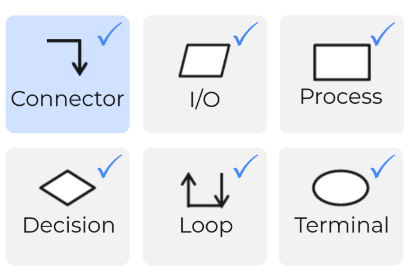
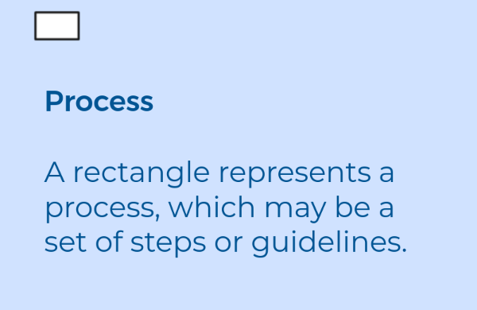

# 03-006b Flowchart Elements Recap

***

## PART 1: Flowchart Terms

1. Connectors 
2. I/O 
3. Process 
4. Decission 
5. Loop 
6. Terminal 

***

## Example 1: Farenheit to Celsius converter snippet

* **Step 1**: Read temperature in Farenheit, is an **I/O**
* **Step 2**: Converting from Fº to Cº, a **PROCESS**
* **Step 3**: Showing the conversion, is an **I/O**
