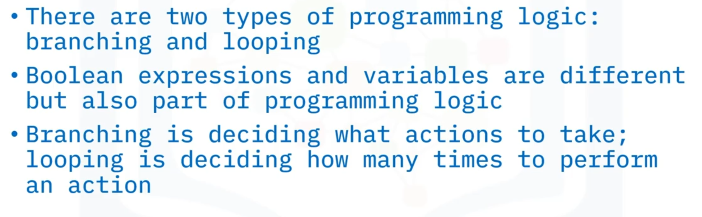
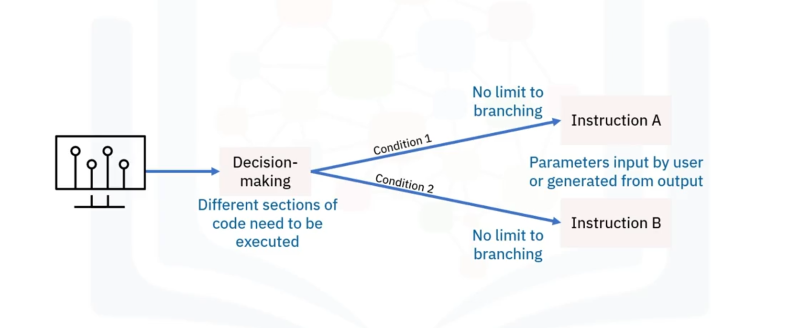
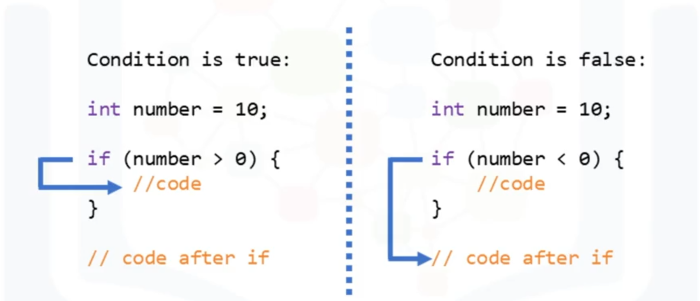
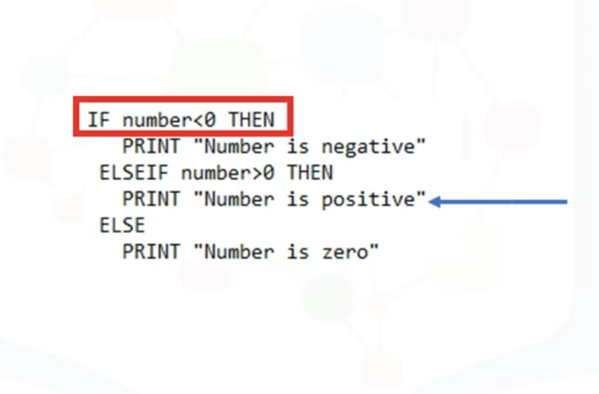
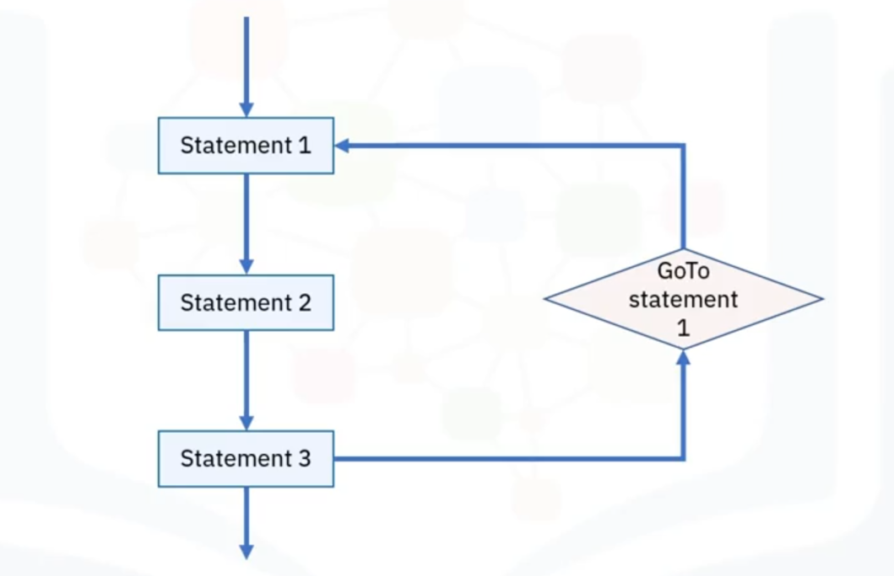
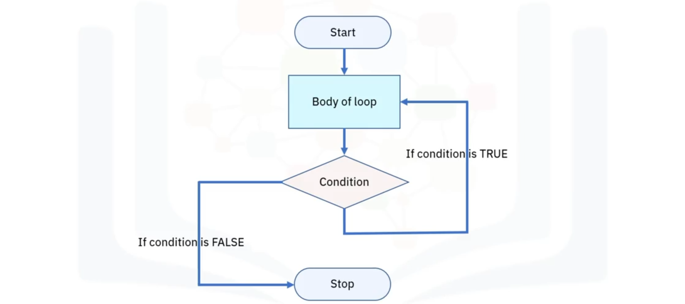

# 03-007    Programming Logic:  Branching and Looping 

### Fundamental Concepts

**Programming logic** comprises two major categories: 

-   **Branching** 
-   **Looping**

Both types utilise **Boolean expressions** and **variables**.

**Boolean expression**: A programming statement with exactly two possible values: **true** or **false**. Computers use Boolean logic to make decisions—executing one action if the expression evaluates to true, another if false.

**Variable**: A named container holding an assigned value that can change based on program conditions or input. Variables form the basis of programming alongside Boolean logic.

---

### Program Structure

Programs typically consist of:

- **Instructions**: Directions telling the computer what to do
- **Data**: Information the program uses during execution
- **Variables**: Values changeable depending on conditions or information passed to the program

---

## Branching Logic

**Branching** is the programming logic where a computer program makes decisions, following different instruction sets depending on whether specific conditions are met during execution.

- Each **possible code pathway creates another branch**
- The **branch executed** depends on parameter values assigned to the branching procedure
- **No limit** to the number of branches—enabling complex logic implementation
- Parameter values originate from **user input** or **output from previous procedures**

---

## Branching Constructs

**Branching statements** (also termed **constructs**) determine the execution path by allowing control flow to jump to different program sections.

### **Common branching statements**:

#### If Statement

**Purpose**:    Decision-making construct guiding programs to make decisions based on specified criteria.

**Logic**:      Executes one code set when condition is TRUE, another when FALSE.

#### If-Then-Else Statement

**Purpose**:    Conditional construct extending basic if logic.

**Logic**:      Executes the substatement following the "then" keyword **only if** the provided condition is true.

#### If-Else Statement

**Purpose**:    Extends the "if" statement by specifying an action if the condition is false.

**Logic**:      Programme executes either the **true code block** or the **false code block**—something is always performed with if-else statements.

#### Switch Statement

**Purpose**:    Selection control mechanism allowing a variable or expression value to change control flow.

**Mechanism**:  Uses search and map techniques to determine execution pathway.

#### GoTo Statement

**Purpose**: Performs one-way control transfer to another line of code.

**Distinction**: Unlike function calls, GoTo does **not return control** to the calling location.

---

## Looping Logic

**Looping** is programming logic where a sequence of instructions continually repeats until reaching a specific condition.

### Loop Process

1. **Execute a specific process** (e.g., retrieve and change data)
2. **Check a condition** (e.g., whether a counter reached a prescribed number)
3. **If condition not met**: Return to the first instruction and repeat the sequence
4. **If condition met**: "Fall through" to the next sequential instruction or branch outside the loop

**Fundamental principle**: Looping is a core programming concept enabling efficient code reuse and iterative data processing.

---

## Loop Types

### **THREE basic loop statements**:

#### While Loop

**Characteristic**: **Entry-controlled loop**—condition evaluated **before** processing the loop body.

**Logic**: If condition is true, then and only then the loop body executes. If false, the loop is skipped.

#### For Loop

**Characteristic**: **Counter-controlled loop**—precise iteration count.

**Logic**:
1. Initial value performed **only once**
2. Condition tests and compares counter to fixed value **after each iteration**
3. Loop stops when condition returns **false**

#### Do-While Loop

**Characteristic**: **Exit-controlled loop**—condition evaluated **after** processing the loop body.

**Logic**: Loop body executes at least once before condition is checked. Continues repeating until condition becomes false.

---

## Key Distinctions

### Branching vs. Looping

| Aspect | Branching | Looping |
|--------|-----------|---------|
| **Purpose** | Decide **what actions to take** | Decide **how many times** to perform an action |
| **Control Flow** | Jumps to different code sections | Repeats code sections |
| **Execution** | Executes based on conditions | Executes until condition met |
| **Structure** | Multiple possible pathways | Iterative repetition |

### Boolean Expressions and Variables

Both branching and looping rely on:
- **Boolean expressions**: Conditional statements evaluating to true or false
- **Variables**: Named values that change based on program conditions

---

## Video Lesson

Welcome to **Branching and Looping Programming Logic**. After this guide, you will be able to: **Describe the two types of programming logic** and **Define Boolean expressions and variables and list the differences between branching and looping**.

There are **two major types of programming logic: branching and looping**. **Both types use Boolean expressions and variables**: A **Boolean expression** is a type of programming statement with **only two values, either "true" or "false."** And **variables have assigned values** that are **passed into a function or subroutine** within a more extensive program.

**Computers use Boolean logic** to **make decisions**. The **computer takes one action** if a **Boolean expression is true** and a **different action** if the **expression is false**.

Typically, a **program consists of instructions** that **tell the computer what to do** and **data** that the program uses when it is running. A **variable has a value** that **can change**, depending on **conditions or information passed** to the program. **Boolean logic, along with variables**, **form the basis of programming**.

**Branching logic** is where a **computer program makes a decision** **following a different set of instructions**, depending on **whether certain conditions are met** during the **program's execution**. Each **possible code pathway creates another branch**. The **branch of code that runs** depends on the **values assigned to the parameters** of the **branching procedure**. There is **no limit to the number of branches** to implement complex logic.

The **values of these parameters** may be **input by the user** or **generated by the output from a previous procedure**. **Branching contains constructs** that **occur and are processed** to **determine the path** a program takes when running. **Branching statements** (also known as **constructs**) **allow the execution flow to jump** to a **different part of the program**. The **common branching statements** used within other control structures include: **if, if-then-else, Switch, and GoTo**.

The **if statement** is a **decision-making construct** that **guides a program to make decisions** based on **specified criteria**. The **if statement executes one code set** when a **specific condition is met (TRUE)** or **another code set** if the **condition is not met (FALSE)**.

The **if-then-else** is a **conditional construct** that **executes its substatement**, which **follows the "then" keyword**. This **only occurs** if the **provided condition is true**.

The **if-else statement extends** the **"if" statement** by **specifying an action if** the **"if" (true/false expression) is false**. **With the if-else statement**, the **program will execute either** the **true code block** or the **false code block**, so **something is always performed** with an **if-else statement**.

In computer programming languages, a **switch statement** is a **type of selection control mechanism** used to **allow the value of a variable or expression** to **change the control flow** of program **execution via search and map**.

**GoTo** is a **statement found in many computer programming languages** that **performs a one-way transfer of control** to **another line of code**. In contrast, a **function call typically returns control**.

Now, let's look at the **logic of looping programming**. A **loop** is a **sequence of instructions** that **continually repeats** until **reaching a specific condition**. Typically, a **particular process is performed**, such as **retrieving and changing data**, and then **some conditions are checked**, such as **whether a counter has reached a prescribed number**. If it has **not**, the **next instruction** in the sequence is to **return to the first instruction** in the series and **repeat the sequence**. If the **condition is reached**, the **next instruction "falls through"** to the **next sequential instruction** or **branches outside the loop**. A **loop is a fundamental programming idea** commonly used in writing programs.

There are **three basic loop statements: While** **For** **And Do-while**.

In a **While loop**, a **condition is evaluated before** processing the **body of the loop**. If a **condition is true** then and **only then the body of a loop is executed**.

In a **For loop**, the **initial value is performed** only once, then the **condition tests and compares** the **counter to a fixed value** after **each iteration**, **stopping the For loop** when **false is returned**.

In a **Do-while loop**, the **condition is always executed after** the **body of a loop**. It is also called an **exit-controlled loop**.

In this guide, you learned that: **There are two major types of programming logic: branching and looping**. **Both types of logic use Boolean expressions and variables**.

**Boolean expressions** have **only two possible values, either true or false**, and **variables have assigned values** that are **passed into a function or subroutine** within a more extensive program. **Variables have values** that **can change**, depending on **conditions or information passed** to the program. And **branching is deciding what actions to take**, while **looping is deciding how many times** to **perform a certain action**.
