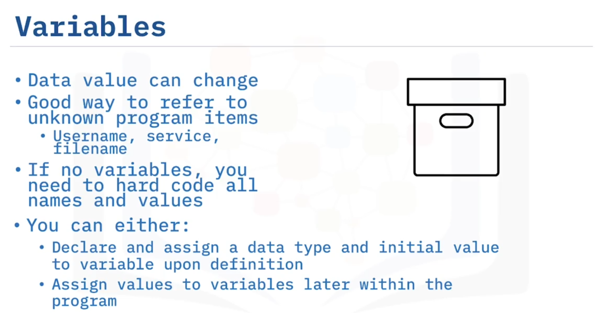

# 03-008: Introduction to Programming Concepts - Part 1

 

***

### Identifiers

**Identifiers** are custom-named labels that software developers assign to reference program components such as stored values, methods, interfaces, or classes.

### Data Types for Identifiers

If an identifier stores data, it can be one of two types:

* **CONSTANTS**
* **VARIABLES**

#### Constants

**Definition**: A data item whose value does **not change** within a program.

**Examples**:

* Numerical constant: mathematical value of Pi
* Text string: player's name in a game

**Terminology**: Also referred to as **"named constants"**.

**Assignment**: Value is assigned when the constant is defined.

**Benefits**:

1. **Ease of readability**: Meaningful names make code clearer (e.g., `pi_value`, `cost_price`, `tax_rate`)
2. **Maintainability**: If the value changes, update only the constant definition, not every occurrence in code

#### Variables

**Definition**: An identifier whose value **can change** during program execution.

**Examples**:

* User entering their age in an application
* High score in a game
* Any user input or runtime-determined value

**Data types**: Can be strings of text, numerical values, or any other data type.

**Purpose**: Useful for referring to program items unknown at development time (username, service name, filename).

**Declaration**: Variables can be declared with or without an initial value. If no initial value is assigned during definition, the value is assigned later by program instructions.

**Best practice**: Using variables prevents "hard-coding" all names and values—essential for flexible, maintainable code.

***

### Containers

**Definition**: Special identifier types referencing **multiple elements** in a program.

**Purpose**: Eliminate the need to create individual variables for each element—enabling faster, more efficient code.

**Scenario**: Storing 1,000 integers would require 1,000 individual variables if containers were not used—unwieldy and inefficient.

#### **TWO container types**:

* **ARRAYS**
* **VECTORS**

#### Arrays

**Definition**: Container storing a **fixed number** of elements of the **same type** in sequential order, starting from index zero.

**Declaration**:

1. Specify the data type (integer, boolean, string, etc.)
2. Specify the array name
3. Specify the maximum size in square brackets

**Syntax**: `dataType arrayName[maxSize];`

**Characteristics**:

* Fixed size (cannot expand)
* Elements stored in sequential memory locations
* Fast element access
* Memory-efficient

#### Vectors

**Definition**: Container with **dynamic size** that automatically resizes itself as elements are added or removed.

**Alternative name**: **"Dynamic arrays"**

**Declaration**:

1. Specify the container type (`vector`)
2. Specify the data type in angle brackets
3. Specify the vector name

**Syntax**: `vector<dataType> vectorName;`

**Characteristics**:

* Dynamic size (expands/contracts automatically)
* No maximum size specification needed
* Elements not stored in sequential memory locations
* Slightly slower element access than arrays
* Requires more memory than arrays

***

## Video Lesson

Welcome to **Introduction to Programming Concepts – Part 1**.

After this guide, you will be able to: **Describe the purpose and use of identifiers in programming. And Describe the purpose and use of containers in programming**.

To **fully understand software programming**, there are **some fundamental programming concepts** you **need to know first**. The **first concepts you will look at** are **identifiers**. **Software developers use an identifier** to **reference a program component** such as a **stored value, a method, an interface, or a class**, by **assigning a custom-named label** to it. If the **identifier stores data**, then the **data values** in the program can be **one of two types: either a constant, or a variable**.

A **constant** is a **data item whose value does not change** within a program. This could be a **numerical constant** such as the **mathematical value of Pi**, or it could be a **text string** that **remains constant** such as a **player's name within a game**. **Constants are also referred to as 'named constants.'** You **assign a value to a constant** when you **define it**. For example, you might want it to **refer to a numerical value** within your program such as **Pi, or a cost price, or a rate of tax**, and then, rather than **repeatedly retyping the same numerical value**, you can just **declare a constant for that value instead**, and **name it something meaningful** like **'pi\_value', or 'cost\_price', or 'tax\_rate'**.

There are **a couple of major benefits** to **using constants in your programs**; **one is for ease of readability** in your code, and the **other is that if the specified value changes** in the future, **you only need to change it once** on the constant, rather than **finding every instance** of that numerical value **within your code and changing it**.

The **other type of identifier** used in programming **is a variable**. As the **name suggests**, this **kind of identifier is not constant**; **its value can change** during the **program's execution**, such as a **user entering their age** in an application or a **high score in a game**. **Variables can be strings of text, numerical values, or any other type of data**. **Using a variable as an identifier** is a **useful way to refer** to **program items that are unknown** to you, such as a **username, a service, or a file name** for instance. If you **don't use a variable**, then you **will need to hard code** all the **names and values** in your program, which is **not considered best practice**.

**Variables can be declared** and **assigned a data type and initial value** as they are defined, or **you can decide not to assign an initial value** when you **define a variable**, and **instead have the value assigned later** by **instructions within the program**.

In addition to the **identifier data structures already discussed**, there are also **special kinds of identifiers** that can **reference multiple elements** in a program, and **these are referred to as containers**. **Being able to specify multiple elements** means that **you don't have to create a variable** for **every individual element**. This **makes it faster and more efficient**.

For example, if you **only want to store six numerical integers**, then you could argue that **you could just create six variables**, one for each. But **what if you need to store 1,000 integers or more**? In such a case, **defining 1,000 variables** would obviously be a **unwieldy and inefficient programming technique**, so in this case you **would use a container**.

There are **two types of containers** to **specify multiple elements: arrays and vectors**. The **simplest of these container types** is an **array**. In an **array**, a **fixed number of elements** of the **same type** are **stored in sequential order**, starting from **index zero**.

When you **declare an array**, you **specify the data type** of the **values it contains**, such as an **integer, or boolean, or a string**, and then the **maximum number of elements** it **can contain**. The **syntax for declaring an array** is to **specify the data type first**, then the **name of the array**, then the **maximum size of the array** in **square braces**.

In **contrast to arrays** that **have a fixed size, vectors have a dynamic size**, and **they will automatically resize themselves** as **you add elements to them or remove elements from them**. For this reason, **you may also see them referred to as dynamic arrays**. **Because they are dynamic in nature, vectors take up more memory space** than arrays, and **their elements also take a little longer to access** than **elements in an array**, as **they are not stored in sequential memory locations**.

The **syntax for declaring a vector** is to **specify the container type of the vector first**, then **specify the data type** in **angle brackets**, then the **name of the array**. **Note that because it is a vector**, you **do not need to specify a maximum number** of values it **can contain** because the **size is not fixed, it is dynamic**.

In this guide, you learned that: **Software developers use an identifier** to **reference a program component**. If an **identifier stores data**, then it **can either be a constant or a variable**. A **constant** is a **data item whose value does not change** within the program. A **variable** is **not constant**; it **can change during the program's execution**.

In an **array**, a **fixed number of elements** of the **same type** are **stored in sequential order**, starting from **zero**. And **vectors have a dynamic size**, and **they automatically resize themselves** as **elements are added or removed**.
