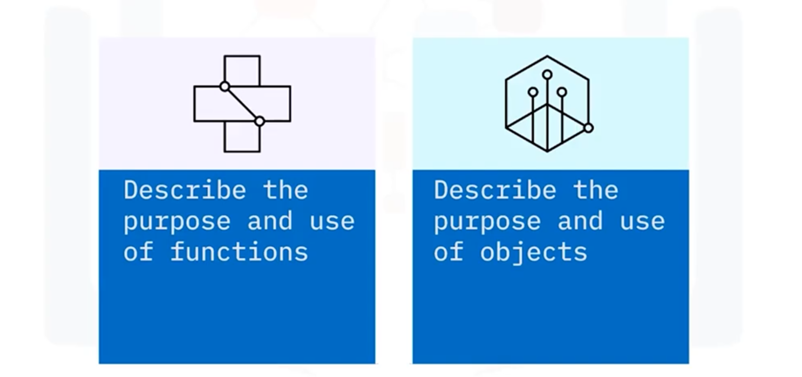
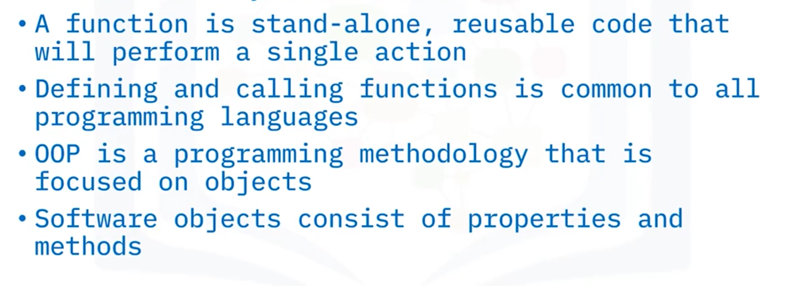

# 03-009: Introduction to Programming Concepts - Part 2 (Function / OOP)

 

### Functions

**Definition**: A piece of structured, stand-alone, and reusable code that performs a single specific action.

**Origin**: Consequence of **modular programming** software development methodology—encouraging program separation into multiple modular components, each performing specific tasks.

**Purpose**: Enables developers to divide substantial, complex programs into smaller, manageable, focused pieces.

**Alternative names**: Subroutines, procedures, methods, modules (language-dependent).

**Mechanism**: Functions accept data as input, process the data, then return the result as output.

#### Function Types

**Standard library functions**: Built-in functions provided by the programming language (e.g., \`println function).

**User-defined functions**: Custom functions written by programmers, reusable repeatedly.

#### Function Implementation Steps

1. **Define (or create)** a function:
   * Provide function keyword
   * Assign unique function name
   * Provide statements comprising function body
2. **Call (or invoke)** a function:
   * Trigger the specified actions within the function
   * Pass specified parameters if required
3. **Declaring** a function:
   * Some languages (C, C++) require function declaration in addition to definition.

**Code block identification**: Varies across languages—braces, begin/end statements, or indentation.

***

### Objects and Object-Oriented Programming

**Object-Oriented Programming (OOP)**: Programming methodology focused on **objects** rather than functions (as in procedure-oriented programming).

#### Real-World Object Analysis

Consider any real-world object (car, bike, TV, washing machine) and ask:

* **"What states can the object be in?"** → Properties/attributes
* **"What behaviours can the object perform?"** → Methods/functions

**Observation**: More complex objects have more potential states and behaviours.

#### Software Objects

**Definition**: Software objects are conceptually similar to real-world objects, comprising **states (properties)** and **behaviours (methods)**.

**Examples**: Windows service, user account, database table, system folder.

**Storage and exposure**:

* **Properties** stored in **fields** (variables in some languages)
* **Behaviours** exposed through **methods** (functions in some languages)

#### OOP vs Procedural Programming

| Aspect             | Procedural Programming           | Object-Oriented Programming       |
| ------------------ | -------------------------------- | --------------------------------- |
| **Focus**          | Functions                        | Objects                           |
| **Data structure** | Separate from functions          | Packaged within objects           |
| **Operation**      | Methods operate on separate data | Objects operate on own data       |
| **Encapsulation**  | No bundling                      | Data and methods bundled together |

***

## Video Lesson

Welcome to **Introduction to Programming Concepts – Part 2**.

After watching this video, you will be able to: **Describe the purpose and use of functions in programming, and describe the purpose and use of objects in programming**.

Next, let's look at the **fundamental concept of functions**. **Functions** are a **consequence of the modular programming software development methodology** that **encourages the separation of a program into multiple modular components**, where **each performs a specific task** within a program. So, a **function** is **essentially a piece of structured, stand-alone, and reusable code** that **will perform a single specific action**. This **enables software developers** to **take a substantial, complex program** and **divide it into smaller, more manageable, and focused pieces**.

Although **some programming languages** may **refer to them as something else**, such as **subroutines, procedures, methods, or modules**, **most modern programming languages** **refer to them as functions**.

**Functions take in data** as an **input**, then **process the data**, and then **return the result** as an **output**. There are **essentially two types of functions**. **Standard library functions** are the **built-in functions provided** by the **programming language**. **Common example includes the 'Print' function**. But **programming languages also allow you** to **write your own functions**. And **once you've written a function**, you **can use it over and over again**.

The **way that the blocks of code** that **make up a function** are **identified** is **different across programming languages**. **Some use braces, some use begin and end statements**, and **others use indentations** for example.

There are **a few steps to using functions**. The **first thing you need to do** is **define (or create) a function**. When you **define a function**, you **provide a function keyword**, then **give the function a unique name**, and **you provide the statements** that **make up the body of the function**. **Once a function has been defined**, it then **needs to be called (or invoked)**. When you **call a function**, the **specified actions** within the **function are performed** using **any specified parameters**. **While defining and calling functions** are **common to all programming languages**, **some programming languages, such as C and C++, also require you to declare a function**.

Next, let's look at the **concept of objects**. **Understanding what objects are** is **key to understanding object-oriented programming**. **Object-oriented programming (or OOP)** is a **programming methodology** that is **focused on objects rather than functions**, which is **what procedure-oriented programming is focused on**. The **objects themselves** will **contain data** in the form of **properties (or attributes)** and **code** in the form of **procedures (or methods)**.

The **key distinction** between the **two methodologies** is that **where procedural programming uses methods** to **operate on separate data structures**, **OOP packages them both together**, so an **object operates on its own data structure**. **Consider the real-world objects** in your life such as **your car, bike, TV, or your washing machine**, and **ask yourself the following two questions: "What states can the object be in?" and "What behaviours can the object perform?"**

When you **think about your answers** to these questions, **you will find** that the **answers to these questions vary** across the objects. **More complex objects** will typically **have more potential states** they **can be in** and **will be able to perform more behaviours**.

In programming, a **software object** is **similar to a real-world object**, conceptually speaking, in that **they too consist of states (or properties) and behaviours (or methods)**. **Software objects** can be **anything**, such as a **Windows service, a user account, a database table, or a system folder**. **Objects store their properties** in **fields** (referred to as **variables** in some programming languages), and **expose their behaviours through methods** (referred to as **functions** in some programming languages).

In this video, you learned that: **A function is a piece of structured, stand-alone, and reusable code that will perform a single specific action.** **The defining and calling of functions is common to all programming languages.** **Object-oriented programming is a programming methodology that is focused on objects rather than functions.** **Software objects consist of properties and methods.**
